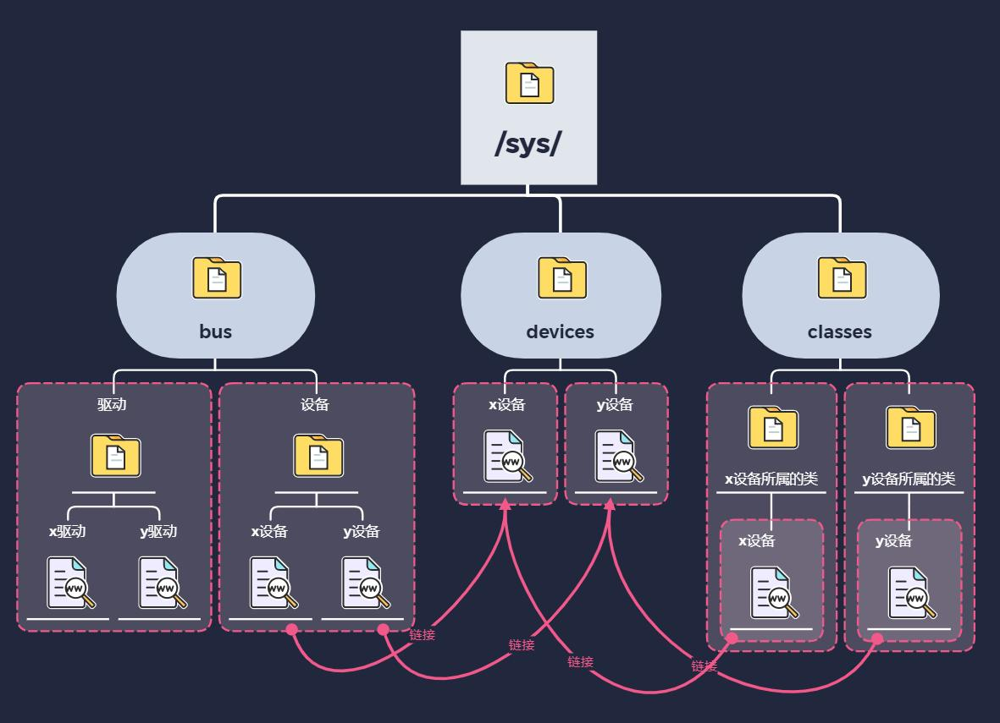
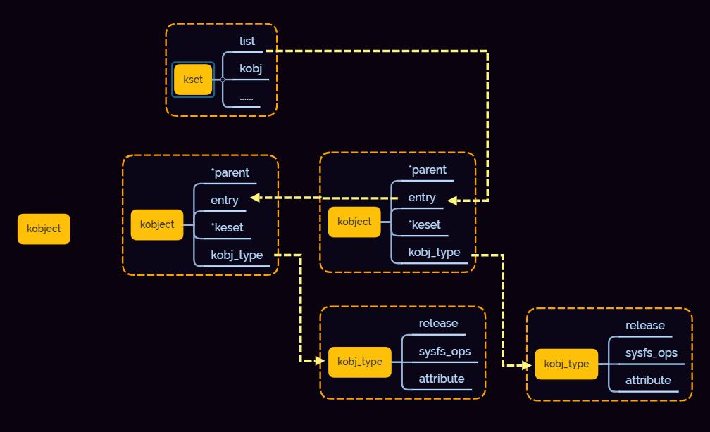

sysfs 文件系统简介
===================

sysfs简介
-----------

sysfs是一个基于ramfs的文件系统，用来导出内核对象的数据、属性到用户空间，以文件目录结构的形式为用户空间提供对这些数据、属性的访问支持。

从驱动开发的角度，sysfs为用户提供了除了设备文件/dev和/proc之外的另一种通过用户空间访问内核数据的方式。使用sysfs编译内核的时候需要定义 ``CONFIG_SYSFS`` ,可以
通过 ``mount -t sysfs sysfs /sys`` 命令来挂载sysfs到/sys目录

sysfs目录结构
---------------

================== =========================================================================================================================================================
目录                描述
------------------ ---------------------------------------------------------------------------------------------------------------------------------------------------------
/sys/block          块设备的存放目录，这是一个过时的接口，现在所有设备都存放在/sys/devices同时在/sys/bus或/sys/class中存放符号连接
/sys/bus            包含了系统中的所有总线，每一种总线通常还有两个子目录device和driver
/sys/class          按照设备功能对系统设备进行分类的目录，例如输入设备都会在/sys/class/input中，/sys/class中都是符号连接，这样可以保证所有设备在系统中只有一个实例
/sys/dev            按照设备号对字符设备和块设备进行分类放在这个目录，同样使用符号链接到/sys/devices/中的相应文件
/sys/devices        所有设备文件的实例都在此目录下
/sys/fs             按照设计是用于描述系统中的所有文件系统
/sys/kernel         这里是n内核所有可调整参数的位置，但仍有一部分可调整参数位于/proc/sys/kernel中
/sys/module         这里有系统中的所有模块的信息，包括编译到内核中的以及编译为外部模块的(ko)
/sys/power          这里是系统中的电源选项，如可以写入控制命令使系统关机或重启
================== =========================================================================================================================================================

sysfs中的要素关系
------------------

sysfs提供一种机制，使得可以显式的描述内核对象，对象属性以及对象间的关系。sysfs有两组接口，一组针对内核，用于将设备映射到文件系统中，另一组针对用户程序，用于读取或者操作这些设备。

sysfs要素以及在用户空间的表现

=============================    =========================================
sysfs在内核中要素                   用户空间显示
-----------------------------    -----------------------------------------
内核对象(kobject)                   目录
对象属性(attribute)                 文件
对象关系(relationship)              链接
=============================    =========================================

真正的设备信息放在devices目录下，bus下对应驱动和设备，class下有不同的分类

kobject和kset使linux设备驱动模型中的底层数据结构，kset结构体中包含了kobject结构体和链表头，所有属于这个kset的kobject都连接到链表头

