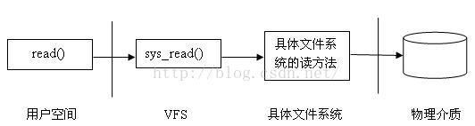

文件I/O read
===============

当用户应用程序调用文件I/O read()操作时，系统调用sys_read()被激发，sys_read()找到所在文件所在的具体文件系统，把控制权传给该文件系统，
最后由具体文件系统与物理介质交互，从介质读出数据

sys_open()系统调用关系
-----------------------

sys_open()系统调用打开或创建一个文件，成功返回该文件的文件描述符，下面是sys_open()实现代码中主要的函数调用关系图

::

    sys_open()
    |-----------do_sys_open()
    |           |--------get_unused_fd() 
    |           |--------do_filp_open()
    |           |        |------set_nameidata
    |           |        |------path_openat
    |           |        |       |-------alloc_empty_file
    |           |        |       |-------do_o_path
    |           |        |       |-------path_init
    |           |        |       |-------link_path_walk
    |           |        |       |-------do_last
    |           |        |               |-------may_open
    |           |        |               |-------vfs_open
    |           |        |                       |------do_dentry_open
    |           |        |                               f->f_op = fops_get(inode->i_fop)
    |           |        |                               open = f->f_open->open
    |           |        |                               open
    |           |        |------restore_nameidata
    |           |--------fsnotify_open()
    |           |--------fd_install()
    |

sys_open
----------

sys_open系统调用位于 ``fs/open.c`` 文件中

::

    SYSCALL_DEFINE3(open, const char __user *, filename, int, flags, umode_t, mode)
    {
        if (force_o_largefile())
            flags |= O_LARGEFILE;

        return do_sys_open(AT_FDCWD, filename, flags, mode);
    }

do_sys_open
-------------

::

    long do_sys_open(int dfd, const char __user *filename, int flags, umode_t mode)
    {
        struct open_flags op;
        int fd = build_open_flags(flags, mode, &op);
        struct filename *tmp;

        if (fd)
            return fd;

        tmp = getname(filename);    //把用户空间传过来的pathname复制到内核空间,后面会需要用到这个pathname解析找到inode
        if (IS_ERR(tmp))
            return PTR_ERR(tmp);

        fd = get_unused_fd_flags(flags);    //得到一个可用的文件描述符,通过该函数可知文件描述符实质上是进程打开文件列表中对应某个文件对象的索引值
        if (fd >= 0) {
            struct file *f = do_filp_open(dfd, tmp, &op);   //打开文件，返回一个file对象，代表由该进程打开的一个文件。进程通过这样的一个数据结构对物理文件进行读写操作
            if (IS_ERR(f)) {
                put_unused_fd(fd);      //释放文件描述符
                fd = PTR_ERR(f);
            } else {
                fsnotify_open(f);       //通知文件被打开
                fd_install(fd, f);      //建立文件描述符与file对象的联系，以后进程对文件的读写都是通过文件描述符进行
            }
        }
        putname(tmp);   //将复制到内核空间的pathname销毁
        return fd;
    }

do_filp_open
--------------

do_filp_open()用于打开文件，返回一个file对象

::

    struct file *do_filp_open(int dfd, struct filename *pathname,
            const struct open_flags *op)
    {
        struct nameidata nd;
        int flags = op->lookup_flags;
        struct file *filp;

        set_nameidata(&nd, dfd, pathname);
        filp = path_openat(&nd, op, flags | LOOKUP_RCU);    //此函数用于找到文件名对应的dentry和inode
        if (unlikely(filp == ERR_PTR(-ECHILD)))
            filp = path_openat(&nd, op, flags);
        if (unlikely(filp == ERR_PTR(-ESTALE)))
            filp = path_openat(&nd, op, flags | LOOKUP_REVAL);
        restore_nameidata();
        return filp;
    }

path_openat函数找到文件路径对应的dentry和inode

::

    static struct file *path_openat(struct nameidata *nd,
                const struct open_flags *op, unsigned flags)
    {
        struct file *file;
        int error;

        file = alloc_empty_file(op->open_flag, current_cred()); //得到一个空的file结构体(默认分配了一些，如果打开的文件超过默认数量则需要动态申请) 
        if (IS_ERR(file))
            return file;

        if (unlikely(file->f_flags & __O_TMPFILE)) {
            error = do_tmpfile(nd, flags, op, file);
        } else if (unlikely(file->f_flags & O_PATH)) {
            error = do_o_path(nd, flags, file);
        } else {
            const char *s = path_init(nd, flags);   //根据路径名查找目标节点的第一步，确定path lookup的位置
            while (!(error = link_path_walk(s, nd)) &&
                (error = do_last(nd, file, op)) > 0) {
                nd->flags &= ~(LOOKUP_OPEN|LOOKUP_CREATE|LOOKUP_EXCL);
                s = trailing_symlink(nd);
            }
            terminate_walk(nd);
        }
        if (likely(!error)) {
            if (likely(file->f_mode & FMODE_OPENED))
                return file;
            WARN_ON(1);
            error = -EINVAL;
        }
        fput(file);
        if (error == -EOPENSTALE) {
            if (flags & LOOKUP_RCU)
                error = -ECHILD;
            else
                error = -ESTALE;
        }
        return ERR_PTR(error);
    }

do_last
--------

do_last是open系统调用的最后一步

::

    /*
     * Handle the last step of open()
     */
    static int do_last(struct nameidata *nd,
               struct file *file, const struct open_flags *op)
    {
        struct dentry *dir = nd->path.dentry;
        kuid_t dir_uid = nd->inode->i_uid;
        umode_t dir_mode = nd->inode->i_mode;
        int open_flag = op->open_flag;
        bool will_truncate = (open_flag & O_TRUNC) != 0;
        bool got_write = false;
        int acc_mode = op->acc_mode;
        unsigned seq;
        struct inode *inode;
        struct path path;
        int error;

        nd->flags &= ~LOOKUP_PARENT;
        nd->flags |= op->intent;

        if (nd->last_type != LAST_NORM) {
            error = handle_dots(nd, nd->last_type);
            if (unlikely(error))
                return error;
            goto finish_open;
        }

        if (!(open_flag & O_CREAT)) {
            if (nd->last.name[nd->last.len])
                nd->flags |= LOOKUP_FOLLOW | LOOKUP_DIRECTORY;
            /* we _can_ be in RCU mode here */
            error = lookup_fast(nd, &path, &inode, &seq);
            if (likely(error > 0))
                goto finish_lookup;

            if (error < 0)
                return error;

            BUG_ON(nd->inode != dir->d_inode);
            BUG_ON(nd->flags & LOOKUP_RCU);
        } else {
            /* create side of things */
            /*
             * This will *only* deal with leaving RCU mode - LOOKUP_JUMPED
             * has been cleared when we got to the last component we are
             * about to look up
             */
            error = complete_walk(nd);
            if (error)
                return error;

            audit_inode(nd->name, dir, AUDIT_INODE_PARENT);
            /* trailing slashes? */
            if (unlikely(nd->last.name[nd->last.len]))
                return -EISDIR;
        }

        if (open_flag & (O_CREAT | O_TRUNC | O_WRONLY | O_RDWR)) {
            error = mnt_want_write(nd->path.mnt);
            if (!error)
                got_write = true;
            /*
             * do _not_ fail yet - we might not need that or fail with
             * a different error; let lookup_open() decide; we'll be
             * dropping this one anyway.
             */
        }
        if (open_flag & O_CREAT)
            inode_lock(dir->d_inode);
        else
            inode_lock_shared(dir->d_inode);
        error = lookup_open(nd, &path, file, op, got_write);
        if (open_flag & O_CREAT)
            inode_unlock(dir->d_inode);
        else
            inode_unlock_shared(dir->d_inode);

        if (error)
            goto out;

        if (file->f_mode & FMODE_OPENED) {
            if ((file->f_mode & FMODE_CREATED) ||
                !S_ISREG(file_inode(file)->i_mode))
                will_truncate = false;

            audit_inode(nd->name, file->f_path.dentry, 0);
            goto opened;
        }

        if (file->f_mode & FMODE_CREATED) {
            /* Don't check for write permission, don't truncate */
            open_flag &= ~O_TRUNC;
            will_truncate = false;
            acc_mode = 0;
            path_to_nameidata(&path, nd);
            goto finish_open_created;
        }

        /*
         * If atomic_open() acquired write access it is dropped now due to
         * possible mount and symlink following (this might be optimized away if
         * necessary...)
         */
        if (got_write) {
            mnt_drop_write(nd->path.mnt);
            got_write = false;
        }

        error = follow_managed(&path, nd);
        if (unlikely(error < 0))
            return error;

        if (unlikely(d_is_negative(path.dentry))) {
            path_to_nameidata(&path, nd);
            return -ENOENT;
        }

        /*
         * create/update audit record if it already exists.
         */
        audit_inode(nd->name, path.dentry, 0);

        if (unlikely((open_flag & (O_EXCL | O_CREAT)) == (O_EXCL | O_CREAT))) {
            path_to_nameidata(&path, nd);
            return -EEXIST;
        }

        seq = 0;	/* out of RCU mode, so the value doesn't matter */
        inode = d_backing_inode(path.dentry);
    finish_lookup:
        error = step_into(nd, &path, 0, inode, seq);
        if (unlikely(error))
            return error;
    finish_open:
        /* Why this, you ask?  _Now_ we might have grown LOOKUP_JUMPED... */
        error = complete_walk(nd);
        if (error)
            return error;
        audit_inode(nd->name, nd->path.dentry, 0);
        if (open_flag & O_CREAT) {
            error = -EISDIR;
            if (d_is_dir(nd->path.dentry))
                goto out;
            error = may_create_in_sticky(dir_mode, dir_uid,
                             d_backing_inode(nd->path.dentry));
            if (unlikely(error))
                goto out;
        }
        error = -ENOTDIR;
        if ((nd->flags & LOOKUP_DIRECTORY) && !d_can_lookup(nd->path.dentry))
            goto out;
        if (!d_is_reg(nd->path.dentry))
            will_truncate = false;

        if (will_truncate) {
            error = mnt_want_write(nd->path.mnt);
            if (error)
                goto out;
            got_write = true;
        }
    finish_open_created:
        error = may_open(&nd->path, acc_mode, open_flag);
        if (error)
            goto out;
        BUG_ON(file->f_mode & FMODE_OPENED); /* once it's opened, it's opened */
        error = vfs_open(&nd->path, file);
        if (error)
            goto out;
    opened:
        error = ima_file_check(file, op->acc_mode);
        if (!error && will_truncate)
            error = handle_truncate(file);
    out:
        if (unlikely(error > 0)) {
            WARN_ON(1);
            error = -EINVAL;
        }
        if (got_write)
            mnt_drop_write(nd->path.mnt);
        return error;
    }

::

    int vfs_open(const struct path *path, struct file *file)
    {
        file->f_path = *path;
        return do_dentry_open(file, d_backing_inode(path->dentry), NULL);
    }

do_entry_open函数的主要目标就是填充file结构体，返回给最开始调用的do_filp_open函数,它里面填充好了相关参数，包括inode, f_mapping, mode, file_operations操作等

::

    static int do_dentry_open(struct file *f,
                  struct inode *inode,
                  int (*open)(struct inode *, struct file *))
    {
        static const struct file_operations empty_fops = {};
        int error;

        path_get(&f->f_path);
        f->f_inode = inode;
        f->f_mapping = inode->i_mapping;

        /* Ensure that we skip any errors that predate opening of the file */
        f->f_wb_err = filemap_sample_wb_err(f->f_mapping);

        if (unlikely(f->f_flags & O_PATH)) {
            f->f_mode = FMODE_PATH | FMODE_OPENED;
            f->f_op = &empty_fops;
            return 0;
        }

        /* Any file opened for execve()/uselib() has to be a regular file. */
        if (unlikely(f->f_flags & FMODE_EXEC && !S_ISREG(inode->i_mode))) {
            error = -EACCES;
            goto cleanup_file;
        }

        if (f->f_mode & FMODE_WRITE && !special_file(inode->i_mode)) {
            error = get_write_access(inode);
            if (unlikely(error))
                goto cleanup_file;
            error = __mnt_want_write(f->f_path.mnt);
            if (unlikely(error)) {
                put_write_access(inode);
                goto cleanup_file;
            }
            f->f_mode |= FMODE_WRITER;
        }

        /* POSIX.1-2008/SUSv4 Section XSI 2.9.7 */
        if (S_ISREG(inode->i_mode) || S_ISDIR(inode->i_mode))
            f->f_mode |= FMODE_ATOMIC_POS;

        f->f_op = fops_get(inode->i_fop);   //file_operations从inode中得到操作方法
        if (WARN_ON(!f->f_op)) {
            error = -ENODEV;
            goto cleanup_all;
        }

        error = security_file_open(f);
        if (error)
            goto cleanup_all;

        error = break_lease(locks_inode(f), f->f_flags);
        if (error)
            goto cleanup_all;

        /* normally all 3 are set; ->open() can clear them if needed */
        f->f_mode |= FMODE_LSEEK | FMODE_PREAD | FMODE_PWRITE;
        if (!open)
            open = f->f_op->open;
        if (open) {
            error = open(inode, f);
            if (error)
                goto cleanup_all;
        }
        f->f_mode |= FMODE_OPENED;
        if ((f->f_mode & (FMODE_READ | FMODE_WRITE)) == FMODE_READ)
            i_readcount_inc(inode);
        if ((f->f_mode & FMODE_READ) &&
             likely(f->f_op->read || f->f_op->read_iter))
            f->f_mode |= FMODE_CAN_READ;
        if ((f->f_mode & FMODE_WRITE) &&
             likely(f->f_op->write || f->f_op->write_iter))
            f->f_mode |= FMODE_CAN_WRITE;

        f->f_write_hint = WRITE_LIFE_NOT_SET;
        f->f_flags &= ~(O_CREAT | O_EXCL | O_NOCTTY | O_TRUNC);

        file_ra_state_init(&f->f_ra, f->f_mapping->host->i_mapping);

        /* NB: we're sure to have correct a_ops only after f_op->open */
        if (f->f_flags & O_DIRECT) {
            if (!f->f_mapping->a_ops || !f->f_mapping->a_ops->direct_IO)
                return -EINVAL;
        }

        /*
         * XXX: Huge page cache doesn't support writing yet. Drop all page
         * cache for this file before processing writes.
         */
        if ((f->f_mode & FMODE_WRITE) && filemap_nr_thps(inode->i_mapping))
            truncate_pagecache(inode, 0);

        return 0;

    cleanup_all:
        if (WARN_ON_ONCE(error > 0))
            error = -EINVAL;
        fops_put(f->f_op);
        if (f->f_mode & FMODE_WRITER) {
            put_write_access(inode);
            __mnt_drop_write(f->f_path.mnt);
        }
    cleanup_file:
        path_put(&f->f_path);
        f->f_path.mnt = NULL;
        f->f_path.dentry = NULL;
        f->f_inode = NULL;
        return error;
    }
