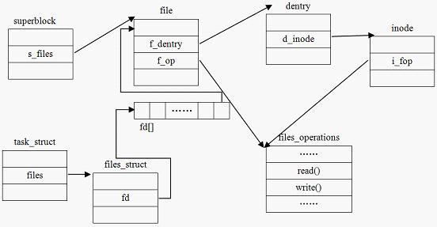

vfs数据结构
===========

- linux文件系统组件的体系结构

该图反应的Linux的文件系统的体系结构用户空间包含一些应用程序（例如，文件系统的使用者）和 GNU C 库（glibc），它们为文件系统调用（打开、读取、写和关闭）提供用户接口。
VFS 是底层文件系统的主要接口。这个组件导出一组接口，然后将它们抽象到各个文件系统，各个文件系统的行为可能差异很大。同时有两个针对文件系统对象的缓存（inode 和 dentry）。
它们缓存最近使用过的文件系统对象。

概念
--------

文件: 一组在逻辑上具有完整意义的信息项的系列。在Linux中除了普通文件，其他诸如目录、设备、套接字等以文件被对待

目录: 目录好比一个文件夹，用来容纳相关文件。因为目录可以包含子目录，所以目录是可以层层嵌套，形成文件路径，Linux中目录被作为一种特殊文件对待

目录项: 在一个文件路径中，路径中的每一个部分被称为目录项。如/home/source/test.c 目录/, home, source, test.c 都是一个目录项

索引节点: 用于存储文件的元数据的一个数据结构。文件的元数据，也就是文件的相关信息，和文件本身是两个不同的概念。它包含的是诸如文件的大小，拥有者，创建时间，磁盘位置等和文件相关的概念

超级块: 用于存储文件系统的控制信息的数据结构。描述文件系统的状态，文件系统类型，大小，区块数，索引节点数等,存放于磁盘的特定扇区中

以上几个概念在磁盘中的位置关系如下图所示

**关于文件系统的三个易混淆的概念**

创建: 以某种方式格式化磁盘的过程就是在其之上建立一个文件系统的过程，创建文件系统时，会在磁盘的特定位置写入关于该文件系统的控制信息(通常我们说的格式化为某个文件系统格式)

注册: 向内核报道，申明自己能被内核支持，一般在编译内核的时候注册，也可以加载内核模块的方式注册.注册过程实际上是将表示各实际文件系统的数据结构struct file_system_type实例化

安装: 也就我们熟悉的mount操作，将文件x系统加入到linux的根文件系统的目录树结构上，这样文件系统才能被访问(也就是我们常说的挂载)

vfs数据结构
------------

vfs依靠四个主要的数据结构和一些辅助的数据结构来描述其结构信息，这些数据结构表现的就像是对象。每个主要对象都包含由操作函数表构成的操作对象，这些操作对象描述了内核针对这几个
主要的对象可以进行的操作

自举块
^^^^^^^^

磁盘分区的第一个块，记录文件系统分区的一些信息，引导加载当前分区的程序和数据被保存在这个块中，也被称为引导块或MBR(主引导记录)

超级块
^^^^^^^^^

存储一个已安装的文件系统的控制信息，代表一个已安装的文件系统。每次一个实际的文件系统被安装时，内核会从磁盘的特定位置读取一些控制信息来填充内存中的超级快对象。一个安装实例
和一个超级块对象一一对应。超级块通过其结构中的一个域s_type记录它所属的文件系统类型

它记录的信息主要有:block与inode的总量，使用量，剩余量，文件系统的挂载时间，最近一次写入数据的时间等。可以说，没有超级块，就没有这个操作系统。inode是用来记录文件属性的，比如说
文件的权限、所有者与组、文件的大小、修改时间等。一个文件占用一个inode，系统读取文件时，首先需要找到inode，并分析inode所记录的权限与用户是否符合，若符合才能够开始实际读取block
的内容。其处于文件系统开始位置的1k处，所占大小为1k。

以下为超级块的数据结构

::

    struct super_block {
        //指向超级块链表的指针,s_list是一个双向循环链表，吧所有的super_block连接起来，一个super_block代表一个在linux上的文件系统
        struct list_head	s_list;		/* Keep this first */
        //包含该具体文件系统的块设备标识符，例如对于/dev/hda1,其设备标识符为0x301
        dev_t			s_dev;		/* search index; _not_ kdev_t */
        //blocksize占用的位数
        unsigned char		s_blocksize_bits;
        //文件系统中数据块大小，以字节为单位
        unsigned long		s_blocksize;
        //文件系统中允许的最大文件大小
        loff_t			s_maxbytes;	/* Max file size */
        //文件系统类型
        struct file_system_type	*s_type;
        //超级块方法,用于超级块操作的函数集合
        const struct super_operations	*s_op;
        //文件系统中用于限额操作的函数集合
        const struct dquot_operations	*dq_op;
        //用于配置磁盘限额的方法，处理来自用户空间的请求
        const struct quotactl_ops	*s_qcop;
        //导出方法
        const struct export_operations *s_export_op;
        //安装标识
        unsigned long		s_flags;
        unsigned long		s_iflags;	/* internal SB_I_* flags */
        //区别于其他文件系统的标识
        unsigned long		s_magic;
        //指向该具体文件系统安装目录的目录项
        struct dentry		*s_root;
        struct rw_semaphore	s_umount;
        //对超级块的使用计数
        int			s_count;
        //引用计数
        atomic_t		s_active;
    #ifdef CONFIG_SECURITY
        void                    *s_security;
    #endif
        const struct xattr_handler **s_xattr;
    #ifdef CONFIG_FS_ENCRYPTION
        const struct fscrypt_operations	*s_cop;
        struct key		*s_master_keys; /* master crypto keys in use */
    #endif
    #ifdef CONFIG_FS_VERITY
        const struct fsverity_operations *s_vop;
    #endif
        struct hlist_bl_head	s_roots;	/* alternate root dentries for NFS */
        struct list_head	s_mounts;	/* list of mounts; _not_ for fs use */
        //指向文件系统被安装的块设备
        struct block_device	*s_bdev;
        //块设备信息
        struct backing_dev_info *s_bdi;
        struct mtd_info		*s_mtd;
        struct hlist_node	s_instances;
        unsigned int		s_quota_types;	/* Bitmask of supported quota types */
        struct quota_info	s_dquot;	/* Diskquota specific options */

        struct sb_writers	s_writers;

        /*
         * Keep s_fs_info, s_time_gran, s_fsnotify_mask, and
         * s_fsnotify_marks together for cache efficiency. They are frequently
         * accessed and rarely modified.
         */
        void			*s_fs_info;	/* Filesystem private info */

        /* Granularity of c/m/atime in ns (cannot be worse than a second) */
        u32			s_time_gran;
        /* Time limits for c/m/atime in seconds */
        time64_t		   s_time_min;
        time64_t		   s_time_max;
    #ifdef CONFIG_FSNOTIFY
        __u32			s_fsnotify_mask;
        struct fsnotify_mark_connector __rcu	*s_fsnotify_marks;
    #endif

        char			s_id[32];	/* Informational name */
        uuid_t			s_uuid;		/* UUID */

        unsigned int		s_max_links;
        fmode_t			s_mode;

        /*
         * The next field is for VFS *only*. No filesystems have any business
         * even looking at it. You had been warned.
         */
        struct mutex s_vfs_rename_mutex;	/* Kludge */

        /*
         * Filesystem subtype.  If non-empty the filesystem type field
         * in /proc/mounts will be "type.subtype"
         */
        const char *s_subtype;

        const struct dentry_operations *s_d_op; /* default d_op for dentries */

        /*
         * Saved pool identifier for cleancache (-1 means none)
         */
        int cleancache_poolid;

        struct shrinker s_shrink;	/* per-sb shrinker handle */

        /* Number of inodes with nlink == 0 but still referenced */
        atomic_long_t s_remove_count;

        /* Pending fsnotify inode refs */
        atomic_long_t s_fsnotify_inode_refs;

        /* Being remounted read-only */
        int s_readonly_remount;

        /* AIO completions deferred from interrupt context */
        struct workqueue_struct *s_dio_done_wq;
        struct hlist_head s_pins;

        /*
         * Owning user namespace and default context in which to
         * interpret filesystem uids, gids, quotas, device nodes,
         * xattrs and security labels.
         */
        struct user_namespace *s_user_ns;

        /*
         * The list_lru structure is essentially just a pointer to a table
         * of per-node lru lists, each of which has its own spinlock.
         * There is no need to put them into separate cachelines.
         */
        struct list_lru		s_dentry_lru;
        struct list_lru		s_inode_lru;
        struct rcu_head		rcu;
        struct work_struct	destroy_work;

        struct mutex		s_sync_lock;	/* sync serialisation lock */

        /*
         * Indicates how deep in a filesystem stack this SB is
         */
        int s_stack_depth;

        /* s_inode_list_lock protects s_inodes */
        spinlock_t		s_inode_list_lock ____cacheline_aligned_in_smp;
        struct list_head	s_inodes;	/* all inodes */

        spinlock_t		s_inode_wblist_lock;
        struct list_head	s_inodes_wb;	/* writeback inodes */
    } __randomize_layout;

- 超级块方法

::

    struct super_operations {
        //该函数在给定的超级块下创建并初始化一个新的索引节点对象
        struct inode *(*alloc_inode)(struct super_block *sb);
        //释放指定的索引节点
        void (*destroy_inode)(struct inode *);
        void (*free_inode)(struct inode *);

        //vfs在索引节点被修改时会调用此函数
        void (*dirty_inode) (struct inode *, int flags);
        //将指定的inode写回磁盘
        int (*write_inode) (struct inode *, struct writeback_control *wbc);
        //删除索引节点
        int (*drop_inode) (struct inode *);
        void (*evict_inode) (struct inode *);
        //用来释放超级块
        void (*put_super) (struct super_block *);
        //使文件系统的数据元素与磁盘上的文件系统同步，wait参数指定操作是否同步
        int (*sync_fs)(struct super_block *sb, int wait);
        int (*freeze_super) (struct super_block *);
        int (*freeze_fs) (struct super_block *);
        int (*thaw_super) (struct super_block *);
        int (*unfreeze_fs) (struct super_block *);
        //获取文件系统状态，把文件系统相关的统计信息放在statfs中
        int (*statfs) (struct dentry *, struct kstatfs *);
        int (*remount_fs) (struct super_block *, int *, char *);
        void (*umount_begin) (struct super_block *);

        int (*show_options)(struct seq_file *, struct dentry *);
        int (*show_devname)(struct seq_file *, struct dentry *);
        int (*show_path)(struct seq_file *, struct dentry *);
        int (*show_stats)(struct seq_file *, struct dentry *);
    #ifdef CONFIG_QUOTA
        ssize_t (*quota_read)(struct super_block *, int, char *, size_t, loff_t);
        ssize_t (*quota_write)(struct super_block *, int, const char *, size_t, loff_t);
        struct dquot **(*get_dquots)(struct inode *);
    #endif
        int (*bdev_try_to_free_page)(struct super_block*, struct page*, gfp_t);
        long (*nr_cached_objects)(struct super_block *,
                      struct shrink_control *);
        long (*free_cached_objects)(struct super_block *,
                        struct shrink_control *);
    };

索引节点
^^^^^^^^^^

索引节点对象存储了文件的相关信息，代表了存储设备上的一个实际的物理文件。当一个文件首次被访问时，内核会在内存中组装响应的索引节点对象，以便向内核提供对一个文件进行操作时
所必须的全部信息，保存的其实是实际的数据的一些信息，这些信息称为元数据。例如文件大下，设备标识符，用户标识符，文件模式，扩展属性，文件读取或修改的时间戳，链接数量，指向存储该
内容的磁盘区块的指针，文件分类等等。这些信息一部分是存储在磁盘特定位置，另外一部分是加载时动态填充的

数据:元数据+数据本身

.. note::
    inode有两种，一种是vfs的inode，一种是具体文件系统的inode，前者在内存中，后者在磁盘中。所以每次其实是将磁盘中的inode填充内存中的inode，这样才算是使用了磁盘文件inode

- inode怎样生成的

每个inode节点的大小，一般是128字节或256字节，inode节点的总数，在格式化时就给定，一般每2KB就设置一个inode，一般情况下inode是用不完的

- inode号

inode号是唯一的，表示不同的文件。其实在linux内部的时候，访问文件都是通过inode号来进行的，所谓文件名仅仅是给用户容易使用的。当我们打开一个文件的时候，首先，系统
会找到这个文件名对应的inode号，然后通过inode号得到inode信息，最后通过inode找到文件数据所在的block

- inode和文件的关系

当创建一个文件的时候就给文件分配了一个inode。一个inode只对应一个实际文件，一个文件也只有一个inode。inodes最大数量就是文件的最大数量

::

    struct inode {
        umode_t			i_mode;     //访问权控制
        unsigned short		i_opflags;
        kuid_t			i_uid;  //使用者的ID
        kgid_t			i_gid;  //用户组ID
        unsigned int		i_flags;    //文件系统标志

    #ifdef CONFIG_FS_POSIX_ACL
        struct posix_acl	*i_acl;
        struct posix_acl	*i_default_acl;
    #endif

        const struct inode_operations	*i_op;  //索引节点操作表
        struct super_block	*i_sb;  //相关的超级块
        struct address_space	*i_mapping; //相关的地址映射

    #ifdef CONFIG_SECURITY
        void			*i_security;
    #endif

        /* Stat data, not accessed from path walking */
        unsigned long		i_ino;  //索引节点号
        /*
         * Filesystems may only read i_nlink directly.  They shall use the
         * following functions for modification:
         *
         *    (set|clear|inc|drop)_nlink
         *    inode_(inc|dec)_link_count
         */
        union {
            const unsigned int i_nlink;
            unsigned int __i_nlink; //硬连接数
        };
        dev_t			i_rdev; //实际设备标识符号
        loff_t			i_size;
        struct timespec64	i_atime;    //最后访问时间
        struct timespec64	i_mtime;    //最后修改时间
        struct timespec64	i_ctime;    //最后改变时间
        spinlock_t		i_lock;	/* i_blocks, i_bytes, maybe i_size */
        unsigned short          i_bytes;    //使用的字节数
        u8			i_blkbits;
        u8			i_write_hint;
        blkcnt_t		i_blocks;   //文件的块数

    #ifdef __NEED_I_SIZE_ORDERED
        seqcount_t		i_size_seqcount;
    #endif

        /* Misc */
        unsigned long		i_state;
        struct rw_semaphore	i_rwsem;

        unsigned long		dirtied_when;	/* jiffies of first dirtying */
        unsigned long		dirtied_time_when;

        struct hlist_node	i_hash; //为了提高查找inode的效率，每一个inode都会有一个hash值
        struct list_head	i_io_list;	/* backing dev IO list */
    #ifdef CONFIG_CGROUP_WRITEBACK
        struct bdi_writeback	*i_wb;		/* the associated cgroup wb */

        /* foreign inode detection, see wbc_detach_inode() */
        int			i_wb_frn_winner;
        u16			i_wb_frn_avg_time;
        u16			i_wb_frn_history;
    #endif
        struct list_head	i_lru;		/* inode LRU list */
        struct list_head	i_sb_list;  //链接一个文件系统中所有inode的链表
        struct list_head	i_wb_list;	/* backing dev writeback list */
        union {
            struct hlist_head	i_dentry;   //目录项链表
            struct rcu_head		i_rcu;  //
        };
        atomic64_t		i_version;
        atomic64_t		i_sequence; /* see futex */
        atomic_t		i_count;    //引用计数
        atomic_t		i_dio_count;
        atomic_t		i_writecount;   //写着计数
    #if defined(CONFIG_IMA) || defined(CONFIG_FILE_LOCKING)
        atomic_t		i_readcount; /* struct files open RO */
    #endif
        union {
            const struct file_operations	*i_fop;	/* former ->i_op->default_file_ops */
            void (*free_inode)(struct inode *);
        };
        struct file_lock_context	*i_flctx;
        struct address_space	i_data;
        struct list_head	i_devices;
        union {
            struct pipe_inode_info	*i_pipe;    //管道信息
            struct block_device	*i_bdev;    //块设备驱动节点
            struct cdev		*i_cdev;    //字符设备驱动节点
            char			*i_link;
            unsigned		i_dir_seq;
        };

        __u32			i_generation;

    #ifdef CONFIG_FSNOTIFY
        __u32			i_fsnotify_mask; /* all events this inode cares about */
        struct fsnotify_mark_connector __rcu	*i_fsnotify_marks;
    #endif

    #ifdef CONFIG_FS_ENCRYPTION
        struct fscrypt_info	*i_crypt_info;
    #endif

    #ifdef CONFIG_FS_VERITY
        struct fsverity_info	*i_verity_info;
    #endif

        void			*i_private; /* fs or device private pointer */
    } __randomize_layout;

- 索引节点方法

::

    struct inode_operations {
        struct dentry * (*lookup) (struct inode *,struct dentry *, unsigned int);   //查找指定文件的dentry
        const char * (*get_link) (struct dentry *, struct inode *, struct delayed_call *);
        int (*permission) (struct inode *, int);
        struct posix_acl * (*get_acl)(struct inode *, int);

        int (*readlink) (struct dentry *, char __user *,int);
        //如果该inode描述一个目录文件，那么当在该目录下创建或者打开一个文件时，内核必须为这个文件创建一个inode。vfs通过调用该inode的i_op->create()
        //来完成上述新inode的创建。该函数第一个参数为该目录的inode，第二个参数是要打开新文件的dentry，第三个参数是对该文件的访问权限。如果该inode描述的是一个普通文件
        //那么该inode永远不会调用这个create函数
        int (*create) (struct inode *,struct dentry *, umode_t, bool);
        //用于在指定目录下创建一个硬链接，这个link函数会被系统调用link调用
        int (*link) (struct dentry *,struct inode *,struct dentry *);
        int (*unlink) (struct inode *,struct dentry *);
        int (*symlink) (struct inode *,struct dentry *,const char *);
        //创建目录,被系统调用mkdir调用
        int (*mkdir) (struct inode *,struct dentry *,umode_t);
        int (*rmdir) (struct inode *,struct dentry *);
        int (*mknod) (struct inode *,struct dentry *,umode_t,dev_t);
        int (*rename) (struct inode *, struct dentry *,
                struct inode *, struct dentry *, unsigned int);
        int (*setattr) (struct dentry *, struct iattr *);
        int (*getattr) (const struct path *, struct kstat *, u32, unsigned int);
        ssize_t (*listxattr) (struct dentry *, char *, size_t);
        int (*fiemap)(struct inode *, struct fiemap_extent_info *, u64 start,
                  u64 len);
        int (*update_time)(struct inode *, struct timespec64 *, int);
        int (*atomic_open)(struct inode *, struct dentry *,
                   struct file *, unsigned open_flag,
                   umode_t create_mode);
        int (*tmpfile) (struct inode *, struct dentry *, umode_t);
        int (*set_acl)(struct inode *, struct posix_acl *, int);
    } ____cacheline_aligned;

目录项
^^^^^^^^

所谓文件，就是按照一定的形式存储在介质上的信息，所以一个文件其实包含了两方面的信息，一个是存储的数据本身，另一个是有关该文件的组织和管理的信息。
在内存中，每个文件都有一个dentry(目录项)和inode(索引节点)结构，dentry记录着文件名，上级目录等信息，正是它形成了我们所看到的树状结构。而有关该文件的组织
和管理的喜喜主要存在inode里面，它记录者文件在存储介质上的位置与分布. 同时dentry->d_inode指向响应的inode结构，dentry与inode是多对一的关系，因为有可能一个
文件有好几个文件名。所有的dentry用d_parent和d_child连接起来,就形成了我们熟悉的树状结构.

.. note::
    不管是文件夹还是最终的文件，都是属于目录项. 目录也是一种文件，所以也存在对应的inode

::

    struct dentry {
        /* RCU lookup touched fields */
        unsigned int d_flags;		/* protected by d_lock */
        seqcount_t d_seq;		/* per dentry seqlock */
        struct hlist_bl_node d_hash;	/* lookup hash list */
        struct dentry *d_parent;	/* parent directory */
        struct qstr d_name;
        struct inode *d_inode;		/* Where the name belongs to - NULL is
                         * negative */
        unsigned char d_iname[DNAME_INLINE_LEN];	/* small names */

        /* Ref lookup also touches following */
        struct lockref d_lockref;	/* per-dentry lock and refcount */
        const struct dentry_operations *d_op;
        struct super_block *d_sb;	/* The root of the dentry tree */
        unsigned long d_time;		/* used by d_revalidate */
        void *d_fsdata;			/* fs-specific data */

        union {
            struct list_head d_lru;		/* LRU list */
            wait_queue_head_t *d_wait;	/* in-lookup ones only */
        };
        struct list_head d_child;	/* child of parent list */
        struct list_head d_subdirs;	/* our children */
        /*
         * d_alias and d_rcu can share memory
         */
        union {
            struct hlist_node d_alias;	/* inode alias list */
            struct hlist_bl_node d_in_lookup_hash;	/* only for in-lookup ones */
            struct rcu_head d_rcu;
        } d_u;
    } __randomize_layout;

- dentry相关的操作（inode里面已经包含了mkdir，rmdir，mknod之类的了）

::

	struct dentry_operations {
			/* 该函数判断目录对象是否有效。VFS准备从dcache中使用一个目录项时，会调用该函数. */
		int (*d_revalidate)(struct dentry *, unsigned int);       
		int (*d_weak_revalidate)(struct dentry *, unsigned int);
			/* 该目录生成散列值，当目录项要加入到散列表时，VFS要调用此函数。 */
		int (*d_hash)(const struct dentry *, struct qstr *);    
			/* 该函数来比较name1和name2这两个文件名。使用该函数要加dcache_lock锁。 */
		int (*d_compare)(const struct dentry *, const struct dentry *,
				unsigned int, const char *, const struct qstr *);
			/* 当d_count=0时，VFS调用次函数。使用该函数要叫 dcache_lock锁。 */
		int (*d_delete)(const struct dentry *);
			/* 当该目录对象将要被释放时，VFS调用该函数。 */
		void (*d_release)(struct dentry *);
		void (*d_prune)(struct dentry *);
			/* 当一个目录项丢失了其索引节点时，VFS就掉用该函数。 */
		void (*d_iput)(struct dentry *, struct inode *);
		char *(*d_dname)(struct dentry *, char *, int);
		struct vfsmount *(*d_automount)(struct path *);
		int (*d_manage)(struct dentry *, bool);
	} ____cacheline_aligned;
	 

文件对象
^^^^^^^^^

注意文件对象描述的是进程已经打开的文件，因为一个文件可以被多个进程打开，所以一个文件可以存在多个文件对象。但是由于文件是唯一的，那么inode就是唯一的，目录项也是定的。

进程其实是通过文件描述符来操作文件的，注意每个文件都有一个32位的数字来表示下一个读写的位置，这个数字叫做文件位置。一般情况下打开文件后，打开位置都是从0开始。linux用
file结构体来保存打开的文件的位置，所以file称为打开的文件描述

::

	struct file {
		union {
			struct llist_node	fu_llist;    /* 每个文件系统中被打开的文件都会形成一个双链表 */
			struct rcu_head 	fu_rcuhead;
		} f_u;
		struct path		f_path;                
	#define f_dentry	f_path.dentry	//f_path.dentry指针指向相关的目录项对象
		struct inode		*f_inode;	/* cached value */
		const struct file_operations	*f_op;    /* 指向文件操作表的指针 */
	ENODATA
		/*
		 * Protects f_ep_links, f_flags.
		 * Must not be taken from IRQ context.
		 */
		spinlock_t		f_lock;
		atomic_long_t		f_count;                /* 文件对象的使用计数 */
		unsigned int 		f_flags;                /* 打开文件时所指定的标志 */
		fmode_t			f_mode;                     /* 文件的访问模式(权限等) */
		struct mutex		f_pos_lock;
		loff_t			f_pos;                      /* 文件当前的位移量 */
		struct fown_struct	f_owner;
		const struct cred	*f_cred;
		struct file_ra_state	f_ra;               /* /预读状态 */
	 
		u64			f_version;                      /* 版本号 */
	#ifdef CONFIG_SECURITY    
		void			*f_security;                /* 安全模块 */
	#endif
		/* needed for tty driver, and maybe others */
		void			*private_data;              /* /tty设备hook */
	 
	#ifdef CONFIG_EPOLL
		/* Used by fs/eventpoll.c to link all the hooks to this file */
		struct list_head	f_ep_links;
		struct list_head	f_tfile_llink;
	#endif /* #ifdef CONFIG_EPOLL */
		struct address_space	*f_mapping;        /* 页缓存映射 */
	} __attribute__((aligned(4)));	/* lest something weird decides that 2 is OK */

.. note::
	文件对象实际上没有对应的磁盘数据，所以在结构体中没有代表其对象是否为脏，是否需要写回磁盘的标志。文件对象通过f_path.dentry指针指向相关的目录项对象，
	目录项会指向相关的索引节点，索引节点会记录文件是否是脏的

文件系统相关
^^^^^^^^^^^^^

根据文件系统所在的物理介质和数据在物理介质上的组织方式来区分不同的文件系统类型的。file_system_type结构用于描述具体的文件系统的类型信息。被linux支持的文件系统，
都有且仅有一个file_system_type结构而不管它有零个或多个实例被安装到系统中

文件系统相关
^^^^^^^^^^^^^

根据文件系统所在的物理介质和数据在物理介质上的组织方式来区分不同的文件系统类型的。file_system_type结构用于描述具体的文件系统的类型信息。被linux支持的文件系统，
都有且仅有一个file_system_type结构而不管它有零个或多个实例被安装到系统中. 而与此对应的是每当一个文件系统被实际安装时，酒有一个vfsmount结构体被创建，这个结构体
对应一个安装点

::

	struct file_system_type {
		const char *name;                        /*文件系统的名字*/
		int fs_flags;                            /*文件系统类型标志*/
	#define FS_REQUIRES_DEV		1 
	#define FS_BINARY_MOUNTDATA	2
	#define FS_HAS_SUBTYPE		4
	#define FS_USERNS_MOUNT		8	/* Can be mounted by userns root */
	#define FS_USERNS_DEV_MOUNT	16 /* A userns mount does not imply MNT_NODEV */
	#define FS_USERNS_VISIBLE	32	/* FS must already be visible */
	#define FS_NOEXEC		64	/* Ignore executables on this fs */
	#define FS_RENAME_DOES_D_MOVE	32768	/* FS will handle d_move() during rename() internally. */
		struct dentry *(*mount) (struct file_system_type *, int,
				   const char *, void *);
		void (*kill_sb) (struct super_block *);        /* 终止访问超级块*/    
		struct module *owner;                          /* 文件系统模块*/
		struct file_system_type * next;                /*链表中的下一个文件系统类型*/
		struct hlist_head fs_supers;                   /*具有同一种文件系统类型的超级块对象链表*/
	 
		struct lock_class_key s_lock_key;
		struct lock_class_key s_umount_key;
		struct lock_class_key s_vfs_rename_key;
		struct lock_class_key s_writers_key[SB_FREEZE_LEVELS];
	 
		struct lock_class_key i_lock_key;
		struct lock_class_key i_mutex_key;
		struct lock_class_key i_mutex_dir_key;
	};

::

	struct vfsmount {
		struct dentry *mnt_root;	/* root of the mounted tree 该文件系统的根目录项对象  */
		struct super_block *mnt_sb;	/* pointer to superblock 该文件系统的超级块 */
		int mnt_flags;                  /*安装标志*/
	};

进程相关
^^^^^^^^^^

::

	struct task_struct {
		......
	/* CPU-specific state of this task */
		struct thread_struct thread;        /* 进程相关 */
	/* filesystem information */
		struct fs_struct *fs;               /* 建立进程与文件系统的关系 */
	/* open file information */
		struct files_struct *files;         /* 打开的文件集 */
		......
	}

	//建立进程与文件系统的关系
	struct fs_struct {
		int users;                 
		spinlock_t lock;            /*保护该结构体的锁*/
		seqcount_t seq;
		int umask;                /*默认的文件访问权限*/
		int in_exec;
		struct path root, pwd;     /*根目录的目录项对象, 当前工作目录的目录项对象*/
	};
	 
	struct path {
		struct vfsmount *mnt;
		struct dentry *dentry;
	};

	/* 进程打开的文件集 */
	struct files_struct {
	  /*
	   * read mostly part
	   */
		atomic_t count;                           /* 结构的使用计数,表明当前被多少进程打开 */
		struct fdtable __rcu *fdt;
		struct fdtable fdtab;                     /* 默认使用这个,标记下面数组的,如果打开的文件超过NR_OPEN_DEFAULT,就需要动态申请空间了,申请的由上面这个标记 */
	  /*
	   * written part on a separate cache line in SMP
	   */
		spinlock_t file_lock ____cacheline_aligned_in_smp;
		int next_fd;                              /* 下一个文件描述符,方便申请文件描述符 */
		unsigned long close_on_exec_init[1];      /* exec()关闭的文件描述符 */
		unsigned long open_fds_init[1];           /* 文件描述符的初始集合 */
		struct file __rcu * fd_array[NR_OPEN_DEFAULT];        /* 默认的文件对象数组 */
	};
	 
	 
	struct fdtable {
		unsigned int max_fds;        /* 当前fd_array里,最大可以打开的文件数量 */
		struct file __rcu **fd;      /* current fd array 默认是files_struct 里面的fd_array,如果超出,就需要动态申请,这个就会指向动态申请的 */
		unsigned long *close_on_exec;
		unsigned long *open_fds;     /* 存放进程已经打开的文件描述符 */
		struct rcu_head rcu;         /* 动态申请的和之前的通过链表链接 */
	};

一般在open函数的时候，进程会通过Pathname(包括path和name，即entry)，找到inode，进而找到它里面的file_operation方法，把这个方法填充到file_struct中的fd_array数组未使用
的最小对应项中，返回该项下标，即我们应用程序所谓的文件描述符. 之后的read write等都是通过文件描述符，直接找到file_struct中的对应数组项，直接操作对应的驱动函数

- 超级块、安装点和具体的文件系统的关系

- 进程与超级块、文件、索引结点、目录项的关系

以下图示说明了上述概念之间的联系

file，dentry，inode，super_block以及超级块的位置约定都属于vfs层，inode中的i_fop和file中f_op一样的，虽然每个文件都有目录项和索引节点在磁盘上，但是只有在需要时才会在内存中
为之建立相应的dentry和inode数据结构，特殊文件在内存中也有inode数据结构和dentry数据结构，但是不一定在存储介质上有索引节点和目录项. 特殊文件一般与外部设备无关，所涉及的信息
通常是内存和CPU本身

一个示例
---------

