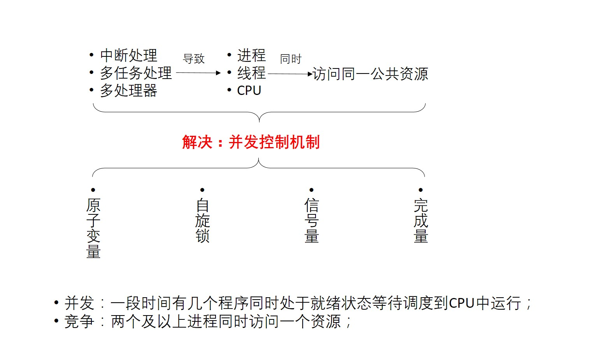
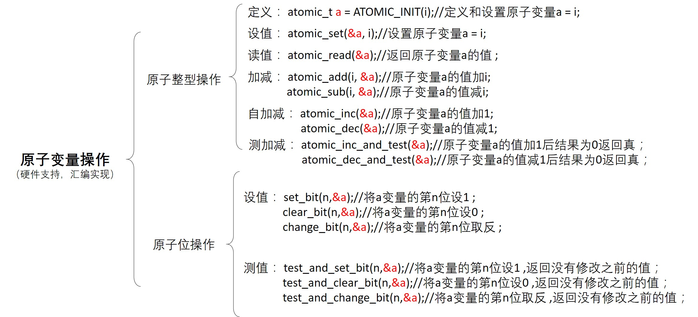
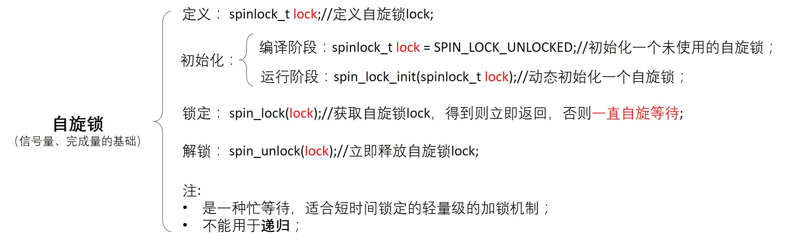
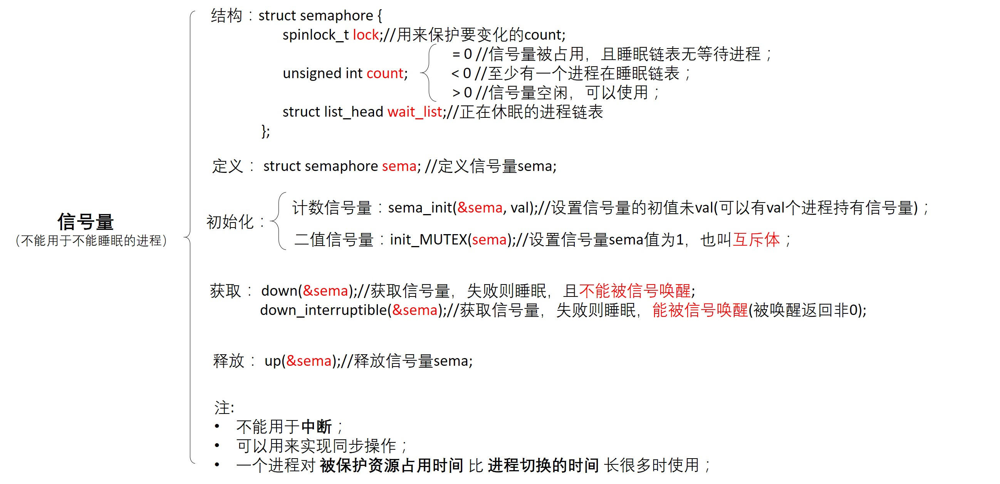

linux并发控制机制
=====================

原子变量操作
----------------

- 测试代码

::

    #include <linux/module.h>
    #include <linux/init.h>

    #include <asm/automic.h>    //原子变量操作的头文件
    #include <asm/bitops.h>     //原子位操作的头文件

    atomic_t al = ATOMIC_INIT(1);   //定义和设置原子量
    unsigned long int a2; 

    static int test_drv_init(void)
    {
        //测试原子量操作
        printk("test a1\nKERN_INFO:aotmic_read(): a1 = %d\n", a1);

        atomic_add(4, &a1);
        printk("KERN_INFO:atomic_add(): a1 = %d\n", a1);

        atomic_dec(&a1);
        printk("KERN_INFO:atomic_dec(): a1 = %d\n", a1);

        printk("KERN_INFO:atomic_dec_and_test(): judge_a1 = %d, new_a1 = %d\n", atomic_dec_and_test(&a1), atomic_read(&a1));

        //测试原子位操作
        set_bit(0, &a2);
        printk("test a2\nKERN_INFO:set_bit(): a2 = %ld\n", a2);

        printk("KERN_INFO:test_and_clear_bit(): return_a2 = %d, new_a2 = %ld\n", \
            test_and_clear_bit(0, &a2), a2);

        printk("KERN_INFO:test_and_set_bit(): return_a2 = %d, new_a2 = %ld\n", test_and_set_bit(0, &a2), a2);
    }

    static void test_drv_exit(void)
    {
    
    }

    module_init(test_drv_init);
    module_exit(test_drv_exit);

    MODULE_LICENSE("GPL");
    MODULE_AUTHOR("hkdywg");
    MODULE_DESCRIPTION("Learn for atomic");

自旋锁
--------

- 测试代码

::

    #include <linux/module.h>
    #include <linux/init.h>
    #include <linux/kernel.h>
    #include <linux/fs.h>
    #include <asm/unaccess.h>
    #include <linux/of.h>
    #include <linux/of_device.h>
    #include <linux/spinlock.h>

    static struct class *testdrv_class;
    static struct class_device *testdrv_class_dev;

    int count = 0;
    spinlock_t lock;

    static int test_drv_open(struct inode *inode, struct file *file)
    {
        spin_lock(&lock);
        if(count) {
            spin_unlock(&lock);
            pirntk("kernel: open fail! count = %d\n", count);
            return -EBUSY;
        }
        count++;
        spin_unlock(&lock);
        printk("kernel: open ok! count = %d\n", count);

        return 0;
    }

    static int test_drv_release(struct inode *inode, struct file *file)
    {
        spin_lock(&lock);
        count--;
        spin_unlock(&lock);
        printk("kernel: release ok! count  = %d\n", count);

        return 0;
    }

    static struct file_operations test_drv_fops = {
        .owner = THIS_MODULE,
        .open = test_drv_open,
        .release = test_drv_release,
    };

    int major;
    static int test_drv_init(void)
    {
        major = register_chrdev(0, "test_drv", &test_drv_fops);

        testdrv_class = class_create(THIS_MODULE, "testdrv");

        testdrv_class_dev = devcie_create(testdrv_class, NULL, MKDEV(major, 0), NULL, "locktest");

        spin_lock_init(&lock);

        printk("kernel: init ok!\n");

        return 0;
    }

    static void test_drv_exit(void)
    {
        unregister_chrdev(major, "test_drv");

        device_destroy(testdrv_class, MKDEV(major, 0));

        class_destroy(testdrv_class);

        printk("kernel: exit ok!\n");
    }

    module_init(test_drv_init);
    module_exit(test_drv_exit);

    MODULE_LICENSE("GPL");
    MODULE_AUTHOR("hkdywg");
    MPDULE_DESCRIPTION("Learn for spin lock");

::

    #include <sys/types.h>
    #include <sys/stat.h>
    #include <fcntl.h>
    #include <stdio.h>

    int main(int argc, char **argv)
    {
        int fd;
        fd = open("/dev/locktest", O_RDWR);

        if(fd < 0) {
            printf("app: can't open!\n");
        } else {
            printf("app: open ok!\n");
        }

        return 0;
    }

信号量
-------

- 测试代码

::

    #include <linux/module.h>
    #include <linux/init.h>
    #include <linux/kernel.h>
    #include <linux/fs.h>
    #include <linux/of.h>
    #include <asm/uaccess.h>
    #include <linux/of_device.h>
    #inlcude <linux/semaphore.h>

    static struct class *testdrv_class;
    static struct class_device *testdrv_class_dev;

    struct semaphore sem;

    static int test_drv_open(struct inode *inode, struct file *file)
    {
        printk("kernel:down befor sem.count = %d\n", sem.count);

        down(&sem);

        printk("kernel:down after sem.count = %d\n", sem.count);

        return 0;
    }

    static int test_drv_release(struct inode *inode, struct file *file)
    {
        printk("kernel:up befor sem.count = %d\n", sem.count);

        up(&sem);

        printk("kernel:up after sem.count = %d\n", sem.count);

        return 0;
    }

    static struct file_operations test_drv_fops = {
        .owner = THIS_MODULE,
        .open = test_drv_open,
        .release = test_drv_release,
    };

    int major;
    static int test_drv_init(void)
    {
        major = register_chrdev(0, "test_drv", &test_drv_fops);

        testdrv_class = class_create(THIS_MODULE, "testdrv");

        testdrv_class_dev = device_create(testdrv_class, NULL, MKDEV(major, 0), NULL, "semaphoretest");

        sema_init(&sem, 2); //允许同时2个进程访问临界资源

        printk("kernel: init ok!\n");

        return 0;
    }

    static void test_drv_exit(void)
    {
        unregister_chrdev(major, "test_drv");

        device_destroy(testdrv_class, MKDEV(major, 0));

        class_destroy(testdrv_class);

        printk("kernel: exit ok!\n");
    }

    module_init(test_drv_init);
    module_exit(test_drv_exit);

    MODULE_LICENSE("GPL");
    MODULE_AUTHOR("hkdywg");
    MODULE_DESCRIPTION("Learn for semaphore");

::

    #include <sys/types.h>
    #include <sys/stat.h>
    #include <fcntl.h>
    #include <stdio.h>

    int main(int argc, char **argv)
    {
        int fd;

        fd = open("/dev/semaphoretest", O_RDWR);

        if(fd < 0)
            printf("app: can't open!\n");
        else
            printf("app: open ok!\n");

        return 0;
    }

    

