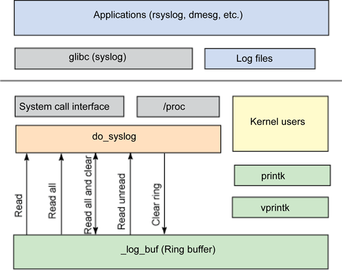

kernel-debug之kdump
------------------

kdump机制介绍
^^^^^^^^^^^^^

一般情况下kernel crash时系统处于死机状态，无法通过一般手段获取故障发生时的
现场信息。这种情况下kdump-kexec机制应运而生。
kexec可在一个内核运行时加载另一个内核，而且不进行硬件初始化。在跳过u-boot
而且没有硬件重启的情况下可以保留上一个内核的运行现场。
产生crash的内核称为生产内核，发生crash后运行的另外一个内核称为捕获内核。
生产内核在发生crash时通过kdump生成vmcore文件，vmcore文件包含函数调用栈信息
cpu寄存器信息等。在捕获内核中可以通过dgdb等工具查看并调试。

什么是kexec?

    kexec是实现kdump机制的关键，它包括2个组成部分：一是内核空间的系统调用
    kexec_load负责在生产内核启动时将捕获内核加载到指定地址。二是用户空间的
    kexec-tools，他将捕获内核的地址传递给生产内核，从而在系统崩溃时能找到
    捕获内核的地址并运行。

什么是kdump
    
    kdump的概念出现在2005年左右，是迄今为止最为可靠的内核转存机制。kdump是
    一种基于kexec的内核崩溃转存机制。当系统崩溃时，kdump使用kexec启动到第二
    个内核。第二个内核通常叫捕获内核，生产内核会预留一部分内存给捕获内核使用，
    由于kdump利用kexec启动捕获内核绕过了boot，没有硬件复位，使得生产内核 的内
    存得以保留。这是内核崩溃转存的本质。

kdump kexec安装
^^^^^^^^^^^^^^^

kexec安装

::

    wget https://mirrors.edge.kernel.org/pub/linux/utils/kernel/kexec/kexec-tools-2.0.17.tar.gz
    tar xvzf kexec-tools-2.0.17.tar.gz
    ./configure --build=x86_64-linux --host=aarch64-unknown-linux-gnu --target=aarch64-unknown-linux-gnu
    make ARCH=arm64 clean all
    make install

注：以上操作直接在目标板系统中执行

kernel 配置

内核编译时需要打开以下选项（最好使用menuconfig的方式，手动修改.config容易漏掉依赖项配置）

::

    CONFIG_KEXEC=y
    CONFIG_SYSFS=y
    CONFIG_DEBUG_INFO=y
    CONFIG_CRASH_DUMP=y
    CONFIG_PROC_VMCORE=y

kexec 应用方法
^^^^^^^^^^^^^^

编译kexec-tools的源码可得到kexec的可执行文件，kexec用来加载捕获内核
加载的命令如下

::

    kexec -p kernel.img --initrd=initramfs-image.img --reuse-cmdline
    or
    kexec -p Image --command-line="`cat /proc/cmdline`"

    --reuse-cmdline参数表示使用与生产内核相同的命令行
    --initrd 传递initramfs
    -l 表明正在加载捕获内核，-l加载的内核可用过kexec -e执行
    -p 加载的内核用于在内核崩溃时执行

然后可以通过以下命令出发内核crash

::

    echo c > /proc/sysrq-trigger

kdump-kexec机制正常运行的情况下，kdump会抓取系统崩溃时的函数调用栈现场以及寄存器和ram信息，并
利用kexec完成捕获内核的启动。在捕获内核中可以查看故障现场情况，分析确认问题。

::
    crash vmlinux vmcore
    在kgdb中输入BT，可找到系统崩溃处的详细信息

kernel debug之printk
--------------------

printk
^^^^^^

pintk()
内核提供的格式化打印函数
健壮性是printk最容易被接受的一个特质，几乎在任何地方，任何时候都可以调用它（中断上下文、进程上下文
持有锁时、多处理器处理时等）；

LOG等级
^^^^^^^

printk与printf一个主要的区别在于前者可以指定log级别。内核根据这个级别判断是否在终端上打印消息。
可以使用下面的方式指定log级别

::

    printk(KERN_CRIT "hello,world!\n");

注：第一个参数并不是一个真正的参数，因为其中没有用于分割级别 和格式字符的逗号(,)，KER_CRIT本身只是一个
普通的字符串（事实上，它表示的是字符串"<2>").作为预处理程序的一部分，C会自动的使用一个名为字符串串连的
功能将这两个字符串组合在一起。组合的结果是将日志级别和用户指定的字符串包含在一个字符串内。

内核使用这个指定log界别与当前终端log等级console_loglevel来决定是不是向终端打印。
下面是可使用的log级别

::

    #define KERN_EMERG      "<0>"   /* system is unusable                            */

    #define KERN_ALERT        "<1>"   /* action must be taken immediately     */ 
    
    #define KERN_CRIT           "<2>"   /* critical conditions                                */
    
    #define KERN_ERR            "<3>"   /* error conditions                                   */
    
    #define KERN_WARNING  "<4>"   /* warning conditions                              */
    
    #define KERN_NOTICE       "<5>"   /* normal but significant condition         */
    
    #define KERN_INFO            "<6>"   /* informational                                       */
    
    #define KERN_DEBUG        "<7>"   /* debug-level messages                       */
    
    #define KERN_DEFAULT     "<d>"   /* Use the default kernel loglevel           */

如果用户没有指定log级别，系统会使用默认值KERN_WARNING (表示只有KERN_WARNING以上的消息会被记录)。
可以通过命令行修改默认日志输出级别

::

    $ cat /proc/sys/kernel/printk 
    4       4       1       7
    $ cat /proc/sys/kernel/printk_delay 
    0
    $ cat /proc/sys/kernel/printk_ratelimit 
    5
    $ cat /proc/sys/kernel/printk_ratelimit_burst 
    10

第一项定义printk当前使用日志级别，这些级别分别表示console的日志级别、默认消息日志级别、最小控制台
日志级别、默认控制台日志级别。
第二项表示printk消息之间的延迟毫秒数
第三项定义消息之间允许的最小时间间隔

记录缓冲区
^^^^^^^^^^

内核消息都被保存在一个LOG_BUG_LEN大小的环形队列中。
关于LOG_BUG_LEN的定义

::

    #define __LOG_BUF_LEN (1 << CONFIG_LOG_BUF_SHIFT)

CONFIG_LOG_BUF_SHIFT由内核编译的配置文件(.config)中定义

记录缓冲区操作:
    1.消息被读出到用户空间时，此消息就会从环形队列中删除。
    2.当消息缓冲区满时，如果再有printk调用时，新消息将覆盖队列中的旧消息。
    3.在读写环形队列时，同步问题很容易得到解决。

klogd
^^^^^

在标准的Linux系统上，用户空间的守护进程klogd从纪录缓冲区中获取内核消息，再通过syslogd守护进程把这些消息
保存在系统日志文件中。klogd进程既可以从/proc/kmsg文件中，也可以通过syslog()系统调用读取这些消息。默认情况下，
它选择读取/proc方式实现。klogd守护进程在消息缓冲区有新的消息之前，一直处于阻塞状态。一旦有新的内核消息，
klogd被唤醒，读出内核消息并进行处理。默认情况下，处理例程就是把内核消息传给syslogd守护进程。syslogd守护进程
一般把接收到的消息写入/var/log/messages文件中。不过，还是可以通过/etc/syslog.conf文件来进行配置，可以选择其
他的输出文件。

dmesg
^^^^^

dmesg 命令也可用于打印和控制内核环缓冲区。这个命令使用 klogctl 系统调用来读取内核环缓冲区，并将它转发到标准
输出（stdout）。这个命令也可以用来清除内核环缓冲区（使用 -c 选项），设置控制台日志级别（-n 选项），以及定义 
用于读取内核日志消息的缓冲区大小（-s 选项）。注意，如果没有指定缓冲区大小，那么 dmesg 会使用 klogctl 的
SYSLOG_ACTION_SIZE_BUFFER 操作确定缓冲区大小。

a) 虽然printk很健壮，但是看了源码你就知道，这个函数的效率很低：做字符拷贝时一次只拷贝一个字节，且去调用console
输出可能还产生中断。所以如果你的驱动在功能调试完成以后做性能测试或者发布的时候千万记得尽量减少printk输出，做到
仅在出错时输出少量信息。否则往console输出无用信息影响性能。 
b) printk的临时缓存printk_buf只有1K，所有一次printk函数只能记录<1K的信息到log buffer，并且printk使用的“ringbuffer”. 

动态调试
^^^^^^^^

动态调试是通过动态的开启和禁止某些内核代码来获取额外的内核信息。 
首先内核选项CONFIG_DYNAMIC_DEBUG应该被设置。所有通过pr_debug()/dev_debug()打印的信息都可以动态的显示或不显示。 
可以通过简单的查询语句来筛选需要显示的信息。 

－源文件名

－函数名

－行号（包括指定范围的行号）

－模块名

－格式化字符串

将要打印信息的格式写入<debugfs>/dynamic_debug/control中。 
