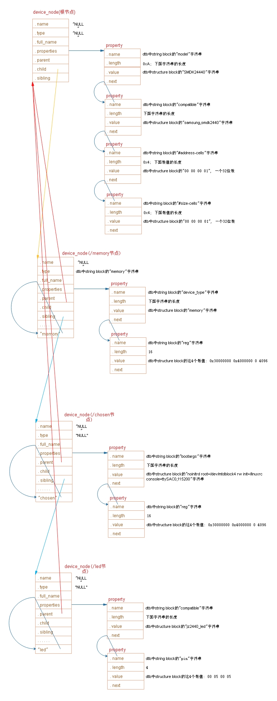
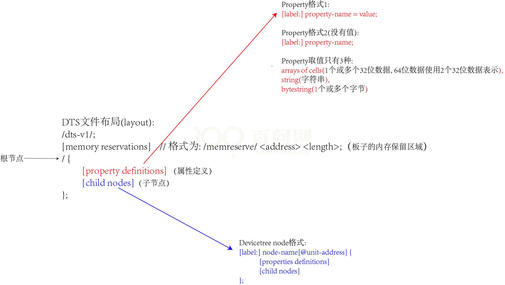
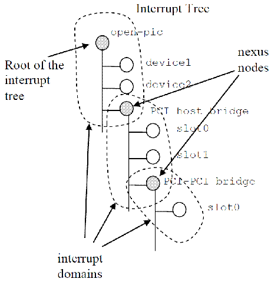

内核对设备树的支持
------------------

从源头上分析，uboot将一些参数，设备树文件传递给内核。内核将如何处理设备树文件呢

从内核的第一个执行文件head.S开始分析

- R0 R1 R2三个寄存器的设置

    uboot启动内核时会设置r0 r1 r2三个寄存器
    r0 一般设置为0
    r1 一般设置为machine id(在使用设备树时该参数没有被使用)
    r2 一般设置ATAGS或者dtb的开始地址 

    这里的machine id是让内核知道时那个CPU，从而调用对应的初始化函数。
    以前没有设备树的时候需要传递这个参数，有设备树后这个参数就不再需要设置了

- head.S的内容

  内核head.S所作的工作如下：
  a)    __lookup_processor_type 使用汇编指令读取CPU ID根据该id找到对应的proc_info_list结构体(里面包含这类CPU的初始化函数、信息)
  b)    __vet_atags 判断是否有可用的dtb
  c)    __create_page_tables 创建页表,即创建虚拟地址和物理地址的映射关系
  d)    __enable_mmu 使能MMC,以后就要使用虚拟地址了
  e)    将uboot传入的R2参数，保存到__atags_pointer中
  f)    调用C函数start_kernel

对设备树中平台信息的处理(选择machine_desc)
^^^^^^^^^^^^^^^^^^^^^^^^^^^^^^^^^^^^^^^^^^

- 内核是如何选择对应的machine_desc
    
    一个编译为image的内核镜像文件，可以支持多个单板，这些板子的配置少有不同，需要做一些单独的初始化。
    内核中针对这些单板,构造了一个machine_desc结构体，里面有.init和.nr。
    设备树的根节点里，有如下两行

    ::

        model="SMDK2440";
        compatible="samsung,smdk2440","samsung,smdk2410","samsung,smdk24xx";

    这里的compatible属性声明想要什么machine_desc，属性值可以是一些列字符串，依次与machine_desc匹配。
    内核中有多个machine_desc，其中有个dt_compat成员，它指向一个字符串数组，里面表示该machine_desc支持哪些单板.

- start_kernel的调用过程

  head.s会把dtb的位置保存在变量__atags_pointer里，最后调用start_kernel。
  start_kernel 的调用过程如下

  ::
    
    start_kernel  //init/main.c
        setup_arch(&command_line); //arch/arm/kernel/setup.c
            mdest = setup_machine_fdt(__atags_pointer);//arch/arm/kernel/setup.c
                early_init_dt_verify(phys_to_virt(dt_phys))  //判断是否有效的dtb,drivers/of/fdt.c                    initial_boot_params = params;
                mdesc = of_flat_dt_match_machine(mdesc_best,arch_get_next_mach);//找到最匹配的machine_desc。 /drivers/of/ftd.c
                while(data=get_next_compat(&compat)){
                    score = of_flat_dt_match(dt_root,compat);
                    if(score > 0 && score < best_score)
                    {
                        best_data = data;
                        best_score = score;
                    }
                }
            machine_desc = mdesc;

- 对设备树中运行时配置信息的处理

  设备树只是其一个信息传递的作用，对这些信息配置的处理，也比较简单，即从设备树的dtb文件中，把这些设备鄂信息提取出来赋值给内核的某个变量即可。
  函数调用过程如下

  ::

    start_kernel //init/main.c
        setup_arch(&command_line); //arch/arm/kernel/setup.c
            mdesc = setup_machine_fdt(__atags_pointer); //arch/arm/kernel/devtree.c
                early_init_dt_scan_nodes(); //arch/arm/kernel/devtree.c
                //从chosen 节点中检索信息
                of_scan_flat_dt(early_init_dt_scan_chosen,boot_command_line);
                // 初始化 {size, address}-cells info
                of_scan_flat_dt(early_init_dt_scan_root,NULL);
                //setup memory,calling early_init_dt_add_memory_arch
                of_scan_flat_dt(early_init_dt_scan_memory,NULL);

里面主要对三种类型的信息进行处理，分别是 /chosen 节点中bootargs属性，根节点的#address-cells和#size-cells属性，/memory的reg属性

1)  /chosen 节点中bootargs属性就是内核启动的命令行参数，它里面包含可以指定根文件系统在哪里，第一个运行的应用程序时哪一个，指定内核的打印信息从那个设备中打印出来
2)  /memory 中的reg属性指定了不同板子的内存大小和起始地址
3)  根节点的#address-cells和#size-cells属性指定属性参数的位数，比如指定前面的memory中reg属性的地址时32位的还是64位的，大小是用一个32位表示还是用两个32位表示。

总结：
* 将/chosen节点中的bootargs属性的值存入全局变量boot_command_line
* 确定根结点的两个属性的值#address-cells, #size-cells 分别存入全局变量 dt_root_addr_cells dt_root_size_cells
* 解析/memory中reg属性。提取出base size，最终调用memblock_add(base,size);

dtb转换为device_node
^^^^^^^^^^^^^^^^^^^^

  在dts文件里，每一个大括号{}代表一个节点，比如根结点里有个大括号,对应一个device_node结构体.memory也有一个大括号，也对应一个device_node结构体。
  节点中有各种属性，还有子节点，所以存在父子关系或者兄弟关系。
  include/linux/of.h 中有对device_node结构体的定义：

  ::
  
    struct device_node{
        const char *name;   //节点中的name属性,如果没有该属性，则设为NULL
        const char *type;   //节点中的device_type属性，如果没有该属性则设为NULL
        phandle phandle;
        const char *full_name;  //节点的名字，node-name[@unit-address]
        struct fwnode_handle fwnode;

        struct property *properties;    //节点属性
        struct property *deadprops;     //removed properties
        struct device_node *parent;     //节点的父亲
        struct device_node *child;      //子节点
        struct device_node *siblingl;   //兄弟节点
        #if defined(CONFIG_OF_KOBJ)
            struct kobject kobj;
        #endif 
        unsigned long _flags;
        void *data;
        #if defined(CONFIG_SPACE)
            const char *path_component_name;
            unsigned int unique_id;
            struct of_irq_controller *irq_trans;
        #endif 
    }

    
device_node结构体表示一个节点，property结构体表示节点的具体属性。

::  

    struct property{
        char *name;     //属性名字，指向dtb文件中字符串
        int length;     //属性值的长度
        void *value;    //属性值，指向dtb文件中value所在的位置，数据仍以big endian存储
        struct property *next;
        #if defined(CONFIG_OF_DYNAMIC) || defined(CONFIG_SPACE)
            unsigned long _flags;
        #endif 
        #if defined (CONFIG_OF_PROMTREE)
            unsigned int unique_id;
        #endif 
        #if defined(CONFIG_OF_KOBJ)
            struct bin_attribute attr;
        #endif 
    }

两个结构体与dts内容的对应关系如下图所示：

device_node 转换为platfom_device
^^^^^^^^^^^^^^^^^^^^^^^^^^^^^^^^

- 哪些device_node可以转换platform_device

::

    /{
        model = "SMDK2440";
        compatible = "samsung,smdk2440";

        #address-cells = <1>;
        #size-cells = <1>;

        memory@0x30000000{
            device_type = "memory";
            reg = <0x30000000 0x4000000>;
        };
        chosen{
            bootargs = "noinitrd root=/dev/mtdblock4 rw init=/linuxrc console=ttySAC0,115200";
        };
        //只有len设备才会转换成platform_device
        led{
            compatible = "jz2440_led";
            reg = <S3C24C10_GPF(5) 1>;
        };
     };

1)  内核函数of_platform_default_populate_init,遍历device_node树，生成platform_device。
2)  并非所有的device_node都会转换成platform_device，只有以下的device_node会转换
    a) 该节点必须含有compatible属性
    b) 根节点的子节点
    c) 含有特殊compatible属性的节点的子节点(子节点必须含有compatible属性)。

    ::

        ##这些特殊的compatible属性为：
        "simple-bus","simple-mfd","isa","arm,amba-bus"

根节点时例外的，生成platform_device时，即使有compatible属性也不会处理

- 如何在设备树中描述硬件

  示例：

::

    /{
        mytest{
            compatible = "mytest","sample-bus";
            mytest@0{
                compatible = "mytest_0";          
            };
        };
        i2c{
            compatible = "samsung,i2c";
            at24c02{
                compatible = "at24c02";
            };
        };
        spi{
            compatible = "samsung,spi";
            flash@0{
                compatible = "winbond,w25q32dw";
                spi-max-frequency = <25000000>;
                reg = <0>;
            };
        };
    };

1) 以上示例中，/mytest会被转换为platform_device，因为他兼容"sample-bus",它的子节点/mytest/mytest@0 也会被转换为platform_device
2) /i2c节点一般表示i2c控制器，它会被转换为platform_device，在内核中有对应的platform_driver。
    /i2c/at24c02节点不会被转换为platform_device,它被如何处理完全由父节点的platform_driver决定。一般是被创建为一个i2c_client
3) /spi节点一般表示spi控制器，它会被转换为platform_device，在内核中有对应的platform_driver。
    /spi/flash@0节点不会被转换为platform_device,它被如何处理完全由父节点的platform_driver决定。一般是被创建为一个spi_client

- 转换过程

a)    入口函数 of_platform_default_populate_init,生成platform_device //drivers/of/platform.c

::

    of_platform_default_populate_init
        of_platform_default_populate(NULL,NULL,NULL);
            of_platform_populate(NULL,of_default_bus_match_table,NULL,NULL)
            for_each_child_of_node(root,child){
                rc=of_platform_bus_create(child,matches,lookup,patent,true);
                dev=of_device_alloc(np,bus_id,patent);  //根据device_node节点的属性设置platform_device的resource
                if(rc){
                    of_node_put(child);
                    break;
                }
            }

b)  of_platform_bus_create(bus,matches,..)调用过程，处理bus节点生成platform_device，并决定是否处理他的子节点

::

    dev = of_platform_device_create_pdata(bus,bus_id,platform_data,patent); //生成bus节点的platform_device结构体
    if(!dev || !of_match_node(matches,bus))  //如果bus节点的compatible属性不吻合matches表就部处理它的子节点
        return 0;

        for_each_child_of_node(bus,child){  //遍历子节点
            pr_debug("create child:%pOF\n",child);
            rc = of_platform_bus_create(child,matches,lookuo,&dev->dev,strict);     //处理它的子节点，of_platform_bus_create是一个递归调用
            if(rc){
                of_node_put(child);
                break;
            }
        }

       
c)  i2c节点一般表示i2c控制器，它会被转换为platform_device，在内核中有对应的platform_driver，platform_driver的probe函数中会调用i2c_add_numbered_adapter：

::

    i2c_add_numbered_adapter    //drivers/i2c/i2c-core-base.c
        __i2c_add_numbered_adapter
            i2c_register_adapter
                of_i2c_register_devices(adap); //drivers/i2c/i2c-core-of.c
                for_each_available_child_of_node(bus,node){
                    client = of_i2c_register_device(adap,node);
                        client = i2c_new_device(adap.&info);    //设备树中的i2c子节点被转换为i2c_client
                }

platform_device与platform_driver匹配
^^^^^^^^^^^^^^^^^^^^^^^^^^^^^^^^^^^^

- 注册platform_driver的过程

::

    platform_driver_register
        __platform_driver_register
            drv->driver.prober = platform_drv_prober;
            driver_register
                bus_add_driver
                klist_add_tail(&priv->knode_bus,&bus->p->klist_drivers);    //把platform_driver放入platform_bus_type的driver链表中
                driver_attach
                bus_for_each_dev(drv->bus,NULL,drv,__driver_attach);    //对于platform_bus_type的每一个设备，调用_driver_attach
                __driver_attach
                    ret=driver_match_device(drv,dev);   //判断dev和drv是否匹配成功
                        return drv->bus->match ? drv->bus->match(dev,drv) : 1;  //调用platform_bus_type.match
                    driver_probe_device(drv,dev);
                        really_probe
                            drv->probe  //platform_drv_probe 
                             platform_drv_probe
                              struct platform_driver *drv = to_platform_driver(_dev->driver);
                              drv->probe

- 注册platform_device的过程

::

    pltform_device_register
        platform_device_add
            device_add
                bus_add_device
                    klist_add_tail(&dev->p->knode_bus,&bus->p->klist_devices);      //把platform_device放入platform_bus_type的device链表中
                bus_probe_device(dev)
                 device_initial_prober
                   __device_attach
                   ret = bus_for_each_drv(dev->bus,NULL,&data,__device_attach_driver);  //对于platform_bus_type下的每一个driver，调用__device_attach_driver
                   __device_attach_driver
                     ret=driver_match_device(drv,dev);
                     return drv->bus->match ? drv->bus->match(dev,drv) : 1;     //调用platform_bus_type.match
                     driver_probe_device

匹配函数是platform_bus_type.match ，即platform_match，匹配过程按优先顺序罗列如下

1)  比较platform_dev.driver_override和platform_driver.drv->name
2)  比较platform_dev.dev.of_node的compatible属性和platform_driver.drv->of_match_table
3)  比较platform_dev.name和platform_driver.id_table
4)  比较platform_dev.name和platform_driver.drv->name 

有一个匹配成功，即匹配成功

内核中设备树操作函数
^^^^^^^^^^^^^^^^^^^^

include/linux 目录下有很多of开头的头文件，dtb---->device_node----->platform_device

- 处理dtb

::

    of_fdt.h        //dtb文件的相关操作函数，我们一般用不到，因为dtb文件在内核中已经转换为device_node树(它更易于使用)

- 处理device_node

::

    of.h                //提供设备树的一般处理函数，比如of_property_read_u32(读某个属性的u32值)，*of_get_child_count(获取某个device_node的子节点数)
    of_address.h        //地址相关的函数，，比如of_get_address(获取reg属性中的addr,size值)
                            of_match_device(从matches数组中取出与当前设备最匹配的一项)    
    of_dma.h            //设备树中DMA相关属性的函数
    of_gpio.h           //GPIO相关的函数
    of_graph.h          //GPU相关驱动中用到的函数，从设备中获取GPU信息
    of_iommu.h          //很少用到
    of_irq.h            //中断相关的函数
    of_mdio.h           //MDIO(Ethernet PHY)api
    of_net.h            //
    of_pci.h            //PCI相关函数
    of_pdt.h            //很少用到
    of_reserved_mem.h   //reserved_mem相关函数

以中断作为例子，一个设备可以发出中断，必须包含中断号和中断触发方式. 官方设备树规格书里面的设备示例

::

    soc{
        #address-cells = <1>;
        #size-cells = <1>;

        serial{
            compatible = "ns16550";
            reg = <0x4600 0x100>;
            clock-frequency = <0>;
            interrupts = <0xA 0x8>;
            interrupt-parent = <&ipic>;
        };
    };

里面包含中断值，通过int of_irq_parse_one(struct device_node \*device,int index,struct of_phandle_args \*out_irq);

解析某一对值，或者我们可以解析原始数据 int of_irq_parse_raw(const __be32 \*addr,struct of_phandle_args \*out_irq);

addr就指向了某一对值，把里面的中断号中断触发方式解析出来，保存在of_phandle_args结构体中 

- 处理platform_device

::

    of_platform.h   //把device_node转换为platform_device时用到的函数

    //根据device_node分配设置platform_device
    struct platform_device *of_device_alloc(struct device_node *np,const char *bus_id,struct device *parent);
    //根据device_node查找到platform_device
    of_find_device_by_node
    of_device.h     //设备相关的函数，比如of_match_device

of文件分为三类

1)  处理DTB
2)  处理device_node
3)  处理platform_device 设备相关信息

根文件系统中查看设备树
^^^^^^^^^^^^^^^^^^^^^^

- 查看原始dtb文件

::

    hexdump -C /sys/firmware/fdt 

- 以目录结构呈现的dtb文件，根节点对应base目录，每一个节点对应一个目录，每一个属性对应一个文件

  比如查看#address-cells的16进制

::
    
    hexdump -C "#address-cells"

查看compatible

::

    cat compatible

/sys/devices/platform 系统中所有的platform_device，有来自设备树的，也有来自.c文件注册的

对于来自设备树的platform_device。可以进入/sys/devices/platform/<设备名>/of_node 查看它的设备树属性

/proc/device-tree 是链接文件，指向 /sys/firmware/devicetree/base

DTS与DTB
--------

device tree结构
^^^^^^^^^^^^^^^

dts文件通过编译生成dtb格式文件

在描述divice tree结构之前，我们首先明确一个问题device tree是否需要描述系统中的所有硬件信息，答案是否定的。
基本上那些可以动态探测到的设备是不需要描述的，例如usb device，不过对于soc上的usb host controller，它是无法
动态识别的，需要在device tree中描述。同样的道理，在computer system中，PCI device可以被动态探测到不需要在device
tree中描述，但是PCI bridge如果不能被探测，那么就需要描述它。

为了了解device tree结构，我们首先给出一个device tree的示例：

::

    /o device-tree
        |-name="device-tree"
        |-model="myboardname"
        |-compatible="myboadfamilyname"
        |-#address-cells=<2>
        |-#size-cells=<2>
        |-linux-phandle=<0>
        |
        o cpus
        ||-name="cpus"
        ||-linux-phandle=<1>
        ||-#address-cless=<1>
        ||-#size-cells=<0>
        |
        o powerpc,970@0
        ||-name="powerpc,970"
        ||-device_type="cpu"
        ||-reg=<0>
        ||-clock-frequency=<0x5f5e1000>
        ||-64-bit
        ||-linux,,phandle=<2>
        |
        o memory@0
        ||-name="meory"
        ||-device_type="memory"
        ||-reg=<0x00000000 0x0000000 0x00000000 0x20000000>
        ||-linux,phandle=<3>
        |
        o chosen
            |-name="chosen"
            |-bootargs="root=/dev/sda2"
            |-linux,phandle=<4>

device tree的基本单元是node，这些node被组织成树状结构，除了root node，每个node都只有一个parent，
一个device tree文件中只能有一个root node。每个node中包含若干的property/value来描述该node的一些
特性。每个node用节点名字(node name)标识，节点名字的格式node-name@unit-address。如果该node没有reg
属性，那么该节点名字中必须不能包括@和unit-address。unit-address的具体格式是和设备挂载在那个bus上
相关。例如对于cpu，其unit-address就是从0开始编址，以此加一。而具体的设备，如以太网控制器，其
unit-address就是寄存器地址。root node的node name是确定的，必须是"/"

在一个树状结构的device_tree中，如果引用一个node呢。要想唯一指定一个node必须使用full path，例如
/node-name-1/node-name-2/node-name-n 在上面的例子中可以通过/cpus/powerpc,970@0访问

属性(property)值标识了设备的特性，他的值(value)是多种多样的
1)  可能为空，也就是没有值的定义，例如上图的64-bit,这个属性没有赋值
2)  可能是一个u32 u64的数值，值的一提的是cell这个术语，在device tree表示32bit的信息单位。例如

::
    #address-cells=<1>;

3)  可能是一个数组，例如<0x00000000 0x00000000 0x00000000 0x20000000>
4)  可能是一个字符串，例如device_type="memory"，当然也可能是一个string list.例如powerpc,970

device tree source file语法介绍
^^^^^^^^^^^^^^^^^^^^^^^^^^^^^^^

在linux_kernel中，扩展名为dts的文件就是描述硬件信心的device tree source file,在dts文件中，一个node被定义成

::

    [label:]node-name[@unit-address]{
        [properties definitions]
        [child nodes]
    }

"[]"表示option,因此可以定义一个只有node name的空节点。label方便在dts文件中引用。child node的格式和node是
完全一样的。因为，一个dts文件中就是若干个嵌套组成的node，property，以及child node，child node property

如果一个device node中包含了有寻址需求的child node，那么就必须定义这两个属性。(address-cells size-cells).
"#"是number的意思。#address-size这个属性用来描述sub node中reg属性地址域特性的。也就是需要多少u32的cell来
描述该地址域，同理可推断#size-cells的含义

chosen node主要用来描述由系统firmware指定的runtime parameter。如果存在chosen node这个节点，那么它的parent
 node必须是根节点。command line可以通过bootargs这个property属性传递。initrd的开始地址也可以通过linux,initrd-start
 这个property属性传递

::

    "root=/dev/nfs nfsroot=1.1.1.1:/nfsboot ip=1.1.1.2:1.1.1.1:255.255.255.0::usbd0:off console=ttyS0,115200 mem=64M@0x30000000"

通过该command line可以控制内核从usbnet启动，当然，具体项目要相应的修改command line以便应对不同的需求。

device tree用于hw platform识别，runtime parameter传递以及硬件设备描述。chosen节点并没有描述任何硬件设备节点
信息，它只是传递了runtime parameter

aliases节点定义了一些别名，因为device tree是树状结构，当要引用一个node的时候要指明相对于root node的full path。
如果要多次引用就=每次都需要写复杂的字符串，多少有些麻烦。因此可以在aliases节点定义一些设备节点full path的缩写。

memory device node是所有设备树文件的必备机电，它定义了物理内存的layout。device_type属性定义了该node的设备类型
例如cpu、serial。对于memory node其device_type必须等于memory。reg属性定义了访问该device node的地址信息，该属性
值被解析成任意长度的数组(address size)，具体用多长的数据来描述address 和size，则根据parent node中的#address-cells和
#size-cells定义。对于device node。reg描述了memory-mapped io register的offset和length。对于memory node则定义了
该memory的起始地址和长度

例如我们的系统是64bit的，physical memory分成两段，定义如下

::

    RAM:start address 0x0,lenth 0x80000000 (2GB)
    RAM:start address 0x100000000 length 0x100000000 (4GB)

对于这样的系统，我们可以将root node的#address-cells和#size-cells这两个属性值设定为2,然后用以下方法描述物理内存

::

    #address-cell=<2>;
    #size-cells=<2>;

    方法一：

    memory@0{
        device_type="memory";
        reg=<0x00000000 0x00000000 0x00000000 0x80000000
             0x00000001 0x00000000 0x00000001 0x00000000
        >;
    };

    方法二：

    memory@0{
        device_type="memory";
        reg=<0x00000000 0x00000000 0x00000000 0x80000000>;    
    };

    memory@100000000{
        devuce_type="memory";
        reg=<0x00000001 0x00000000 0x00000001 0x00000000>;
    };

以下是s3c24xx.dtsi的一个示例

::

    #include "skeleton.dtsi"

    /{
        compatible = "samsung,s3c24xx";--------------A
        interrupt-patent = <&intc>;------------------B

        aliases{
            pinctrl = &pinctrl_0;--------------------C
        };

        intc:interrupt-controller@4a000000{----------D
            compatible = "samsung,s3c2410-irq";
            reg = <0x4a000000 0x100>;
            interrupt-controller;
            #interrupt-cells = <4>;
        };

        serial@50000000{-----------------------------E
            compatible = "samsung,s3c2410-uart";
            reg = <0x50000000 0x4000>;
            interrupts = <1 0 4 28>,<1 1 4 28>;
            status = "disabled";
        };

        pinctrl_0:pinctrl@56000000{------------------F
            compatible = "samsung,s3c2410-wakeup-eint";
            interrrupts = <0 0 0 3>,
                          <0 0 1 3>,
                          <0 0 2 3>,
                          <0 0 3 3>;
        };
    };

A)  在描述compatible属性之前要县描述model属性，model属性指定了该设备属于哪一个设备生产商的哪一个model。
一般而言，我们会给model赋值"manufacturer,model",例如model="samsung,s3c24xx".现在回到compatible属性的描述，
该属性的值是一个string list，定义了一系列的modle，这些字符串被kernel哟你过来选择哪一个driver来驱动该设备。
对于root node，compatible属性用来匹配machine type的，对于普通的device node则是用来匹配driver的。

B)  具体各个hw block的interrupt source是如何物理的连接到interrupt controller的呢，在dts文件中是用interrupt-
parent这个属性来标识的。如果interrupe-parent的属性值为root node，那么root node会产生中断到interrupt controller么
答案是否定的。

intc是一个lable，标识了一个device node(以上示例中是标识了interrupt-controller@4a000000这个device node)。实际上
interrupt-parent属性值应该是一个u32的整数(这个整数值在device tree的范围内唯一标识了一个的device node,也就是phandle)。
定义了一个lable后，后续可以使用&来引用这个lable,dtc会将lable转换成u32的整数放入dtb中。

在device tree中有一个概念叫interrupt tree，也就是说interrupt也是一个树状结构

系统中有一个interrupt tree的根节点，device1、device2以及PCI host brigde的interrupt line都是连接到root interrupt
controller的。PCI host bridge设备中有一些下游的设备，也会产生中断，但是他们的中断都是连接到PCI host bridge上的
interrupt controller(术语叫做interrupt nexus)，然后报告到root interrupt controller。

C)  pinctrl0也是一个缩写，/pinctrl@56000000的别名
D)  intc是描述interrupt controller的device node。interrupt-controller属性为空，只是用来标识该node是一个interrupt controller
    而不是interrupt nexuss 

对于根节点必须有个cpus的child node来描述系统中cpu信息。

device tree binary格式
^^^^^^^^^^^^^^^^^^^^^^

经过device tree compiler的编译，device tree source file变成了device tree blob格式

+-------------------------------------+
|        DTB header                   |
|        (struct boot_param_header)   |
+-------------------------------------+
|        alignment gap                |
|                                     |
+-------------------------------------+
|        memory reserve map           |
|                                     |
+-------------------------------------+
|        alignment gap                |
|                                     |
+-------------------------------------+
|        device-tree structure        |
|                                     |
+-------------------------------------+
|        alignment gap                |
|                                     |
+-------------------------------------+
|        device-tree strings          |
|                                     |
+-------------------------------------+

- dtb header

+-------------------+-----------------------------------------------------------+
|   header fild nam |                description                                |
+-------------------+-----------------------------------------------------------+
|   magic           |用来识别DTB的，kernel以此确定是dtb还是tag list             |
+-------------------+-----------------------------------------------------------+
|   totalsize       |DTB的它total size                                          |
+-------------------+-----------------------------------------------------------+
|   off_dt_struct   |device tree structure block的offset                        |
+-------------------+-----------------------------------------------------------+
|   off_dt_strings  |device tree strings block的offset                          |
+-------------------+-----------------------------------------------------------+
|   off_mem_rsvmap  |offset to memory reserve map                               |
+-------------------+-----------------------------------------------------------+
|   version         |该dtb版本                                                  |
+-------------------+-----------------------------------------------------------+
|   last_comp_ver   |兼容版本信息                                               |
+-------------------+-----------------------------------------------------------+
|   boot_cpuid_phys |我们在哪个cpu上booting                                     |
+-------------------+-----------------------------------------------------------+
|   dt_strings_size |dts block的size，和off_dt_strings确定了strings在内存的位置 |
+-------------------+-----------------------------------------------------------+
|   dt_struct_size  |dts block的size，和off_dt_struct确定了struct在内存中位置   |
+-------------------+-----------------------------------------------------------+

- memory reserve map的格式描述

这个区域包括若干的reserve memory描述符，每个reserve memory描述符是有address和size组成，其中address和size都是用u64来描述。

- device tree structure block的格式描述

device tree structure block区域是有若干的分片组成，每个分片开始位置都是保存了token，以此来描述该
分片的属性和内容，共计有5种token

1)  FDT_BEGIN_NODE(0x00000001),该token描述了一个node的开始位置，紧挨着该token的就是node name(包括unit address)
2)  FDT_END_NODE(0x000000002),该token描述了一个node的结束位置
3)  FDT_PROP(0x00000003),该token描述了一个property开始的位置，该token之后是两个u32的数据，分别是length和name offset。
    length表示该property value datade size. name offset表示该属性字符串在device tree strings block的偏移。length和name offset
    之后就是长度位length的具体属性值数据
4)  FDT_NOP(0x00000004)
5)  FDT_END(0x00000009),该token标识了一个dtb的结束位置

- 一个dtb的可能结构如下
  
1)  若干个FDT_NOP(可选)
2)  FDT_BEGIN_NODE
        node name
        padding
3)  若干属性定义
4)  若干子节点定义(FDT_BEGIN_NODE和FDT_END_NODE包围)
5)  若干个FDT_NOP
6)  FDT_END_NODE
7)  FDT_END

- device tree string block的格式描述

device tree strings bloc定义了各个node中使用的属性的字符串表，由于很多属性会出现在多个node中，因此，所有的属性字符串组成了一个
string block。这样可以压缩dtb的size

