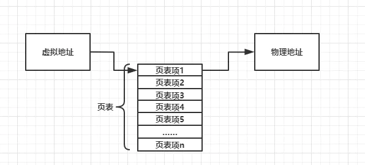
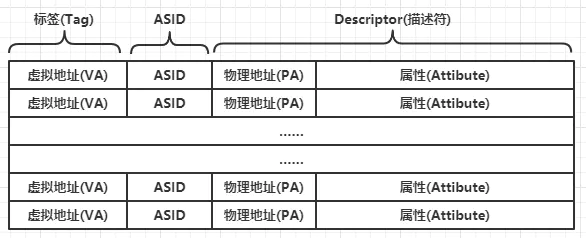
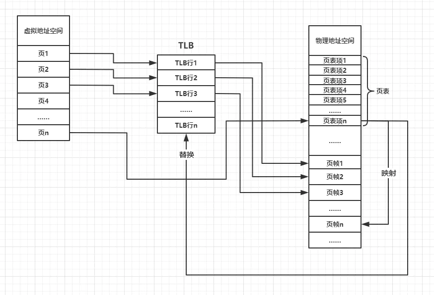
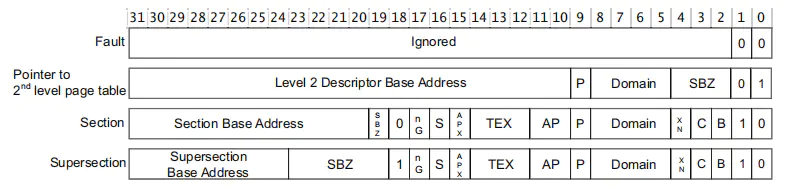
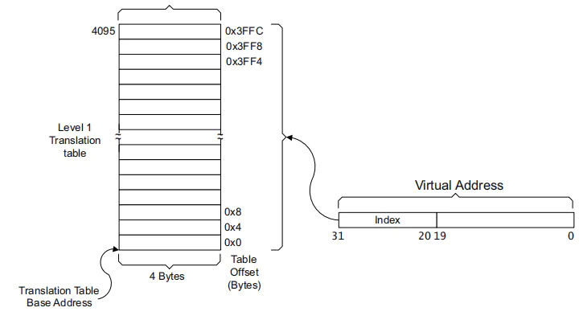
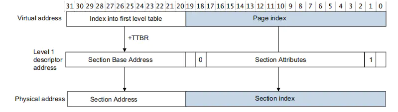
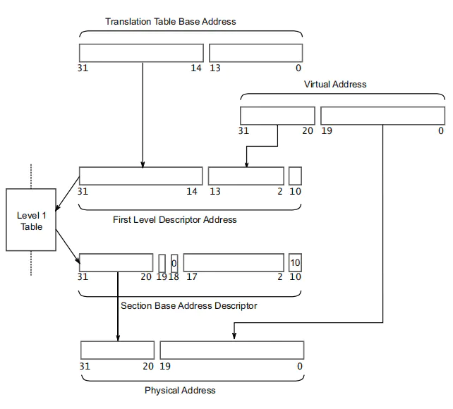

ARM体系MMU
===========

MMU全称为Memory Management Unit，即内存管理单元。在带有MMU的嵌入式linux中，CPU访问的地址都是虚拟地址，而MMU负责将程序中代码或者数据的虚拟地址翻译为物理地址。在
执行期间，MMU会自动转换CPU发出的虚拟地址，无法人工进行操作，只需要配置好MMU相关属性即可

虚拟地址是在编译和链接时定义的，可以简单的理解为有链接器和链接器脚本指定虚拟地址。除了翻译虚拟地址,MMU还可以配置内存区域的各项配置，如内存区域的访问权限，内存区域是否
使能cache等功能

MMU基本概念
------------

页
^^^^

MMU管理虚拟地址空间时，是按照页为单位来进行管理，在ARMv7的MMU，页大小共有16M(super section)、1M(section)、64k(large page)、4k(page)。页大小可以通过协处理器CP15进行配置，
越小的页意味着内存的颗粒度越小，内存使用时的浪费也会越小，但也意味着使用的TLB行越多。

页帧
^^^^^

因为虚拟地址空间需要有对应的物理地址，这样才能在虚拟地址中存储数据，所以MMU管理物理地址空间时，按照页帧为单位进行管理，其大小分为64k或者4k，一段虚拟地址空间有可能存在多个
页，这些页对应着多个页帧.页和页帧时不同地址空间下关于内存空间大小的概念

页表及页表项
^^^^^^^^^^^^^

MMU在进行地址空间转换时，需要一些信息，存放这些信息的表就是页表。每个页表的最小单位就是页表项。页表存储在物理地址空间中，且一个页表项对应着一个页。在切换页表时，通过将页表的物理
首地址设置到协处理器CP15中的TTBR寄存器(Translation Table Base Register), 此后MMU会通过该地址自动去物理地址空间中找到对应的页表，从而完成虚拟地址到物理地址的映射。

在不考虑TLB和多级页表的情况下，可以简单的如下图所示

TLB
^^^^^

TLB全称为Translation lookaside buffer, 即旁路转换缓冲，它是MMU的cache，用于临时存放虚拟地址到物理地址映射所需要的信息。TLB访问步骤如下

1. CPU访问虚拟地址到MMU
2. MMU根据规则查看虚拟地址是否在TLB中
3. 如果在TLB中，则称为TLB命中，从TLB中直接获取物理地址对内存进行访问
4. 如果不在TLB中，则称为TLB失效，此时MMU将进行translation table walking,即通过访问页表来获取物理地址，并将该虚拟地址的信息存入TLB，以便下次使用

TLB由许多TLB行组成，如下图所示

TLB行由3个部分组成，分别为标签，ASID和描述符

标签: 该部分由虚拟地址的一部分bit组成，MMU通过将虚拟地址的一部分bit和TLB的所有标签对比进行搜索

ASID: 全称为Address Space ID，一般用于多进程系统

描述符: 由2个部分组成，分为物理地址(一部分bit)和内存区域属性组成。可以理解为cache中的数据

一般情况下，切换进程时会切换页表，因为随着进程的切换，虚拟地址到物理的映射已经改变，此时需要清理TLB来保持TLB一致性，清理TLB一般通过协处理器CP15来完成，
在linux内核中，有flush_tlb_all()和flush_tlb_range()函数来完成该工作

- MMU组成

MMU工作过程
-------------

ARMv7下的MMU具有2级页表，分为1级页表和2级页表。

一级页表
^^^^^^^^^^

1级页表也称主页表和段页表，下面简称L1页表，它将4GB的地址空间划分为4096个1MB大小的段，每个段的地址为32bit,所以1级页表拥有4096个32bit的页表项,支持4种内存大小，
16M/1M的称之为段，64k/4k称之为页

.. note::
    存放在TTBR寄存器的地址需要16k对齐

一级页表项一共有4种格式，如下图所示

每种格式都由物理地址部分+属性部分组成，各种格式的含义如下

1. 1Mb段转换页表项(section)，映射到1MB的物理地址范围，其物理地址部分即为所需要映射的物理基地址
2. 物理地址部分指向2级页表的物理基地址
3. 16MB段转换页表项，是一种特殊的1MB段转换页表项，其物理地址部分即为所需要映射的物理基地址
4. 无效页表项,当访问该页表项时，将触发指令取指异常或者取数据异常

- 一级页表转换

以1MB段举例，假设L1页表的物理地址为0x12300000,现有一个虚拟地址0x00100000,其转换过程如图所示

1. 查表过程：将虚拟地址高12bit,即0x001乘以4得到0x004, 0x004即为该虚拟地址所在段的页表项在页表中的偏移，所以该虚拟地址对应的页表项的物理地址为0x12300000+0x004=0x12300004
2. 根据查到的页表项，将页表项高12bit和虚拟地址底20bit结合即为该虚拟地址在该1Mb段内的物理地址

完整的转换过程如下

