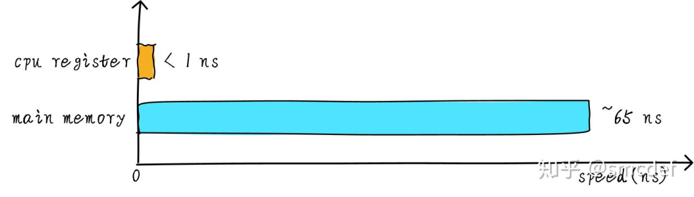

内存管理之cache
==================

如果CPU需要将一个变量加1,一般分为以下3个步骤

1. CPU从主存中读取变量地址的数据到内部通用寄存器x0(arm64架构的通用寄存器之一)
2. 通用寄存器x0加一
3. CPU将通用寄存器x0的值写入主存

但是CPU通用寄存器的速度与主存之间存在很大的差异

所以在硬件上，我们将cache放置在cpu和主存之间，作为主存数据的缓存，当cpu试图从主存中load/store数据的时候，cpu首先从cache中查找对应地址的数据是否
缓存在cache中．如果其数据缓存在cache中，直接从cache中拿到数据并返回给cpu. 

多级cache存储结构
------------------

不同等级的cache之间速度是有差异的

.. image::
    res/cache_speed.png

在coretex-a53架构中，l1 cache分为单独的instruction cache(ICache)和data cache(DCache), L1 cache是CPU私有的，每个CPU都有一个L1 cache, 一个cluster内
所有CPU共享一个L2 cache, L2 cache不区分指令和数据，都可以缓存．所有的cluster之间共享L3 cache. L3 cache通过总线和主存相连

多级cache之间的工作配合
---------------------------

cpu要访问的数据在cache中有缓存称为命中(hit),反之则称为缺失(miss). cache的大小称为cache size,代表cache可以缓存的最大数据的大小．
我们将cache平均分成相等的很多块，每一个块大小称为cache line，现在的硬件设计中一般cache line的大小是4-128Bytes.

- cache line是cache和主存之间数据传输的最小单位(当发生cache缺失时，cache控制器会从主存中一次性的读取cache line大小的数据)

