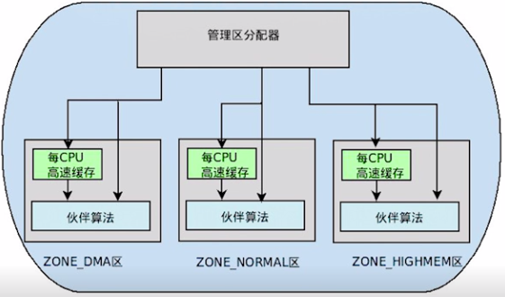
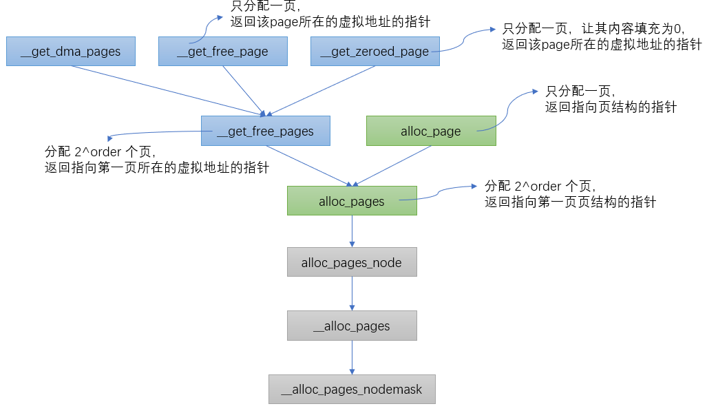
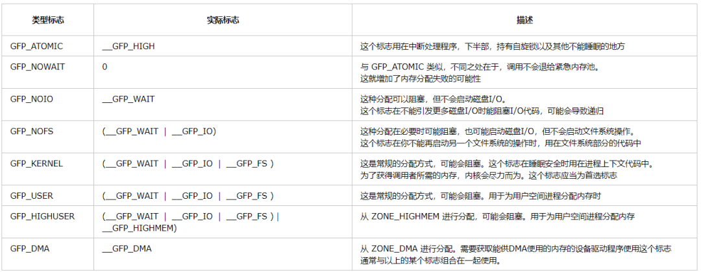
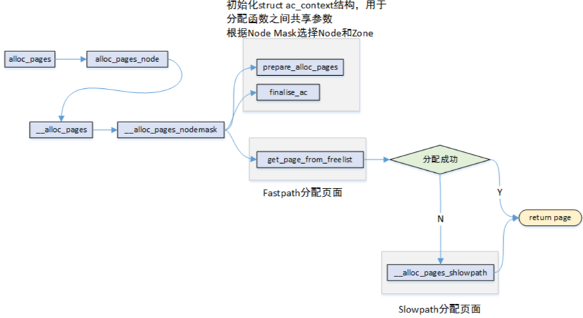
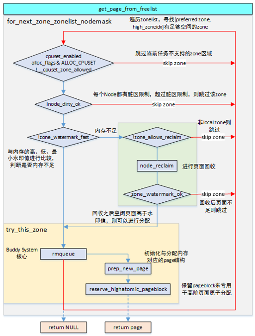
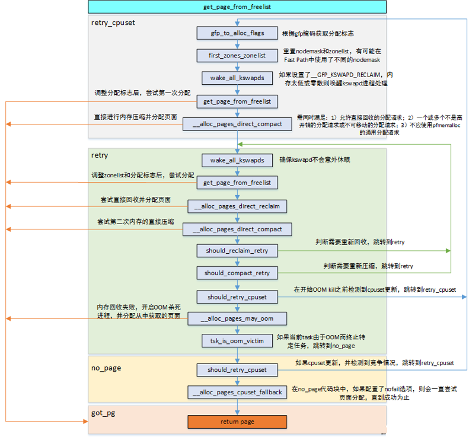

页帧分配器的实现
===================

linux内核中物理内存是以页帧为最小单位存在的

页帧分配器
--------------

页帧分配在内核里的机制我们叫做页帧分配器(page frame allocator),在linux系统中，页帧分配器管理着所有物理内存，无论是内核还是进程，都需要
请求页帧分配器．

- 如果要求从DMA区中获取，就只能从ZONE_DMA区中获取

- 如果没有规定从哪个区获取，就按照顺序从ZONE_NORMAL--------->ZONE_DMA获取

- 如果规定从HIGHMEM区获取，就按照顺序从ZONE_HIGHMEM------->ZONE_NORMAL-------->ZONE_DMA获取

页帧分配API
---------------

内核中根据不同的分配需求有6个函数接口来请求页帧，最终都会调用到 ``__alloc_pages_nodemask`` 

页面具有移动属性，内核将相同属性的页面分组在一起来抑制内存的连续碎片

::

    enum migratetype { 
        MIGRATE_UNMOVABLE,
        MIGRATE_MOVABLE,
        MIGRATE_RECLAIMABLE,
        MIGRATE_PCPTYPES,
        MIGRATE_HIGHATOMIC = MIGRATE_PCPTYPES,
    #ifdef CONFIG_CMA
        MIGRATE_CMA,
    #endif
    #ifdef CONFIG_MEMORY_ISOLATION
        MIGRATE_ISOLATE,
    #endif
        MIGRATE_TYPES
    };

- MIGRATE_UNMOVABLE: 无法移动和检索的类型，用于内核分配的页面，I/O缓冲区，内核堆栈等

- MIGRATE_MOVABLE: 当需要大的连续内存时，通过移动当前使用的页面来尽可能防止碎片，用于分配用户内存

- MIGRATE_RECLAIMABLE: 当没有可用内存时使用此类型

- MIGRATE_HIGHATOMIC: 减少原子分配请求无法进行高阶页面分配的可能，内核会提前准备一个页面块

- MIGRATE_CMA: 页面类型由CMA内存分配器单独管理

- MIGRATE_ISOLATE: 内核会暂时更改为这种类型，以迁移使用中的系列活动页面

**fgp_mask分配掩码**

定义在include/linux/gfp.h文件中，这些标志在页面申请时使用，其中GFP表示get free page

- __GFP_DMA: 请求在ZONE_DMA区域中分配页面

- __GFP_HIGHMEM: 请求在ZONE_HIGHMEM区域中分配页面

- __GFP_MOVABLE: ZONE_MOVABLE可用时在该区域分配页面，同时表示页面分配后可以在内存压缩时进行迁移，也能进行回收

- __GFP_RECLAIMABLE: 请求分配到可恢复页面

- __GFP_HIGH: 高优先级处理请求

- __GFP_IO: 请求在分配期间进行I/O操作

- __GFP_FS: 请求在分配期间进行文件系统调用

- __GFP_ZERO: 请求将分配的区域初始化为0

- __GFP_NOFAIL: 不允许请求失败，会无限重试

- __GFP_NORETRY: 请求不重试内存分配请求

**alloc_flags分配标志**

定义在mm/internal.h文件中，在页面的分配函数中与gfp_mask分开使用

- ALLOC_WMARK_MIN: 仅在最小水位water mark及以上限制页面分配

- ALLOC_WMARK_LOW: 仅在低水位water mark及以上限制页面分配

- ALLOC_WMARK_HIGH: 仅在高水位water mark及以上限制页面分配

- ALLOC_HARDER: 努力分配，一般在gfp_mask设置了__GFP_ATOMIC时会使用

- ALLOC_HIGH: 高优先级分配，一般在gfp_mask设置了__GFP_HIGH时使用

- ALLOC_CPUSET: 检查是否为正确的cpuset

- ALLOC_CMA: 允许从CMA区域进行分配

**__alloc_pages_nodemask的实现**

页面分配时，有两种路径可以选择，如果在快速路径中分配成功了，则直接返回分配的页面．如果快速路径分配失败则选择
慢速路径来进行分配

- 快速分配 
    
    - 如果分配的是单个页面，考虑从per CPU缓存中分配空间，如果缓存中没有页面，从伙伴系统中提取页面做补充．

    - 分配多个页面时，从指定类型中分配，如果指定类型中没有足够的页面，从备用类型链表中分配．最后会试探保留类型链表

- 慢速分配: 允许等待和页面回收

