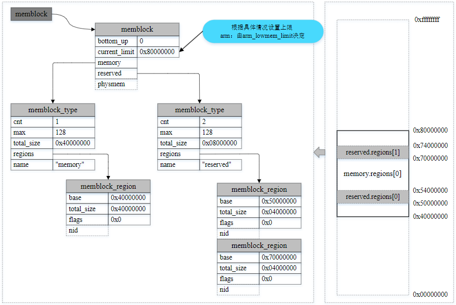

linux物理内存初始化(memblock)
==================================

内核初始化完成后，系统中的内存的分配和释放时由buddy系统，slab分配器来管理．但在buddy系统，slab分配器可用之前，内存的分配和
释放是由memblock分配器来管理物理内存的使用情况. memblock是唯一能够在早期启动阶段管理内存的内存分配器．

.. note::
    memblock管理的内存为物理地址，非虚拟地址

early boot memory
--------------------

early boot memory即系统上电到内核内存管理模型创建之前这段时间的内存管理，严格来说他是系统启动过程中的一个中间阶段的内存管理，当
sparse内存模型数据初始化完成之前后，将会从early boot memory中接管内存管理权限．

sparse内存模型本身的内存管理数据也是需要复杂的初始化过程，而这个初始化过程也需要申请内存，比如mem_map. 因此需要在sparse模型之前需要一个内存管理
子系统为其分配内存，尤其针对NUMA系统，需要指明各个node上申请到的相应内存

::

    include/linux/memblock.h

    struct memblock {
        bool bottom_up;
        phys_addr_t current_limit;
        struct memblock_type memory;
        struct memblock_type reserved;
        #ifdef CONFIG_HAVE_MEMBLOCK_PHYS_MAP
        struct memblock_type physmem;
        #endif
    };

- bottom_up: 申请内存时分配器分配方式，true表示从低地址到高地址分配，false表示从高地址到低地址分配

- current_limit: 内存块大小限制，一般可在memblock_alloc申请内存时进行检查限制

- memory: 可以被memblock管理分配的内存(系统启动时，会因为内核镜像加载等原因，需要提前预留内存，这些都不在memory之中)

- reserved: 预留已经分配的空间，主要包括memblock之前占用的内存以及通过memblock_alloc从memory中申请的内存空间

- physmem: 所有物理内存的集合

::

    include/linux/memblock.h

    struct memblock_type {
        unsigned long cnt;
        unsigned long max;
        phys_addr_t total_size;
        struct memblock_region *regions;
        char *name;
    };

- cnt: 该memblock_type内包含多少个regions

- max: memblock_type内包含regions的最大个数，默认为128

- total_size: 该memblock_type内所有regions加起来的size大小

- regions: regions数组，指向的是数组的首地址

- name: memblock_type的名称

::

    include/linux/memblock.h

    struct memblock_region {
        phys_addr_t base;
        phys_addr_t size;
        enum memblock_flags flags;
        #ifdef CONFIG_HAVE_MEMBLOCK_NODE_MAP
        int nid;
        #endif
    };

memblock_regions代表了一块物理内存区域

- base: 该region的物理地址

- size: 该region区域的大小

- flags: region区域的flags

- nid: nid

::

    include/linux/memblock.h

    enum memblock_flags {
        MEMBLOCK_NONE = 0x0,
        MEMBLOCK_HOTPLUG = 0x1,
        MEMBLOCK_MIRROR = 0x2,
        MEMBLOCK_NOMAP = 0x4,
    };

- MEMBLOCK_NONE: 表示没有特殊需求，正常使用

- MEMBLOCK_HTPLUG: 该块内存支持热插拔，用于后续创建zone时，归ZONE_MOVABLE管理

- MEMBLOCK_MIRROR: 用于mirror功能，内存镜像是内存冗余技术的一种，工作原理与硬盘的热备份类似，将内存数据做两个复制，分别存放在主内存和镜像内存中

- MEMBLOCK_NOMAP: 不能被kernel用于直接映射(即线性映射区域)

**各数据结构之间的关系**

下面通过一个例子来更好的理解，用一个memblock_region实例来描述memory类型的1GB可用物理内存区间，并用两个memblock_region实例描述reserved类型的两个
子区间，指示两个子内存区间正在被使用而保留

memblock初始化
------------------

在bootloader做好初始化工作后，将kernel image加载到内存后，就会跳到kernel部分继续执行，跑的先是汇编部分的代码，进行各种设置和环境初始化后，就会跳到
kernel的第一个函数 ``start_kernel``

::

    init/main.c

    asmlinkage __visible void __init start_kernel(void)
    {
        ...
        cgroup_init_early();
        ...
        boot_cpu_init();
        page_address_init();
        early_security_init();
        setup_arch(&command_line);
        ...
        mm_init();
        ...
        sched_init();
        ...
        console_init();
        ...
        setup_per_cpu_pageset();
        ...
        fork_init();
        ...
    }

这里内容较多，我们重点关注 ``setup_arch`` 函数

::

    arch/arm64/kernel/setup.c

    void __init setup_arch(char **cmdline_p)
    {
        init_mm.start_code = (unsigned long)_text;
        init_mm.end_code = (unsigned long)_etext;
        init_mm.end_data = (unsigned long)_edata;
        init_mm.brk = (unsigned long)_end;

        *cmdline_p = boot_command_line;

        early_fixmap_init();
        early_ioremap_init();

        setup_machine_fdt(__fdt_pointer);
        ...
        arm64_memblock_init();

        paging_init();
        ...
        bootmem_init();
        ...
    }

``setup_arch`` 中完成memblock的初始化，物理内存映射，sparse初始化等工作

::

    arch/arm64/kernel/setup.c

    static void __init setup_machine_fdt(phys_addr_t dt_phys)
    {
        int size;
        void *dt_virt = fixmap_remap_fdt(dt_phys, &size, PAGE_KERNEL);

        const char *name;

        if(dt_virt)
            memblock_reserve(dt_phys, size);

        if(!dt_virt || !early_init_dt_scan(dt_virt)) {
            pr_erit("\n"
            "Error: invalid device tree blob at physsical address %pa (virtual address 0x%p)\n",
            &dt_phys, dt_virt);

            while(true)
                cpu_relax();
        }

        fixmap_remap_fdt(dt_phys, &size, PAGE_KERNEL_RO);

        name = of_flat_dt_get_machine_name();
        if(!name)
            return;

        dump_stack_set_arch_desc("%s (DT)", name);
    }

- 拿到dtb的物理地址后，会通过fixmap_remap_fdt进行mapping,其中包括pgd, pud, pte等mapping,当mapping成功后会返回dt_virt，并通过memblock_reserve添加到
  memblock.reserved中

- 接着是early_init_dt_scan，通过解析dtb文件的memory节点获得可用物理内存的起始地址和大小，并通过类memblock_add的api往memory.regions数组添加一个memblock_region
  实例，用于管理这个物理内存区域

当物理内存都添加进系统之后，arm64_memblock_init会对整个物理内存进行整理，主要的工作就是将一些特殊的区域添加进reserved内容中．函数执行完后，如下图所示

memblock物理内存映射
-----------------------

物理内存在通过memblock_add添加进系统之后，这部分的物理内存到虚拟内存的映射还没有建立．即使可以通过memblock_alloc分配一段物理内存，但是还不能访问，
需要在paging_init执行之后

::

    void __init paging_init(void)
    {
        pgd_t *pgdp = pgd_set_fixmap(__pa_symbol(swapper_pg_dir));

        map_kernel(pgdp);
        map_mem(pgdp);

        pgd_clear_fixmap();

        cpu_replace_ttbrl(lm_alias(swapper_pg_dir));
        init_mm.pgd = swapper_pg_dir;

        mmeblock_free(__pa_symbol(init_pg_dir),
            __pa_symbol(init_pg_end) - __pa_symbol(init_pg_dir));

        memblock_allow_resize();
    }

- pgd_set_fixmap: swapper_pg_dir页表的物理地址映射到fixmap的FIX_PGD区域，然后使用swapper_pg_dir页表作为内核的pgd页表．因为页表都是处于虚拟地址空间
  构建的，所以这里需要转成虚拟地址pgdp．而此时伙伴系统也没有ready，只能通过fixmap预先设定用于映射PGD的页表，现在pgdp是分配FIX_PGD的物理内存空间对应的虚拟地址

- map_kernel: 将内核的各个段(.text .init .data .bss)映射到虚拟内存空间，这样内核就可以正常运行了

- map_mem: 将memblock子系统添加的物理内存进行映射，主要是把通过memblock_add添加到系统中的物理内存进行映射，主要如果memblock设置了MEMBLOCK_NOMAP标志的话则就不对其地址进行映射

- cpu_replace_ttbr1: 将TTBR1寄存器指向新准备的swapper_pg_dir页表，TTBR1寄存器是虚拟内存管理的重要组成部分，用于存储当前使用的页表的首地址

- 将init_pg_dir指向的区域释放

**__create_pgd_mapping**

map_kernel是映射内核启动时需要的各个段，map_mem是映射memblock添加的物理内存．但是页表映射都会调用到 ``__create_pgd_mapping`` 函数

::

    static void __create_pgd_mapping(pgd_t *pgdir, phys_addr_t phys, unsigned long virt,
        phys_addr_t size, pgprot_t prot, phys_addr_t (*pgtable_alloc)(int), int flags)
    {
        unsigned long addr, end, next;
        pgd_t *pgdp = pgd_offset_pgd(pgdir, virt);

        if(WARN_ON((phys ^ virt) & ~PAGE_MASK))
            return;

        phys &= PAGE_MASK;
        addr = virt & PAGE_MASK;
        end = PAGE_ALIGN(virt + size);

        do {
            next = pgd_addr_end(addr, end);
            alloc_init_pud(pgdp, addr, next, phys, prot, pgtable_alloc, flags);
            phys += next - addr;
        } while(pgdp++, addr = next, addr != end);
    }

总体来说，就是逐级页表建立映射关系，同时中间会进行权限的控制

从上面的代码流程分析，可以看出pgd/pud/pmd/pte的页表项虽然保存的都是物理地址，但是上面pgd/pud/pmd/pte的计算分析都是基于虚拟地址

假设内核需要访问虚拟地址virt_addr对应的物理地址为phys的内容

- 通过存放内核页表的寄存器TTBR1得到swapper_pg_dir页表的物理地址，然后转换成pgd页表的虚拟地址

- 根据virt_addr计算对应的pgd entry(pgd页表的地址+vrt_addr计算出的offset)，PGD entry存放的是PUD页表的物理地址，然后转换成PUD页表基地址的虚拟地址

- PUD和PMD的处理过程类似

- 最后从PMD entry中找到PTE页表的虚拟地址，根据vir_addr计算得到对应的pte entry,从pte entry中得到phys所在的物理页帧地址

- 加上根据virt_addr计算得到的偏移后得到virt对应的物理地址

以虚拟地址0xffff000140e09000为例

