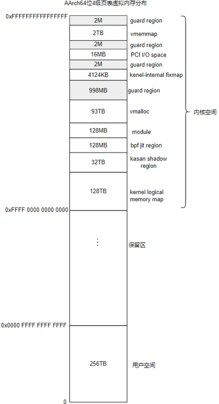
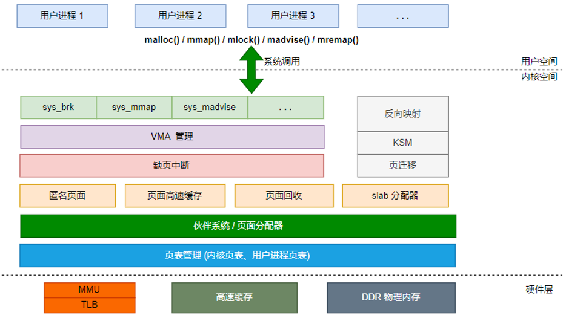

linux内存分布
=====================

虚拟内存
------------

最初的操作系统并没有那么完善，开始的时候程序是直接装载到物理内存中的，这就导致了下面的一些问题

- 程序编写困难: 操作系统是同时运行好多程序的，编写的程序如果直接操作物理内存的话，需要考虑程序操作的内存地址是否已经被其他程序占用

- 修改内存数据导致程序崩溃: 一个应用程序可以访问所有的物理内存，如果一个应用程序恶意修改其他应用程序的内存地址的话，可能导致其他程序崩溃
  

虚拟内存概念的出现解决了上面的问题，应用程序不再直接操作物理内存，对每个应用程序来说，他们相当于拥有了所有的内存空间．

每个进程都拥有自己的虚拟内存地址，不用的硬件对应不用的虚拟内存

对于32位的处理器x86来说，每个进程可以拥有4G的虚拟内存，其中

- 0x08048000~0xBFFFFFFF(3G大小，最低的128M内存没用)表示用户空间

- 0xC0000000~0xFFFFFFFF(1G)表示内核空间

对于64位的处理器来说，一般会保留48位的虚拟内存，大概是256TB的虚拟内存空间

上图为4级页表下的虚拟地址分布

从进程的角度看内存分配
------------------------

在linux系统中，应用程序通常采用ELF格式，ELF结构图如下图所示

程序在编译，链接时会尽量把相同权限属性的段分配在同一空间里，如把可读，可执行的段放在一起，包括代码段，init段．
把可读可写的段放在一起，包括数据段和未初始化的数据段等．ELF把这些属性相似并链接在一起的段叫做分段．进程在加载时按照
这些分段来映射可执行文件的

linux操作系统提供了proc文件系统来窥探linux内核的执行情况，每个进程在执行之后，在/proc/pid/maps节点会列出当前进程的地址映射情况

从内核角度看内存分配
----------------------

