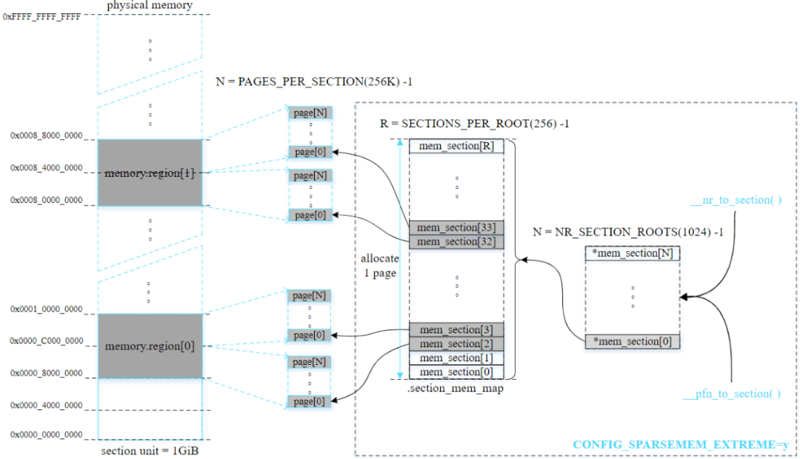
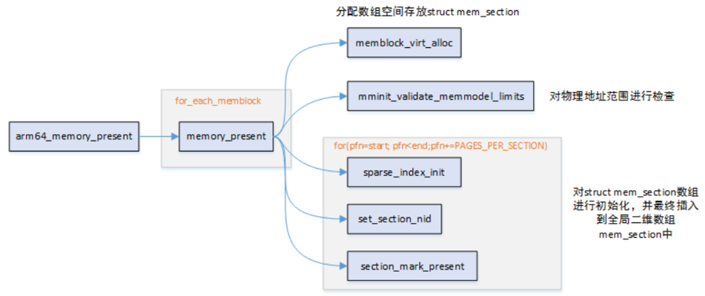
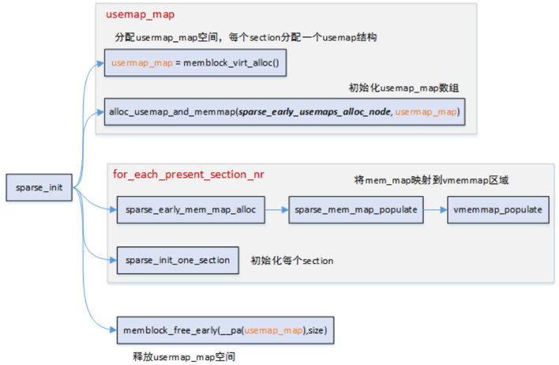
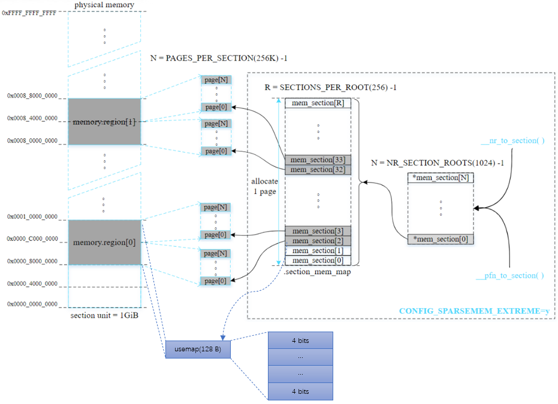
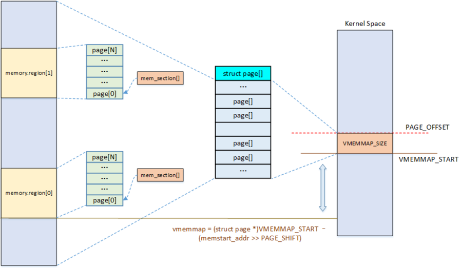
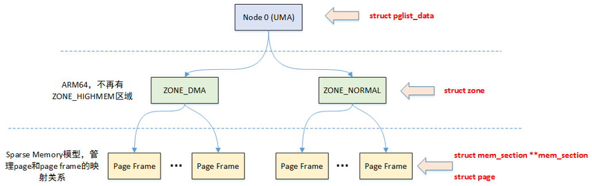
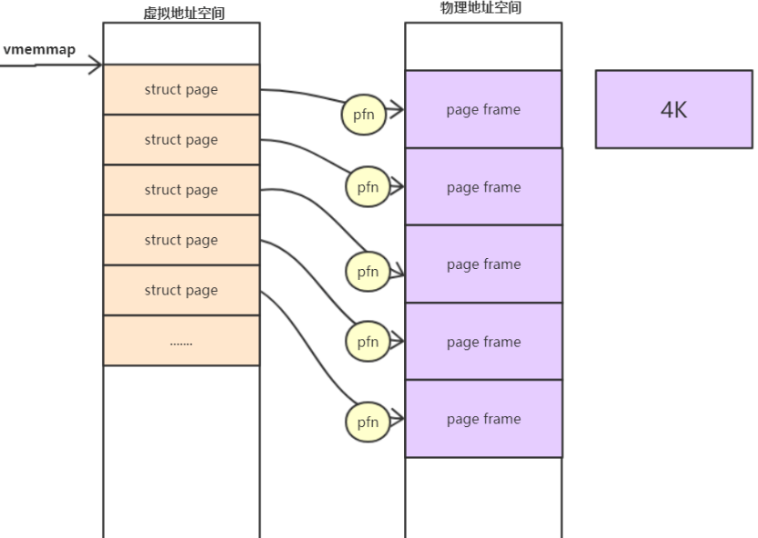
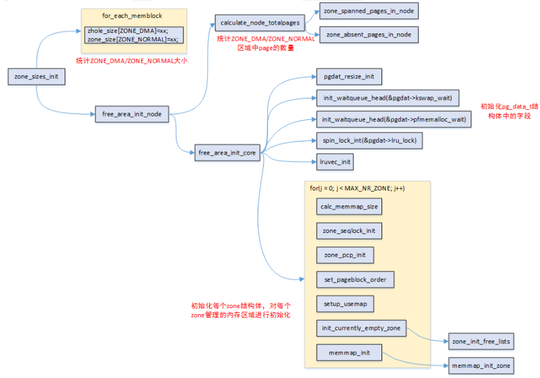
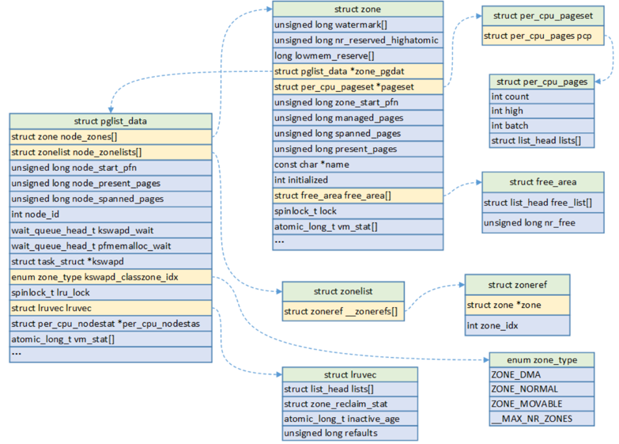
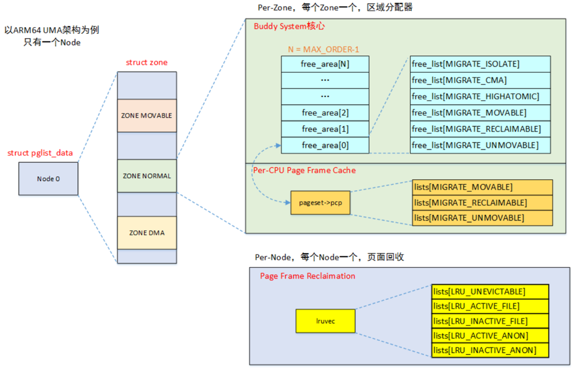

物理内存的软件划分
========================

setup_arch函数中调用了 ``bootmem_init`` 函数，这个函数基本上完成了linux对物理内存划分的初始化，包括node, zone, page frame,以及对应的数据结构

::

    void __init bootmem_init(void)
    {
        unsigned long min, max;

        min = PFN_UP(memblock_start_of_DRAM());
        max = PFN_DOWN(memblock_end_of_DRAM());

        early_memtest(min << PAGE_SHIFT, max << PAGE_SHIFT);

        max_pfn = max_low_pfn = max;

        arm64_numa_init();

        arm64_memory_present();

        sparse_init();
        zone_sizes_init(min, max);

        memblock_dump_all();
    }

在sparse memory模型中，section是管理内存online/offline的最小内存单元，在ARM64中，section的大小为1G，而在linux内核中，通过一个全局的二位数组
struct mem_section \**mem_section来维护映射关系

这个工作主要在arm64_memory_present中来完成初始化及映射关系的建立

该函数主要有两个作用

- 首先分配了usermap, 这个usermap与内存的回收机制相关．sparse memory模型会为每一个section都会分配一个usermap，最终的物理页面的压缩，迁移等操作，都跟这些位相关

- 然后遍历所有present section，然后将其映射到vmemmap区域

数据结构的划分
------------------

linux把物理内存划分为三个层次来管理: 存储节点(Node), 内存管理区(Zone), 页面(Page)

**Node**

内存架构分为UMA和NUMA两种．在NUMA架构下，每一个Node都会对应一个struct pglist_data, 在UMA架构中只会使用唯一的一个struct pglist_data结构．比如我们在
ARM64 UMA中使用的全局变量struct pglist_data __refdata 

::

    typedef struct pglist_data {
        ......
        struct zone node_zones[];           //对应的ZONE区域，比如ZONE_DMA, ZONE_NORMAL等
        struct zonelist_node_zonelists[];

        unsigned long node_start_pfn;       //节点的起始内存页面帧号
        unsigned long node_present_pages;   //总共可用的页面数
        unsigned long node_spanned_pages;   //总共的页面数，包括有空洞的区域

        wait_queue_head_t kswapd_wait;      //页面回收进程使用的等待队列
        struct task_struct *kswapd;         //页面回收进程
        ...
    } pg_data_t;

以UMA内存架构为例，struct pglist_data描述单个Node的内存，然后内存又分成不同的Zone区域，Zone描述区域内的不同页面，包括空闲页面，Buddy System管理的页面等

**Zone**

其实这是个历史遗留问题，出于对不同架构的兼容性的考虑．比如32位的处理器只支持4G的虚拟地址，然后1G的地址空间给内核，但这样无法对超过一个G的物理内存进行一一映射．
linux内核提出的解决方案是将物理内存分成2部分，一部分直接做线性地址映射，另一部分叫高端内存．者两部分对应内存管理区就分别为ZONE_NORMAL和ZONE_HIGHMEM．当然对于
64位的架构而言，有足够大的内核地址空间可以映射物理内存，所以就不需要ZONE_HIGHMEM了

所以，将Node拆分成Zone主要还是出于Linux为了兼容各种架构和平台，对不同区域的内存需要采用不同的管理方式和映射方式

::

    enum zone_type { 
    #ifdef CONFIG_ZONE_DMA
        ZONE_DMA,           //ISA设备的DMA操作，范围是0~16M, ARM架构没有这个zone
    #endif
    #ifdef CONFIG_ZONE_DMA32
        ZONE_DMA32,         //用于低于4G内存进行DMA操作的32位设备
    #endif
        ZONE_NORMAL,        //标记了线性映射物理内存，4G以上的物理内存，如果系统内存不足4G，那么所有的内存都属于ZONE_NORMAL
    #ifdef CONFIG_HIGHMEM
        ZONE_HIGHMEM,       //高端内存，标记超出内存虚拟地址空间的物理内存段，64为架构没有该ZONE
    #endif
        ZONE_MOVABLE,       //虚拟内存域，在防止物理内存碎片的机制中会使用到该内存区域
    #ifdef CONFIG_ZONE_DEVICE
        ZONE_DEVICE,        //为支持热插拔设备而分配的Non Volatile Memory非易失性内存
    #endif
        __MAX_NR_ZONES
    };

可以通过下面的命令查看Zone的分类

::

    cat /proc/zoneinfo | grep Node

    Node 0, zone DMA32
    Node 0, zone Normal
    Node 0, zone Movable

zone的数据结构定义如下:

::

    struct zone {
        .....
        unsigned long watermark[];  //水位值
        long lowmem_reserved[];     //zone中预留的内存
        struct pglist_data *zone_pgdat;     //执行所属的pglist_data
        struct per_cpu_pageset *pageset;    //Per-CPU上的页面，减少自旋锁的争用

        unsigned long zone_start_pfn;       //ZONE的起始内存页面帧号
        unsigned long managed_pages;        //被Buddy System管理的页面数量
        unsigned long spanned_pages;        //ZONE中总共的页面数，包含空洞的区域
        unsigned long present_pages;        //ZONE里实际管理的页面数量

        struct frea_area free_area[];       //管理空闲页面的列表
        ........
    };

**Page**

为了描述一个物理page，内核使用struct page结构来表示一个物理页．假设一个page的大小是4k，内核会将整个物理内存分割成一个一个4k大小的物理页，
而4k大小物理页的区域，我们称为page frame

struct page和物理页面是一对一的映射关系

系统启动的时候，内核会将整个struct page映射到内核虚拟地址空间vmemmap的区域，所以我们可以简单的认为struct page的基地址vmemmap,
则vmemmap + pfn的地址就是此struct page对应的地址

::

    struct page { 
        unsigned long flags;
        union {
            struct {
                struct list_head lru;
                struct address_space *mapping;
                pgoff_t index;
                unsigned long private;
            };
            .....
        };
    };

bootmem_init
---------------

内核内存管理机制除了伙伴算法，per-CPU页帧高速缓存外，还有slub缓存，vmalloc机制．

- 伙伴算法: 负责大块连续物理内存的分配和释放，以页帧为单位．该机值可以避免外部碎片

- per-CPU页帧高速缓存: 内核经常请求和释放单个页帧，该缓存包含预先分配的页帧，用于满足本地CPU发出的单一页帧请求

- slub缓存: 负责小块物理内存的分配，并且它也作为高速缓存，主要针对内核中经常分配并释放的对象

- vmalloc机制: vmalloc机制使得内核通过连续的线性地址来访问非连续的物理页帧，这样可以最大限度的使用高度物理内存

