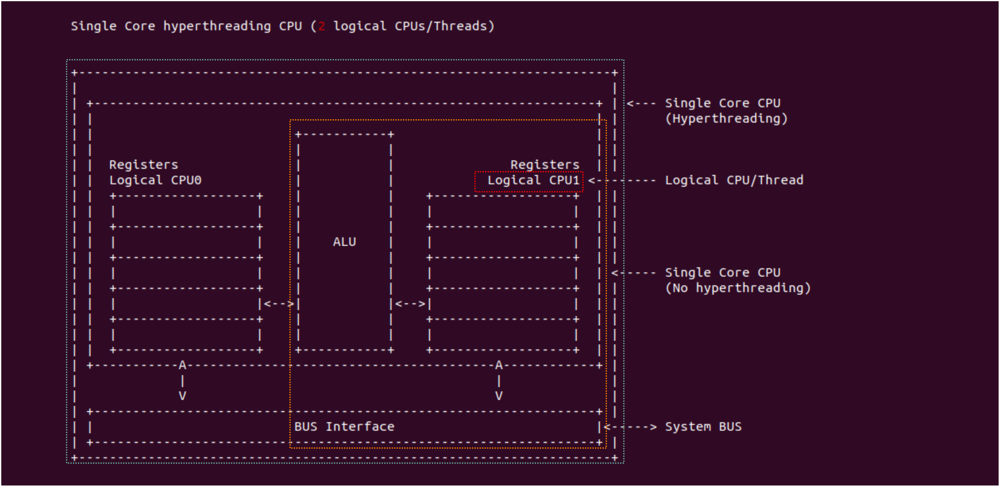

内存基础知识
=============

- 计算机基础架构

CPU架构基础
--------------

 
存储子系统
-------------

存储子系统指的是计算机存储程序和数据的各种存储设备，冲同的存储器子系统一般包括高速缓存(CACHE),主存(Main Storage)和辅存(Secondary Storage)．

上面的表格来自 jboner 测试的各种存储子系统设备存取时延，可以看到离 CPU 最近存取速度越快

通过上面的介绍可知，CACHE 是为了加速 CPU 对内存的访问，采用局部性原理将即将访问到的数据加载到 CACHE 中，以此保证 CACHE 的命中率，进而提供 CPU 读取数据的速度。

