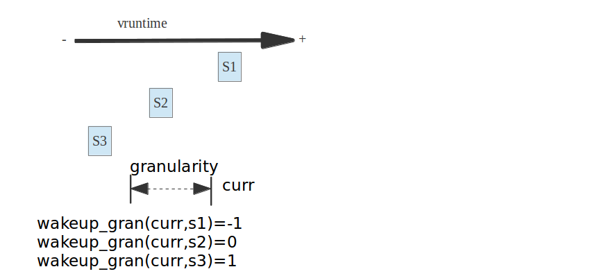

pick_next_task_fair选择下一个被调度的进程
==========================================

每个调度器类sched_class都必须提供一个pick_next_task函数用以在就绪队列中选择一个最优的进程来等待调度,而我们的cfs调度器类中,选择下一个将要运行的
进程由pick_next_task_fair函数来完成

之前我们在讲主调度器的时候,主调度器schedule函数在进程调度抢占时,会通过__schedule函数调用全局pick_next_task选择一个最优的进程，在pick_next_task
中我们就按照优先级依次调用不同调度器类提供的pick_next_task方法

- pick_next_task_fair

选择下一个将要运行的进程pick_next_task_fair执行，其代码执行流程如下，对于此函数的讲解我们从simple标签开始,这个常规状态下的pick_next思路，简单来说就是
pick_next_task_fair函数的框架

::

    again:
        控制循坏来读取最优进程

    #ifdef CONFIG_FAIR_GROUP_SCHED
        完成组调度下的pick_next选择
        返回被选择的调度实体指针
    #endif

    simple:
        最基础的pick_next函数
        返回被选择的调度实体指针
    
    idle:
        如果系统中没有可运行的进程,则需要调度idle进程

可见我们会发现:

- simple标签时cfs中最基础的pick_next操作

- idle则使得在没有进程被调度时,调度idle进程

- again标签用于循环的进行pick_next操作

::

    static struct task_struct *
    pick_next_task_fair(struct rq *rq, struct task_struct *prev, struct rq_flags *rf)
    {
        struct cfs_rq *cfs_rq = &rq->cfs;
        struct sched_entity *se;
        struct task_struct *p;
        int new_tasks;

    again:
        if (!sched_fair_runnable(rq))   //如果nr_running计数器为0,当前队列上没有可运行进程,则需要调度idle进程
            goto idle;

    #ifdef CONFIG_FAIR_GROUP_SCHED
        if (!prev || prev->sched_class != &fair_sched_class)    //如果当前运行的进程prev不是被fair调度的普通非实时进程
            goto simple;

        /*
         * Because of the set_next_buddy() in dequeue_task_fair() it is rather
         * likely that a next task is from the same cgroup as the current.
         *
         * Therefore attempt to avoid putting and setting the entire cgroup
         * hierarchy, only change the part that actually changes.
         */

        do {
            struct sched_entity *curr = cfs_rq->curr;

            /*
             * Since we got here without doing put_prev_entity() we also
             * have to consider cfs_rq->curr. If it is still a runnable
             * entity, update_curr() will update its vruntime, otherwise
             * forget we've ever seen it.
             */
            if (curr) {     //如果当前进程在curr在队列上,则需要更新其统计量和虚拟运行时间，否则设置curr为空
                if (curr->on_rq)
                    update_curr(cfs_rq);
                else
                    curr = NULL;

                /*
                 * This call to check_cfs_rq_runtime() will do the
                 * throttle and dequeue its entity in the parent(s).
                 * Therefore the nr_running test will indeed
                 * be correct.
                 */
                if (unlikely(check_cfs_rq_runtime(cfs_rq))) {
                    cfs_rq = &rq->cfs;

                    if (!cfs_rq->nr_running)
                        goto idle;

                    goto simple;
                }
            }

            se = pick_next_entity(cfs_rq, curr);    //选择一个最优的调度实体
            cfs_rq = group_cfs_rq(se);
        } while (cfs_rq);   //如果调度的进程仍属于当前组,那么选取下一个可能被调度的任务,以保证子组件调度的公平性

        p = task_of(se);    //获取调度实体se的进程实体信息

        /*
         * Since we haven't yet done put_prev_entity and if the selected task
         * is a different task than we started out with, try and touch the
         * least amount of cfs_rqs.
         */
        if (prev != p) {
            struct sched_entity *pse = &prev->se;

            while (!(cfs_rq = is_same_group(se, pse))) {
                int se_depth = se->depth;
                int pse_depth = pse->depth;

                if (se_depth <= pse_depth) {
                    put_prev_entity(cfs_rq_of(pse), pse);
                    pse = parent_entity(pse);
                }
                if (se_depth >= pse_depth) {
                    set_next_entity(cfs_rq_of(se), se);
                    se = parent_entity(se);
                }
            }

            put_prev_entity(cfs_rq, pse);
            set_next_entity(cfs_rq, se);
        }

        goto done;
    simple:
    #endif
        if (prev)
            put_prev_task(rq, prev);    //将当前进程放入运行队列的合适位置

        do {
            se = pick_next_entity(cfs_rq, NULL);    //选出下一可执行的调度实体(进程)
            set_next_entity(cfs_rq, se);    //把选出的进程从红黑树中移除，更新红黑树,会调用__dequeue_entity完成此工作
            cfs_rq = group_cfs_rq(se);  //在非组调度的情况下返回NULL
        } while (cfs_rq);

        p = task_of(se);    //获取到调度实体指代的进程信息

    done: __maybe_unused;
    #ifdef CONFIG_SMP
        /*
         * Move the next running task to the front of
         * the list, so our cfs_tasks list becomes MRU
         * one.
         */
        list_move(&p->se.group_node, &rq->cfs_tasks);
    #endif

        if (hrtick_enabled(rq))
            hrtick_start_fair(rq, p);

        update_misfit_status(p, rq);

        return p;

    idle:
        if (!rf)
            return NULL;

        new_tasks = newidle_balance(rq, rf);

        /*
         * Because newidle_balance() releases (and re-acquires) rq->lock, it is
         * possible for any higher priority task to appear. In that case we
         * must re-start the pick_next_entity() loop.
         */
        if (new_tasks < 0)
            return RETRY_TASK;

        if (new_tasks > 0)
            goto again;

        /*
         * rq is about to be idle, check if we need to update the
         * lost_idle_time of clock_pelt
         */
        update_idle_rq_clock_pelt(rq);

        return NULL;
    }

put_prev_task函数
------------------

全局put_prev_task函数
^^^^^^^^^^^^^^^^^^^^^^

put_prev_task是用来将前一个进程prev放回到就绪队列中,这是一个全局函数，而每个调度器也必须实现一个自己的put_prev_task函数

::

    static inline void put_prev_task(struct rq *rq, struct task_struct *prev)
    {
        prev->sched_class->put_prev_task(rq, prev);
    }

CFS的put_prev_task_fair函数
^^^^^^^^^^^^^^^^^^^^^^^^^^^^

::

    static void put_prev_task_fair(struct rq *rq, struct task_struct *prev)
    {
        struct sched_entity *se = &prev->se;
        struct cfs_rq *cfs_rq;

        for_each_sched_entity(se) {
            cfs_rq = cfs_rq_of(se);
            put_prev_entity(cfs_rq, se);
        }
    }

    static void put_prev_entity(struct cfs_rq *cfs_rq, struct sched_entity *prev)
    {
        /*
         * If still on the runqueue then deactivate_task()
         * was not called and update_curr() has to be done:
         */
        if (prev->on_rq)
            update_curr(cfs_rq);

        /* throttle cfs_rqs exceeding runtime */
        check_cfs_rq_runtime(cfs_rq);

        check_spread(cfs_rq, prev);

        if (prev->on_rq) {
            update_stats_wait_start(cfs_rq, prev);
            /* Put 'current' back into the tree. */
            __enqueue_entity(cfs_rq, prev);
            /* in !on_rq case, update occurred at dequeue */
            update_load_avg(cfs_rq, prev, 0);
        }
        cfs_rq->curr = NULL;
    }

pick_next_entity函数
---------------------

::

    //1. 首先要确保任务组之间的公平这也是设置组的原因之一
    //2. 选择下一个合适的(优先级比较高的)进程,因为它确实需要马上运行
    //3. 如果没有条件2中进程，那么为了良好的局部性,选择上一次执行的进程
    //4. 只要有任务存在就不要让CPU空转，只有在没有进程的情况下才会让CPU运行idle进程
    static struct sched_entity *
    pick_next_entity(struct cfs_rq *cfs_rq, struct sched_entity *curr)
    {
        struct sched_entity *left = __pick_first_entity(cfs_rq);    //选取红黑树最左边的进程
        struct sched_entity *se;

        /*
         * If curr is set we have to see if its left of the leftmost entity
         * still in the tree, provided there was anything in the tree at all.
         */
         //如果left==null或者curr!=null  并且curr比left进程更优(即curr的虚拟运行时间更小)
         //说明curr进程是自动放弃与运行权力，且其比最左进程更优
        if (!left || (curr && entity_before(curr, left))
            left = curr;

        se = left; /* ideally we run the leftmost entity */     //存储了cfs_rq队列中最优的那个进程

        /*
         * Avoid running the skip buddy, if running something else can
         * be done without getting too unfair.
         */
        if (cfs_rq->skip == se) {   //如果skip存储了需要跳过不参与调度的进程调度实体,那么我们需要选择次优的调度实体来进行调度
            struct sched_entity *second;

            if (se == curr) {
                second = __pick_first_entity(cfs_rq);   //se == curr == skip选择最左的那个调度实体left
            } else {
                second = __pick_next_entity(se);    //选择红黑树上第二左的进程结点
                if (!second || (curr && entity_before(curr, second)))   //如果没有次优进程或者curr比second进程更优，则选择curr
                    second = curr;
            }

            if (second && wakeup_preempt_entity(second, left) < 1)  //判断left和second的vruntime差距是否小于sysctl_sched_wakeup_granularity,即如果second能抢占left
                se = second;
        }

        /*
         * Prefer last buddy, try to return the CPU to a preempted task.
         */
        if (cfs_rq->last && wakeup_preempt_entity(cfs_rq->last, left) < 1)
            se = cfs_rq->last;

        /*
         * Someone really wants this to run. If it's not unfair, run it.
         */
        if (cfs_rq->next && wakeup_preempt_entity(cfs_rq->next, left) < 1)
            se = cfs_rq->next;
        //清楚掉这个指针
        clear_buddies(cfs_rq, se);

        return se;
    }

cfs的last和next指针域
^^^^^^^^^^^^^^^^^^^^^

在pick_next_entity的最后，要把红黑树最左下角的进程和另外两个进(next和last)做比较,next是抢占失败的进程,而last则是抢占成功后被抢占的进程,这三个进程到底哪一个是最优的next进程呢

linux CFS实现的判决条件是:

1) 尽可能满足需要刚被唤醒的进程抢占其他进程的需求

2) 尽可能减少以上这种抢占带来的缓存刷新的影响

- cfs_rq的last和next指针,last表示最后一个执行wakeup的sched_entity, next表示最后一个被wakeup的sched_entity.他们在进程wakeup的时候会赋值,在pick新sched_entity的时候,会优先选择这些last或者next指针的sched_entity,有利于提高缓存的命中率

因此我们优选出来的进程必须同last和next指针域进行对比，其实就是检查就绪队列中的最优进程,即红黑树最左边节点last是否可以抢占last和next指针域，检查是否可以抢占是通过wake_up_preempt_entity函数来完成的

wakeup_preempt_entity检查是否可以被抢占
^^^^^^^^^^^^^^^^^^^^^^^^^^^^^^^^^^^^^^^^^

::

    /*
     * Should 'se' preempt 'curr'.
     *
     *             |s1
     *        |s2
     *   |s3
     *         g
     *      |<--->|c
     *
     *  w(c, s1) = -1
     *  w(c, s2) =  0
     *  w(c, s3) =  1
     *
     */
    static int
    wakeup_preempt_entity(struct sched_entity *curr, struct sched_entity *se)
    {
        s64 gran, vdiff = curr->vruntime - se->vruntime;    //curr和se的vruntime的差值

        if (vdiff <= 0)     //如果curr的vruntime比较小,说明curr更加需要补偿,即se无法抢占curr
            return -1;

        gran = wakeup_gran(se); //计算curr的最小抢占期限粒度，当差值大于最小粒度时才抢占,这样可以避免频繁抢占
        if (vdiff > gran)
            return 1;

        return 0;
    }

    static unsigned long wakeup_gran(struct sched_entity *se)
    {
        unsigned long gran = sysctl_sched_wakeup_granularity;   //NICE_0_LOAD的基准最小期限

        /*
         * Since its curr running now, convert the gran from real-time
         * to virtual-time in his units.
         *
         * By using 'se' instead of 'curr' we penalize light tasks, so
         * they get preempted easier. That is, if 'se' < 'curr' then
         * the resulting gran will be larger, therefore penalizing the
         * lighter, if otoh 'se' > 'curr' then the resulting gran will
         * be smaller, again penalizing the lighter task.
         *
         * This is especially important for buddies when the leftmost
         * task is higher priority than the buddy.
         */
        return calc_delta_fair(gran, se);   //计算抢占的粒度
    }

到底能不能选择last和next两个进程,则时wakeup_preempt_entity函数决定的,图解如下

