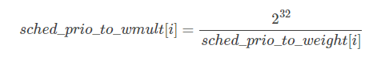

CFS调度器负荷权重load_weight
==============================

linux内核使用cfs来调度我们常见的普通进程,其所属的调度器类为fair_sched_class，使用的调度策略包括SCHED_NORMAL和SCHED_BATCH,进程task_struct中
struct sched_entity se字段就是标识cfs调度器类的调度实体

linux对普通进程和实时进程分别使用静态优先级static_prio和实时优先级rt_priority来指定其默认的优先级别,然后通过normal_prio函数将他们分别转换为
普通优先级normal_prio，最终换算出动态优先级prio,动态优先级prio才是内核调度的时候优先考虑的优先级字段

但是cfs完全公平调度器在调度进程的时候,进程的重要性不仅是有优先级指定的,而且还考虑保存在task_struct->se.load的负荷权重

负荷权重
---------

负荷权重struct load_weight
^^^^^^^^^^^^^^^^^^^^^^^^^^^

负荷全中国用struct load_weight数据结构来表示,保存着进程权重值weight，其定义在include/linux/sched.h

::

    struct load_weight {
        unsigned long weight;   //存储了权重的信息
        u32 inv_weight;     //存储了权重值用于重除的结果 weight  * inv_weight = 2^32
    }

调度实体的负荷权重load
^^^^^^^^^^^^^^^^^^^^^^

::

    struct sched_entity {
        struct load_weight load;        /* for load-balancing */
        ....
    }

进程的负荷权重
^^^^^^^^^^^^^^^

::

    struct task_struct {
        ...
        struct sched_entity se;
        ...
    }

 因此我们可以通过task_struct->se.load获取负荷权重的信息，而set_load_weight负责根据进程类型及其静态优先级计算负荷权重

优先级和权重的转换
--------------------

优先级->权重转换表
^^^^^^^^^^^^^^^^^^

一般这个概念是这样的，进程没降低一个nice值(优先级提升)，则多获得10%的CPU时间，每升高一个nice值，则放弃10%的cpu时间

为执行该策略，内核需要将优先级转换为权重值,并提供了一张优先级->权重转换表sched_prio_to_weight，内核不仅维护了负荷权重自身,还baocunl另外一个数值,
用于负荷重除的结果,即sched_prio_to_wmult数组,这两个数组中的数据是一一对应的

::

    #define WEIGHT_IDLEPRIO		3   //sched_idle进程的负荷权重
    #define WMULT_IDLEPRIO		1431655765      //sched_idle进程负荷权重的重除值

    extern const int		sched_prio_to_weight[40];
    extern const u32		sched_prio_to_wmult[40];

    const int sched_prio_to_weight[40] = {
     /* -20 */     88761,     71755,     56483,     46273,     36291,
     /* -15 */     29154,     23254,     18705,     14949,     11916,
     /* -10 */      9548,      7620,      6100,      4904,      3906,
     /*  -5 */      3121,      2501,      1991,      1586,      1277,
     /*   0 */      1024,       820,       655,       526,       423,
     /*   5 */       335,       272,       215,       172,       137,
     /*  10 */       110,        87,        70,        56,        45,
     /*  15 */        36,        29,        23,        18,        15,
    };

    const u32 sched_prio_to_wmult[40] = {
     /* -20 */     48388,     59856,     76040,     92818,    118348,
     /* -15 */    147320,    184698,    229616,    287308,    360437,
     /* -10 */    449829,    563644,    704093,    875809,   1099582,
     /*  -5 */   1376151,   1717300,   2157191,   2708050,   3363326,
     /*   0 */   4194304,   5237765,   6557202,   8165337,  10153587,
     /*   5 */  12820798,  15790321,  19976592,  24970740,  31350126,
     /*  10 */  39045157,  49367440,  61356676,  76695844,  95443717,
     /*  15 */ 119304647, 148102320, 186737708, 238609294, 286331153,
    };

对内核使用的范围[-20,19]中的每个nice级别，sched_prio_to_weight数组都有一个对应项

nice[-20,19]-===>下标[0,39]

而权重weight用unsigned long 表示,因此内核无法直接存储1/weight而必须借助乘法和位移来执行除法的技术,sched_prio_to_wmult数组就存储了
这些值,即sched_prio_to_vmult每个元素的值是2^32/prio_to_weight每个元素的值

    

1.25的乘积因子
^^^^^^^^^^^^^^^

各数组之间的乘积因子是1.25。两个进程A和B在nice级别0，即静态优先级120运行，因此两个进程的CPU份额相同,都是50%. nice级别为0的进程查其权重表可知是
1024,每个进程的份额是1024/(1024+1024)=0.5,即50%

如果B的优先级加一(优先级降低)成为nice=1,那么其CPU份额应该减少10%，换句话说进程A得到的总CPU应该是55%,而进程B应该是45%.优先级增加1导致权重减少，即1024/1.25=820
而进程A仍然是1024，则进程A现在得到的CPU份额是1024/(1024+820)=0.55,而进程B的CPU份额是820/(1024+820)=0.45

进程负荷权重的计算
-------------------

set_load_weight负责根据非实时进程类型及其静态优先级计算负荷权重。而实时进程不需要cfs调度，因此无需计算器负荷权重值

set_load_weight依据静态优先级设置进程的负荷权重

::

    static void set_load_weight(struct task_struct *p, bool update_load)
    {
        //由于数组中的下标是0~39,普通进程的优先级是[100~139]
        //因此通过static_prio - MAX_RT_PRIO的方式将静态优先级转换为数组下标
        int prio = p->static_prio - MAX_RT_PRIO;
        //取得指向进程task负荷权重的指针load,下面修改load就是修改进程的负荷权重
        struct load_weight *load = &p->se.load;

        /*
         * SCHED_IDLE tasks get minimal weight:
         */
         //SCHED_IDLE进程的负荷权重最小
        if (task_has_idle_policy(p)) {
            load->weight = scale_load(WEIGHT_IDLEPRIO);
            load->inv_weight = WMULT_IDLEPRIO;
            p->se.runnable_weight = load->weight;
            return;
        }

        /*
         * SCHED_OTHER tasks have to update their load when changing their
         * weight
         */
        if (update_load && p->sched_class == &fair_sched_class) {
            reweight_task(p, prio);
        } else {
            //设置进程的负荷权重weight和权重的重除值inv_weight
            load->weight = scale_load(sched_prio_to_weight[prio]);
            load->inv_weight = sched_prio_to_wmult[prio];
            p->se.runnable_weight = load->weight;
        }
    }

scale_load取得负荷权重的值
^^^^^^^^^^^^^^^^^^^^^^^^^^^^
::

    # define SCHED_FIXEDPOINT_SHIFT		10

    # define NICE_0_LOAD_SHIFT	(SCHED_FIXEDPOINT_SHIFT + SCHED_FIXEDPOINT_SHIFT)
    # define scale_load(w)		((w) << SCHED_FIXEDPOINT_SHIFT)
    # define scale_load_down(w) \
    ({ \
        unsigned long __w = (w); \
        if (__w) \
            __w = max(2UL, __w >> SCHED_FIXEDPOINT_SHIFT); \
        __w; \
    })
    #else
    # define NICE_0_LOAD_SHIFT	(SCHED_FIXEDPOINT_SHIFT)
    # define scale_load(w)		(w)
    # define scale_load_down(w)	(w)

就绪队列的负荷权重
--------------------

不仅进程，就绪队列也关联到一个负荷权重，这个不仅确保能够跟踪记录有多少进程在运行,而且还能将进程的权重添加到就绪队列中

cfs就绪队列的负荷权重
^^^^^^^^^^^^^^^^^^^^^^^

::

    struct rq
    {
        ...
        struct load_weight load;
        ...
    }

    struct cfs_rq
    {
        struct load_weight load;
        unsigned int nr_running, h_nr_runnning;
    }

    struct rt_rq中不需要负荷权重

    struct dl_rq中不需要负荷权重

就绪队列的负荷权重计算
^^^^^^^^^^^^^^^^^^^^^^

就绪队列的负荷权重存储的其实就是队列上的所有进程的负荷权重的总和,因此每次进程被加到就绪队列的时候，就需要在就绪队列的负荷权重中加上进程的负荷权重,
同时由于就绪队列的不是一个单独被调度的实体,也就不需要优先级到负荷权重的转换,因而其不需要负荷权重的重除字段,即inv_weight=0

因此进程从就绪队列上入队或者出队的时候,就绪队列的负荷权重就加上或者减去进程的负荷权重.内核提供了update_load_add等函数更新就绪队列负荷权重

::

    //用于进程进入就绪队列时调用
    static inline void update_load_add(struct load_weight *lw, unsigned long inc)
    {
        lw->weight += inc;
        lw->inv_weight = 0;
    }

    //进程调出就绪队列时调用
    static inline void update_load_sub(struct load_weight *lw, unsigned long dec)
    {
        lw->weight -= dec;
        lw->inv_weight = 0;
    }

    static inline void update_load_set(struct load_weight *lw, unsigned long w)
    {
        lw->weight = w;
        lw->inv_weight = 0;
    }
