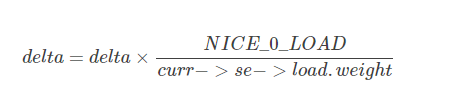

虚拟时钟vruntime和调度延迟
===========================

cfs调度算法的思想：理想状态下每个进程都能获得相同的时间片,并且同时运行在CPU上，但实际上一个CPU同一时刻运行的进程只能有
一个,就是说一个进程占有CPU时其他进程必须等待

虚拟运行时间
-------------

虚拟运行时间的引入
^^^^^^^^^^^^^^^^^^^

CFS为了实现公平,必须惩罚当前正在运行的进程，以使那些正在等待的进程下次被调度

具体实现时,CFS通过每个进程的虚拟运行时间(vruntime)来衡量哪个进程最值得被调度

CFS中就绪队列是一颗以vruntime为键值的红黑树,虚拟时间越小的进程越靠近整个红黑树的最左端,因此调度器每次选择位于红黑树最左端的那个进程，该进程的vruntime最小.

虚拟运行时间时通过进程的实际运行时间和进程权重计算出来的

在CFS调度器中,将进程优先级这个概念弱化,而是强调进程的权重,一个进程的权重越大则说明这个进程更需要运行,因此它的虚拟运行时间就越小,这样被调度的机会就越大

cfs虚拟时钟
^^^^^^^^^^^^^

完全公平调度算法CFS依赖于虚拟时钟,用以度量等待进程在完全公平系统中所能得到的CPU时间,但是数据结构中任何地方都没有找到虚拟时钟，这个是由于所有必要信息都可以根据
现存的实际时钟和每个进程相关的权重推算出来

假设现在系统有A B C三个进程，A.weight=1 B.weight=2 C.weight=3那么我们可以计算出整个公平调度队列的总权重是cfs_rq.weight=6,很自然的想法就是公平就是你在重量中占的
比重多少来定义你的重要性,那么,A的重要性就是1/6,同理B 和C的重要性分别为2/6和3/6,很显然C最重要就应该先被调度,而且占用的资源应该也最多.这就是CFS的公平策略

虚拟时钟相关的数据结构
------------------------

调度实体的虚拟时钟信息
^^^^^^^^^^^^^^^^^^^^^^^

既然虚拟时钟是用来衡量调度实体(一个或多个进程)的一种时间度量,因此必须在调度实体中存储器虚拟时钟的信息

::

    struct sched_entity {
        struct load_weight load;    //这个决定了进程在CPU上的运行时间和被调度次数
        struct rb_node run_node;
        unsigned int on_rq; //是否在就绪队列上

        u64 exec_start; //上次启动的时间

        u64 sum_exec_runtime;   //记录该进程的CPU消耗时间，这个是真实的CPU消耗时间,在进程撤销时会将sum_exec_runtime保存到prev_sum_exec_runtime中
        u64 vruntime;   //虚拟时钟,通过调用update_curr实现
        u64 prev_sum_exec_runtime;

        struct cfs_rq *cfs_rq;
    }

就绪队列上的虚拟时钟信息
^^^^^^^^^^^^^^^^^^^^^^^^

完全公平调度类sched_fair_class主要扶着管理普通进程,在全局的CPU就绪队列上存储了在cfs的就绪队列struct cfs_rq

::

    struct cfs_rq
    {
        struct load_weight load;        //所有进程的累计负荷值
        unsigned long nr_running;       //当前就绪队列的进程数

        u64 min_vruntime;       //队列的虚拟时钟

        struct rb_root tasks_timeline;      //红黑树的头结点
        struct rb_node *rb_leftmost;        //红黑树的最左面结点

        struct sched_entity *curr;      //当前执行进程的可调度实体
        ...
    }

update_curr函数计算进程虚拟时间
--------------------------------

所有与虚拟时钟有关的计算都在update_curr中执行,该函数在系统中各个不同的地方调用,包括周期性调度器在内

update_curr的流程如下

- 首先计算进程当前时间与上次启动时间的差值

- 通过负荷权重和当前时间模拟出进程的虚拟运行时钟

- 重新设置cfs的min_vruntime保持其单调性

::

    /*
     * Update the current task's runtime statistics.
     */
    static void update_curr(struct cfs_rq *cfs_rq)
    {
        struct sched_entity *curr = cfs_rq->curr;   //确定就绪队列的当前执行进程curr
        u64 now = rq_clock_task(rq_of(cfs_rq));     //rq_of(cfs_rq)返回cfs队列所在的全局就绪队列
                                                    //rq_clock_task返回rq的clock_task
        u64 delta_exec;

        if (unlikely(!curr))    //如果就绪队列上没有进程在执行，则返回
            return;

        delta_exec = now - curr->exec_start;    //计算当前和上一次更新负荷权重时两次的时间差值
        if (unlikely((s64)delta_exec <= 0))
            return;

        curr->exec_start = now; //更新启动时间

        schedstat_set(curr->statistics.exec_max,
                  max(delta_exec, curr->statistics.exec_max));

        curr->sum_exec_runtime += delta_exec;       //将时间差累加到先前统计的时间即可
        schedstat_add(cfs_rq->exec_clock, delta_exec);

        curr->vruntime += calc_delta_fair(delta_exec, curr);    //计算虚拟时钟
        update_min_vruntime(cfs_rq);    //重新设置min_vruntime

        if (entity_is_task(curr)) {
            struct task_struct *curtask = task_of(curr);

            trace_sched_stat_runtime(curtask, delta_exec, curr->vruntime);
            cgroup_account_cputime(curtask, delta_exec);
            account_group_exec_runtime(curtask, delta_exec);
        }

        account_cfs_rq_runtime(cfs_rq, delta_exec);
    }

- 模拟虚拟时钟

忽略舍入和溢出检查,calc_delta_fair函数所做的就是更具下列公式计算

根据公式可知,nice=0的进程，虚拟时间和物理时间是相等的。nice值越低的进程,权重越大,累加的虚拟运行时间会更小

每个进程拥有一个vruntime,每次需要调度的时候就会选运行队列中最小vruntime的那个进程来执行，vruntime在时钟中断里面被维护，每次时钟中断都要更新当前进程的vruntime
即vruntime以如下公式逐渐增长

curr->vruntime += calc_delta_fair(delta_exec, curr)

::

    /*
     * delta /= w
     */
    static inline u64 calc_delta_fair(u64 delta, struct sched_entity *se)
    {
        if (unlikely(se->load.weight != NICE_0_LOAD))
            delta = __calc_delta(delta, NICE_0_LOAD, &se->load);

        return delta;
    }

    /*
     * delta_exec * weight / lw.weight
     *   OR
     * (delta_exec * (weight * lw->inv_weight)) >> WMULT_SHIFT
     *
     * Either weight := NICE_0_LOAD and lw \e sched_prio_to_wmult[], in which case
     * we're guaranteed shift stays positive because inv_weight is guaranteed to
     * fit 32 bits, and NICE_0_LOAD gives another 10 bits; therefore shift >= 22.
     *
     * Or, weight =< lw.weight (because lw.weight is the runqueue weight), thus
     * weight/lw.weight <= 1, and therefore our shift will also be positive.
     */
    static u64 __calc_delta(u64 delta_exec, unsigned long weight, struct load_weight *lw)
    {
        u64 fact = scale_load_down(weight);
        int shift = WMULT_SHIFT;

        __update_inv_weight(lw);

        if (unlikely(fact >> 32)) {
            while (fact >> 32) {
                fact >>= 1;
                shift--;
            }
        }

        /* hint to use a 32x32->64 mul */
        fact = (u64)(u32)fact * lw->inv_weight;

        while (fact >> 32) {
            fact >>= 1;
            shift--;
        }

        return mul_u64_u32_shr(delta_exec, fact, shift);
    }

重新设置cfs->min_vruntime
^^^^^^^^^^^^^^^^^^^^^^^^^^^

::

    static void update_min_vruntime(struct cfs_rq *cfs_rq)
    {
        struct sched_entity *curr = cfs_rq->curr;
        struct rb_node *leftmost = rb_first_cached(&cfs_rq->tasks_timeline);    //存储了进程红黑树的最左结点,这个节点存储了即将调度的节点

        u64 vruntime = cfs_rq->min_vruntime;

        if (curr) {     //检测cfs就绪队列上是否有活动进程curr,如果有则设置vrutime的值为cuur->vruntime
            if (curr->on_rq)
                vruntime = curr->vruntime;
            else
                curr = NULL;
        }

        if (leftmost) { /* non-empty tree */    //检测是cfs红黑树上是否有最左节点,即等待被调度的节点
            struct sched_entity *se;
            se = rb_entry(leftmost, struct sched_entity, run_node);     //获取sched_entity,其中包含了vruntime
            
            if (!curr)
                vruntime = se->vruntime;
            else
                vruntime = min_vruntime(vruntime, se->vruntime);    //更新vruntime
        }

        /* ensure we never gain time by being placed backwards. */
        cfs_rq->min_vruntime = max_vruntime(cfs_rq->min_vruntime, vruntime);    //为了保证min_vruntime单调递增,只有vruntime查出cfs_rq->min_vruntime时才更新
    #ifndef CONFIG_64BIT
        smp_wmb();
        cfs_rq->min_vruntime_copy = cfs_rq->min_vruntime;
    #endif
    }

红黑树的键值entity_key和entity_befor
-------------------------------------

完全公平调度调度器CFS的真正关键点是,红黑树的排序过程是进程的vruntime来进行计算的,准确的来说同一个就绪队列所有进程(或者调度实体)依照其键值se->vruntime - cfs_rq->min_vruntime进行排序.

键值较小的结点,在cfs红黑树中排序的位置就越靠左,因此也更快的被调度,用这种方法,linux内核实现了下面两种对立的机制

- 在程序运行时,其vruntime稳定的增加,它在红黑树中总是向右移动
    因为越重要的进程vruntime增加的越慢,因此他们向右移动的速度也越慢，这样其被调度的机会要大于次要进程

- 如果进程进入睡眠，其vruntime保持不变，因为每个队列min_vruntime同时会单调增加,那么进程从睡眠中苏醒，在红黑树中的位置会更靠左,也因此其键值相对来说变小了

::

    static inline int entity_before(struct sched_entity *a,
                    struct sched_entity *b)
    {
        return (s64)(a->vruntime - b->vruntime) < 0;
    }

延迟跟踪(调度延迟)与虚拟时间在调度实体内部的再分配
---------------------------------------------------

调度延迟与其控制字段
^^^^^^^^^^^^^^^^^^^^^

内核有一个固定的概念，称之为良好的调度延迟,即保证每个可运行的进程都应该至少运行一次的某个时间间隔,它在 ``sysctl_sched_latency`` 中给出,可通过 ``/proc/sys/kernel/sched_latency_ns`` 控制，默认值
为20000000即20毫秒

第二个控制参数是 ``sched_nr_latency`` 控制在一个延迟周期中处理的最大活动进程数目，如果活动进程的数目超过该上限,则延迟周期也比例的线性扩展sched_nr_latency可以通过sysctl_sched_min_granularity间接
的控制,后者可通过/proc/sys/kernel/sched_min_granularity_ns设置，默认值是4000000纳秒,即4毫秒

__sched_period = sysctl_sched_latency * nr_running / shced_nr_latency

虚拟时间在调度实体内的分配
^^^^^^^^^^^^^^^^^^^^^^^^^^^

调度实体是内核进行调度的基本实体单位，其可能包含一个或者多个进程，那么调度实体分配到虚拟运行时间，需要在内部对各个进程进行再次分配

通过考虑各个进程的相对权重，将一个延迟周期的时间在活动进程之前进行分配,对于由某个调度实体标识的给定进程，分配到的时间通过sched_slice函数来分配

::

    /*
     * We calculate the wall-time slice from the period by taking a part
     * proportional to the weight.
     *
     * s = p*P[w/rw]
     */
    static u64 sched_slice(struct cfs_rq *cfs_rq, struct sched_entity *se)
    {
        u64 slice = __sched_period(cfs_rq->nr_running + !se->on_rq);

        for_each_sched_entity(se) {
            struct load_weight *load;
            struct load_weight lw;

            cfs_rq = cfs_rq_of(se);
            load = &cfs_rq->load;

            if (unlikely(!se->on_rq)) {
                lw = cfs_rq->load;

                update_load_add(&lw, se->load.weight);
                load = &lw;
            }
            slice = __calc_delta(slice, se->load.weight, load);
        }
        return slice;
    }
