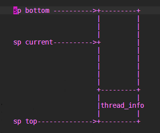
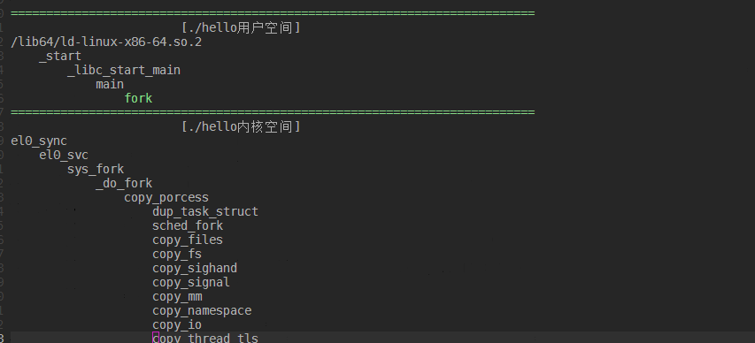

do_fork
========

linux中进程创建的函数有三个,分别为 ``fork`` ``vfork`` ``clone`` ,确切的说vfork创建出来的时轻量级进程,也叫线程,是共享资源的而进程

+------------------+-------------------------------------------------------------------------------------+
|  系统调用        |                           描述                                                      |
+==================+=====================================================================================+
|  fork            | fork创建的子进程是父进程的完整副本,复制了父进程的资源                               |
+------------------+-------------------------------------------------------------------------------------+
|  vfork           | vfork创建的与父进程共享数据段,而且vfork创建的子进程将优于父进程运行                 |
+------------------+-------------------------------------------------------------------------------------+
|  clone           | linux创建线程一般使用的是pthread库，实际上Linux也提供了创建线程的系统调用clone      |
+------------------+-------------------------------------------------------------------------------------+

fork、vfork、clone的系统调用的入口地址分别是sys_fork,sys_vfork和sys_clone，而他们的定义是依赖于体系结构的,因为在用户空间和内核空间之间
传递参数的方法因体系结构而异

.. note::

    系统调用的实现和C库不同，普通C函数通过将参数的值压入到进程的栈中进行参数的传递,由于系统调用是通过中断进程从用户态到内核的一种特殊的函数调用,
    没有用户态或者内核态的堆栈可以被用来在调用函数和被调函数之间进行参数传递.系统调用通过CPU寄存器来进行参数传递,在进行系统调用之前,内核将CPU寄存器
    的内容拷贝到内核堆栈中,实现参数的传递.不同的体系结构采用不同的方式或者不同寄存器来传递参数.

fork,vfork,clone系统调用的实现
------------------------------

do_fork和_fo_fork代码都位于 kernel/fork.c文件中

::

    #ifndef CONFIG_HAVE_COPY_THREAD_TLS
    /* For compatibility with architectures that call do_fork directly rather than
     * using the syscall entry points below. */
    long do_fork(unsigned long clone_flags,
              unsigned long stack_start,
              unsigned long stack_size,
              int __user *parent_tidptr,
              int __user *child_tidptr)
    {
        struct kernel_clone_args args = {
            .flags		= (clone_flags & ~CSIGNAL),
            .pidfd		= parent_tidptr,
            .child_tid	= child_tidptr,
            .parent_tid	= parent_tidptr,
            .exit_signal	= (clone_flags & CSIGNAL),
            .stack		= stack_start,
            .stack_size	= stack_size,
        };

        if (!legacy_clone_args_valid(&args))
            return -EINVAL;

        return _do_fork(&args);
    }
    #endif

    /*
     * Create a kernel thread.
     */
    pid_t kernel_thread(int (*fn)(void *), void *arg, unsigned long flags)
    {
        struct kernel_clone_args args = {
            .flags		= ((flags | CLONE_VM | CLONE_UNTRACED) & ~CSIGNAL),
            .exit_signal	= (flags & CSIGNAL),
            .stack		= (unsigned long)fn,
            .stack_size	= (unsigned long)arg,
        };

        return _do_fork(&args);
    }

+----------------+-----------------------------------------------------------------------------------------------------------------------------+
|   参数         |                                              描述                                                                           |
+================+=============================================================================================================================+
|   clone_flags  | 进程复制的属性信息,即从父进程继承哪些资源.该标志为4字节,最低一个字节为子进程结束时发送给父进程的信号代码,通常为SIGCHLD      |
+----------------+-----------------------------------------------------------------------------------------------------------------------------+
|  stack_start   | 子进程用户堆栈的地址                                                                                                        |
+----------------+-----------------------------------------------------------------------------------------------------------------------------+
|  stack_size    | 用户态下栈的大小,该参数通常是不必要的,总被设置为0                                                                           |
+----------------+-----------------------------------------------------------------------------------------------------------------------------+
|  parent_tidptr | 父进程在用户态下Pid的地址,该参数在CLONE_PARENT_SETTID标志被设定时有意义                                                     |
+----------------+-----------------------------------------------------------------------------------------------------------------------------+
|  child_tidptr  |  父进程在用户态下Pid的地址,该参数在CLONE_PARENT_SETTID标志被设定时有意义                                                    |
+----------------+-----------------------------------------------------------------------------------------------------------------------------+

其中clone_flags标志如下所示

+----------------+-----------------------------------------------------------------------------------------------+
| 标志名称       |                                    说明                                                       |
+================+===============================================================================================+
| CLONE_VM       | 共享内存描述符和所有的页表                                                                    |
+----------------+-----------------------------------------------------------------------------------------------+
| CLONE_FS       | 共享根目录和当前工作目录所在的表,以及文件Umask                                                |
+----------------+-----------------------------------------------------------------------------------------------+
| CLONE_PTRACE   | 如果父进程被跟踪，那么子进程也被跟踪                                                          |
+----------------+-----------------------------------------------------------------------------------------------+
| CLONE_VFORK    | 在发出vfork系统调用时设置                                                                     |
+----------------+-----------------------------------------------------------------------------------------------+
| CLONE_STOPPED  | 强迫子进程开始于TASK_STOPPED状态                                                              |
+----------------+-----------------------------------------------------------------------------------------------+
| CLONE_SIGHAND  | 共享父进程信号处理表,阻塞信号表和挂起信号表,如果设置此标识就必须同时设置CLONE_VM标志          |
+----------------+-----------------------------------------------------------------------------------------------+
| CLONE_THREAD   | 把子进程插入到父进程所在的线程组中,并迫使子进程共享父进程的信号描述符                         |
+----------------+-----------------------------------------------------------------------------------------------+

fork vfork clone系统调用的实现
^^^^^^^^^^^^^^^^^^^^^^^^^^^^^^^^

::

    #ifdef __ARCH_WANT_SYS_FORK
    SYSCALL_DEFINE0(fork)
    {
    #ifdef CONFIG_MMU
        struct kernel_clone_args args = {
            .exit_signal = SIGCHLD,
        };

        return _do_fork(&args);
    #else
        /* can not support in nommu mode */
        return -EINVAL;
    #endif
    }
    #endif

    #ifdef __ARCH_WANT_SYS_VFORK
    SYSCALL_DEFINE0(vfork)
    {
        struct kernel_clone_args args = {
            .flags		= CLONE_VFORK | CLONE_VM,
            .exit_signal	= SIGCHLD,
        };

        return _do_fork(&args);
    }
    #endif

    #ifdef __ARCH_WANT_SYS_CLONE
    #ifdef CONFIG_CLONE_BACKWARDS
    SYSCALL_DEFINE5(clone, unsigned long, clone_flags, unsigned long, newsp,
             int __user *, parent_tidptr,
             unsigned long, tls,
             int __user *, child_tidptr)
    #elif defined(CONFIG_CLONE_BACKWARDS2)
    SYSCALL_DEFINE5(clone, unsigned long, newsp, unsigned long, clone_flags,
             int __user *, parent_tidptr,
             int __user *, child_tidptr,
             unsigned long, tls)
    #elif defined(CONFIG_CLONE_BACKWARDS3)
    SYSCALL_DEFINE6(clone, unsigned long, clone_flags, unsigned long, newsp,
            int, stack_size,
            int __user *, parent_tidptr,
            int __user *, child_tidptr,
            unsigned long, tls)
    #else
    SYSCALL_DEFINE5(clone, unsigned long, clone_flags, unsigned long, newsp,
             int __user *, parent_tidptr,
             int __user *, child_tidptr,
             unsigned long, tls)
    #endif
    {
        struct kernel_clone_args args = {
            .flags		= (clone_flags & ~CSIGNAL),
            .pidfd		= parent_tidptr,
            .child_tid	= child_tidptr,
            .parent_tid	= parent_tidptr,
            .exit_signal	= (clone_flags & CSIGNAL),
            .stack		= newsp,
            .tls		= tls,
        };

        if (!legacy_clone_args_valid(&args))
            return -EINVAL;

        return _do_fork(&args);
    }
    #endif

clone可以由用户进行配置父进程的哪些资源，也可以指定新的栈地址,另外还可以设置用户空间的两个指针(parent_tidptr和child_tidptr)用于与线程库通信

所有进程复制(创建)的fork机制最终都调用了 ``kernel/fork.c`` 中的 ``_do_fork`` 函数(一个与体系结构无关的函数)

_do_fork以调用copy_process开始,后者执行生成新的进程的实际工作,并根据指定的标志复制父进程的数据.在子进程生成后,内核必须执行下列收尾操作

1) 调用copy_process为子进程复制出一份进程信息

2) 如果时vfork(设置了CLONE_VFORK和ptrace标志) 初始化完成处理信息

3) 调用wake_up_new_task 将子进程加入调度器,为之分配CPU

4) 如果是vfork父进程等待子进程完成exec替换自己的地址空间

::

    /*
     *  Ok, this is the main fork-routine.
     *
     * It copies the process, and if successful kick-starts
     * it and waits for it to finish using the VM if required.
     *
     * args->exit_signal is expected to be checked for sanity by the caller.
     */
    long _do_fork(struct kernel_clone_args *args)
    {
        u64 clone_flags = args->flags;
        struct completion vfork;
        struct pid *pid;
        struct task_struct *p;
        int trace = 0;
        long nr;

        /*
         * Determine whether and which event to report to ptracer.  When
         * called from kernel_thread or CLONE_UNTRACED is explicitly
         * requested, no event is reported; otherwise, report if the event
         * for the type of forking is enabled.
         */
        if (!(clone_flags & CLONE_UNTRACED)) {
            if (clone_flags & CLONE_VFORK)
                trace = PTRACE_EVENT_VFORK;
            else if (args->exit_signal != SIGCHLD)
                trace = PTRACE_EVENT_CLONE;
            else
                trace = PTRACE_EVENT_FORK;

            if (likely(!ptrace_event_enabled(current, trace)))
                trace = 0;
        }
        //复制进程描述符,copy_process的返回值是一个task_struct指针
        p = copy_process(NULL, trace, NUMA_NO_NODE, args);
        add_latent_entropy();

        if (IS_ERR(p))
            return PTR_ERR(p);

        /*
         * Do this prior waking up the new thread - the thread pointer
         * might get invalid after that point, if the thread exits quickly.
         */
        trace_sched_process_fork(current, p);
        //得到新创建的进程pid信息
        pid = get_task_pid(p, PIDTYPE_PID);
        nr = pid_vnr(pid);

        if (clone_flags & CLONE_PARENT_SETTID)
            put_user(nr, args->parent_tid);

        if (clone_flags & CLONE_VFORK) {
            p->vfork_done = &vfork;
            init_completion(&vfork);
            get_task_struct(p);
        }
        //将子进程加入到调度器中,为其分配CPU，准备执行
        wake_up_new_task(p);

        /* forking complete and child started to run, tell ptracer */
        if (unlikely(trace))
            ptrace_event_pid(trace, pid);
        //如果是vfork,将父进程加入到等待队列，等待子进程完成
        if (clone_flags & CLONE_VFORK) {
            if (!wait_for_vfork_done(p, &vfork))
                ptrace_event_pid(PTRACE_EVENT_VFORK_DONE, pid);
        }

        put_pid(pid);
        return nr;
    }

- copy_process流程

1) 调用dup_task_struct复制当前的task_struc

2) 检查进程数是否超限

3) 初始化自旋锁,挂起信号,cpu定时器

4) 调用sched_fork初始化进程数据结构,并把进程状态设置为TASK_RUNNING

5) 复制进程信息,包括文件系统,信号处理函数,内存管理等

6) 调用copy_thread_tls初始化子进程内核栈

7) 为新进程分配新的pid

::

    /*
     * This creates a new process as a copy of the old one,
     * but does not actually start it yet.
     *
     * It copies the registers, and all the appropriate
     * parts of the process environment (as per the clone
     * flags). The actual kick-off is left to the caller.
     */
    static __latent_entropy struct task_struct *copy_process(
                        struct pid *pid,
                        int trace,
                        int node,
                        struct kernel_clone_args *args)
    {
        int pidfd = -1, retval;
        struct task_struct *p;
        struct multiprocess_signals delayed;
        struct file *pidfile = NULL;
        u64 clone_flags = args->flags;
        
        ...
        //这里省略掉一些参数检测

        //将当前进程复制一份给新的进程p
        retval = -ENOMEM;
        p = dup_task_struct(current, node);
        if (!p)
            goto fork_out;

        /*
         * This _must_ happen before we call free_task(), i.e. before we jump
         * to any of the bad_fork_* labels. This is to avoid freeing
         * p->set_child_tid which is (ab)used as a kthread's data pointer for
         * kernel threads (PF_KTHREAD).
         */
        p->set_child_tid = (clone_flags & CLONE_CHILD_SETTID) ? args->child_tid : NULL;
        /*
         * Clear TID on mm_release()?
         */
        p->clear_child_tid = (clone_flags & CLONE_CHILD_CLEARTID) ? args->child_tid : NULL;

        ftrace_graph_init_task(p);

        rt_mutex_init_task(p);

    #ifdef CONFIG_PROVE_LOCKING
        DEBUG_LOCKS_WARN_ON(!p->hardirqs_enabled);
        DEBUG_LOCKS_WARN_ON(!p->softirqs_enabled);
    #endif
        retval = -EAGAIN;
        if (atomic_read(&p->real_cred->user->processes) >=
                task_rlimit(p, RLIMIT_NPROC)) {
            if (p->real_cred->user != INIT_USER &&
                !capable(CAP_SYS_RESOURCE) && !capable(CAP_SYS_ADMIN))
                goto bad_fork_free;
        }
        current->flags &= ~PF_NPROC_EXCEEDED;
        //复制信用凭证
        retval = copy_creds(p, clone_flags);
        if (retval < 0)
            goto bad_fork_free;

        /*
         * If multiple threads are within copy_process(), then this check
         * triggers too late. This doesn't hurt, the check is only there
         * to stop root fork bombs.
         */
         //超过最大进程数,则返回
        retval = -EAGAIN;
        if (nr_threads >= max_threads)
            goto bad_fork_cleanup_count;

        delayacct_tsk_init(p);	/* Must remain after dup_task_struct() */
        p->flags &= ~(PF_SUPERPRIV | PF_WQ_WORKER | PF_IDLE);
        p->flags |= PF_FORKNOEXEC;
        INIT_LIST_HEAD(&p->children);
        INIT_LIST_HEAD(&p->sibling);
        rcu_copy_process(p);
        p->vfork_done = NULL;
        spin_lock_init(&p->alloc_lock);
        //初始化信号挂起Pendding
        init_sigpending(&p->pending);
        
        ...
        //这里省略初始化和时间相关的杂项

        //初始化调度实体se,和调度器类
        /* Perform scheduler related setup. Assign this task to a CPU. */
        retval = sched_fork(clone_flags, p);
        if (retval)
            goto bad_fork_cleanup_policy;

        //perf相关
        retval = perf_event_init_task(p);
        if (retval)
            goto bad_fork_cleanup_policy;
        retval = audit_alloc(p);
        if (retval)
            goto bad_fork_cleanup_perf;
        //进程共享内存链表初始化
        /* copy all the process information */
        shm_init_task(p);
        retval = security_task_alloc(p, clone_flags);
        if (retval)
            goto bad_fork_cleanup_audit;
        retval = copy_semundo(clone_flags, p);
        if (retval)
            goto bad_fork_cleanup_security;
        //将当前current进程打开的fd复制一份到新的进程
        retval = copy_files(clone_flags, p);
        if (retval)
            goto bad_fork_cleanup_semundo;
        //复制fs
        retval = copy_fs(clone_flags, p);
        if (retval)
            goto bad_fork_cleanup_files;
        retval = copy_sighand(clone_flags, p);
        if (retval)
            goto bad_fork_cleanup_fs;
        retval = copy_signal(clone_flags, p);
        if (retval)
            goto bad_fork_cleanup_sighand;
        retval = copy_mm(clone_flags, p);
        if (retval)
            goto bad_fork_cleanup_signal;
        retval = copy_namespaces(clone_flags, p);
        if (retval)
            goto bad_fork_cleanup_mm;
        retval = copy_io(clone_flags, p);
        if (retval)
            goto bad_fork_cleanup_namespaces;
        //拷贝进程不同的部分
        retval = copy_thread_tls(clone_flags, args->stack, args->stack_size, p,
                     args->tls);
        if (retval)
            goto bad_fork_cleanup_io;

        stackleak_task_init(p);

        //申请新的pid
        if (pid != &init_struct_pid) {
            pid = alloc_pid(p->nsproxy->pid_ns_for_children);
            if (IS_ERR(pid)) {
                retval = PTR_ERR(pid);
                goto bad_fork_cleanup_thread;
            }
        }

        /*
         * This has to happen after we've potentially unshared the file
         * descriptor table (so that the pidfd doesn't leak into the child
         * if the fd table isn't shared).
         */
        if (clone_flags & CLONE_PIDFD) {
            retval = get_unused_fd_flags(O_RDWR | O_CLOEXEC);
            if (retval < 0)
                goto bad_fork_free_pid;

            pidfd = retval;

            pidfile = anon_inode_getfile("[pidfd]", &pidfd_fops, pid,
                              O_RDWR | O_CLOEXEC);
            if (IS_ERR(pidfile)) {
                put_unused_fd(pidfd);
                retval = PTR_ERR(pidfile);
                goto bad_fork_free_pid;
            }
            get_pid(pid);	/* held by pidfile now */

            retval = put_user(pidfd, args->pidfd);
            if (retval)
                goto bad_fork_put_pidfd;
        }

    #ifdef CONFIG_BLOCK
        p->plug = NULL;
    #endif
        futex_init_task(p);

        /*
         * sigaltstack should be cleared when sharing the same VM
         */
        if ((clone_flags & (CLONE_VM|CLONE_VFORK)) == CLONE_VM)
            sas_ss_reset(p);

        /*
         * Syscall tracing and stepping should be turned off in the
         * child regardless of CLONE_PTRACE.
         */
        user_disable_single_step(p);
        clear_tsk_thread_flag(p, TIF_SYSCALL_TRACE);
    #ifdef TIF_SYSCALL_EMU
        clear_tsk_thread_flag(p, TIF_SYSCALL_EMU);
    #endif
        clear_tsk_latency_tracing(p);

        /* ok, now we should be set up.. */
        p->pid = pid_nr(pid);
        //如果是线程,则设置线程组组长为当前进程指向的组长,如果是进程则将组长设置为自己
        if (clone_flags & CLONE_THREAD) {
            p->exit_signal = -1;
            p->group_leader = current->group_leader;
            p->tgid = current->tgid;
            //进程的tgid才是真正的pid,即同一个线程组下的线程tgid相同,pid不同
        } else {
            if (clone_flags & CLONE_PARENT)
                p->exit_signal = current->group_leader->exit_signal;
            else
                p->exit_signal = args->exit_signal;
            p->group_leader = p;
            p->tgid = p->pid;
        }

        p->nr_dirtied = 0;
        p->nr_dirtied_pause = 128 >> (PAGE_SHIFT - 10);
        p->dirty_paused_when = 0;

        p->pdeath_signal = 0;
        INIT_LIST_HEAD(&p->thread_group);
        p->task_works = NULL;

        cgroup_threadgroup_change_begin(current);
        /*
         * Ensure that the cgroup subsystem policies allow the new process to be
         * forked. It should be noted the the new process's css_set can be changed
         * between here and cgroup_post_fork() if an organisation operation is in
         * progress.
         */
         //cgroup相关
        retval = cgroup_can_fork(p);
        if (retval)
            goto bad_fork_cgroup_threadgroup_change_end;

        /*
         * From this point on we must avoid any synchronous user-space
         * communication until we take the tasklist-lock. In particular, we do
         * not want user-space to be able to predict the process start-time by
         * stalling fork(2) after we recorded the start_time but before it is
         * visible to the system.
         */

        p->start_time = ktime_get_ns();
        p->real_start_time = ktime_get_boottime_ns();

        /*
         * Make it visible to the rest of the system, but dont wake it up yet.
         * Need tasklist lock for parent etc handling!
         */
        write_lock_irq(&tasklist_lock);

      //设置父进程,如果是线程,父进程就是current的父进程,否则current就是新进程的父进程
        /* CLONE_PARENT re-uses the old parent */
        if (clone_flags & (CLONE_PARENT|CLONE_THREAD)) {
            p->real_parent = current->real_parent;
            p->parent_exec_id = current->parent_exec_id;
        } else {
            p->real_parent = current;
            p->parent_exec_id = current->self_exec_id;
        }

        klp_copy_process(p);

        spin_lock(&current->sighand->siglock);

        /*
         * Copy seccomp details explicitly here, in case they were changed
         * before holding sighand lock.
         */
        copy_seccomp(p);

        rseq_fork(p, clone_flags);

        /* Don't start children in a dying pid namespace */
        if (unlikely(!(ns_of_pid(pid)->pid_allocated & PIDNS_ADDING))) {
            retval = -ENOMEM;
            goto bad_fork_cancel_cgroup;
        }

        /* Let kill terminate clone/fork in the middle */
        if (fatal_signal_pending(current)) {
            retval = -EINTR;
            goto bad_fork_cancel_cgroup;
        }

        /* past the last point of failure */
        if (pidfile)
            fd_install(pidfd, pidfile);

        init_task_pid_links(p);
        if (likely(p->pid)) {
            ptrace_init_task(p, (clone_flags & CLONE_PTRACE) || trace);
            //初始化pid结构
            init_task_pid(p, PIDTYPE_PID, pid);
            if (thread_group_leader(p)) { //如果新进程是线程组组长,同样意味着他是进程而不是线程
                init_task_pid(p, PIDTYPE_TGID, pid); //将pid赋值给task->pid[PGID].pid
                init_task_pid(p, PIDTYPE_PGID, task_pgrp(current));
                init_task_pid(p, PIDTYPE_SID, task_session(current));

                if (is_child_reaper(pid)) {
                    ns_of_pid(pid)->child_reaper = p;
                    p->signal->flags |= SIGNAL_UNKILLABLE;
                }
                p->signal->shared_pending.signal = delayed.signal;
                p->signal->tty = tty_kref_get(current->signal->tty);
                /*
                 * Inherit has_child_subreaper flag under the same
                 * tasklist_lock with adding child to the process tree
                 * for propagate_has_child_subreaper optimization.
                 */
                p->signal->has_child_subreaper = p->real_parent->signal->has_child_subreaper ||
                                 p->real_parent->signal->is_child_subreaper;
                list_add_tail(&p->sibling, &p->real_parent->children);
                list_add_tail_rcu(&p->tasks, &init_task.tasks);
                attach_pid(p, PIDTYPE_TGID);
                attach_pid(p, PIDTYPE_PGID);
                attach_pid(p, PIDTYPE_SID);
                __this_cpu_inc(process_counts);
            } else {
                current->signal->nr_threads++;
                atomic_inc(&current->signal->live);
                refcount_inc(&current->signal->sigcnt);
                task_join_group_stop(p);
                list_add_tail_rcu(&p->thread_group,
                          &p->group_leader->thread_group);
                //将线程p挂到组长的thread_group链表下面
                list_add_tail_rcu(&p->thread_node,
                          &p->signal->thread_head);
            }
            //添加到pid空间,并增加线程数
            attach_pid(p, PIDTYPE_PID);
            nr_threads++;
        }
        total_forks++;
        hlist_del_init(&delayed.node);
        spin_unlock(&current->sighand->siglock);
        syscall_tracepoint_update(p);
        write_unlock_irq(&tasklist_lock);

        proc_fork_connector(p);
        cgroup_post_fork(p);
        cgroup_threadgroup_change_end(current);
        perf_event_fork(p);

        trace_task_newtask(p, clone_flags);
        uprobe_copy_process(p, clone_flags);
        //返回新线程task_struct
        return p;

    bad_fork_cancel_cgroup:
        spin_unlock(&current->sighand->siglock);
        write_unlock_irq(&tasklist_lock);
        cgroup_cancel_fork(p);
    bad_fork_cgroup_threadgroup_change_end:
        cgroup_threadgroup_change_end(current);
    bad_fork_put_pidfd:
        if (clone_flags & CLONE_PIDFD) {
            fput(pidfile);
            put_unused_fd(pidfd);
        }
    bad_fork_free_pid:
        if (pid != &init_struct_pid)
            free_pid(pid);
    bad_fork_cleanup_thread:
        exit_thread(p);
    bad_fork_cleanup_io:
        if (p->io_context)
            exit_io_context(p);
    bad_fork_cleanup_namespaces:
        exit_task_namespaces(p);
    bad_fork_cleanup_mm:
        if (p->mm) {
            mm_clear_owner(p->mm, p);
            mmput(p->mm);
        }
    bad_fork_cleanup_signal:
        if (!(clone_flags & CLONE_THREAD))
            free_signal_struct(p->signal);
    bad_fork_cleanup_sighand:
        __cleanup_sighand(p->sighand);
    bad_fork_cleanup_fs:
        exit_fs(p); /* blocking */
    bad_fork_cleanup_files:
        exit_files(p); /* blocking */
    bad_fork_cleanup_semundo:
        exit_sem(p);
    bad_fork_cleanup_security:
        security_task_free(p);
    bad_fork_cleanup_audit:
        audit_free(p);
    bad_fork_cleanup_perf:
        perf_event_free_task(p);
    bad_fork_cleanup_policy:
        lockdep_free_task(p);
    #ifdef CONFIG_NUMA
        mpol_put(p->mempolicy);
    bad_fork_cleanup_threadgroup_lock:
    #endif
        delayacct_tsk_free(p);
    bad_fork_cleanup_count:
        atomic_dec(&p->cred->user->processes);
        exit_creds(p);
    bad_fork_free:
        p->state = TASK_DEAD;
        put_task_stack(p);
        delayed_free_task(p);
    fork_out:
        spin_lock_irq(&current->sighand->siglock);
        hlist_del_init(&delayed.node);
        spin_unlock_irq(&current->sighand->siglock);
        return ERR_PTR(retval);
    }

在copy_process函数中dup_task_struct函数实现如下,该函数用于从当前进程current的task_struct结构中,复制一份一模一样的给新进程

::

    static struct task_struct *dup_task_struct(struct task_struct *orig, int node)
    {
        struct task_struct *tsk;
        unsigned long *stack;
        struct vm_struct *stack_vm_area __maybe_unused;
        int err;
        
        //如果从传入的参数是NUMA_NO_NODE,表示申请内存的时候,从当前进程所在内存结点申请
        if (node == NUMA_NO_NODE)
            node = tsk_fork_get_node(orig);
        //从内存Node结点盛情一段内存作为新进程tsk结构
        tsk = alloc_task_struct_node(node);
        if (!tsk)
            return NULL;
        //分配线程栈
        stack = alloc_thread_stack_node(tsk, node);
        if (!stack)
            goto free_tsk;

        if (memcg_charge_kernel_stack(tsk))
            goto free_stack;

        stack_vm_area = task_stack_vm_area(tsk);
        //这个函数其实就是tsk = orig,即将current进程memcpy到tsk
        err = arch_dup_task_struct(tsk, orig);

        /*
         * arch_dup_task_struct() clobbers the stack-related fields.  Make
         * sure they're properly initialized before using any stack-related
         * functions again.
         */
         //将stack地址设置到tsk的记录栈地址的位置,替换掉从current拷贝来的栈(这个是内核栈,每个应用程序有两个栈,一个是内核栈一个是应用栈,内核线程只有内核栈)
        tsk->stack = stack;
    #ifdef CONFIG_VMAP_STACK
        tsk->stack_vm_area = stack_vm_area;
    #endif
    #ifdef CONFIG_THREAD_INFO_IN_TASK
        refcount_set(&tsk->stack_refcount, 1);
    #endif

        if (err)
            goto free_stack;

    #ifdef CONFIG_SECCOMP
        /*
         * We must handle setting up seccomp filters once we're under
         * the sighand lock in case orig has changed between now and
         * then. Until then, filter must be NULL to avoid messing up
         * the usage counts on the error path calling free_task.
         */
        tsk->seccomp.filter = NULL;
    #endif

        //将current的thread_info结构拷贝一份到tsk
        setup_thread_stack(tsk, orig);
        clear_user_return_notifier(tsk);
        clear_tsk_need_resched(tsk);
        //设置栈的结束位置,用于检测栈溢出
        set_task_stack_end_magic(tsk);

    #ifdef CONFIG_STACKPROTECTOR
        tsk->stack_canary = get_random_canary();
    #endif
        if (orig->cpus_ptr == &orig->cpus_mask)
            tsk->cpus_ptr = &tsk->cpus_mask;

        /*
         * One for the user space visible state that goes away when reaped.
         * One for the scheduler.
         */
        refcount_set(&tsk->rcu_users, 2);
        /* One for the rcu users */
        refcount_set(&tsk->usage, 1);
    #ifdef CONFIG_BLK_DEV_IO_TRACE
        tsk->btrace_seq = 0;
    #endif
        tsk->splice_pipe = NULL;
        tsk->task_frag.page = NULL;
        tsk->wake_q.next = NULL;

        account_kernel_stack(tsk, 1);

        kcov_task_init(tsk);

    #ifdef CONFIG_FAULT_INJECTION
        tsk->fail_nth = 0;
    #endif

    #ifdef CONFIG_BLK_CGROUP
        tsk->throttle_queue = NULL;
        tsk->use_memdelay = 0;
    #endif

    #ifdef CONFIG_MEMCG
        tsk->active_memcg = NULL;
    #endif
        return tsk;

    free_stack:
        free_thread_stack(tsk);
    free_tsk:
        free_task_struct(tsk);
        return NULL;
    }

在申请新的进程task_struct结束后,这里有必要解释一下 ``thread_info`` 结构，thread_info结构是存放到内核的SP栈中的,原本linux是直接将task_struct存放到sp当中,
但是后来随着task_struct越来越大,因此,添加了一个thread_info结构作为中间代理结构,达到通过sp能够获取到对应进程task_struct结构的目的.thread_info在栈的位置如图

通常内核栈大小为2个page，即8K，并且内核栈严格按照8K对齐.因此当获取到SP指针的时候(sp current),只需要与上一个8K取反的值(sp & (~8k))就可以得到thread_info结构。
thread_info->task就指向该进程的task_struct结构.由于内核栈是向下增长，因此如果栈越界,首先破坏的是自己的thread_info结构,然后奔溃.

内核中current其实就是一个宏,利用当前sp和thread_info反向找到自己的task_struct结构

copy_thread_tls是一个非常重要的函数,其主要是设置新进程的运行地址和寄存器值,实现如下

::

    int copy_thread_tls(unsigned long clone_flags, unsigned long stack_start,
            unsigned long stk_sz, struct task_struct *p, unsigned long tls)
    {
        struct pt_regs *childregs = task_pt_regs(p);

        memset(&p->thread.cpu_context, 0, sizeof(struct cpu_context));

        /*
         * In case p was allocated the same task_struct pointer as some
         * other recently-exited task, make sure p is disassociated from
         * any cpu that may have run that now-exited task recently.
         * Otherwise we could erroneously skip reloading the FPSIMD
         * registers for p.
         */
        fpsimd_flush_task_state(p);

        if (likely(!(p->flags & PF_KTHREAD))) {
            *childregs = *current_pt_regs();
            childregs->regs[0] = 0;

            /*
             * Read the current TLS pointer from tpidr_el0 as it may be
             * out-of-sync with the saved value.
             */
            *task_user_tls(p) = read_sysreg(tpidr_el0);

            if (stack_start) {
                if (is_compat_thread(task_thread_info(p)))
                    childregs->compat_sp = stack_start;
                else
                    childregs->sp = stack_start;
            }

            /*
             * If a TLS pointer was passed to clone, use it for the new
             * thread.
             */
            if (clone_flags & CLONE_SETTLS)
                p->thread.uw.tp_value = tls;
        } else {
            memset(childregs, 0, sizeof(struct pt_regs));
            childregs->pstate = PSR_MODE_EL1h;
            if (IS_ENABLED(CONFIG_ARM64_UAO) &&
                cpus_have_const_cap(ARM64_HAS_UAO))
                childregs->pstate |= PSR_UAO_BIT;

            if (arm64_get_ssbd_state() == ARM64_SSBD_FORCE_DISABLE)
                set_ssbs_bit(childregs);

            if (system_uses_irq_prio_masking())
                childregs->pmr_save = GIC_PRIO_IRQON;

            p->thread.cpu_context.x19 = stack_start;
            p->thread.cpu_context.x20 = stk_sz;
        }
        p->thread.cpu_context.pc = (unsigned long)ret_from_fork;
        p->thread.cpu_context.sp = (unsigned long)childregs;

        ptrace_hw_copy_thread(p);

        return 0;
    }

经过copy_thread_tls函数之后,新进程的运行环境就已经准备就绪,最后只需要将新进程的task_struct结构加入到run queue调度队列里面即可(wake_up_new_task函数).一旦
调度到新的进程,新进程就从ret_from_fork函数开始运行,

应用程序fork调用栈如下

