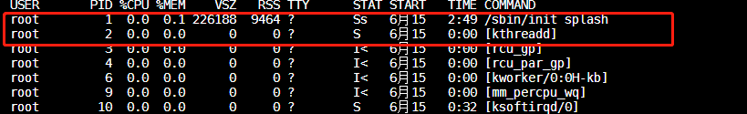

init_task
==========

linux下有三个特殊的进程,idle进程(PID=0) init进程(PID=1)和 kthreadd(PID=2)

- idle进程是系统自动创建,运行在内核态

idle进程其pid=0,其前身是系统创建的第一个进程,也是唯一一个没有通过fork或者kernel_thread产生的进程。完成加载系统后,演变为进程调度、交换

- init进程由idle通过kernel_thread创建,在内核空间完成初始化后，加载init程序,并最终在用户空间运行

由0进程创建,完成系统的初始化,时系统中所有其他用户进程的祖先进程.linux中所有进程都是Init进程创建并运行的,首先linux内核启动,然后在用户空间启动Init进程,再启动其他系统进程.
在系统启动完成后,init将变为守护进程监视系统其他进程

- kthreadd 进程由idle通过kernel_thread创建,并始终运行在内核空间,负责所有内核线程的调度和管理

它的任务就是管理和调度其他内核线程,会循环执行一个kthread的函数,该函数的作用就是运行kthread_create_list全局链表维护的kthread,当我们调用kernel_thread创建的内核线程
就会被加入到此链表中.因此所有的内核线程都直接或者间接的以kthreadd为父进程

idle的创建
----------

在smp系统中,每个处理器单元有独立的运行队列,而每个运行队列上又有一个idle进程,即有多少个处理器单元就有多少个idle进程

系统的空闲时间,其实就是指idle进程的运行时间

0号进程上下文信息-init_task描述符
^^^^^^^^^^^^^^^^^^^^^^^^^^^^^^^^^

``init_task`` 是内核中所有进程、线程的task_struct雏形，在内核的初始化过程中,通过静态定义构造处理一个task_struct接口,取名为init_task，然后在初始化的后期,通过 ``rest_init()`` 函数创建了
内核init线程,kthreadd内核线程

1) 内核init线程,最终执行/sbin/init进程,变为所有用户态程序的根进程(pstree命令显示),即用户空间的init进程.开始的init是由kernel_thread创建的内核线程.在完成初始化工作后,转向用户空间,并且生成所有用户进程的祖先

2) 内核kthreadd线程,变为所有内核态其他守护线程的父线程

所以init_task决定了系统所有进程、线程的基因,它完成初始化后,最终演变为0号进程idle，并且运行在内核态

idle进程的优先级为MAX_PRIO-20,早期的版本中idle是参与调度的,但是目前的版本中idle并不在运行队列中参与调度,而是在运行队列结构中含idle指针,指向idle进程,在调度器发现运行队列为空的时候运行.

内核中的init_task变量就是进程0使用的进程描述符,也是linux系统中第一个进程描述符.

init_task 在init/init_task.c中定义

::

    /*
     * Set up the first task table, touch at your own risk!. Base=0,
     * limit=0x1fffff (=2MB)
     */
    struct task_struct init_task = {
	.thread_info	= INIT_THREAD_INFO(init_task),
	.stack_refcount	= REFCOUNT_INIT(1),
	.state		= 0,
	.stack		= init_stack,
	.usage		= REFCOUNT_INIT(2),
	.flags		= PF_KTHREAD,
	.prio		= MAX_PRIO - 20,
	.static_prio	= MAX_PRIO - 20,
	.normal_prio	= MAX_PRIO - 20,
	.policy		= SCHED_NORMAL,
	.cpus_ptr	= &init_task.cpus_mask,
	.cpus_mask	= CPU_MASK_ALL,
	.nr_cpus_allowed= NR_CPUS,
	.mm		= NULL,
	.active_mm	= &init_mm,
	.restart_block	= {
		.fn = do_no_restart_syscall,
	},
	.se		= {
		.group_node 	= LIST_HEAD_INIT(init_task.se.group_node),
	},
	.rt		= {
		.run_list	= LIST_HEAD_INIT(init_task.rt.run_list),
		.time_slice	= RR_TIMESLICE,
	},
	.tasks		= LIST_HEAD_INIT(init_task.tasks),
        ...
    }
    EXPORT_SYMBOL(init_task);

进程堆栈init_thread_union
^^^^^^^^^^^^^^^^^^^^^^^^^^

init_task进程使用 init_stack作为进程堆栈

::

    .stack = init_stack,

进程内存空间
^^^^^^^^^^^^

init_task的虚拟地址空间,也采用同样的方法定义

由于init_task是一个运行在内核空间的内核线程,因此其虚拟地址段mm为NULL,但是必要时它还是需要使用虚拟地址的,因此active_mm被设置为 ``init_mm``

::
    .mm = NULL,
    .active_mm = &init_mm,

其中init_mm被定义在init-mmc.c中

::

    struct mm_struct init_mm = {
        .mm_rb		= RB_ROOT,
        .pgd		= swapper_pg_dir,
        .mm_users	= ATOMIC_INIT(2),
        .mm_count	= ATOMIC_INIT(1),
        .mmap_sem	= __RWSEM_INITIALIZER(init_mm.mmap_sem),
        .page_table_lock =  __SPIN_LOCK_UNLOCKED(init_mm.page_table_lock),
        .arg_lock	=  __SPIN_LOCK_UNLOCKED(init_mm.arg_lock),
        .mmlist		= LIST_HEAD_INIT(init_mm.mmlist),
        .user_ns	= &init_user_ns,
        .cpu_bitmap	= CPU_BITS_NONE,
        INIT_MM_CONTEXT(init_mm)
    };

0号进程的演化
--------------

rest_init创建init和kthread进程
^^^^^^^^^^^^^^^^^^^^^^^^^^^^^^

linux在无进程概念的情况下将一直从初始化部分的代码执行到 ``start_kernel`` ，然后再到其最后一个函数调用rest_init

大致是在vmlinux的入口startup_32(head.S)中为pid号为0的原始进程设置了执行环境,然后start_kernel完成内核的初始化工作,包括初始化页表,初始化中断向量表，初始化系统时间等

从 ``rest_init`` 开始,linux开始产生进程,因为Init_task是静态制造出来的,pid=0，它试图将从最早的汇编代码一直到start_kernel的执行都纳入到init_task的进程上下文中.
在这个函数中创建了init进程和kthreadd进程

::

    noinline void __ref rest_init(void)
    {
        struct task_struct *tsk;
        int pid;

        rcu_scheduler_starting();
        /*
         * We need to spawn init first so that it obtains pid 1, however
         * the init task will end up wanting to create kthreads, which, if
         * we schedule it before we create kthreadd, will OOPS.
         */
        pid = kernel_thread(kernel_init, NULL, CLONE_FS);
        /*
         * Pin init on the boot CPU. Task migration is not properly working
         * until sched_init_smp() has been run. It will set the allowed
         * CPUs for init to the non isolated CPUs.
         */
        rcu_read_lock();
        tsk = find_task_by_pid_ns(pid, &init_pid_ns);
        set_cpus_allowed_ptr(tsk, cpumask_of(smp_processor_id()));
        rcu_read_unlock();

        numa_default_policy();
        pid = kernel_thread(kthreadd, NULL, CLONE_FS | CLONE_FILES);
        rcu_read_lock();
        kthreadd_task = find_task_by_pid_ns(pid, &init_pid_ns);
        rcu_read_unlock();

        /*
         * Enable might_sleep() and smp_processor_id() checks.
         * They cannot be enabled earlier because with CONFIG_PREEMPTION=y
         * kernel_thread() would trigger might_sleep() splats. With
         * CONFIG_PREEMPT_VOLUNTARY=y the init task might have scheduled
         * already, but it's stuck on the kthreadd_done completion.
         */
        system_state = SYSTEM_SCHEDULING;

        complete(&kthreadd_done);

        /*
         * The boot idle thread must execute schedule()
         * at least once to get things moving:
         */
        schedule_preempt_disabled();
        /* Call into cpu_idle with preempt disabled */
        cpu_startup_entry(CPUHP_ONLINE);
    }
        
1) pid = kernel_thread(kernel_init, NULL, CLONE_FS);创建了1号内核线程,该线程最后转向用户空间,演变为init进程

2) pid = kernel_thread(kthreadd, NULL, CLONE_FS | CLONE_FILES);创建了kthreadd内核线程

3) 调用schedule函数切换当前进程,调用该函数后kernel_init将会运行

::

    void __sched schedule_preempt_disabled(void)
    {
        sched_preempt_enable_no_resched();
        schedule();
        preempt_disable();
    }

kernel_init会继续完成剩下的初始化工作,然后execve(/sbin/init)，称为系统中其他进程的祖先

cpu_startup_entry函数调用cpu_idle_loop(),0号线程进入idle函数的循环,在该循环中周期性的检查

::

    void cpu_startup_entry(enum cpuhp_state state)
    {
        arch_cpu_idle_prepare();
        cpuhp_online_idle(state);
        while (1)
            do_idle();
    }

idle的运行与调度
^^^^^^^^^^^^^^^^

idle在系统没有其他就绪进程可执行的时候才会被调度,即执行 ``do_idle`` 函数

::

    /*
     * Generic idle loop implementation
     *
     * Called with polling cleared.
     */
    static void do_idle(void)
    {
        int cpu = smp_processor_id();
        /*
         * If the arch has a polling bit, we maintain an invariant:
         *
         * Our polling bit is clear if we're not scheduled (i.e. if rq->curr !=
         * rq->idle). This means that, if rq->idle has the polling bit set,
         * then setting need_resched is guaranteed to cause the CPU to
         * reschedule.
         */

        __current_set_polling();
        tick_nohz_idle_enter();

        while (!need_resched()) {
            rmb();

            local_irq_disable();

            if (cpu_is_offline(cpu)) {
                tick_nohz_idle_stop_tick();
                cpuhp_report_idle_dead();
                arch_cpu_idle_dead();
            }

            arch_cpu_idle_enter();

            /*
             * In poll mode we reenable interrupts and spin. Also if we
             * detected in the wakeup from idle path that the tick
             * broadcast device expired for us, we don't want to go deep
             * idle as we know that the IPI is going to arrive right away.
             */
            if (cpu_idle_force_poll || tick_check_broadcast_expired()) {
                tick_nohz_idle_restart_tick();
                cpu_idle_poll();
            } else {
                cpuidle_idle_call();
            }
            arch_cpu_idle_exit();
        }

        /*
         * Since we fell out of the loop above, we know TIF_NEED_RESCHED must
         * be set, propagate it into PREEMPT_NEED_RESCHED.
         *
         * This is required because for polling idle loops we will not have had
         * an IPI to fold the state for us.
         */
        preempt_set_need_resched();
        tick_nohz_idle_exit();
        __current_clr_polling();

        /*
         * We promise to call sched_ttwu_pending() and reschedule if
         * need_resched() is set while polling is set. That means that clearing
         * polling needs to be visible before doing these things.
         */
        smp_mb__after_atomic();

        sched_ttwu_pending();
        schedule_idle();

        if (unlikely(klp_patch_pending(current)))
            klp_update_patch_state(current);
    }

默认的idle实现是hlt指令,hlt指令使cpu处于暂停状态,等待硬件中断发生的时候恢复,从而达到节能的目的.

+-------------------------------+---------------------------------------------------------------------------------------------------------+
|       rest_init 流程          |                                         说明                                                            |
+===============================+=========================================================================================================+
|                               |                                                                                                         |
|                               |                                                                                                         |
|    rcu_scheduler_starting     |                                                                                                         |
|                               |                                                                                                         |
+-------------------------------+---------------------------------------------------------------------------------------------------------+
|                               |                                                                                                         |
|                               |                                                                                                         |
|                               |                                                                                                         |
|                               |                                                                                                         |
+-------------------------------+---------------------------------------------------------------------------------------------------------+
|                               |                                                                                                         |
|                               |                                                                                                         |
|                               |                                                                                                         |
|                               |                                                                                                         |
+-------------------------------+---------------------------------------------------------------------------------------------------------+
|                               |                                                                                                         |
|                               |                                                                                                         |
|                               |                                                                                                         |
|                               |                                                                                                         |
+-------------------------------+---------------------------------------------------------------------------------------------------------+
|                               |                                                                                                         |
|                               |                                                                                                         |
|                               |                                                                                                         |
|                               |                                                                                                         |
+-------------------------------+---------------------------------------------------------------------------------------------------------+
|                               |                                                                                                         |
|                               |                                                                                                         |
|                               |                                                                                                         |
|                               |                                                                                                         |
+-------------------------------+---------------------------------------------------------------------------------------------------------+
|                               |                                                                                                         |
|                               |                                                                                                         |
|                               |                                                                                                         |
|                               |                                                                                                         |
+-------------------------------+---------------------------------------------------------------------------------------------------------+
