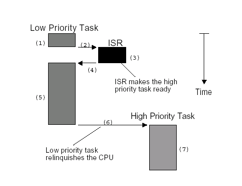
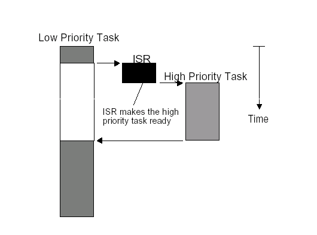

用户抢占和内核抢占
===================

非抢占式内核与抢占式内核
-------------------------

非抢占式内核
^^^^^^^^^^^^^

非抢占式内核由任务主动放弃CPU使用权

非抢占式调度法也称为合作型多任务,各个任务彼此合作共享一个CPU,异步事件还是由中断服务来处理,中断服务可以使一个高优先级的任务由挂起状态变为就绪状态.
但中断服务以后控制权还是回到原来被中断的那个任务,直到该任务主动放弃CPU使用权,那个高优先级的任务才能获得CPU的使用权，非抢占式内核如下图所示

非抢占式内核的优点

1) 中断响应快(与抢占式内核比较)

2) 允许使用不可重入函数

3) 几乎不需要使用信号量来保护共享数据,运行的任务占有CPU，不必担心被别的任务抢占

非抢占式内核的缺点:

1) 任务响应时间慢,高优先级的任务已经进入就绪态,但还不能运行,要等到当前运行着的任务释放CPU

2) 非抢占式内核的任务响应时间式不确定的

抢占式内核
^^^^^^^^^^^

使用抢占式内核可以保证系统响应时间，最高优先级的任务一旦就绪，总能得到CPU的使用权，当一个运行着的任务使一个比它优先级高的任务进入就绪态，当前任务的CPU使用权
就会被剥夺，或者说被挂起了

抢占式内核如下图所示

抢占式内核优点：

1) 使用抢占式内核，最高优先级的任务什么时候可以运行，可以得到CPU使用权是可知的.使用抢占式内核使得任务级响应时间得以最优化

2) 不能直接使用不可重入型函数，调用不可重入函数时,要满足互斥条件,这点可以使用互斥型信号量来实现.如果调用不可重入型函数时,低优先级的任务CPU的使用权被高优先级任务剥夺，不可重入型函数中的数据有可能被破坏

linux用户抢占
--------------

一般来说,用户抢占发生在以下几种情况下

1) 从系统调用返回到用户空间

2) 从中断(异常)处理程序返回用户空间

从这里我们看出，用户抢占是发生在用户空间的抢占现象

更详细的触发条件如下

1) 时钟中断处理例程检查当前任务的时间片，当任务的时间片消耗完时,scheduler_tick()函数会设置need_resched标志

2) 信号量，等待队列，completion等机制唤醒时都是基于waitqueue的,而waitqueue的唤醒函数为default_wake_function,其调用try_to_wake_up将被唤醒的任务更改为就绪转台并设置为need_resched标志

3) 设置用户进程的nice值时，可能会使高优先级的任务进入就绪状态

4) 改变任务的优先级时,可能会使高优先级的任务进入就绪状态

5) 新建一个任务时，可能会使高优先级的任务进入就绪状态

6) 对CPU(SMP)进行负载均衡时,当前任务可能需要放到另外一个CPU上运行

linux内核抢占
--------------

如果内核处于相对耗时的操作中，比如文件系统或者内存管理的相关任务,这就造成了系统的延迟增加，让用户感觉卡顿的现象.在编译内核的时候如果启动了对内核抢占的支持，则可以解决这些问题，如果
高优先级的任务需要完成，则不仅用户空间的程序可以被中断内核也可以被中断。

内核抢占和用户层进程被其他进程抢占是两个不同的概念,内核抢占是从实时系统中引入的，在非实时系统中的确也能提高系统的响应速度,但也不是在所有情况下都是最优的,因为抢占也需要调度和同步的开销。
在某些时候甚至关闭内核抢占，比如主调度器在完成调度的时候.内核也不是在任意点都可以被中断的

要满足什么条件，kernel才可以抢占一个任务的内核态呢

1) 没有锁，锁是用于保护临界区,不能被抢占

2) kernel code可重入,因为kernel是SMP-safe的，所以满足可重入性

内核抢占发生的时机，一般发生在

1) 当一个中断例程退出，在返回内核态时,这时隐式的调用schedule(函数,当前任务没有主动放弃CPU使用权,而是被剥夺了了CPU使用权

2) 内核中的任务显示的调用schedule()任务主动放弃CPU使用权

内核抢占并不是在任何一个地方都可以发生

1) 内核正在进行中断处理,在linux内核中进程不能抢占中断(中断只能被其他中断中止，抢占).在中断例程中不允许进行进程调度,进程调度函数schedule()会对此做出判断，如果在中断中调用会打印出错信息

2) 内核正在进行中断上下文的Bottom half(中断下半部)处理 

3) 内核代码正持有spinlock自旋锁 rwlock读写锁

4) 内核正在执行调度程序scheduler

5) 内核正在对每个CPU私有数据结构操作

内核抢占的实现
---------------

系统中每个进程都有一个特定于体系结构的struct thread_info结构,用户层程序被调度的时候会检查struct thread_info中need_resched标识是否需要被重新调度

内核抢占抢占也可以用同样的方法实现linux内核在thread_info结构中加入了一个自旋锁标识preempt_count称为抢占计数器(preemption counter)

::

    /*
     * low level task data that entry.S needs immediate access to.
     */
    struct thread_info {
        unsigned long		flags;		/* low level flags */
        mm_segment_t		addr_limit;	/* address limit */
    #ifdef CONFIG_ARM64_SW_TTBR0_PAN
        u64			ttbr0;		/* saved TTBR0_EL1 */
    #endif
        union {
            u64		preempt_count;	/* 0 => preemptible, <0 => bug */
            struct {
    #ifdef CONFIG_CPU_BIG_ENDIAN
                u32	need_resched;
                u32	count;
    #else
                u32	count;
                u32	need_resched;
    #endif
            } preempt;
        };
    };

内核提供了一些函数或者宏去开启关闭以及检测preempt_count的值

::

    #define PREEMPT_ENABLED	(0)

    static __always_inline int preempt_count(void)
    {
        return READ_ONCE(current_thread_info()->preempt_count);
    }

    static __always_inline volatile int *preempt_count_ptr(void)
    {
        return &current_thread_info()->preempt_count;
    }

    static __always_inline void preempt_count_set(int pc)
    {
        *preempt_count_ptr() = pc;
    }

    /*
     * must be macros to avoid header recursion hell
     */
    #define init_task_preempt_count(p) do { \
        task_thread_info(p)->preempt_count = FORK_PREEMPT_COUNT; \
    } while (0)

    #define init_idle_preempt_count(p, cpu) do { \
        task_thread_info(p)->preempt_count = PREEMPT_ENABLED; \
    } while (0)

还有其他函数用于开启和关闭内核抢占

::

    #define preempt_enable() \
    do { \
        barrier(); \
        if (unlikely(preempt_count_dec_and_test())) \
            __preempt_schedule(); \
    } while (0)

    #define preempt_enable_notrace() \
    do { \
        barrier(); \
        if (unlikely(__preempt_count_dec_and_test())) \
            __preempt_schedule_notrace(); \
    } while (0)

    #define preempt_check_resched() \
    do { \
        if (should_resched(0)) \
            __preempt_schedule(); \
    } while (0)

    #define preempt_disable() \
    do { \
        preempt_count_inc(); \
        barrier(); \
    } while (0)

    #define sched_preempt_enable_no_resched() \
    do { \
        barrier(); \
        preempt_count_dec(); \
    } while (0)

    #define preempt_enable_no_resched() sched_preempt_enable_no_resched()

    #define preemptible()	(preempt_count() == 0 && !irqs_disabled())

- 重新启用内核抢占时使用preempt_schedule检查抢占

在内核停用抢占后重新启用时,检测是否有进程打算抢占当前执行的内核代码

抢占机制中主要的函数是preempt_schedule，设置了TIF_NEED_RESCHED标志并不能保证可以抢占内核,内核可能处于临界区

::

    asmlinkage __visible void __sched notrace preempt_schedule(void)
    {
        /*
         * If there is a non-zero preempt_count or interrupts are disabled,
         * we do not want to preempt the current task. Just return..
         */
        //#define preemptible()	(preempt_count() == 0 && !irqs_disabled())
        //如果抢占计数器大于0，那么抢占被停用，函数返回
        //如果内核停用了硬件中断,以保证一次性完成相关操作,那么此时抢占也是不可以的
        if (likely(!preemptible()))
            return;

        preempt_schedule_common();
    }

    static void __sched notrace preempt_schedule_common(void)
    {
        do {
            preempt_disable_notrace();  //抢占计数器加1
            preempt_latency_start(1);
            __schedule(true);   //完成一次调度,参数preempt=true表明调度不是以普通的方法引发的
            preempt_latency_stop(1);
            preempt_enable_no_resched_notrace();    //抢占计数器减一

            /*
             * Check again in case we missed a preemption opportunity
             * between schedule and now.
             */
        } while (need_resched());   
    }

- 中断之后返回内核态时通过preempt_schedule_irq触发

上面preempt_schedule只是触发内核抢占的一种办法,另一种激活抢占的是在处理了一个硬件中断请求之后,如果处理器在处理中断请求后返回内核态(返回用户态则没有影响),特定体系结构的
汇编例程会检查抢占计数器是否为0,即是否允许抢占,以及是否设置了重新调度标识

preempt_schedule_irq与preempt_schedule的本质区别在于preempt_schedule_irq调用时停用了中断，防止中断造成的递归调用

::

    asmlinkage __visible void __sched preempt_schedule_irq(void)
    {
        enum ctx_state prev_state;

        /* Catch callers which need to be fixed */
        BUG_ON(preempt_count() || !irqs_disabled());

        prev_state = exception_enter();

        do {
            preempt_disable();
            local_irq_enable();
            __schedule(true);
            local_irq_disable();
            sched_preempt_enable_no_resched();
        } while (need_resched());

        exception_exit(prev_state);
    }
