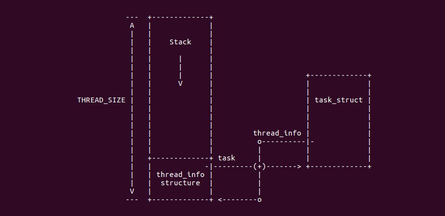
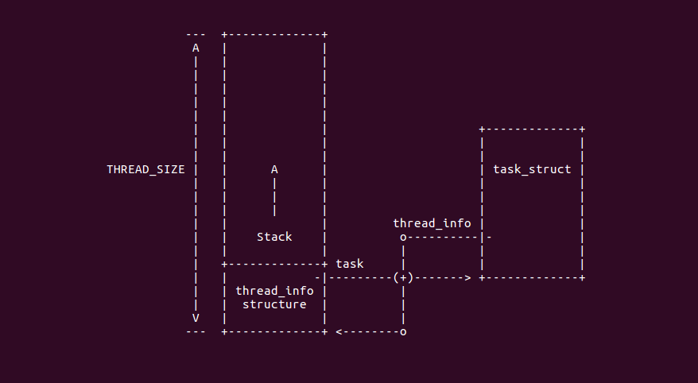

thread_info与内核栈stack的关系
=================================

thread_info简介
------------------

thread_info结构被称为迷你进程描述符，是因为在这个结构中并没有直接包含与进程相关的字段，而是通过task字段指向某个具体的
进程描述符．通常这块内存区域的大小是8k,也就是两个页的大小．一个进程的内核栈和thred_info结构之间的关系图如下

.. image::
    res/thread_info.png

从上图可知，内核是从该内存区域的顶层向下(从高地址向低地址)增长的，而thread_info结构则是从该区域向上增长．内核栈的栈顶地址
存储在esp寄存器中．所以当进程从用户态切换到内核态后，esp寄存器指向这个区域的末端

由于一个页大小是4k,一个页的起始地址都是4K的整数倍，即后12位都为０，取得esp内核栈栈顶的地址，将其后12位取0，就可以得到内存区域的
起始地址，该地址即是thread_info的地址．通过thread_info又可以得到task_struct的地址而得到进程pid

thread_union实现
---------------------

thread_info与内核堆栈在内核中的定义位于:include/linux/sched.h文件中

::

    union thread_union {
    #ifndef CONFIG_ARCH_TASK_STRUCT_ON_STACK
        struct task_struct task;
    #endif
    #ifndef CONFIG_THREAD_INFO_IN_TASK
        struct thread_info thread_info;
    #endif
        unsigned long stack[THREAD_SIZE/sizeof(long)];
    };

thread_info接口
------------------

内核将thread_info与内核堆栈放在固定的空间里，内核只要知道堆栈的位置，那么内核堆栈对应的thread_info结构的地址就可以获得

::

    static inline struct thread_info *current_thread_info(void)
    {
        return (struct thread_info*)(current_stack_pointer & ~(THREAD_SIZE - 1));
    }

    register unsigned long current_stack_pointer asm("sp");

0号进程的thread_info
----------------------

在linux中，0号进程就是内核启动之后的第一个进程，其通过init_task变量定义，其定义在init/init_task.c文件中,起中stack成员指向init_stack结构

::

    struct task_struct init_task
    #ifdef CONFIG_ARCH_TASK_STRUCT_ON_STACK
        __init_task_data
    #endif
    = {
    #ifdef CONFIG_THREAD_INFO_IN_TASK

        .thread_info = INIT_THREAD_INFO(init_task),
        .stack_refcount = ATOMIC_INIT(1),
    #endif
        .state = 0,
        .stack = init_stack,        //0号进程的stack指向了init_stack
        .usage = ATOMIC_INIT(2),
        ...
        ...
    };

``init_stack`` 其定义在include/asm-generic/vmlinux.lds.h中

::

    #define INIT_TASK_DATA(align)               \
        . = ALIGN(align);                       \
        __start_init_task = .;                  \
        init_thread_union = .;                  \
        init_stack = .;                         \
        KEEP(*(.data..init_task))               \
        KEEP(*(.data..init_thread_info))        \
        . = __start_init_task + THREAD_SIZE;    \
        __end_init_task = .;

0号进程的stack定义位于链接脚本里，其中关于init_stack的定义通过INIT_TASK_DATA宏进行定义，链接脚本中定义了链接符号
__start_init_task指向了堆栈开始的地址，并且init_thread_union与init_stack的地址都指向了这里．并且将__end_init_task指向
了堆栈的顶部

堆栈的生长方式与thread_info的关系
------------------------------------

堆栈的生长方式分为向上增长和向下增长，通常堆栈是向下增长的，此时内核使用thread_union结构将thread_info和内核堆栈绑定到一起，
并且thread_info位于区域的底部，而堆栈的站定位于区域的顶部

如果堆栈的生长方向是向上的，那么thread_union的结构如下

