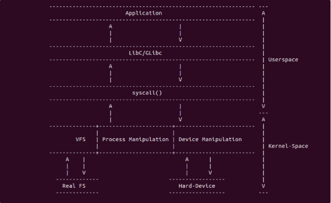

linux系统调用
===============

系统调用原理
--------------

系统调用是linux内核为用户态程序提供的主要功能接口，通过系统调用，用户态进程能够临时切换到内核态,使用内核态才能访问的硬件和资源完成特定功能。
系统调用由linux内核和内核模块实现,内核在处理系统时还会检查系统调用请求和参数是否正确,以保证对特权资源和硬件访问的正确性。通过这种方式,linux
在提供内核和硬件资源访问接口的同时，保证了内核和硬件资源的正确性和安全性

不同架构的系统调用实现细节存在差异,但总体上可以归结为以下三个内容:

- 在用户空间触发系统调，通用的库函数libc或glibc面向用户层，通过本身的逻辑处理找到对应的系统调用接口，并通过软中断的方式进入内核系统调用，不同架构下
  系统调用软中断的方式不同,x86通过0x80软中断进入内核系统调用处理，arm通过swi指令

- 不同架构下系统调用中断处理不同,但功能是一致的，那就是通过传递下来的系统调用号，找到系统调用入口信息，并将系统调用传递的参数传递给内核里系统调用实现

- 内核部分系统调用的实现

系统调用可以分为六大类

1)  进程控制(process control)

2)  文件管理(file manipulation)

3)  设备管理(device manipulation)

4)  信息维护(information maintenance)

5)  通信(conmunication)

6)  保护(protection)

系统调用用户空间的实现
-----------------------

用户空间触发系统调用的方法很多，包括直接调用汇编命令进行触发，也可以通过"syscall"函数进行触发等，这里重点介绍"syscall"函数.用户空间可以通过
调用 ``syscall()`` 函数来触发指定的系统调用，其函数定义如下

::

    #include <sys/syscall.h>
    int syscall(int number, ...);

syscall()执行一个系统调用，根据number参数和所有的汇编语言接口来调用哪个系统调用。示例如下

::

    int main(void)
    {
        int nice = 0;

        /*
        *   __NR_nice是sys_nice的系统调用号,nice是传递给系统调用的一个参数
        *   该函数会直接调用内核的sys_nice()函数实现修改当前进程的nice值
        */
        syscall(__NR_nice, nice);
    }

syscall()函数可以间接的调用系统调用，移除了库函数对调用过程的影响。下面是syscall()在不同架构中的实现

arm架构
--------

arm架构将系统调用入口信息放置在 ``arch/arm/tools/syscall.tbl``

::

    #
    # Linux system call numbers and entry vectors
    #
    # The format is:
    # <num>	<abi>	<name>			[<entry point>			[<oabi compat entry point>]]
    #
    # Where abi is:
    #  common - for system calls shared between oabi and eabi (may have compat)
    #  oabi   - for oabi-only system calls (may have compat)
    #  eabi   - for eabi-only system calls
    #
    # For each syscall number, "common" is mutually exclusive with oabi and eabi
    #
    0	common	restart_syscall		sys_restart_syscall
    1	common	exit			sys_exit
    2	common	fork			sys_fork
    3	common	read			sys_read
    4	common	write			sys_write
    5	common	open			sys_open
    6	common	close			sys_close
    # 7 was sys_waitpid
    8	common	creat			sys_creat
    9	common	link			sys_link
    10	common	unlink			sys_unlink
    11	common	execve			sys_execve
    12	common	chdir			sys_chdir
    13	oabi	time			sys_time32
    14	common	mknod			sys_mknod
    15	common	chmod			sys_chmod
    16	common	lchown			sys_lchown16
    # 17 was sys_break
    # 18 was sys_stat
    19	common	lseek			sys_lseek
    20	common	getpid			sys_getpid
    21	common	mount			sys_mount
    22	oabi	umount			sys_oldumount
    23	common	setuid			sys_setuid16
    24	common	getuid			sys_getuid16
    25	oabi	stime			sys_stime32
    26	common	ptrace			sys_ptrace
    27	oabi	alarm			sys_alarm
    # 28 was sys_fstat
    29	common	pause			sys_pause
    30	oabi	utime			sys_utime32
    # 31 was sys_stty
    # 32 was sys_gtty
    33	common	access			sys_access
    34	common	nice			sys_nice
    # 35 was sys_ftime
    36	common	sync			sys_sync
    37	common	kill			sys_kill
    38	common	rename			sys_rename
    39	common	mkdir			sys_mkdir
    40	common	rmdir			sys_rmdir
    41	common	dup			sys_dup
    42	common	pipe			sys_pipe
    43	common	times			sys_times
    # 44 was sys_prof
    45	common	brk			sys_brk
    46	common	setgid			sys_setgid16
    47	common	getgid			sys_getgid16
    # 48 was sys_signal
    49	common	geteuid			sys_geteuid16
    50	common	getegid			sys_getegid16
    51	common	acct			sys_acct
    52	common	umount2			sys_umount

只需要在表中填入系统调用号，abi类型信息，系统调用名字,系统调用函数名字后就可以确定一个唯一的系统调用入口

arm64架构
----------

arm64架构将系统调用入口信息放在 ``include/uapi/asm-generic/unistd.h``

::

    #define __NR_io_setup 0
    __SC_COMP(__NR_io_setup, sys_io_setup, compat_sys_io_setup)
    #define __NR_io_destroy 1
    __SYSCALL(__NR_io_destroy, sys_io_destroy)
    #define __NR_io_submit 2
    __SC_COMP(__NR_io_submit, sys_io_submit, compat_sys_io_submit)
    #define __NR_io_cancel 3
    __SYSCALL(__NR_io_cancel, sys_io_cancel)
    #if defined(__ARCH_WANT_TIME32_SYSCALLS) || __BITS_PER_LONG != 32
    #define __NR_io_getevents 4
    __SC_3264(__NR_io_getevents, sys_io_getevents_time32, sys_io_getevents)
    #endif

    /* fs/xattr.c */
    #define __NR_setxattr 5
    __SYSCALL(__NR_setxattr, sys_setxattr)
    #define __NR_lsetxattr 6
    __SYSCALL(__NR_lsetxattr, sys_lsetxattr)
    #define __NR_fsetxattr 7
    __SYSCALL(__NR_fsetxattr, sys_fsetxattr)
    #define __NR_getxattr 8
    __SYSCALL(__NR_getxattr, sys_getxattr)
    #define __NR_lgetxattr 9
    __SYSCALL(__NR_lgetxattr, sys_lgetxattr)
    #define __NR_fgetxattr 10
    __SYSCALL(__NR_fgetxattr, sys_fgetxattr)
    #define __NR_listxattr 11
    __SYSCALL(__NR_listxattr, sys_listxattr)
    #define __NR_llistxattr 12
    __SYSCALL(__NR_llistxattr, sys_llistxattr)
    #define __NR_flistxattr 13
    __SYSCALL(__NR_flistxattr, sys_flistxattr)
    #define __NR_removexattr 14
    __SYSCALL(__NR_removexattr, sys_removexattr)
    #define __NR_lremovexattr 15
    __SYSCALL(__NR_lremovexattr, sys_lremovexattr)
    #define __NR_fremovexattr 16
    __SYSCALL(__NR_fremovexattr, sys_fremovexattr)

只需要在该表中定义一个系统调用号，再通过调__SYSCALL()函数确定系统调用函数信息就可以确定一个唯一的系统调用入口

系统调用内核实现
-----------------

系统调用内核实现就是系统调用再内核的实现过程，在接收到来自用户空间的系统调用参数之后,内核核心实现就根据自己的逻辑进行处理,处理完毕之后，内核可以将结果返回给用户空间，
也可以拷贝相应的数据用户空间，内核部分的核心实现通过以下宏进行定(位于include/linux/syscalls.h)

::

    #ifndef SYSCALL_DEFINE0
    #define SYSCALL_DEFINE0(sname)					\
        SYSCALL_METADATA(_##sname, 0);				\
        asmlinkage long sys_##sname(void);			\
        ALLOW_ERROR_INJECTION(sys_##sname, ERRNO);		\
        asmlinkage long sys_##sname(void)
    #endif /* SYSCALL_DEFINE0 */

    #define SYSCALL_DEFINE1(name, ...) SYSCALL_DEFINEx(1, _##name, __VA_ARGS__)
    #define SYSCALL_DEFINE2(name, ...) SYSCALL_DEFINEx(2, _##name, __VA_ARGS__)
    #define SYSCALL_DEFINE3(name, ...) SYSCALL_DEFINEx(3, _##name, __VA_ARGS__)
    #define SYSCALL_DEFINE4(name, ...) SYSCALL_DEFINEx(4, _##name, __VA_ARGS__)
    #define SYSCALL_DEFINE5(name, ...) SYSCALL_DEFINEx(5, _##name, __VA_ARGS__)
    #define SYSCALL_DEFINE6(name, ...) SYSCALL_DEFINEx(6, _##name, __VA_ARGS__)

    #define SYSCALL_DEFINEx(x, sname, ...)				\
        SYSCALL_METADATA(sname, x, __VA_ARGS__)			\
        __SYSCALL_DEFINEx(x, sname, __VA_ARGS__)

通过上面的宏，内核会创建一个名为sys_syscall_name()的函数,并定义了参数的类型,例如sys_nice()的定义如下

::

    SYSCALL_DEFINE1(nice, int, increment)
    {
        long nice, retval;

        /*
         * Setpriority might change our priority at the same moment.
         * We don't have to worry. Conceptually one call occurs first
         * and we have a single winner.
         */
        increment = clamp(increment, -NICE_WIDTH, NICE_WIDTH);
        nice = task_nice(current) + increment;

        nice = clamp_val(nice, MIN_NICE, MAX_NICE);
        if (increment < 0 && !can_nice(current, nice))
            return -EPERM;

        retval = security_task_setnice(current, nice);
        if (retval)
            return retval;

        set_user_nice(current, nice);
        return 0;
    }

linux系统调用的列表
--------------------

- 进程控制

+--------------------+------------------------------------------------------------------------------------------------------+
|   系统调用         |                           描述                                                                       |
+====================+======================================================================================================+
| fork               |   创建一个新进程                                                                                     |
+--------------------+------------------------------------------------------------------------------------------------------+
| clone              |   按指定条件创建子进程                                                                               |
+--------------------+------------------------------------------------------------------------------------------------------+
| execve             |   运行可执行文件                                                                                     |
+--------------------+------------------------------------------------------------------------------------------------------+
| exit               |   中止进程                                                                                           |
+--------------------+------------------------------------------------------------------------------------------------------+
| _exit              |   立即中止当前进程                                                                                   |
+--------------------+------------------------------------------------------------------------------------------------------+
| getdtablesize      |   进程所能打开的最大文件数                                                                           |
+--------------------+------------------------------------------------------------------------------------------------------+
| getpgid            |   获取在指定进程组标识号                                                                             |
+--------------------+------------------------------------------------------------------------------------------------------+
| setpgid            |   设置指定进程组标识号                                                                               |
+--------------------+------------------------------------------------------------------------------------------------------+
| getpgrp            |   获取当前进程组标识号                                                                               |
+--------------------+------------------------------------------------------------------------------------------------------+
| setgprp            |   设置当前进程组标识号                                                                               |
+--------------------+------------------------------------------------------------------------------------------------------+
| getpid             |   获取进程标识号                                                                                     |
+--------------------+------------------------------------------------------------------------------------------------------+
| getppid            |   获取父进程标识号                                                                                   |
+--------------------+------------------------------------------------------------------------------------------------------+
| getpriority        |   获取调度优先级                                                                                     |
+--------------------+------------------------------------------------------------------------------------------------------+
| setpriority        |   设置调度优先级                                                                                     |
+--------------------+------------------------------------------------------------------------------------------------------+
| modify_ldt         |   读写进程的本地描述表                                                                               |
+--------------------+------------------------------------------------------------------------------------------------------+
| nanosleep          |   使进程睡眠指定的时间                                                                               |
+--------------------+------------------------------------------------------------------------------------------------------+
| nice               |   改变分时进程的优先级                                                                               |
+--------------------+------------------------------------------------------------------------------------------------------+
| pause              |   挂起进程，等待信号                                                                                 |
+--------------------+------------------------------------------------------------------------------------------------------+
| personality        |   设置进程运行域                                                                                     |
+--------------------+------------------------------------------------------------------------------------------------------+
| prctl              |   对进程进行特定操作                                                                                 |
+--------------------+------------------------------------------------------------------------------------------------------+
| ptrace             |   进程跟踪                                                                                           |
+--------------------+------------------------------------------------------------------------------------------------------+
| sched_getparam     |   获取进程的调度参数                                                                                 |
+--------------------+------------------------------------------------------------------------------------------------------+
| sched_getscheduler |   获取指定进程的调度策略                                                                             |
+--------------------+------------------------------------------------------------------------------------------------------+
| sched_setscheduler |   设置指定进程的调度策略和参数                                                                       |
+--------------------+------------------------------------------------------------------------------------------------------+
| sched_yield        |   进程主动让出处理器，并将放在调度队列队尾                                                           |
+--------------------+------------------------------------------------------------------------------------------------------+
| vfork              |   创建一个子进程,以供执行新程序，常与execve同时使用                                                  |
+--------------------+------------------------------------------------------------------------------------------------------+
| wait               |   等待子进程终止                                                                                     |
+--------------------+------------------------------------------------------------------------------------------------------+
| waitpid            |   等待指定子进程终止                                                                                 |
+--------------------+------------------------------------------------------------------------------------------------------+
| capget             |   获取进程权限                                                                                       |
+--------------------+------------------------------------------------------------------------------------------------------+
| capset             |   设置进程权限                                                                                       |
+--------------------+------------------------------------------------------------------------------------------------------+
| getsid             |   获取会话标识号                                                                                     |
+--------------------+------------------------------------------------------------------------------------------------------+              
| setsid             |   设置会话标识号                                                                                     |
+--------------------+------------------------------------------------------------------------------------------------------+              

- 文件系统控制

+--------------------+------------------------------------------------------------------------------------------------------+
|   系统调用         |                               描述                                                                   |
+====================+======================================================================================================+
| fcntl              |  文件控制                                                                                            |
+--------------------+------------------------------------------------------------------------------------------------------+
| open               |  打开文件                                                                                            |
+--------------------+------------------------------------------------------------------------------------------------------+
| creat              |  创建新文件                                                                                          |
+--------------------+------------------------------------------------------------------------------------------------------+
| close              |  关闭文件描述符                                                                                      |
+--------------------+------------------------------------------------------------------------------------------------------+
| read               |  读文件                                                                                              |
+--------------------+------------------------------------------------------------------------------------------------------+
| write              |  写文件                                                                                              |
+--------------------+------------------------------------------------------------------------------------------------------+
| readv              |  从文件读取数据到缓冲数组中                                                                          |
+--------------------+------------------------------------------------------------------------------------------------------+
| writev             |  将缓冲数组里的数据写入文件                                                                          |
+--------------------+------------------------------------------------------------------------------------------------------+
| pread              |  对文件进行随机读                                                                                    |
+--------------------+------------------------------------------------------------------------------------------------------+
| pwrite             |  对文件进程随机写                                                                                    |
+--------------------+------------------------------------------------------------------------------------------------------+
| lseek              |  移动文件指针                                                                                        |
+--------------------+------------------------------------------------------------------------------------------------------+
| _llseek            |  在64位地址空间里移动文件指针                                                                        |
+--------------------+------------------------------------------------------------------------------------------------------+
| dup                |  复制已打开的文件描述字                                                                              |
+--------------------+------------------------------------------------------------------------------------------------------+
| dup2               |  按指定条件复制文件描述字                                                                            |
+--------------------+------------------------------------------------------------------------------------------------------+
| flock              |  文件加/解锁                                                                                         |
+--------------------+------------------------------------------------------------------------------------------------------+
| poll               |  I/O多路转换                                                                                         |
+--------------------+------------------------------------------------------------------------------------------------------+
| truncat            |  e截断文件                                                                                           |
+--------------------+------------------------------------------------------------------------------------------------------+
| vumask             |  设置文件权限掩码                                                                                    |
+--------------------+------------------------------------------------------------------------------------------------------+
| fsync              |  把文件在内存中的部分写回磁盘                                                                        |
+--------------------+------------------------------------------------------------------------------------------------------+

- 文件系统操作

+--------------------+------------------------------------------------------------------------------------------------------+
|  系统调用          |                         描述                                                                         |
+====================+======================================================================================================+
| acess              |  确定文件的可存取性                                                                                  |
+--------------------+------------------------------------------------------------------------------------------------------+
| chdir              |  改变当前工作目录                                                                                    |
+--------------------+------------------------------------------------------------------------------------------------------+
| chmod              |  改变文件权限                                                                                        |
+--------------------+------------------------------------------------------------------------------------------------------+
| chown              |  改变文件的属主或用户组                                                                              |
+--------------------+------------------------------------------------------------------------------------------------------+
| chroot             |  改变根目录                                                                                          |
+--------------------+------------------------------------------------------------------------------------------------------+
| stat               |  改变文件状态信息                                                                                    |
+--------------------+------------------------------------------------------------------------------------------------------+
| statfs             |  获取文件系统信息                                                                                    |
+--------------------+------------------------------------------------------------------------------------------------------+
| readdir            |  读取目录项                                                                                          |
+--------------------+------------------------------------------------------------------------------------------------------+
| getdents           |  读取目录项                                                                                          |
+--------------------+------------------------------------------------------------------------------------------------------+
| mkdir              |  创建目录                                                                                            |
+--------------------+------------------------------------------------------------------------------------------------------+
| mknod              |  创建索引节点                                                                                        |
+--------------------+------------------------------------------------------------------------------------------------------+
| rmdir              |  删除目录                                                                                            |
+--------------------+------------------------------------------------------------------------------------------------------+
| rename             |  文件改名                                                                                            |
+--------------------+------------------------------------------------------------------------------------------------------+
| link               |  创建软链接                                                                                          |
+--------------------+------------------------------------------------------------------------------------------------------+
| symlink            |  创建符号链接                                                                                        |
+--------------------+------------------------------------------------------------------------------------------------------+
| unlink             |  删除链接                                                                                            |
+--------------------+------------------------------------------------------------------------------------------------------+
| readlink           |  读取符号链接的值                                                                                    |
+--------------------+------------------------------------------------------------------------------------------------------+
| mount              |  挂载文件系统                                                                                        |
+--------------------+------------------------------------------------------------------------------------------------------+
| unmount            |  卸载文件系统                                                                                        |
+--------------------+------------------------------------------------------------------------------------------------------+
| ustat              |  读取文件系统信息                                                                                    |
+--------------------+------------------------------------------------------------------------------------------------------+
| utime              |  改变文件的访问修改时间                                                                              |
+--------------------+------------------------------------------------------------------------------------------------------+
| quotactl           |  控制磁盘配额                                                                                        |
+--------------------+------------------------------------------------------------------------------------------------------+

- 系统控制

+--------------------+------------------------------------------------------------------------------------------------------+
|   系统调用         |                               描述                                                                   |
+====================+======================================================================================================+
| ioctl              | I/O总控制函数                                                                                        |
+--------------------+------------------------------------------------------------------------------------------------------+
| _sysctl            | 读写系统参数                                                                                         |
+--------------------+------------------------------------------------------------------------------------------------------+
| acct               | 启动或禁止进程                                                                                       |
+--------------------+------------------------------------------------------------------------------------------------------+
| getrlimit          | 获取系统资源上限                                                                                     |
+--------------------+------------------------------------------------------------------------------------------------------+
| setrlimit          | 设置系统资源上限                                                                                     |
+--------------------+------------------------------------------------------------------------------------------------------+
| getrusage          | 获取系统资源是应用情况                                                                               |
+--------------------+------------------------------------------------------------------------------------------------------+
| uselib             | 选择要使用的函数库                                                                                   |
+--------------------+------------------------------------------------------------------------------------------------------+
| ioperm             | 设置端口的权限                                                                                       |
+--------------------+------------------------------------------------------------------------------------------------------+
| iopl               | 改变进程I/O权限级别                                                                                  |
+--------------------+------------------------------------------------------------------------------------------------------+
| outb               | 低级端口操作                                                                                         |
+--------------------+------------------------------------------------------------------------------------------------------+
| reboot             | 重新启动                                                                                             |
+--------------------+------------------------------------------------------------------------------------------------------+
| swapon             | 打开交换文件和设置                                                                                   |
+--------------------+------------------------------------------------------------------------------------------------------+
| swapoff            | 关闭交换文件和设备                                                                                   |
+--------------------+------------------------------------------------------------------------------------------------------+
| bdflush            | 控制bdflush守护进程                                                                                  |
+--------------------+------------------------------------------------------------------------------------------------------+
| sysfs              | 获取核心支持的文件系统类型                                                                           |
+--------------------+------------------------------------------------------------------------------------------------------+
| sysinfo            | 获取系统信息                                                                                         |
+--------------------+------------------------------------------------------------------------------------------------------+
| adjtimex           | 调整系统时钟                                                                                         |
+--------------------+------------------------------------------------------------------------------------------------------+
| alarm              | 设置进程的闹钟                                                                                       |
+--------------------+------------------------------------------------------------------------------------------------------+
| getitimer          | 获取计数器值                                                                                         |
+--------------------+------------------------------------------------------------------------------------------------------+
| setitimer          | 设置计数器值                                                                                         |
+--------------------+------------------------------------------------------------------------------------------------------+
| gettimeofday       | 获取时间和时区                                                                                       |
+--------------------+------------------------------------------------------------------------------------------------------+
| settimeofday       | 设置时间和时区                                                                                       |
+--------------------+------------------------------------------------------------------------------------------------------+
| stime              | 设置系统日期和时间                                                                                   |
+--------------------+------------------------------------------------------------------------------------------------------+
| time               | 获取系统时间                                                                                         |
+--------------------+------------------------------------------------------------------------------------------------------+
| times              | 获取进程运行时间                                                                                     |
+--------------------+------------------------------------------------------------------------------------------------------+
| uname              | 获取当前UNIX系统的名称、版本和主机等信息                                                             |
+--------------------+------------------------------------------------------------------------------------------------------+
| vhangup            | 挂起当前终端                                                                                         |
+--------------------+------------------------------------------------------------------------------------------------------+
| nfsservctl         | 对NFS守护进程进行控制                                                                                |
+--------------------+------------------------------------------------------------------------------------------------------+
| create_module      | 创建可装载的模块项                                                                                   |
+--------------------+------------------------------------------------------------------------------------------------------+
| delete_module      | 删除可装载的模块项                                                                                   |
+--------------------+------------------------------------------------------------------------------------------------------+
| init_module        | 初始化模块                                                                                           |
+--------------------+------------------------------------------------------------------------------------------------------+
| query_module       | 查询模块信息                                                                                         |
+--------------------+------------------------------------------------------------------------------------------------------+

- 内存管理

+--------------------+------------------------------------------------------------------------------------------------------+
|   系统调用         |                               描述                                                                   |
+====================+======================================================================================================+
|  brk               | 改变数据段空间的分配                                                                                 |
+--------------------+------------------------------------------------------------------------------------------------------+
|  mlock             | 内存页面加锁                                                                                         |
+--------------------+------------------------------------------------------------------------------------------------------+
|  munlock           | 内存页面解锁                                                                                         |
+--------------------+------------------------------------------------------------------------------------------------------+
|  mlockall          | 调用进程所有内存页面加锁                                                                             |
+--------------------+------------------------------------------------------------------------------------------------------+
|  munlockall        | 调用进程所有内存页面解锁                                                                             |
+--------------------+------------------------------------------------------------------------------------------------------+
|  mmap              | 映射虚拟内存页                                                                                       |
+--------------------+------------------------------------------------------------------------------------------------------+
|  munmap            | 去除内存页映射                                                                                       |
+--------------------+------------------------------------------------------------------------------------------------------+
|  mremap            | 重映射虚拟内存地址                                                                                   |
+--------------------+------------------------------------------------------------------------------------------------------+
|  msync             | 将映射内存中的数据写回磁盘                                                                           |
+--------------------+------------------------------------------------------------------------------------------------------+
|  mprotect          | 设置内存映射保护                                                                                     |
+--------------------+------------------------------------------------------------------------------------------------------+
|  getpagesize       | 获取页面大小                                                                                         |
+--------------------+------------------------------------------------------------------------------------------------------+
|  sync              | 将内存缓冲区数据写回磁盘                                                                             |
+--------------------+------------------------------------------------------------------------------------------------------+
|  cacheflush        | 将指定缓冲区中内存磁盘                                                                               |
+--------------------+------------------------------------------------------------------------------------------------------+

- 网络管理

+--------------------+------------------------------------------------------------------------------------------------------+
|   系统调用         |                               描述                                                                   |
+====================+======================================================================================================+
|  getdomainname     | 取域名                                                                                               |
+--------------------+------------------------------------------------------------------------------------------------------+
|  setdomainname     | 设置域名                                                                                             |
+--------------------+------------------------------------------------------------------------------------------------------+
|  gethostid         | 获取主机识别号                                                                                       |
+--------------------+------------------------------------------------------------------------------------------------------+
|  sethostid         | 设置主机识别号                                                                                       |
+--------------------+------------------------------------------------------------------------------------------------------+
|  gethostname       | 获取主机名称                                                                                         |
+--------------------+------------------------------------------------------------------------------------------------------+
|  sethostname       | 设置主机名称                                                                                         |
+--------------------+------------------------------------------------------------------------------------------------------+

- socket控制

+--------------------+------------------------------------------------------------------------------------------------------+
|   系统调用         |                               描述                                                                   |
+====================+======================================================================================================+
| socketcall         |   socket系统调用                                                                                     |
+--------------------+------------------------------------------------------------------------------------------------------+
| socket             |   建立socket                                                                                         |
+--------------------+------------------------------------------------------------------------------------------------------+
| bind               |   绑定socket到端口                                                                                   |
+--------------------+------------------------------------------------------------------------------------------------------+
| connect            |   远程连接主机                                                                                       |
+--------------------+------------------------------------------------------------------------------------------------------+
| accept             |   响应socket连接请求                                                                                 |
+--------------------+------------------------------------------------------------------------------------------------------+
| send               |   通过socket发送信息                                                                                 |
+--------------------+------------------------------------------------------------------------------------------------------+
| sendto             |   发送UDP信息                                                                                        |
+--------------------+------------------------------------------------------------------------------------------------------+
| recv               |   通过socket接收信息                                                                                 |
+--------------------+------------------------------------------------------------------------------------------------------+
| recvfrom           |   接收UDP信息                                                                                        |
+--------------------+------------------------------------------------------------------------------------------------------+
| recvmsg            |   通过socket接收信息                                                                                 |
+--------------------+------------------------------------------------------------------------------------------------------+
| listen             |   监听socket端口                                                                                     |
+--------------------+------------------------------------------------------------------------------------------------------+
| select             |   对多路同步I/O进行轮询                                                                              |
+--------------------+------------------------------------------------------------------------------------------------------+
| shutdown           |   关闭socket上的连接                                                                                 |
+--------------------+------------------------------------------------------------------------------------------------------+
| getsockname        |   取得本地socket名字                                                                                 |
+--------------------+------------------------------------------------------------------------------------------------------+
| getpeername        |   获取通信对方的socket名字                                                                           |
+--------------------+------------------------------------------------------------------------------------------------------+
| getsockopt         |   获取端口设置                                                                                       |
+--------------------+------------------------------------------------------------------------------------------------------+
| setsockopt         |   设置端口参数                                                                                       |
+--------------------+------------------------------------------------------------------------------------------------------+
| sendfile           |   在文件或端口间传输数据                                                                             |
+--------------------+------------------------------------------------------------------------------------------------------+

- 用户管理

+--------------------+------------------------------------------------------------------------------------------------------+
|   系统调用         |                               描述                                                                   |
+====================+======================================================================================================+
|  getuid            | 获取用户标识号                                                                                       |
+--------------------+------------------------------------------------------------------------------------------------------+
|  setuid            | 设置用户标识号                                                                                       |
+--------------------+------------------------------------------------------------------------------------------------------+
|  getgid            | 获取组标识号                                                                                         |
+--------------------+------------------------------------------------------------------------------------------------------+
|  setgid            | 设置组标识号                                                                                         |
+--------------------+------------------------------------------------------------------------------------------------------+
|  getegid           | 获取有效组标识号                                                                                     |
+--------------------+------------------------------------------------------------------------------------------------------+
|  setegid           | 设置有效组标识号                                                                                     |
+--------------------+------------------------------------------------------------------------------------------------------+
|  seteuid           | 设置有效用户标识号                                                                                   |
+--------------------+------------------------------------------------------------------------------------------------------+

- 进程间通信

+--------------------+------------------------------------------------------------------------------------------------------+
|   系统调用         |                               描述                                                                   |
+====================+======================================================================================================+
| ipc                |  进程间通信总控制调用                                                                                |
+--------------------+------------------------------------------------------------------------------------------------------+

- 信号

+--------------------+------------------------------------------------------------------------------------------------------+
|   系统调用         |                               描述                                                                   |
+====================+======================================================================================================+
| sigaction          | 设置对指定信号的处理方法                                                                             |
+--------------------+------------------------------------------------------------------------------------------------------+
| sigprocmask        | 更具参数对信号集中的信号执行阻塞/解除阻塞等操作                                                      |
+--------------------+------------------------------------------------------------------------------------------------------+
| sigpending         | 对指定的被阻塞信号设置队列                                                                           |
+--------------------+------------------------------------------------------------------------------------------------------+
| sigsuspend         | 挂起进程等待特定信号                                                                                 |
+--------------------+------------------------------------------------------------------------------------------------------+
| kill               | 向进程或进程组发信号                                                                                 |
+--------------------+------------------------------------------------------------------------------------------------------+

- 消息

+--------------------+------------------------------------------------------------------------------------------------------+
|   系统调用         |                               描述                                                                   |
+====================+======================================================================================================+
| msgctl             |  消息控制操作                                                                                        |
+--------------------+------------------------------------------------------------------------------------------------------+
| msgget             |  获取消息队列                                                                                        |
+--------------------+------------------------------------------------------------------------------------------------------+
| msgsnd             |  发消息                                                                                              |
+--------------------+------------------------------------------------------------------------------------------------------+
| msgrecv            |  接收消息                                                                                            |
+--------------------+------------------------------------------------------------------------------------------------------+

- 管道

+--------------------+------------------------------------------------------------------------------------------------------+
|   系统调用         |                               描述                                                                   |
+====================+======================================================================================================+
| pipe               |  创建管道                                                                                            |
+--------------------+------------------------------------------------------------------------------------------------------+

- 信号量

+--------------------+------------------------------------------------------------------------------------------------------+
|   系统调用         |                               描述                                                                   |
+====================+======================================================================================================+
| semctl             |  信号量控制                                                                                          |
+--------------------+------------------------------------------------------------------------------------------------------+
| semget             |  获取一组信号量                                                                                      |
+--------------------+------------------------------------------------------------------------------------------------------+
| semop              |  信号量操作                                                                                          |
+--------------------+------------------------------------------------------------------------------------------------------+

- 共享内存

+--------------------+------------------------------------------------------------------------------------------------------+
|   系统调用         |                               描述                                                                   |
+====================+======================================================================================================+
| shmctl             |  控制共享内存                                                                                        |
+--------------------+------------------------------------------------------------------------------------------------------+
| shmget             |  获取共享内存                                                                                        |
+--------------------+------------------------------------------------------------------------------------------------------+
| shmat              |  连接共享内存                                                                                        |
+--------------------+------------------------------------------------------------------------------------------------------+
| shmdt              |  拆卸共享内存                                                                                        |
+--------------------+------------------------------------------------------------------------------------------------------+
