ARM64汇编
============

寄存器
----------

寄存器是CPU的一个组成部分，里面存放着指令、数据和地址等供CPU计算使用，速度比内存快。寄存器分为通用寄存器和专用寄存器

arm64寄存器如下

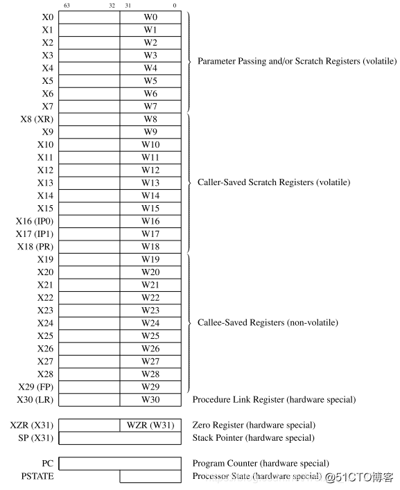

- 通用寄存器

1) arm64提供了31个64位通用寄存器，x0-x30
2) 可以通过w0-w30来访问这31个64位寄存器的低32位，写入时会将高32位清零

- 浮点寄存器

v0-v31，一共有32个浮点寄存器，每个寄存器的大小是128位，分别可以用不同的方式来访问不同的位数

1) Bn: 8位
2) Hn: 16位
3) Sn: 32位
4) Dn: 64位
5) Qn:128位

- 特殊寄存器

1) 程序计数器：即PC，保存着当前CPU执行指令的地址不能用作算术指令的源或目的地以及用作加载或存储指令给
2) 堆栈指针: sp, 即x31, 指向堆栈的顶部，sp不能被大多数指令引用，但一些算术指令如ADD指令，可以读写当前的堆栈指针来调整函数中的堆栈指针，每个异常级别都有一个专用的SP寄存器  fp: 即x29, 帧指针，指向当前frame的栈底，也就是高地址 
3) 链接寄存器：lr, 即x30，存储着函数的返回地址
4) 程序状态寄存器: cpsr, 这个寄存器是按位起作用的，每一位都有专门的作用。 spsr, 当发生异常时，cpsr会存入spsr直到异常恢复在复制回cpsr

.. image::
    res/CPSR01.png

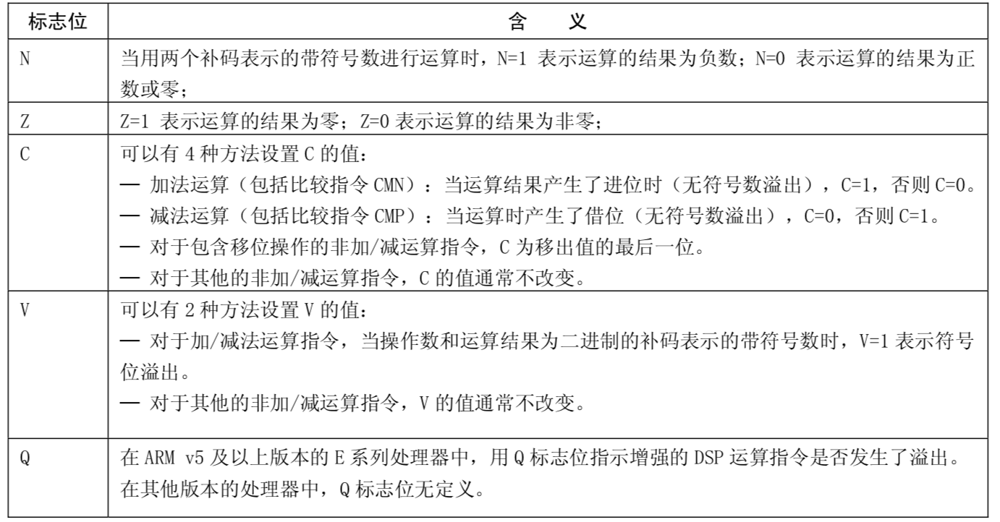

在arm64中不再单一使用cpsr寄存器来保存当前状态，而是用PSTATE来保存处理器的状态

PSTATE包括以下的系统寄存器

**NZCV寄存器：保存条件标志**

可读可写的寄存器

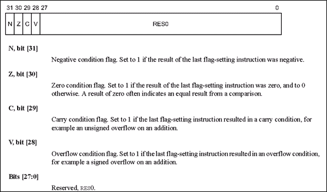

**DAIF寄存器：DAIF状态**

4种事件的mask

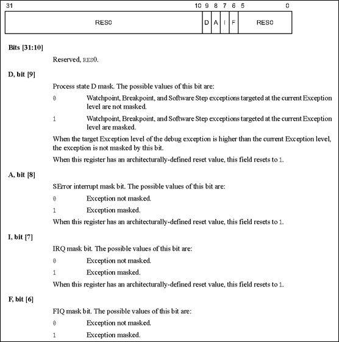

**CurrentEL:当前的exception level**

arm64有4个exception level,当前的EL，保存在这个寄存器中，这个寄存器是只读寄存器

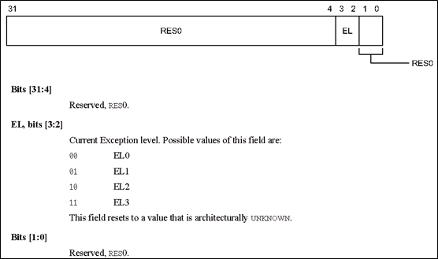

**SPSel: 当前栈的选择**

在EL3, EL2, EL1是可以选择SP是使用SP_ELx还是SP_EL0，通过这个寄存器设置

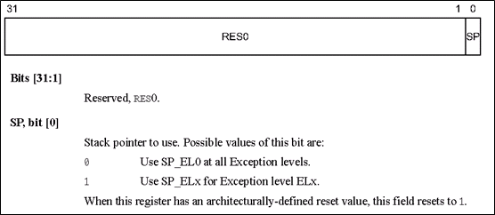

**PAN: privileged access never**

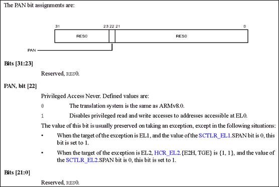

**UAO: user access override**

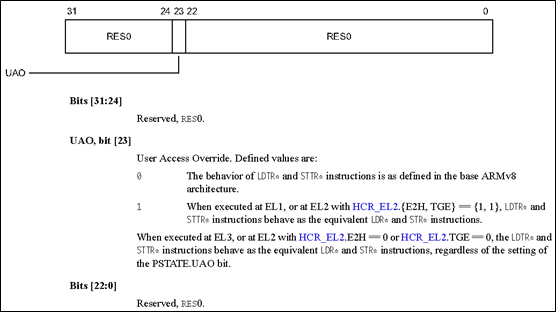

以上的寄存器可以通过 ``mrs`` 或 ``msr`` 指令进行访问 
    

- 函数返回值问题

整型返回值被保存在x0和x1中，而浮点值则保存在v0-v3中，同时使用多个寄存器可以返回一个小型结构体类型的返回值。如果返回值为比较大的结构体，那么寄存器可能就变得不够用了，此时就需要调用者做出一些配合，
调用者会在一开始为该结构体分配一块内存，然后将其地址写到x8寄存器中，在设置返回值的时候，直接往该地址中写入数据即可

- 函数参数问题

一般来说，函数参数(整型参数、地址)不超过8个的话，会存放在x0-x7里面，如果浮点型数据或者超过8个，会在调用函数之前将这些参数入栈，函数调用完之后出栈

 
模式与异常等级
-----------------

模式
^^^^

- 用户模式(USR): ARM处理器正常程序执行状态
- 快速中断模式(FIQ): 高速数据传输或通道处理
- 外部中断模式(IRQ): 通用的中断处理
- 管理模式(supervisor): 操作系统使用的保护模式
- 数据访问终止模式(abort): 当数据或指令预取终止时进入该模式，用于虚拟存储及存储保护
- 系统模式(system): 运行具有特权的操作系统任务
- 为定义指令终止模式(UND): 当未定义的指令执行时进入该模式
- hyp: 用于虚拟化扩展
- monitor: 用于security扩展

异常等级
^^^^^^^^^^^

- EL0: 非特权用户模式
- EL1: 操作系统内核
- EL2: Hypervisor，虚拟扩展
- EL3: secure monitor，安全扩展，实现EL0和EL1的secture和Non-secure之间的切换，可以起到物理屏障安全隔离作用

模式与异常等级之间的关系
^^^^^^^^^^^^^^^^^^^^^^^^^^^

- user模式： 只能在EL0执行
- monitor模式：只能在secure的EL3执行
- hyp模式：只能在non-secure的EL2执行，虚拟机
- system, supervisor, abort, undefined, IRQ, FIQ模式：依赖于secure模式

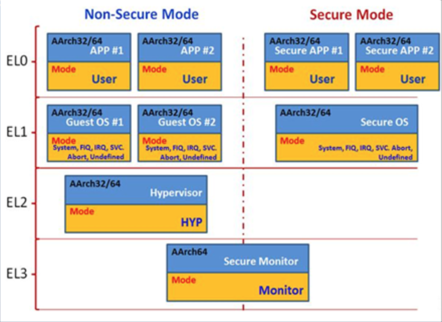

寻址方式
---------

立即寻址
^^^^^^^^^

立即寻址也叫立即数寻址，这是一种特殊的寻址方式，操作数本身就在指令中给出，只要取出指令也就取到了操作数，这个操作数被称为立即数，对应的方式也称为立即寻址

::

	ADD W0, W1, #0x05 

寄存器寻址
^^^^^^^^^^^

寄存器寻址也就是利用寄存器中的数值作为操作数，这是一种常见的方式，也是效率比较高的寻址方式

::

	ADD W0, W1, W2

寄存器间接寻址
^^^^^^^^^^^^^^^^

寄存器间接寻址就是以寄存器中值作为操作数的地址，而操作数本身存放在存储器中

::

	ADD W0, W1, [W2]
	LDR W3, [W0]

基址变址寻址
^^^^^^^^^^^^^

基址变址寻址就是将寄存器(该寄存器一般称作基址寄存器)的内容与指令中给出的地址偏移量相加，从而得到一个操作数的有效地址。变址寻址方式常用于访问某基地址附近的地址单元，
常见的有以下几种形式

::

	LDR W0, [W1, #4] 	;将寄存器w1中内容加上4作为地址，然后将该地址处的数据存入寄存器w0中
	LDR W0, [W1, #4]! 	;将寄存器w1中内容加上4作为地址，然后将该地址处的数据存入寄存器w0中,然后w1中的内容自增4
	LDR W0, [W1], #4 	;将寄存器w1中的内容作为地址，然后将该地址处的数据存入w0中，并将w1中内容自增4
	LDR W0, [W1, W2]	;将w1和w2中的内容相加作为地址，然后将该地址处的数据存入w0

基本操作
----------

分配和初始化全局变量
^^^^^^^^^^^^^^^^^^^^^^

- 定义一个未初始化的static静态局部变量和全局变量

::

    .byte expressions
    .byte2 expressions
    .hword expressions
    .short expressions

    .4byte expressions
    .word expressions
    .long expressions

    .8byte expressions
    .quad expressions
    
    .ascii "string"         ;带'\n'
    .szciz "string"         ;不带'\n'
    .string "string"

    .float flonums
    .single flonums
    .double flonums

对齐aligning
^^^^^^^^^^^^^^

::

    .align abs-expr, abs-expr, abs-expr
    ;第一个abs-expr：对齐的size
    ;第二个abs-expr：填充
    ;第三个abs-expr: 可选，对齐应该跳过的最大字节数

    .balign[lw] abs-expr, abs-expr, abs-expr
    
    .skip size, fill
    .space size, fill
    ;分配一大块内存并将其全部初始化到相同的值，可以使用这两个指令

    .equ symbol, expression
    .set symbol, expression 
    ;宏定义，等价于define

    .equiv symbol, expression
    ;宏定义，如果已经定义过了则产生error

    .global symbol
    ;声明，声明后，所有文件都可以使用

    .comm symbol, length

函数
^^^^^^

::

    .size name, expression
    .type name, type_description

条件
^^^^

::

    .if expression
    .ifdef symbol
    .inndef symbol
    .else
    .end

include文件
^^^^^^^^^^^^

::

    .include "file"

宏
^^^^

::

    .macro macname
    .manro macname macargs ...
    .endm
    .exitm

如果宏使用参数，那么在宏体中使用该参数时添加前缀 "\"

指令
-----

常用指令

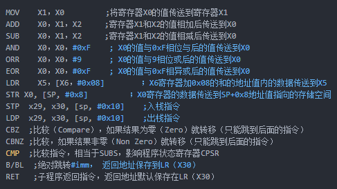

大多数指令都是可以带条件的，条件码如下

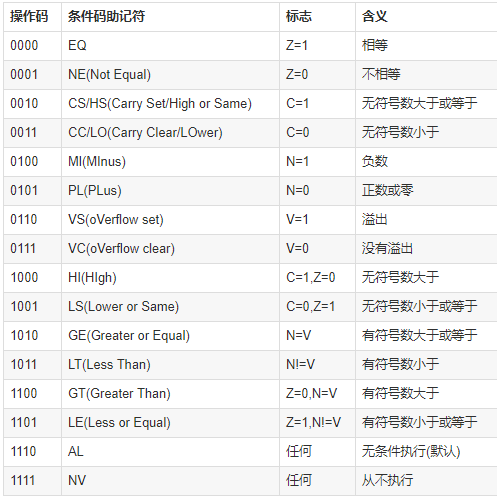

- mov

mov指令格式为

::

    mov.{条件}{s} 目的寄存器，原操作数

mov指令可以完成从另一个寄存器、移位寄存器或将一个立即数加载到目的寄存器，其中s选项决定指令的操作是否影响cpsr中的条件标志位的值，当没有s时指令不更新cpsr中条件标志位的值

::

    .text
    .global _test

    _test:
    mov w1, 8
    mov w2, w1
    ret

- mvn

mvn指令格式为

::

    mvn.{条件}{s} 目的寄存器，源操作数

mvn指令可完成从另一个寄存器被移位的寄存器或将一个立即数加载到目的寄存器，与mov指令不同之处在于传送之前按位被取反了，即把一个被取反的值传送到目的寄存器中，其中s选项决定
指令的操作是否影响cpsr中条件标志位的值，当没有s时指令不更新cpsr中条件标志位的值

::

    .text
    .global _test

    _test:
    mov w1, 0
    mvn w2, w1
    ret

- add

add指令的格式为

::

    add.{条件}{s} 目的寄存器， 操作数1, 操作数2

add指令用于把两个操作数相加，并把结果存放到目的寄存器中，操作数1应是一个寄存器，操作数2可以是一个寄存器，被移位的寄存器，或是一个立即数

::

    .text
    .global _test

    _test:
    mov w1, 2
    mov w2, 4
    add w0, w1, w2
    ret

- adc

adc指令的格式为

::

    adc.{条件}{s} 目的寄存器， 操作数1, 操作数2

adc指令用于把两个操作数相加，再加上cpsr中的C条件标志位的值，并将结果存放到目的寄存器中。它使用一个进位标志位，这样就可以做比64位大的数的加法，注意不要忘记
设置s后缀来更改进位标志，操作数1应是一个寄存器，操作数2可以是一个寄存器，被移位的寄存器，或一个立即数

- sub

sub指令的格式为

::

    sub.{条件}{s} 目的寄存器， 操作数1，操作数2

sub指令用于把操作数1减去操作数2,并将结果存放到目的寄存器中。操作数1应是一个寄存器，操作数2可以是一个寄存器，被移位的寄存器，或一个立即数。该指令可用于有符号数或
无符号数的减法运算

::

    .text
    .global _test

    _test:
    mov w1, 4
    mov w2, 2
    sub w0, w1, w2
    ret

- sbc

sbc指令的格式为

::

    sbc.{条件}{s} 目的寄存器，操作数1, 操作数2

sbc指令用于把操作数1减去操作数2，再减去cpsr中的C条件标志位的反码，并将结果存放到目的寄存器中，操作数1应是一个寄存器，操作数2可以是一个寄存器，被移位的寄存器，或一个立即数。
该指令使用进位标志来标识借位，这样就可以做大于32位的减法，注意不要忘记设置s后缀来更改进位标志。该指令可用于有符号数或无符号数的减法运算

- mul

mul指令格式为

::

    mul.{条件}{s} 目的寄存器，操作数1, 操作数2

mul指令完成操作数1和操作数2的乘法，并把结果放置到目的寄存器中，同时可以根据运算结果设置CPSR中相应的条件标志位，其中操作数1和操作数2均为64位的有符号或无符号数

::

    .text
    .global _test

    _test:
    mov w1, 4
    mov w2, 2
    mul w0, w1, w2
    ret

- and

and指令格式为

::

    and.{条件}{s} 目的寄存器，操作数1, 操作数2

and指令用于在两个操作数上进行逻辑与运算，并把结果放置到目的寄存器中，操作数1应是一个寄存器，操作数2可以是一个寄存器，被移位的寄存器或一个立即数。该指令常用于屏蔽操作数1的某些位

::

    .text
    .global _test

    _test:
    mov w1, 4
    and w0, w1, 3  ;保持w1的0位和1位，其余位清零
    ret

- orr

orr指令格式为

::

    orr.{条件}{s} 目的寄存器， 操作数1, 操作数2

orr指令用于在两个操作数上进行逻辑或运算，并把结果放置到目的寄存器中，操作数1应是一个寄存器，操作数2可以是一个寄存器，被移位的寄存器，或一个立即数。该指令常用于设置操作数1的某些位

::

    .text
    .global _test

    _test:
    mov w1, 4
    orr w0, w1, 3  ;设置w1的0, 1位，其余位保持不变
    ret

- eor

eor指令格式为

::

    eor.{条件}{s} 目的寄存器，操作数1，操作数2

eor指令用于在两个操作数上进行逻辑异或运算，并把结果放置到目的寄存器中,操作数1应是一个寄存器，操作数2可以是一个寄存器，被移位的寄存器，或一个立即数。该指令常用于反转操作数1的某些位

::

    .text
    .global _test

    _test:
    mov w1, 4
    mov w0, w1, 3 ;反转w1的0，1位，其余位保持不变

- tst

tst指令格式为

::

    tst.{条件} 操作数1, 操作数2

tst指令用于把一个寄存器的内容和另一个寄存器的内容或立即数进行按位与运算，并根据运算结果更新cpsr中条件标志位的值，操作数1是要测试的数据，而操作数2是一个位掩码。该指令一般用来检测是否设置了特定的位

::

    .text
    .global _test

    _test:
    mov w1, 0
    tst w1, 1

- str

str指令格式为

::

    str.{条件} 源寄存器， <存储器地址>

str指令用于从源寄存器中将一个64位或32位(看使用rn还是wn)的字节数据传送到存储器中.

str的示例与ldr一起说明

- strb

strb指令格式为

::

	strb.{条件} 源寄存器，<存储器地址>

strb： (store register byte) 将寄存器中的值写入到内存中（只存储一个字节）

::

	strb w8, [sp, #7]   ;将寄存器w8中的低1个字节保存到栈内存[sp + 7] 处

- adr

adr主要用于形成pc的相对地址，把相对地址Load到寄存器中

::

    adr <xd>, <label>

当前指令到lable的偏移offset_to_label加上pc的值，然后将结果赋值给xd。offset_to_label可以是个负数。 经常被编译器转成add或sub指令

::

    add <xd>, [PC, #offset_to_label] 
    或
    sub <xd>, [PC, #-offset_to_label]

- adrp

::
    
    adrp <xd>, <label>

adrp就是address page的简写，这里的page指的是大小为4KB的连续内存，和操作系统中的页不是一回事。该指令的作用是将label所在的页且4KB对齐的页基址放入寄存器xd中。
lable表示的地址肯定在这个页基址确定的页内. 一般情况下会跟上一条ADD xd, xd, offset_to_lable 指令，这样label所在的地址就在xd寄存器中了

该指令的作用就是将符号地址变为运行时地址

- mrs

::
    
    mrs.{条件} 通用寄存器, 程序状态寄存器

mrs指令用于将程序状态寄存器的内容传送到通用寄存器中，该指令一般用于以下两种情况

1) 当需要改变程序状态寄存器的内容时，可用mrs将程序状态寄存器的内容读入通用寄存器修改后然后再写回程序状态寄存器

2) 当在异常处理或进程切换时，需要保存程序状态寄存器的值，可用该指令读出然后保存

- msr

::

    msr.{条件} 程序状态寄存器 _<域>, 操作数

msr指令用于将操作数的内容传送到程序状态寄存器的特定域中，其中操作数可以为通用寄存器或者立即数。<域>用于设置程序状态寄存器中需要操作的位

1) 位[31：24]为条件标志位域，用f表示；
2) 位[23：16]为状态位域，用s表示；
3) 位[15：8]为扩展位域，用x表示；
4) 位[7：0]为控制位域，用c表示；

- ldr

ldr指令格式为

::

    ldr.{条件} 目的寄存器， <存储器地址>

ldr指令用于从存储器中将一个64位或32位(看使用rn还是wn)的字节数据传送到目的寄存器中，当程序计数器pc作为目的寄存器时，指令从存储器中读取的字节数据被当作目的地址，从而可以实现程序流程的跳转

::

    .text
    .global _test

    _test:
    mov w1, 4
    str w1, [sp, 8]
    ldr w0, [sp, 8]
    ret

- ldrsb

ldrsb： (load register byte) 将内存中的值（只读取一个字节）读取到寄存器中

::

	ldr x0, [x1] 		;将寄存器x1的值作为地址，取该内存地址的值放入寄存器x0中
	ldr w8, [sp, #0x8]  ;将栈内存[sp + 8]处的值读取到w8中
	ldr x0, [x1, #4]!   ;将寄存器x1中的值加上4作为内存地址，然后取出该内存中的值放入x0中，然后将寄存器x1的值加上4放入寄存器x1中
	ldr x0, [x1], #4	;将寄存器x1的值作为内存地址，取该内存地址的值放入x0中，再将x1的值加上4放入x1中
	ldr x0, [x1, x2]	;将x1和x2的值相加作为地址，然后取该地址的值存入x0中
	ldrsb	w8, [sp, #7]    ; 将栈内存 [sp + 7] 出的 低 1 字节的值读取到寄存器 w8 中

- stru

与str用法类似，将寄存器中的值写入到内存中(一般用于负地址运算中)

::
	
	stru w10, [x29, #-0x04] 		;将寄存器w10中的值保存到[x29 - 0x04]处

- ldur

与ldr用法类似，将内存中的值读取到寄存器中(一般用于负地址运算)

::

	ldur w8, [x29, #-0x4] 	;将栈内存[x29 - 0x04]处的值读取到w8寄存器中

- b

b指令格式为

::

    b.{条件} 目的地址

b指令是最简单的跳转指令，遇到一个b指令，ARM处理器会立即跳转到给定的目标地址，从那里继续执行

::

    .text
    .global _test

    _test:
    b label
    mov w2, 5

    lable:
    mov w0, 3
    mov w1, 4
    ret

- bl

bl指令格式为

::

    bl.{条件} 目标地址

同样是跳转指令，但在跳转之前，会在lr寄存器中保存pc的当前内容，因此，可以通过将lr的内容重新加载到pc中，来返回到跳转之后的那个指令处执行

- stp 

入栈指令(str 的变种指令，可以同时操作两个寄存器)

::

	stp x29, x30, [sp, #0x10] 	;将x29 x30的值存入sp偏移16个字节的位置

- ldp

出栈指令(ldr的变种指令，可以同时操作两个寄存器)

::

	ldp x29, x30, [sp, #0x10] 	;将sp偏移16个字节的值取出来，存入寄存器x29和寄存器x30中, 

- scvtf

signed convert to float, 带符号定点数转为浮点数

::

	scvtf d1, w0	;将w0寄存器中的值保存到浮点寄存器d1中

- fcvtzs

float convert to zero signed，浮点数转化为定点数

::

	fcvtzs w0, s0		;将浮点寄存器s0的值保存到w0中

- cbz

和0比较，如果结果为0就跳转到后面的指令

- cbnz 

和非0比较，如果结果非零就跳转

- cmp

比较指令，相当于subs，影响程序状态寄存器cpsr

- cset

比较指令，满足条件，则置1，否则置0

::

	cmp w8, #2 		;将寄存器w8的值和常量2进行比较,结果会体现在cpsw寄存器中
	cset w8, gt 	;如果是大于(grater than)，则将寄存器w8的值设置为1，否则设置为0

- ret

子程序(函数调用)返回指令，返回地址已默认保存在寄存器lr(x30)中

- LSL LSR ASR ROR

分别为：逻辑左移，逻辑右移，算数右移，循环右移

栈
---

函数在调用的时候系统会为每一个函数在栈区建立一个帧(frame),所有的函数内部变量都会保存在这个帧里面，然后结束后这个帧就会被回收，释放所有的内部变量。
一般来说，调用帧有多少层，就有多少帧

所有的帧都存放在 Stack，由于帧是一层层叠加的，所以 Stack 叫做栈。生成新的帧，叫做"入栈"，英文是 push；栈的回收叫做"出栈"，英文是 pop。
Stack 的特点就是，最晚入栈的帧最早出栈（因为最内层的函数调用，最先结束运行），这就叫做"后进先出"的数据结构。每一次函数执行结束，就自动释放一个帧，所有函数执行结束，整个 Stack 就都释放了。

看一个简单的程序

::

    int main(void)
    {
        int a = 2;
        int b = 3;
        return a + b ;
    }

编译之后通过objdump 查看汇编代码

::

	 00000000000006e4 <main>:
	 d10043ff        sub     sp, sp, #0x10			;sp指针往低地址移动了16个字节
	 52800040        mov     w0, #0x2                ;将立即数2写入寄存器w0
	 b9000be0        str     w0, [sp, #8]		    ;从sp地址+8字节为基地址开始的4个字节内的数据用w0寄存器内的数据填充		
	 52800060        mov     w0, #0x3                ;将立即数3写入寄存器w0        
	 b9000fe0        str     w0, [sp, #12]			;从sp地址+12字节为基地址开始的4个字节内的数据用w0寄存器内的数据填充		
	 b9400be1        ldr     w1, [sp, #8]			;从sp地址+8字节为及地址开始的4个字节数据放到w1寄存器中
	 b9400fe0        ldr     w0, [sp, #12]		    ;从sp地址+12字节为及地址开始的4个字节数据放到w0寄存器中
	 0b000020        add     w0, w1, w0			    ;将w1和w0中的数据相加并写入w0中
	 910043ff        add     sp, sp, #0x10		    ;将sp指针往高地址移动16字节，回到最初的位置
	 d65f03c0        ret

.. note::
	函数返回的结果保存在寄存器w0中(如果是64位则是x0)，但不是只有w0可以保存返回结果，w0-w7都是可以的。事实上我们用不到16个字节的栈，但为什么要开辟
	这么多呢，因为ARM64规定sp必须16字节对齐

- 堆栈平衡

前面的示例代码中，``sub sp, sp, #0x10`` 和结束时的 ``add sp, sp,, #0x10`` 这样做的目的就是为了维持堆栈平衡。函数开始时开辟堆栈空间，在结束时进行退栈操作，
这就解释了函数内的变量都存在栈区，函数结束后变量会被释放掉

- 参数传递

::

	int add(int a, int b)
	{
		return a + b;
	}

	int main()
	{
		return add(2,3);
	}

转换为汇编

::

	 a9bf7bfd        stp     x29, x30, [sp, #-16]!		;将保存现场, x29, x30的值放到sp-16的地址处，然后将sp的值减去16并存入sp中, x29表示fp寄存器，x30表示lr寄存器
     ;从sp地址往高地址偏移16个字节的地址开始，用16个字节保存fp和lr寄存器。前8个字节保存fp寄存器，后8个字节保存lr寄存器
	 910003fd        mov     x29, sp						;将sp的值存入x29中
	 52800061        mov     w1, #0x3                       ;w1置为3    
	 52800040        mov     w0, #0x2                       ;w0置为2    
	 97fffff4        bl      6e4 <add>					    ;跳转到add函数中
	 a8c17bfd        ldp     x29, x30, [sp], #16			;恢复现场:从sp+16地址处取出值存入x29, x30中,前8个字节保存fp寄存器	
	 d65f03c0        ret

	 00000000000006e4 <add>:
	 d10043ff        sub     sp, sp, #0x10				;sp指针向下移动16字节
	 b9000fe0        str     w0, [sp, #12]				;取出w0的值放入sp+12地址处
	 b9000be1        str     w1, [sp, #8]				;取出w1的值放入sp+8地址处
	 b9400fe1        ldr     w1, [sp, #12]				;从sp+12地址处取出值存入w1
	 b9400be0        ldr     w0, [sp, #8]				;从sp+8地址出取出值存入w0
	 0b000020        add     w0, w1, w0					;w1和w0做加法，并写入w0中
	 910043ff        add     sp, sp, #0x10				;sp指针向上移动16字节
	 d65f03c0        ret

sp与fp之间的空间就是函数的栈空间,fp为栈底，sp为栈顶

代码中一开始做了保存现场的操作，函数调用的时候我们通过跳转指令B或者BL来进行函数调用，在跳转的同时ARM会保存函数的返回地址到LR也就是下一条指令的入口地址，函数调用的时候
进行LR压栈，函数返回的时候进行LR出栈从而保证正确执行程序返回后的后续指令
