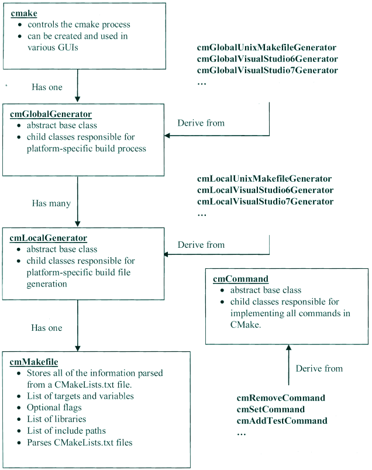

CMake简明
==========

CMake简介
----------

CMake是一个开源的可扩展工具，用于独立于编译器的管理构建过程。CMake必须和本地构建系统联合使用，在每个源码目录中需要编写CMakeLists.txt文件，以申明
如何生成标准的构建文件(如GNU Make的Makefile)

Cmake会生成一个方便用户编辑的缓存文件，当其运行时，会定位头文件、库文件、可执行文件，这些信息都会被收集到缓存文件中。

核心理念
-----------

CMake包含一系列重要的概念抽象，包括目标(Targets)、生成器(Generators)、命令(Commands)等，这些命令均被实现为C++类。

下面列出这些概念之间的关系

- 源文件: 对应了典型的C/C++源码
- 目标: 多个源文件联合成为目标，目标通常为可执行文件或者库文件
- 目录：表示源码树中的一个目录，常常包含一个CMakeLists.txt文件，一个或者多个目标与之关联
- 本地生成器(Local generator): 每个目录有一个本地生成器，负责为此目录生成Makefiles,或者工程文件
- 全局生成器(Global generator): 所有本地生成共享一个全局生成器，后者负责监管构建过程，全局生成器由Cmake本身创建并驱动

CMake开始执行时，会创建一个cmake对象并把命令行参数传递给它，camke对象管理整体的配置过程，持有构建过程的全局信息(例如缓存值)。cmake会根据用户的选择来创建合适的全局
生成器(VS、Makefiles等)，并把构建过程的控制权转交给全局生成器(调用configure和generate方法)

下图显示cmake、生成器、cmMakefile、命令等类型的关系

目标
^^^^^

cmMakefile对象存放的最重要的对象是目标(Targets),目标代表可执行文件，库、实用工具等。每个 ``add_library`` ``add_executable`` ``add_custom_target`` 命令都会创建一个目标

**库目标**

::
    
    # 创建一个静态库，包含两个源文件
    add_library(foo STATIC foo1.c foo2.c)

命令的第二个参数申明库的类型，有效值包括

=================== ==============================================================================================
    库类型                      说明
------------------- ----------------------------------------------------------------------------------------------
 STATIC                 目标必须构建为静态库
 SHARED                 目标必须构建为动态库
 MODULE                 目标必须构建为支持在运行时动态加载到可执行文件中的模块
=================== ==============================================================================================

如果没有申明库类型，则CMake依据变量 ``BUILD_SHARED_LIBS`` 判断应该构建为共享库还是静态库，如果此变量不设置构建为静态库

**可执行目标**

::

    # 创建可执行文件
    add_exectable(foo foo.c)

**读写目标属性**

使用 ``set_target_properties`` ``get_target_properties`` 或者更通用的 ``set_property`` ``get_property`` 命令，可以读写目标的属性

::

    # 修改目标使用的文件目录，注意，全局的include_directories会将此目标忽略
    set_property(TARGET jsonrpc
        PROPERTY INCLUDE_DIRECTORIES
        ${JSONCPP_INCLUDE_DIRS}
        ${BOOST_INCLUDE_DIRS}
        ${CMAKE_CURRENT_SOURCE_DIR}
        ${CMAKE_CURRENT_SOURCE_DIR}/jsonrpc
    )
    # 同时设置多个属性
    set_target_properties(jsonrpc PROPERTIES VERSION ${PROJECT_VERSION} SOVERSION ${PROJECT_VERSION_MAJOR})

常见目标属性如下

=======================    ==============================================================================
 属性                               说明
-----------------------    ------------------------------------------------------------------------------
 LINK_FLAGS                 传递给链接器的标志
 COMPILE_FLAGS              传递给编译器的标志
 INCLUDE_DIRECTORIES        指定目标需要引用的头文件目录
 PUBLIC_HEADER              共享的库目标提供的公共头文件
 VERSION                    构建版本
 SOVERSION                  API版本
 OUTPUT_NAME                目标输出文件名称
=======================    ==============================================================================

全部目标属性可以查阅官网  https://cmake.org/cmake/help/v3.0/manual/cmake-properties.7.html#properties-on-targets                                                                                                                                                

**链接到库**

使用 ``target_link_libraries`` 命令，可以指定目标需要链接的库的列表。列表的元素可以是库、库的全路径

::

    add_library(foo foo.cpp)
    # foo库依赖bar库
    target_link_libraries(foo bar)

    add_executable(foobar foobar.cpp)
    # foobar显式依赖foo，隐式依赖bar
    target_link_libraries(foobar foo)

源文件
^^^^^^^^^^

与Target类似，源文件也被建模为C++类，也支持读写属性(通过set_source_files_properties、get_source_files_properties或更一般的命令)

=========================   =============================================================================================
 属性                               说明
-------------------------   ---------------------------------------------------------------------------------------------
 COMPILE_FLAGS                  针对特定源文件的编译器标志，可以包含-D、-I之类的标志
 GENERATED                      指示此文件是否在构建过程中生成，这种文件在CMake首次运行时不存在，因而计算依赖关系时考虑
 OBJECT_DEPENDS                 添加此源文件时额外依赖的其他文件
=========================   =============================================================================================

目录、生成器、测试、属性
^^^^^^^^^^^^^^^^^^^^^^^^^^^^^

其他偶尔可能用到的CMake类型包括Directory、Generator、Test、Property等。

属性是一种键值存储，它关联到一个对象。读写属性最一般的方法是上面提到的get/set_property命令。所有可用的属性可以通过 ``cmake -help-property-list`` 得到

变量和缓存条目
^^^^^^^^^^^^^^^^

CMakeLists中的变量和普通编程语言中的变量很类似，变量的值要么是单个值，要么是列表。引用变量必须使用 ``${VARNAME}`` 语法，要设置变量的值需要使用set命令。
变量对当前的CMakeLists文件、当前函数、以及子目录的CMakeLists、任何通过INCLUDE包含进来的文件、任何调用的宏或函数可见。

当处理一个子目录、调用一个函数时，CMake创建一个新的作用域，其复制当前作用域全部变量。在子作用域中对变量的修改不会对父作用域产生影响。要修改父作用域中的变量，
可以在set时指定特殊选项。

::

    set(name Alex PARENT_SCOPE)

常用变量如下表

==========================  ========================================================================
 变量                           说明
--------------------------  ------------------------------------------------------------------------
 CMAKE_C_FLAGS                  C编译标志，示例 set(CMAKE_C_FLAGS "-std=c11 -pthread")
 CMAKE_CXX_FLAGS                C++编译标志
 CMAKE_C_FLAGS_DEBUG            用于Debug配置的C编译标记，示例 set(CMAKE_C_FLAGS_DEBUG "-g -O0")
 CMAKE_CXX_FLAGS_DEBUG          C++ Debug编译标志
 CMAKE_C_FLAGS_RELEASE
 CMAKE_CXX_FLAGS_RELEASE
==========================  ========================================================================

``option`` 命令可以创建一个Boolean变量(ON/OFF)并将其存储在缓存中

::

    option(USE_PNG "Do you want to use the png library?")

构建配置
^^^^^^^^^^

构建配置运行工程使用不同方式构建:debug、optimized或任何其他标记。CMake默认支持四种构建配置

======================  ==============================================================
 构建配置                   说明
----------------------  --------------------------------------------------------------
 Debug                      启用基本的调试(编译器的)标志
 Release                    基本的优化配置
 MinSizeRei                 生成最小的，但不一定是最快的代码
 RelWithDebugInfo           优化构建，但同时携带调试信息
======================  ==============================================================

可以使用 ``CMAKE_BUILD_TYPE`` 变量指定目标配置

::

    cmake ../ -DCMAKE_BUILD_TYPE=Debug

编写CMakeLists文件
--------------------

CMake由CMakeLists.txt驱动，此文件包含构建需要的一些信息。

基本命令
^^^^^^^^^^^

======================= ================================================================================================
 命令                           说明
----------------------- ------------------------------------------------------------------------------------------------
 project                 顶层CMakeLists.txt应该包含的第一个命令，声明工程名字和使用的语言 
 set                     设置变量或者列表
 remove                  从变量值的列表中移除一个单值
 separate_arguments      基于空格，把单个字符串分割为列表
 add_executable          定义目标(可执行文件)
 add_library             定义目标(库)
======================= ================================================================================================

流程控制命令
^^^^^^^^^^^^^

和普通编程语言一样，CMake支持条件、循环控制结构，同时支持子过程(macro、function)

**if-else条件控制** 

::

    if(MSVC80)
    #...
    elseif(MSVC90)
    #...
    elseif(APPLE)
    #...
    endif()

**条件表达式**

=============================== =====================================================================================
 语法                               说明
------------------------------- -------------------------------------------------------------------------------------
 if(variable)                    0 FALSE OFF NO NOTFOUND \*-NOTFOUNR IGNORE为假，其他为真。不区分大小写。
 if(NOT variable)                上面取反，variable可以不用$包围
 if(variable AND variable1)      逻辑与
 if(varibale1 OR variable2)      逻辑或
 if(num1 EQUAL num2)             数字相等比较(其他操作符包括LESS、GREATER)
 if(str1 STREQUAL str2)          字典序相等比较(其他类似的还有STRLESS STRGREATER)
 if(v1 VERSION_EQUAL v2)          major[.minor[.patch[.tweak]]]风格版本号相等比较
 if(COMMAND cmd_name)            如果指定的命令可以调用
 if(DEFINED variable)            如果变量被定义
 if(EXISTS filename)             如果文件存在
 if(IS_DIRECTORY name)           判断是否为目录
 if(IS_ABSOLUTE name)            判断是否为绝对路径
 if(n1 IS_NEWER_TAN n2)          判断文件n1的修改时间是否大于n2
 if(variable MATCHES regex)      变量匹配，支持正则表达
=============================== =====================================================================================

操作符优先级

1) 括号分组()
2) 前缀一元操作符: EXISTS、COMMAND、DEFINED
3) 比较操作符: EQUAL、LESS、GREATER以及其变体，MATCHES
4) 逻辑非: NOT
5) 逻辑或与: AND OR2) 前缀一元操作符: EXISTS、COMMAND、DEFINED
3) 比较操作符: EQUAL、LESS、GREATER以及其变体，MATCHES
4) 逻辑非: NOT
5) 逻辑或与: AND OR

**foreach**

::

    foreach(item list)
        # do something with item
    endforeach(item)

**while**

::

    while(${COUNT} LESS 2000)
        set(TASK_COUNT, ${COUNT})
    endwhile()

**break**

此命令用于中断foreach/while循环

**function**

CMake中的函数类似C/C++函数，可以向函数传递参数，除了依据行参名外，你还可以使用ARGC，ARGV，ARGN，ARG0， ARG1...等形式.
函数内部是一个新的作用域。

::

    function(println msg)
        message(${msg} "\n")
        set(msg ${msg} PARTENT_SCOPE)
    endfunction()

    println(Hello)

**return**

此命令用于从函数中返回。

**macro**

宏域函数类似，但宏不会创建新的作用域。传递给宏的参数也不会被作为变量看待，而是执行宏替换为字符串

::

    macro(println msg)
        message(${msg} "\n")
    endmacro()

检查CMake版本
---------------

::

    if(${CMAKE_VERSION} VERSION_GREATER 1.6.1)

    endif()
    
    # 还可以申明要求的CMake最低版本
    cmake_minimum_required(VERSION 2.8)

使用模块
---------

所谓模块，仅仅是存放到一个文件中一系列CMake命令的集合。我们可以用include命令包含到CMakeLists.txt中

::

    # 此模块用于查找TCL库
    include(FindTCL)
    #找到后，将其加入到链接依赖中
    target_link_libraries(FOO ${TCL_LIBRARY})

包含一个模块时，可以使用绝对路径，或者是基于 ``CMAKE_MODULE_PATH`` 的相对路径，如果此变量未设置，默认为CMake的安装目录的Modules子目录

模块依据用途可以分为

1) 查找类模块: 查找软件元素，例如头文件、库

::

    # png库依赖zlib库
    include(FindZLIB)   #查找zlib库
    if(ZLIB_FOUND)      #往往在找到后设置LIBNAME_FOUND变量
        #查找头文件位置并存入变量
        find_path(PNG_PNG_INCLUDE_DIR png.h /usr/local/include /usr/include)
        #查找库文件位置并存入变量
        find_library(PNG_LIBRARY png /usr/lib /usr/local/lib)
        if(PNG_LIBRARY AND PNG_PNG_INCLUDE_DIR)
            set(PNG_INCLUDE_DIR ${PNG_PNG_INCLUDE_DIR} ${ZLIB_INCLUDE_DIR})
            set(PNG_LIBRARIES ${PNG_LIBRARY} ${ZLIB_LIBRARY})
            set(PNG_FOUND TRUE)
        endif()
    endif()

2) 系统探测模块: 探测系统的特性，例如浮点数长度、对ASCI C++11的支持

3) 实用工具模块: 用于添加额外的功能，例如处理一个CMake工程依赖于其他CMake工程的情况

安装文件
----------

软件通常被安装到和源码、构建树无关的位置上，CMake提供一个 ``install`` 命令，来说明一个工程如何被安装。 执行 ``make install`` 即可完成安装

install命令提供了若干"签名"(类似于子命令)，签名作为第一个参数传入。可用的签名包括

============================    ================================================================================================
 签名                                       说明
----------------------------    ------------------------------------------------------------------------------------------------
 install(TARGETS...)             安装工程中目标对应的二进制文件
 install(FILES...)               一般性的文件安装，包括头文件、文档、软件需要的数据文件
 install(PROGRAMS...)            安装不是当前工程构建的文件，例如shell脚本，与FILES类似，只不过PROGRAMS被授予可执行权限
 install(DIRECTORY...)           安装一个完整的目录树
 install(SCRIPT...)              指定一个用户提供的、在安装过程中执行的CMake脚本
 install(CODE...)                与SCRIPT类似，只是脚本以内联字符串形式提供
============================    ================================================================================================

**TARGETS签名**

::

    install(TARGETS
            targets...  #基于add_executable/add_library创建的目标列表
            #通过TARGETS签名安装的文件可以分为三类
            # ARCHIVE 静态库， LIBRARY 可加载模块、动态库， RUNTIME可执行文件
            [ARCHIVE|LIBRARY|RUNTIME|FRAMEWORK|BUNDLE|PRIVATE_HEADER|PUBLIC_HEADER|RESOURCE]
            [DESTINATION <dir>]
            [PERMISSIONS permissions...]
            [CONFIGURATIONS [Debug|Release|...]]
            [COMPENT compent]
            [OPTIONAL]
            [EXPORT <export name>]
    )

示例

::

    install(TARGETS myExecutable mySharelib myStaticlib myPlugin
            RUNTIME DESTINATION bin COMPENT Runtime
            LIBRARY DESTINATION lib COMPENT Runtime
            ARCHIVE DESTINATION lib/myproject COMPENT Development
    )

**FILES签名**

::

    install(FILES files..  #需要被安装的文件的列表，如果是相对路径，相对于当前Source目录
        DESTINATION <dir>   #目标位置，如果是相对路径，相对于安装Prefix
        [PERMISSIONS permissions...] #默认权限644
        [CONFIGURATIONS [Debug|Release|...]]
        [COMPENT compent]
        [RENAME <name>]    #为文件指定新的名称，要求文件列表只有一个元素
        [OPTIONAL]
    )

**PROGRAMS签名**

安装shell脚本或者python脚本时，可以使用PROGRAMS签名，此签名和PROGRAMS一样，只是默认权限为755

**DIRECTORY签名**

安装整个目录时，需要使用DIRECTORY签名

::

    install(DIRECTORY dir... #需要被安装的目录的列表，如果是相对路径，相对于source目录
            DESTINATION <dir>   #安装目录
            [FILE_PERMISSIONS permissions...]  #文件默认权限644,目录默认权限755
            [DIRECTORIES_PERMISSIONS permissions...]
            [USR_SOURCE_PERMISSIONS]  #和文件源保持同样的权限
            [CONFIGURATIONS [Debug|Release|...]]
            [COMPONENT component]
            [
                #排除某些文件，或者为某些文件指定特殊的权限
                #PATTERN用于unxi风格通配符匹配，REGEX用于正则式匹配
                [PATTERN <pattern> | REGEX <regex>]
                [EXCLUDE] #是否把匹配的文件排除，不安装
                [PERMISSIONS permissions...]  #设置匹配文件的权限
            ]
    
    )

系统探测
------------

系统探测，即检测在其上构建的系统的各种环境信息，是构建跨平台库或者应用程序的关键因素。

使用头文件和库
^^^^^^^^^^^^^^^

与集成外部库相关的命令包括 ``find_library`` 、 ``find_path`` 、 ``find_program`` 、 ``find_package`` 。对于大部分C/C++库，使用前两个命令一般足够和
系统上已经安装的库进行链接，这两个命令分别用来定位库文件、头文件所在目录

::

    #寻找一个库
    find_library(
            TIFF_LIBRARY
            NAME tiff tiff2     #只需要库的basename
            PATHS /usr/local/lib /usr/lib   #搜索库路径，前面的优先
    )

    #查找一般性的文件，仅支持一个待查找文件，支持多个路径
    find_path(
            TIFF_INCLUDES
            tiff.h
            /usr/local/include /usr/include
    )

    include_directories(${TIFF_INCLUDES})
    add_executable(mytiff mytiff.c)
    target_link_libraries(mytiff ${TIFF_LIBRARY})

.. note::
    find_*命令总是会查找PATH环境变量，find_*命令会自动创建对应的缓存条目

查找包
^^^^^^^^^^

CMake提供 ``find_package(Package [version])`` 命令来查找符合package包规则的软件包。

该命令可以在两个模式下运行：

1) Module模式: 此模式下CMake会依次扫描 ``CMAKE_MODULE_PATH`` 、CMake安装目录，尝试寻找一个名称为 ``Find<Package>.cmake`` 的查找模块。如果找到则加载，并调用其来寻找目标包的全部组件
2) Config模式: 如果Module模式下没有定位到查找模块，命令自动切换到Config模式。该模式下，命令会寻找包配置文件(package configuration file):目标包提供的、一个名为<Package>Config[Version].cmake
               或者<package>-config[-version].cmake的文件。只要给出包的名称，命令就知道从何处寻找包配置文件，可能的位置是<prefix>/lib/<package>/<package>-config.cmake

**内置查找模块**

CMake的内置查找模块，在找到包后，一般会定义一系列的变量供当前工程使用

==========================  =============================================================================
 变量名称约定                       说明
--------------------------  -----------------------------------------------------------------------------
 <PKG>_INCLUDE_DIRS             包的头文件所在目录
 <PKG>_LIBRARIES                包提供的库的完整路径
 <PKG>_DEFINITIONS              使用包时，编译代码需要用的宏定义
 <PKG>_EXECUTABLE               包提供的PKG工具所在目录
 <PKG>_ROOT_DIR                 PKG包的安装根目录
 <PKG>_VERSION_<VER>            如果PKG的VER版本被找到则定义为真
 <PKG>_<CMP>_FOUND              如果PKG的CMP组件被找到，则定义为真
 <PKG>_FOUND                    如果PKG被找到则定义为真
==========================  =============================================================================

为编译传递参数
^^^^^^^^^^^^^^^^

要传递参数给编译器，可以指定命令行，或者使用一个预先配置好的头文件。

调用 ``add_definitions`` 命令，可以向编译器传递宏定义

::

    #定义一个布尔的缓存条目
    option(DEBUG_BUILD "Enable debug messages")
    if(DEBUG_BUILD)
        #添加宏定义
        add_definitions(-DDEBUG_MSG)
    endif()

**配置头文件**

这种方式更可维护，大部分工程应当使用该方式，应用程序只需要引入预先配置好的头文件即可，不必编写复杂的CMake规则。我们可以把头文件看作一种配置文件

定制命令与目标
----------------

可移植性
^^^^^^^^^^

CMake提供了两个主要工具，解决不同平台之间的可移植性问题。

**cmake -E**

使用 ``cmake -E arguments`` 调用，可以执行一些跨平台的操作。支持的argument包括

==========================================    ====================================================================================
 操作                                           说明
------------------------------------------    ------------------------------------------------------------------------------------
 chdir dir command args                         改变当前目录为dir然后执行指定的命令
 copy file destination                          拷贝文件
 copy_if_different infile outfile               如果两个文件不一样，则从infile拷贝到outfile
 copy_directory source destination              拷贝目录，包括子目录
 remove file file1...                           删除文件
 echo string                                    打印到标准输出
 time command args                              运行一个命令并计算耗时
==========================================    ====================================================================================

CMake不限制仅使用cmake命令，事实上可以调用任何命令。一个通用的实践是，通过 ``find_program`` 先找到一个程序，然后在定制命令中调用之

**系统特征变量**

================================ ========================================================================================================
 变量                               说明
-------------------------------- --------------------------------------------------------------------------------------------------------
 EXE_EXTENSION                     可执行文件的扩展名，Windows为.exe ,UNIX为空
 CMAKE_CURRENT_BINARY_DIR          与当前CMakeLists文件关联的输出目录的完整路径
 CMAKE_CURRENT_SOURCE_DIR          与当前CMakeLists文件关联的源码目录的完整路径
 EXECUTABLE_OUTPUT_PATH            可执行文件路径
 LIBRARY_OUTPUT_PATH               库文件需要生成的目录
 CMAKE_SHARED_LIBRARY_PREFIX       共享库文件前缀
 CMAKE_SHARED_LIBRARY_SUFFIX       共享库文件后缀
 CMAKE_LIBRARY_PREFIX              静态库文件前缀
 CMAKE_LIBRARY_SUFFIX              静态库文件后缀
 CMAKE_SHARED_MODULE_PREFIX        共享模块文件前缀
 CMAKE_SHARED_MODULE_SUFFIX        共享模块文件后缀
================================ ========================================================================================================

定制命令与目标
^^^^^^^^^^^^^^^

**add_custom_command**

add_custom_command有两个主要的签名: TARGET、OUTPUT，分别用于目标或者文件添加额外的规则。

::

    add_custom_command( 
        TARGET target     #目标名称
        #执行触发时机
        #pre_build,在目标的任何依赖文件被构建之前运行
        #pre_link,在所有依赖已经构建好，但是尚未链接时执行
        #post_build，在目标已经构建好后执行
        PRE_BUILD | PRE_LINK | POST_BUILD
        # command为可执行文件的名称
        COMMAND command [ARGS arg1 arg2 ...]
        [COMMAND command [ARGS arg1 arg2 ...]]
        #注释，在定制命令运行时打印
        [COMMENT comment]
    )

示例

::

    #在目标构建好之后拷贝
    add_executable(myProgram myProgram.c)
    get_target_property(EXE_LOC myProgram LOCATION)
    add_custom_command( 
        TARGET myProgram
        POST_BUILD
        COMMAND ${CMAKE_COMMAND} ARGS -E copy ${EXE_LOC} output/file
    )

add_custon_command的另外一个用途是指定生成一个文件的规则。

::

    add_custom_command(
        #指定命令运行生成的结果文件，最好指定完整路径
        OUTPUT output1 [output2 ...]
        #需要执行的命令
        COMMAND command [ARGS [args ...]]
        #命令依赖的文件
        [DEPENDS [depends ...]]
        [COMMENT commnet]
    )

**add_custom_target**

::

    add_custom_target(
        #name为目标的名称，使用make name生成此目标
        name [ALL]  #ALL表示目标包含在ALL_BUILD目标中，自动构建
        #执行的命令
        [command arg arg ...]
        #此目标依赖的文件列表
        [DEPENDS dep1 dep2 ...]
    )

CMake交叉编译
--------------

**工具链文件**

通过一个所谓工具链(ToolChain)文件，可以向CMake传递目标平台的任何必要信息

::

    cmake -DCMAKE_TOOLCHAIN_FILE=config/toolchain.cmake ..

**工具链文件变量**

=======================================  =============================================================================================================================
    变量                                    说明
---------------------------------------  -----------------------------------------------------------------------------------------------------------------------------
 CMAKE_SYSTEM_NAME                        该变量必须设置，指定目标平台的名称。Linux Windows Generic(嵌入式无OS). 设置此变量后，CMAKE_CROSSCOMPILING为真
 CMAKE_SYSTEM_VERSION                     可选，目标平台版本
 CMAKE_SYSTEM_PROCESSOR                   可选，目标平台处理器或者硬件的名称
 CMAKE_C_COMPILER                         C编译器完整路径或者名字
 CMAKE_CXX_COMPILER                       C++编译器名字
 CMAKE_FIND_ROOT_PATH                     指定一组包含了目标平台环境的目录，这些目录供所有的find_*命令使用
 CMAKE_FIND_ROOT_PATH_MODE_PROGRAM        find_program命令默认行为，NEVER对CMAKE_FIND_ROOT_PATH目录无效，ONLY仅目录中搜索，BOTH是默认值，都搜索
 CMAKE_FIND_ROOT_PATH_MODE_LIBRARY        find_library行为 
 CMAKE_FIND_ROOT_PATH_MODE_INCLUDE        find_include行为
=======================================  =============================================================================================================================

示例

::

    # Supported Values: Linux, QNX, Android, Window, Generic(For Embedded system)
    set(CMAKE_SYSTEM_NAME Linux)
    set(CMAKE_SYSTEM_PROCESSOR aarch64-poky)

    if(${CMAKE_VERSION} VERSION_GREATER 3.7.0)
        set(FLAGS_SUFFIX _INIT) # 3.7.x introduced new _INIT variables for toolchainfile flags
    else()
        set(FLAGS_SUFFIX)
    endif()

    set(BUILD_PLATFORM "v3h_aarch64")

    # Set cross compiler tool path
    if(ENV{CROSS_TOOL_CHAIN_PATH})
        set(CROSS_TOOLCHAIN_ROOT_PATH $ENV{CROSS_TOOL_CHAIN_PATH})
    else()
        set(CROSS_TOOLCHAIN_ROOT_PATH /opt/poky/3.0.2/sysroots)
    endif()

    set(CMAKE_SYSROOT ${CROSS_TOOLCHAIN_ROOT_PATH}/aarch64-poky-linux)
    set(CMAKE_FIND_ROOT_PATH ${CMAKE_SYSROOT})
    set(TOOLCHAIN_PATH ${CROSS_TOOLCHAIN_ROOT_PATH}/x86_64-pokysdk-linux/usr/bin/aarch64-poky-linux)

    message(STATUS "TOOLCHAIN_PATH = ${TOOLCHAIN_PATH}")

    find_program(CMAKE_C_COMPILER       NAMES   "aarch64-poky-linux-gcc"        PATHS   ${TOOLCHAIN_PATH})
    find_program(CMAKE_CXX_COMPILER     NAMES   "aarch64-poky-linux-g++"        PATHS   ${TOOLCHAIN_PATH})
    find_program(CMAKE_ASM_COMPILER     NAMES   "aarch64-poky-linux-gcc"        PATHS   ${TOOLCHAIN_PATH})
    find_program(CMAKE_RANLIB           NAMES   "aarch64-poky-linux-ranlib"     PATHS   ${TOOLCHAIN_PATH})
    find_program(CMAKE_AR               NAMES   "aarch64-poky-linux-ar"         PATHS   ${TOOLCHAIN_PATH})
    find_program(CMAKE_AS               NAMES   "aarch64-poky-linux-as"         PATHS   ${TOOLCHAIN_PATH})
    find_program(CMAKE_LD               NAMES   "aarch64-poky-linux-ld"         PATHS   ${TOOLCHAIN_PATH})
    find_program(CMAKE_NM               NAMES   "aarch64-poky-linux-nm"         PATHS   ${TOOLCHAIN_PATH})
    find_program(CMAKE_GDB              NAMES   "aarch64-poky-linux-gdb"        PATHS   ${TOOLCHAIN_PATH})
    find_program(CMAKE_STRIP            NAMES   "aarch64-poky-linux-strip"      PATHS   ${TOOLCHAIN_PATH})
    find_program(CMAKE_GDB              NAMES   "aarch64-poky-linux-gdb"        PATHS   ${TOOLCHAIN_PATH})
    find_program(CMAKE_OBJCOPY          NAMES   "aarch64-poky-linux-objcopy"    PATHS   ${TOOLCHAIN_PATH})
    find_program(CMAKE_OBJDUMP          NAMES   "aarch64-poky-linux-objdump"    PATHS   ${TOOLCHAIN_PATH})

    message(STATUS "CMAKE_C_COMPILER = ${CMAKE_C_COMPILER}")
    message(STATUS "CMAKE_CXX_COMPILER = ${CMAKE_CXX_COMPILER}")
    message(STATUS "CMAKE_ASM_COMPILER = ${CMAKE_ASM_COMPILER}")

    if(NOT CMAKE_C_COMPILER)
        message(FATAL_ERROR "CMAKE_C_COMPILER not found")
    endif()

    if(NOT CMAKE_CXX_COMPILER)
        message(FATAL_ERROR "CMAKE_CXX_COMPILER not found")
    endif()

    if(NOT CMAKE_ASM_COMPILER)
        message(FATAL_ERROR "CMAKE_ASM_COMPILER not found")
    endif()

    if(NOT CMAKE_AR)
        message(FATAL_ERROR "CMAKE_AR not found")
    endif()

    set(CMAKE_SYSROOT ${CMAKE_FIND_ROOT_PATH})
    set(CMAKE_FIND_ROOT_PATH_MODE_PROGRAM NEVER)

    set(CMAKE_ASM_FLAGS${FLAGS_SUFFIX} "--sysroot=${CMAKE_FIND_ROOT_PATH}")
    set(CMAKE_C_COMPILER_TARGET aarch64-poky-linux)
    set(CMAKE_C_FLAGS${FLAGS_SUFFIX} "--sysroot=${CMAKE_FIND_ROOT_PATH}")
    set(CMAKE_CXX_COMPILER_TARGET aarch64-poky-linux)
    set(CMAKE_CXX_FLAGS${FLAGS_SUFFIX} "--sysroot=${CMAKE_FIND_ROOT_PATH}")

    set(CMAKE_EXE_LINKER_FLAGS${FLAGS_SUFFIX} "--sysroot=${CMAKE_FIND_ROOT_PATH}")

    message(STATUS "cross tool chain is configure")
