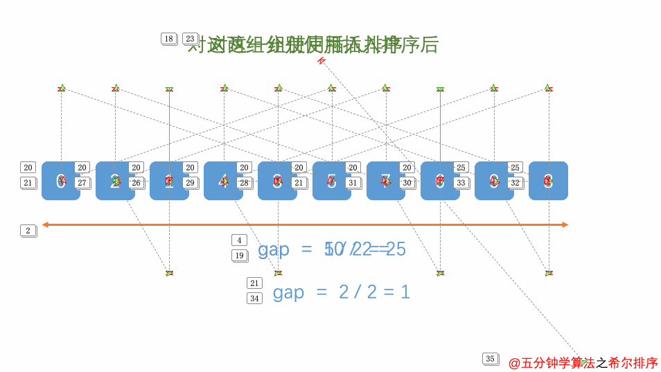

十大经典排序算法
=================

排序算法可以分为内部排序和外部排序。内部排序是数据记录在内存中进行排序，而外部排序是因为排序的数据很大，一次不能容纳全部的排序记录，在排序过程中
需要访问外存。

常见的内部排序算法有：插入排序、希尔排序、选择排序、冒泡排序、归并排序、快速排序、堆排序、基数排序等

.. image::
    res/sort_all.webp

冒泡排序
--------

算法步骤
^^^^^^^^^

1) 比较相邻的元素，如果第一个比第二个大，就交换他们两个
2) 对每一对相邻元素做同样的工作，从开始第一对到结尾最后一对。这步做完，最后的元素会是最大的数
3) 针对所有元素重复以上步骤，除了最后一个
4) 持续每次对越来越少的元素重复上面的步骤，直到没有任何一对数字比较

动画演示
^^^^^^^^^

.. image::
    res/maopao.gif

参考代码
^^^^^^^^^^

::

    #include <stdio.h>
    #include <string.h>
    #include <stdlib.h>

    int *sort(int *nums, int nums_len)
    {
        int *tmp_ptr = (int *)malloc(sizeof(int) * nums_len);

        memcpy(tmp_ptr, nums, nums_len * sizeof(int));
            
        for(int i = 1; i < nums_len; i++)
        {
            for(int j = 0; j < nums_len - i; j++)
            {
                int tmp = tmp_ptr[j];
                if(tmp_ptr[j] > tmp_ptr[j+1])
                {
                    tmp_ptr[j] = tmp_ptr[j+1];
                    tmp_ptr[j+1] =  tmp;
                }
            }
        }
        return tmp_ptr;
    }

    int main()
    {
        int *dst_arr;
        int test_arr[10] = {3, 5, 36, 1, 0, 9, 17, 4, 2, 8};

        dst_arr = sort(test_arr, sizeof(test_arr)/sizeof(int));
        
        for(int i = 0; i < sizeof(test_arr)/sizeof(int); i++)
            printf("dst arr: %d\n", dst_arr[i]);
        return 0;
    }

选择排序
----------

算法步骤
^^^^^^^^^

1) 首先在未排序序列中找到最小(大)元素，存放到排序序列的起始位置
2) 再从剩余未排序元素中继续寻找最小(大)元素，然后放到已排序序列的末尾
3) 重复第二步，直到所有元素排序完毕

动画演示
^^^^^^^^^^

.. image::
    res/xuanze.gif

参考代码
^^^^^^^^^

::

    #include <stdio.h>
    #include <string.h>
    #include <stdlib.h>

    int sort(int *nums, int nums_len)
    {
        int min = 0;

        for(int i = 0; i < nums_len - 1; i++)
        {
            min = i;
            int tmp = nums[min];
            for(int j = i + 1; j < nums_len; j++)
            {
                if(nums[j] < nums[min])
                    min = j;
            }
            nums[i] = nums[min];
            nums[min] = tmp;
        }
        for(int i = 0; i < 10; i++)
            printf("dst arr: %d\n", nums[i]);
    }

    int main()
    {
        int *dst_arr;
        int test_arr[10] = {3, 5, 36, 1, 0, 9, 17, 4, 2, 8};

        sort(test_arr, sizeof(test_arr)/sizeof(int));
        
        return 0;
    }

插入排序
------------

算法步骤
^^^^^^^^^

1) 将排序序列第一个元素看作一个有序序列，把第二个元素到最后一个元素当成是未排序序列
2) 从头到尾一次扫描未排序序列，将扫描到的每个元素插入有序序列的适当位置。(如果待插入的元素与序列中的某个元素相等，则将待插入元素插到相等元素的后面)

动画演示
^^^^^^^^^^

.. image::
    res/charu.gif

参考代码
^^^^^^^^^

::

    #include <stdio.h>
    #include <string.h>
    #include <stdlib.h>

    int sort(int *nums, int nums_len)
    {
        for(int i = 1; i < nums_len; i++)
        {
            int j = i;
            int tmp = nums[i];
            while(j > 0 && tmp < nums[j - 1])
            {
                nums[j] = nums[j - 1];
                j--;
            }
            if(j != i)
                nums[j] =  tmp;
        }
        for(int i = 0; i < 10; i++)
            printf("dst arr: %d\n", nums[i]);
    }

    int main()
    {
        int *dst_arr;
        int test_arr[10] = {3, 5, 36, 1, 0, 9, 17, 4, 2, 8};

        sort(test_arr, sizeof(test_arr)/sizeof(int));
        
        return 0;
    }

希尔排序
----------

算法步骤
^^^^^^^^^

1) 选择一个增量序列t1, t2, .... tk, 其中ti > tj, tk = 1
2) 按增量序列个数k，对序列进行k趟排序
3) 每趟排序，根据对应的增量ti，将待排序序列分割成若干长度为m的子序列，分别对各子表进行插入排序。仅增量因子为1时，整个序列作为一个表来处理，表长度即为整个序列的长度

动画演示
^^^^^^^^^

参考代码
^^^^^^^^^^^

归并排序
---------

算法步骤
^^^^^^^^^

1) 申请空间，使其大小为两个已经已经排序序列之和，该空间用来存放合并后的序列
2) 设定两个指针，最初位置分别为两个已经排序序列的起始位置
3) 比较两个指针所指向的元素，选择相对小的元素放到合并空间，并移动指针到下一位置
4) 重复步骤3直到某一指针到序列尾
5) 将另一序列剩下的所有元素直接复制到合并序列尾

动画演示
^^^^^^^^^^

.. image::

