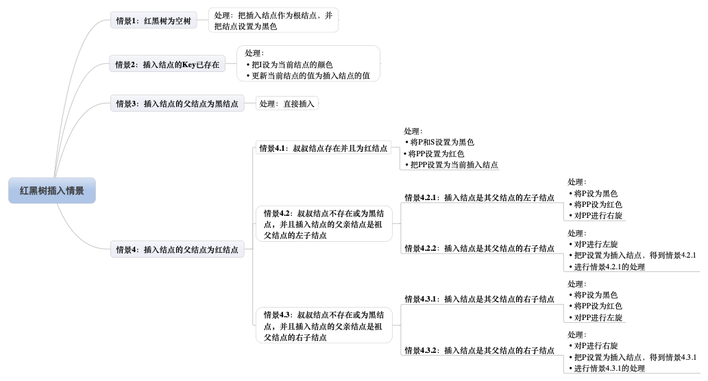

红黑树
========

二叉查找树
------------

对于二叉树中任意一个元素，若其左子树中所有元素的值都小于该元素的值，并且其右子树中所有元素的值都大于该元素的值，这个二叉树就称为搜索二叉树。二叉树中序遍历的结果是从小到大
依次排列的，这也是判断一个二叉树是不是搜索二叉树的依据。

二叉查找树有以下性质

1) 若任意节点的左子树不空，则左子树上所有结点的值均小于它的根节点的值
2) 若任意结点的右子树不空，则右子树上所有结点的值均大于它的根结点的值
3) 任意结点的左右子树也分别为二叉查找树
4) 没有键值相等的结点

AVL数
------

平衡二叉查找树，又被称为AVL树，具有以下性质：它是一棵空树或它的左右两个子树的高度差的绝对值不超过1，并且左右两个子树都是一颗平衡二叉树。由于普通的二叉查找树会容易失去平衡，
极端情况下，二叉查找树会退化成线性的链表，从而导致插入和查找的复杂度都下降到O(n)，所以这也是平衡二叉树设计的初衷。平衡二叉树保持平衡的方法，根据定义，有两个重点，一个是左右
两个子树的高度差的绝对值不能超过1，二是左右两个子树也是一颗平衡二叉树。

红黑树
-------

红黑树是自平衡的二叉查找树，树中的结点有改动时，通过调整结点顺序(旋转)，重新给结点染色，使结点满足某种特殊的性质来保持平衡。红黑树不是完全平衡的二叉树，但能保证搜索操作在O(log n)的时间
复杂度内完成。

红黑树的插入、删除以及旋转、染色操作都是O(log n)的时间复杂度。每个结点只需要用一位(bit)保存颜色(仅为红黑)属性，除此以外，红黑树不需要保存其他信息，所以红黑树与普通二叉查找树的内存开销基本相同。

红黑树是一种具有红色和黑叔链接的平衡查找树，同时满足

1) 红色结点向左倾斜
2) 一个结点不可能有两个红色链接
3) 整个树完全黑色平衡，即从根结点到所有叶子结点的路径上，黑色链接的个数都相同

红黑树性质

1) 结点必须是红色或黑色
2) 根结点必须是黑色
3) 叶节点(NIL)是黑色的，(NIL结点无数据，是空结点)
4) 红色结点必须有两个黑色儿子结点
5) 从任一结点出发到其每个叶子结点的路径，黑色结点的数量是相等的

红黑树术语

1) 黑高 blcak-height: 从某个结点出发(不含该结点)到达一个叶节点的任意一条简单路径上的黑色结点个数称为该结点的黑高，记为bh。红黑树的黑高为其根节点的黑高
2) NIL: 红黑树中的每个结点包含5个属性：color、key、left、right、和p。如果一个结点没有子结点或父结点，则该结点的属性值为NIL。这些NIL被视为指向二叉查找树的叶结点的指针。
3) 哨兵 T.nil: 为了便于处理红黑树代码中的边界条件，使用一个哨兵T.nil来代表所有的NIL
4) 旋转： 红黑树的旋转是一种能保持二叉查找树性质的局部操作。有左旋转和又旋转两种旋转，通过改变树中某些结点的颜色以及指针结构来保持对红黑树进行插入和删除操作后的红黑性质。

下图是一颗简单的红黑树示例

红黑树并不是一个完美平衡二叉查找树，从上图可以看出，根结点的左子树显然比右子树高，但左子树和右子树的黑结点层数是相等的，即任意一个结点到每个叶子结点的路径都包含数量相同的黑结点。
所以我们叫红黑树这种平衡为黑色完美平衡。

红黑可以自平衡，它靠以下三种操作:左旋、右旋、变色

-  左旋： 以某个结点作为支点(旋转结点)，其右子结点变为旋转结点的父结点，右子结点的左子结点变为旋转结点的右子结点，左子结点保持不变

- 右旋：以某个结点作为支点(旋转结点)，其左子结点变为旋转结点的父结点，左子结点的右结点变为旋转结点的左子结点，右子结点保持不变

.. image::
    res/rb_tree_turnright.png

可以看到旋转操作不会影响旋转结点的父结点，父结点以上的结构还是保持不变的。 左旋只影响旋转结点和其右子树的结构，把右子树的结点往左子树挪了。 右旋只影响旋转结点和其左子树的结构，把左子树的结点往右子树挪了。

所以旋转操作是局部的。另外可以看出旋转能保持红黑树平衡的一些端详了：当一边子树的结点少了，那么向另外一边子树“借”一些结点；当一边子树的结点多了，那么向另外一边子树“租”一些结点。

- 变色: 结点颜色由红变黑或由黑变红

红黑树查找
^^^^^^^^^^^

1) 从根结点开始查找，把根结点设置为当前结点
2) 若当前结点为空，返回null
3) 若当前结点不为空，用当前结点的key跟查找key做比较
4) 如果当前结点key等于查找key，那么该key就是查找目标，返回当前结点
5) 若当前结点key大于查找key，把当前结点的左子结点设置为当前结点，重复步骤2
6) 若当前结点key小于查找key，把当前结点的右子结点设置为当前结点，重复步骤2

红黑树插入
^^^^^^^^^^^

红黑树转换演示：

插入操作包括两部分工作：1. 查找插入位置，2插入后自平衡

1) 从根结点开始查找
2) 若根结点为空，那么插入结点作为根结点，结束
3) 若根结点不为空，那么把根节点作为当前结点
4) 若当前结尾为null，返回当前结点的父结点，结束
5) 若当前结点key等于查找key，那么该key所在结点就是插入结点，更新结点的值，结束
6) 若当前结点key大于查找key，把当前结点的左子结点设置为当前结点，重复步骤4
7) 若当前结点key小于查找key，把当前结点的右子结点设置为当前结点，重复步骤4

根据性质4，当前红黑树中从根结点到每个叶子结点的黑色结点数目是一样的，如果插入结点为黑色的话，必然破坏规则，所以插入结点的颜色应该为红色

红黑树中所有插入情景如下

**插入情景1：红黑树为空树**

最简单的一种情景，直接把插入结点作为根节点就行，根据红黑树性质2，把根节点设为黑色

处理：把插入结点作为根结点，并把结点颜色设为黑色

**插入情景2：插入结点的key已存在**

插入结点的key已存在，既然红黑树总是保持平衡，在插入前红黑树已经是平衡的，那么把插入结点设置为将要替代结点的颜色，再把结点的值更新就完成插入

**插入情景3：插入结点的父结点为黑色**

由于插入的结点是红色的，当插入结点的父结点是黑色时， 并不会影响红黑树的平衡，直接插入即可，无需做自平衡

**插入情景4：插入结点的父结点是红色**

红黑树的性质2：根节点是黑色。如果插入的父结点是红结点，那么该父结点不可能为根结点，所以插入结点总是存在祖父结点。这点很重要，因为后续的旋转操作需要祖父结点的参与

情景4又分为很多子情景

**插入情景4.1：叔叔结点存在并且为红结点**

从红黑树性质4可以看出祖父结点肯定为黑结点，因为不可以同时存在两个相连的红结点。那么此时该插入子树的红黑层数的情况是:黑红红。显然最简单的处理方式是把其改为:红黑红。

图示如下

可以看到我们把PP结点设为红色了，如果PP的父结点是黑色，那么无需再做任何处理。但如果PP的父结点是红色，根据性质4，此时红黑树已不再平衡了，所以还需要把PP当作新的插入结点，
继续做插入操作自平衡处理，直到平衡为止。

如果PP为根节点，那么根据性质2，我们必须把PP重新设置为黑色，那么树的红黑结构变为：黑黑红。换句话说，从根结点到叶子结点的路径中，黑色结点增加了。这也是唯一一种会增加红黑树
黑色结点层数的插入情景。

另外还可以总结出另外一个经验：红黑树的生长是自底向上的。这点不同于普通的二叉查找树，普通的二叉查找树的生长是自顶向下的。

**插入情景4.2: 叔叔结点不存在或为黑结点，并且插入结点的父结点是祖父结点的左子结点**

**插入情景4.2.1：插入结点时其父结点的左子结点**

处理：1.将P设为黑色     2. 将PP设为红色     3.对PP进行右旋

由上图可知，左边两个红结点，右边不存在，那么一边一个刚刚好，并且因为红色。肯定不回破坏树的平衡

**插入情景4.2.2: 插入结点是其父结点的右子结点**

处理： 1.对P进行左旋    2.把P设置为插入结点，得到情景4.2.1  3.进行情景4.2.1的处理

**插入情景4.3：叔叔结点不存在或为黑结点，并且插入结点的父结点是祖父结点的右子结点**

**插入情景4.3.1：插入结点是其父结点的右子结点**

处理：1.将P设为黑色     2.将PP设为红色      3.对PP进行左旋

**插入情景4.3.2：插入结点是其父结点的左子结点**

处理：1.对P进行右旋     2.把P设置为插入结点，得到情景4.3.1      3.进行情景4.3.1的处理

红黑树删除
^^^^^^^^^^^^

红黑树的删除操作也包括两部分工作：一是查找目标结点，二是删除后自平衡。

二叉树删除结点找替代结点有3种情景：

1) 若删除结点无子结点，直接删除
2) 如果删除结点只有一个子结点，用子结点替代删除结点
3) 若删除结点有两个子结点，用后继结点(大于删除结点的最小结点也就是删除结点右子树中最左结点)替换删除结点

一个重要思路：删除结点被替代后，在不考虑结点的键值的情况下，对于树来说，可以认为删除的是替代结点。

.. image::
    res/rb_tree_delet.png

红黑树删除情景汇总

为了描述方便，现在约定下

.. image::
    res/rb_tree_delet_r.png

**删除情景1：替换结点是红色结点**

我们把替换结点换到了删除结点的位置时，由于替换结点是红色，删除了也不会影响红黑树的平衡，只要把替换结点的颜色设置为删除结点的颜色即可重新平衡

**删除情景2：替换结点是黑色结点**

当替换结点是黑色时，我们就不得不进行自平衡处理了。我们必须还得考虑替换结点是其父结点的左子结点还是右子结点，来做不同的旋转操作，使树重新平衡。

**删除情景2.1：替换结点是其父结点的左子结点**

处理: 1.将S设为黑色     2.将P设为红色   3.对P进行左旋，得到情景2.1.2.3  4.进行情景2.1.2.3的处理

**删除情景2.1.1：替换结点的兄弟结点时红结点**

处理方式同情景2.1

**删除情景2.1.2: 替换结点的兄弟结点是黑结点**

当兄弟结点为黑时，其父结点和子结点的具体颜色也无法确定，此时需要考虑多种子情景

**删除情景2.1.2.1：替换结点的兄弟结点的右子结点是红结点，左子结点任意颜色**

处理：1.将S的颜色设为P的颜色    2.将P设为黑色   3.将SR设为黑色      4.对P进行左旋

.. image::
    res/rb_tree_delet_2.1.2.1.png

**删除情景2.1.2.2：替换结点的兄弟结点的右子结点为黑结点，左子结点为红结点**

处理：1.将S设为红色     2.将SL设为黑色  3.对S进行右旋，得到情景2.1.2.1  4.进行情景2.1.2.1的处理

**删除情景2.1.2.3：替换结点的兄弟结点的子结点都为黑结点**

处理：1.将S设为红色   2.把P作为替换结点     3.重新进行删除结点情景处理

.. image::
    res/rb_tree_delet_2.1.2.3.png

**删除情景2.2：替换结点是其父结点的右子结点**

与情景2.1类似，方向相反而已

**删除情景2.2.1：替换结点的兄弟结点是红结点**

处理：1.将S设为黑色     2.将P设为红色   3.对P进行右旋得到情景2.2.2.3    4.进行情景2.2.2.3的处理

.. image::
    res/rb_tree_delet_2.2.1.png

**删除情景2.2.2：替换结点的兄弟结点是黑结点**

对此情景进行细分

**删除情景2.2.2.1：替换结点的兄弟结点的左子结点是红结点，右子结点任意颜色**

处理：1.将S的颜色设为P的颜色    2.将P设为黑色   3.将SL设为黑色  4.对P进行右旋

    

**删除情景2.2.2.2：替换结点的兄弟结点的左子结点是黑结点，右子结点为红结点**

处理：1.将S设为红色     2.将SR设为黑色      3.对S进行左旋，得到情景2.2.2.1  4.进行情景2.2.2.1的处理

.. image::
    res/rb_tree_delet_2.2.2.2.png

**删除情景2.2.2.3：替换结点的兄弟结点的子结点都是黑结点**

处理：1.将S设为红色         2.把P作为新的替换结点       3.重新进行删除结点的情景处理

.. image::
    res/rb_tree_delet_2.2.2.3.png

