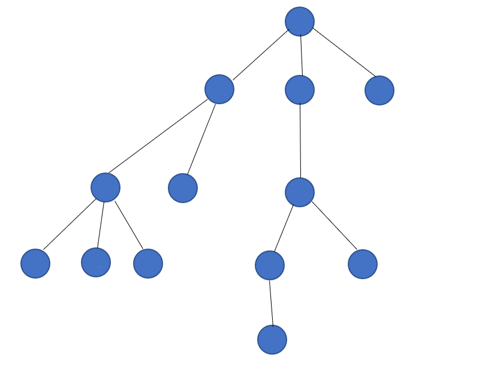
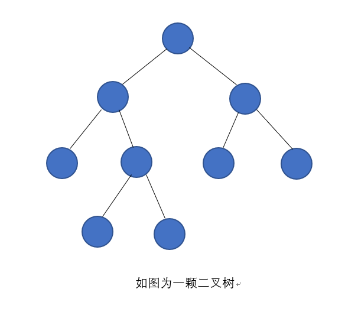
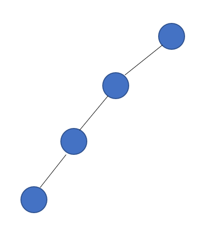
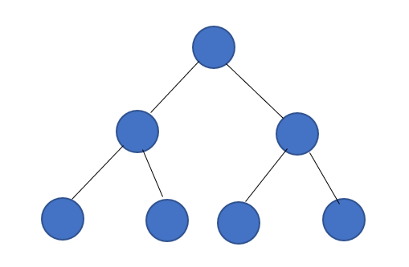
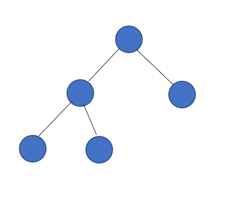
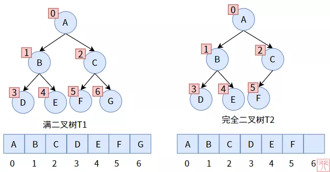
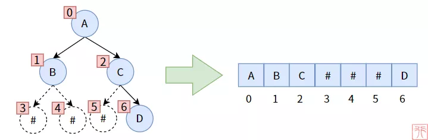
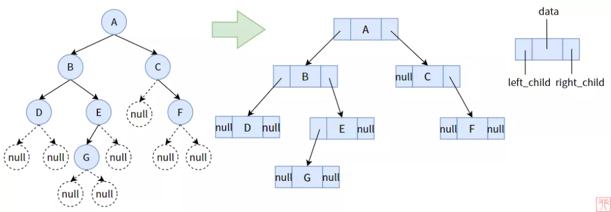
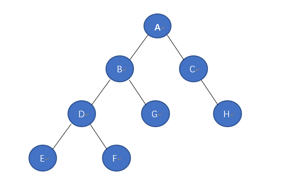

数据结构之树
===============

树的概念
----------

树是数据结构中的一种，其属于非线性数据结构的一种。树由结点和边组成，且不存在任何环的一种数据结构。

- 树的基本术语

===================     ======================================================================================================
 术语                       描述
-------------------     ------------------------------------------------------------------------------------------------------
 节点的度                   树中某个节点的子树的个数
 树的度                     树中各节点的度的最大值
 分支节点                   度不为0的节点
 叶子节点                   度为0的节点
 孩子节点                   某节点的后继节点
 父节点                     该节点为其孩子的父节点
 兄弟节点                   同一父节点的孩子节点互为兄弟节点
 子孙节点                   某节点所有子树中的节点
 祖先节点                   
 节点的层次                 根节点为第一层(以此类推)
 树的高度                   树中节点的最大层次
 有序树                     树中节点子树按次序从左向右排列，次序不能改变
 无序树                     与有序树相反
===================     ======================================================================================================

- 树的性值

1) 树中节点数为节点度树加1(加根节点)
2) 度为m的树中第i层最多有m^(i-1)个节点
3) 高度为h的m次树至多有(m^h-1)/(m-1)个节点
4) 具有n个节点的m次树的最小高度为logm(n(m-1)+1)向上取整

二叉树
--------

二叉树是n个节点的有限集合，该集合可以为空集(称为空二叉树)，或者由一个根节点和两棵互不相交的子树组成，分别称为根节点左子树和右子树

每一个节点中最多拥有一个左结点和右结点，并没有多余的结点，这是很明星的二叉树特征

- 二叉树特点

1) 每个结点最多有两颗子树，所以二叉树中不存在度大于2的结点
2) 左子树和右子树是有顺序的，次序不能任意颠倒
3) 即使树中某结点只有一颗子树，也要区分它是左子树还是右子树

- 二叉树的性质

1) 二叉树第i层上的结点数最多为2^(i-1)个结点
2) 深度为k的二叉树最多有2^k-1个结点
3) 包含n个结点的二叉树高度至少为log2(n+1)
4) 在任意一颗二叉树中，若终端结点的个树为N0，度为2的结点为n2,则n0=n2+1

- 几种特殊的二叉树

斜树: 所有结点都只有左子树的二叉树叫左写树。相反的为右斜树

满二叉树: 在二叉树中所有分支结点都存在左子树和右子树，并且所有叶子结点都在同一层上，这样的二叉树称为满二叉树

满二叉树的特点有:

1) 叶子结点只能出现在最下一层
2) 非叶子结点的度一定是2
3) 在同样深度的二叉树中，满二叉树的结点个树最多，叶子数最多

完全二叉树: 对一颗具有n个结点的二叉树按层编号，如果编号为i(1<=i<=n)的结点与同样深度的满二叉树中的编号为i的结点在二叉树中的位置完全相同，则这颗二叉树称为完全二叉树

二叉树的存储
-------------

二叉树的存储可以有两种方式:顺序存储和链式存储

**顺序存储**

满二叉树

完全二叉树

非满、完全二叉树

这种存储的缺点是，数组中可能会有大量空间未使用，造成浪费

**链式存储**

链式存储则采用链表的方式进行数据存储。也是较为常见的存储方式

一颗二叉树的结点设计一定要有如下内容：

1) 结点元素，data域，用来存储数据可以是int，char等基本类型，也可以是struct等复合数据类型
2) 左孩子结点，left指针
3) 右孩子结点，right指针
4) 父结点(可选)，parent指针

::

    struct node
    {
        int data;
        struct node* left;
        struct node* right;
    };

    struct Tree
    {
        struct node* root;
    };

树的创建
^^^^^^^^^

::

    void insert(struct tree* t, int value)
    {
        struct node* node = (struct node*)malloc(sizeof(struct node));
        node->data = value;
        node->left = NULL;
        node->right = NULL;

        if(t->root == NULL)
        {
            t->root = node;
        }
        else
        {
            struct node* tmp = t->root;
            while(tmp != NULL)
            {
                
            }
        }
    }

二叉树的遍历
--------------

二叉树的遍历可以总结为以下三句话

1) 先序遍历: 根左右
2) 中序遍历: 左根右
3) 后序遍历: 左右根

先序遍历
^^^^^^^^^^

这个二叉树的先序遍历访问顺序就是: ABDEFGCH

::

  /* Pre-Traverse Binary-Tree */
  static void Preorder_Traverse_BinaryTree(struct binary_node *node)
  {
      if (node == NULL) {
          return;
      } else {
          printf("%d ", node->idx);
          /* Traverse left child */
          Preorder_Traverse_BinaryTree(node->left);                                                                                                                                                         
          /* Traverse right child */
          Preorder_Traverse_BinaryTree(node->right);
      }   
  }

中序遍历
^^^^^^^^^^^

这个二叉树的中序遍历访问顺序就是：EDFBGACH

::

      /* Midd-Traverse Binary-Tree */
      static void Middorder_Traverse_BinaryTree(struct binary_node *node)
      {
          if (node == NULL) {
              return;
          } else {
              Middorder_Traverse_BinaryTree(node->left);
              printf("%d ", node->idx);
              Middorder_Traverse_BinaryTree(node->right);
          }   
      }

后序遍历
^^^^^^^^^^^

这个二叉树的后续遍历访问顺序就是: EFDGBHCA

::

      /* Post-Traverse Binary-Tree */
      static void Postorder_Traverse_BinaryTree(struct binary_node *node)
      {
          if (node == NULL) {
              return;
          } else {
              Postorder_Traverse_BinaryTree(node->left);
              Postorder_Traverse_BinaryTree(node->right);
              printf("%d ", node->idx);
          }
      }

