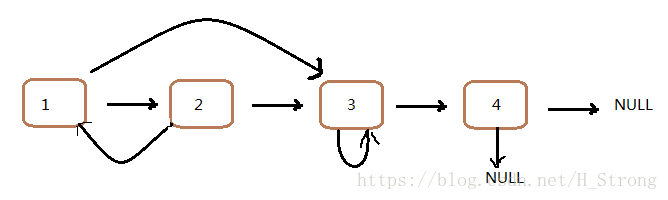
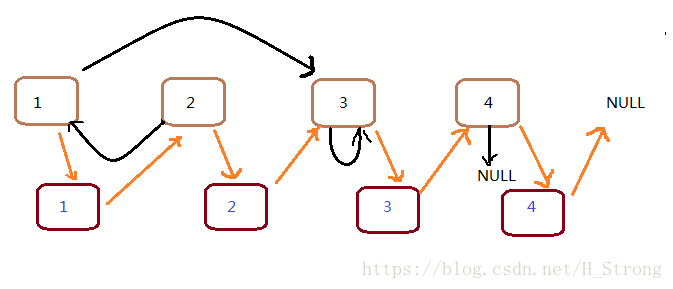
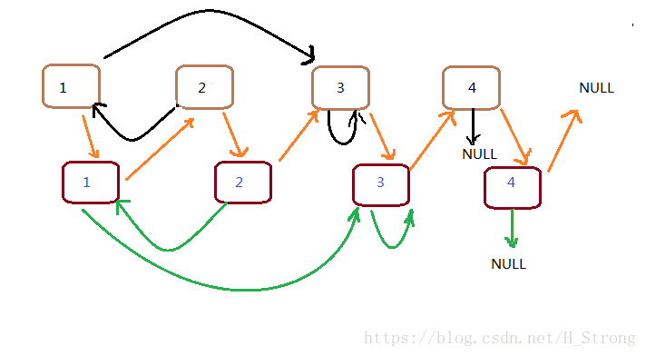
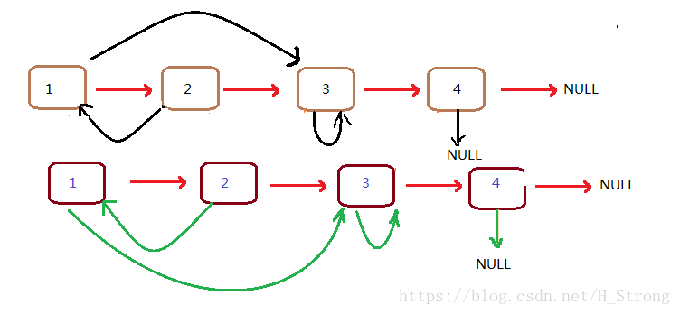

链表操作
==========

从尾到头打印链表
-------------------

题目描述
^^^^^^^^^

输入一个链表的头节点，从尾到头反过来返回每个节点的值（用数组返回）。

示例

::

    输入：head = [1,3,2]
    输出：[2,3,1]

解题思路
^^^^^^^^^^

方法1: 先求链表长度，然后再将链表中元素逆序存入数组中

方法2: 先反转链表并求其长度，在将反转后的链表数据拷贝至数组中

代码
^^^^^^

::

    #include <stdio.h>
    #include <string.h>
    #include <stdlib.h>

    #define USING_METHOD_1
    //#define USING_METHOD_2

    struct ListNode {
        int val;
        struct ListNode *next;
    };

    #ifdef USING_METHOD_1
    int *reversePrint(struct ListNode *head, int *returnSize)
    {
        int listlen= 0;
        struct ListNode *cur = head;
        
        while(cur)
        {
            listlen++;
            cur = cur->next;
        }

        int *arr = (int *)malloc(sizeof(int) * listlen);
        *returnSize = listlen;
        cur = head;

        while(cur)
        {
            *(arr + listlen - 1) = cur->val;
            cur = cur->next;
            listlen--;
        }
        return arr;
    }
    #else
    int *reversePrint(struct ListNode *head, int *returnSize)
    {
        int listlen = 0;
        struct ListNode *cur = head;
        struct ListNode *next = NULL;
        struct ListNode *tail = NULL;

        while(cur)
        {
            
            next = cur->next;
            cur->next = tail;
            tail = cur;

            cur = next;
            listlen++;
        }   //反转链表并求其长度
        int *arr = (int *)malloc(sizeof(int)*listlen);
        *returnSize = listlen;
        cur = tail;
        for(int i = 0; i < listlen; i++)
        {
            arr[i] = cur->val;
            cur = cur->next;
        }
        return arr;
    }
    #endif

    void AddListNode(struct ListNode *head, struct ListNode *node)
    {
        struct ListNode * cur = head;
        while(cur->next)
        {
            cur = cur->next;
        }
        cur->next = node;
        return;
    }

    int main()
    {
        int listlen = 0;
        int *arr;
        static struct ListNode listhead = {.val = 20, .next = NULL};
        struct ListNode node_1 = {.val = 30, .next = NULL};
        struct ListNode node_2 = {.val = 40, .next = NULL};
        struct ListNode node_3 = {.val = 50, .next = NULL};
        struct ListNode node_4 = {.val = 60, .next = NULL};
        struct ListNode node_5 = {.val = 70, .next = NULL};

        AddListNode(&listhead, &node_1);
        AddListNode(&listhead, &node_2);
        AddListNode(&listhead, &node_3);
        AddListNode(&listhead, &node_4);
        AddListNode(&listhead, &node_5);

        arr = reversePrint(&listhead, &listlen);
        for(int i = 0; i < listlen; i++)
            printf("%d\n", arr[i]);

        return 0;
    }

删除链表的节点
-----------------

题目描述
^^^^^^^^^^

给定单向链表的头指针和一个要删除的节点的值，定义一个函数删除该节点。

返回删除后的链表的头节点。

示例

::

    输入: head = [4,5,1,9], val = 5
    输出: [4,1,9]
    解释: 给定你链表中值为 5 的第二个节点，那么在调用了你的函数之后，该链表应变为 4 -> 1 -> 9.

题目解析
^^^^^^^^^^

遍历链表，当head.val == val时，定位到目标节点

定位到目标节点后，需要修改这个节点，题目的要求是删除，对于链表中的每个节点来说，它都有前驱和后继两个节点，那么删除操作就很简单了：设节点 cur 的前驱节点为 pre ，后继节点为 cur.next ，执行 pre.next = cur.next ，即可实现删除 cur 节点。

代码
^^^^^^

::

    #include <stdio.h>
    #include <string.h>
    #include <stdlib.h>

    struct list_node
    {
        int value;
        struct list_node* next;
    };

    int insert_listnode(struct list_node *head, struct list_node *node)
    {
        struct list_node *cur = head;
        while(cur->next)
        {
            cur = cur->next;
        }
        cur->next = node;
        return 0;
    }

    struct list_node* delete_listnode(struct list_node *head, int value)
    {
        struct list_node *cur = head;
        struct list_node *prev = NULL;

        while(cur)
        {
            if(cur->value == value)
            {
                if(cur == head)
                {
                    return head->next;
                }
                prev->next = cur->next;
                return head;
            }
            prev = cur;
            cur = cur->next;
        }
        return NULL;
    }

    int traverse_listnode(struct list_node *head)
    {
        struct list_node *cur = head;
        unsigned int i = 0;
        while(cur)
        {
            printf("list node %d  --->  %d\n", i++, cur->value);
            cur = cur->next;
        }
        return 0;
    }

    int main()
    {
        int* ret = 0;
        struct list_node node_0 = {.value = 10, .next = NULL};
        struct list_node node_1 = {.value = 3, .next = NULL};
        struct list_node node_2 = {.value = 2, .next = NULL};
        struct list_node node_3 = {.value = 8, .next = NULL};
        struct list_node node_4 = {.value = 0, .next = NULL};
        struct list_node node_5 = {.value = 5, .next = NULL};

        struct list_node *head = &node_0;

        insert_listnode(head, &node_1);
        insert_listnode(head, &node_2);
        insert_listnode(head, &node_3);
        insert_listnode(head, &node_4);
        insert_listnode(head, &node_5);

        ret = delete_listnode(head, 10);
        if(ret == NULL)
            printf("not found list node\n");
        else
            head = ret;

        traverse_listnode(head);
        return 0;
    }

链表中倒数第 K 个节点
------------------------

题目描述
^^^^^^^^^^

输入一个链表，输出该链表中倒数第 k 个节点。为了符合大多数人的习惯，本题从 1 开始计数，即链表的尾节点是倒数第 1 个节点。

示例

::

    给定一个链表: 1->2->3->4->5, 和 k = 2.

    返回链表 4->5.

解析思路
^^^^^^^^^

1、初始化两个指针 fast 和 slow，一开始都指向链表的头节点
2、前指针 fast 先向前走 k 步
3、两个指针 fast 和 slow 同时向前移动，直到前指针slow 指向 NULL
4、最后返回 slow

代码
^^^^^

::
    
    #include <stdio.h>
    #include <string.h>
    #include <stdlib.h>

    struct list_node
    {
        int value;
        struct list_node* next;
    };

    int insert_listnode(struct list_node *head, struct list_node *node)
    {
        struct list_node *cur = head;
        while(cur->next)
        {
            cur = cur->next;
        }
        cur->next = node;
        return 0;
    }

    struct list_node* delete_listnode(struct list_node *head, int value)
    {
        struct list_node *cur = head;
        struct list_node *prev = NULL;

        while(cur)
        {
            if(cur->value == value)
            {
                if(cur == head)
                {
                    return head->next;
                }
                prev->next = cur->next;
                return head;
            }
            prev = cur;
            cur = cur->next;
        }
        return NULL;
    }

    int traverse_listnode(struct list_node *head)
    {
        struct list_node *cur = head;
        unsigned int i = 0;
        while(cur)
        {
            printf("list node %d  --->  %d\n", i++, cur->value);
            cur = cur->next;
        }
        return 0;
    }

    struct list_node* getKthFromEnd(struct list_node *head, int k)
    {
        struct list_node *fast = head;
        struct list_node *slow = head;

        for(int i = 0; i < k; i++)
        {
            fast = fast->next;
        }
        while(fast)
        {
            slow = slow->next;
            fast = fast->next;
        }
        return slow;
    }

    int main()
    {
        int* ret = 0;
        struct list_node node_0 = {.value = 10, .next = NULL};
        struct list_node node_1 = {.value = 3, .next = NULL};
        struct list_node node_2 = {.value = 2, .next = NULL};
        struct list_node node_3 = {.value = 8, .next = NULL};
        struct list_node node_4 = {.value = 0, .next = NULL};
        struct list_node node_5 = {.value = 5, .next = NULL};

        struct list_node *head = &node_0;

        insert_listnode(head, &node_1);
        insert_listnode(head, &node_2);
        insert_listnode(head, &node_3);
        insert_listnode(head, &node_4);
        insert_listnode(head, &node_5);

        struct list_node *new = getKthFromEnd(head, 3);
        
        traverse_listnode(new);
        return 0;
    }

反转链表
----------

题目描述
^^^^^^^^^

给你单链表的头节点 head ，请你反转链表，并返回反转后的链表。

题目解析
^^^^^^^^^

1) 通过递归函数，一直递归到链表的最后一个结点为止，此时，该结点就是反转成功后的头结点，是最终的返回结果。
2) 在递归函数中，让当前节点的下一个节点的 next 指针指向当前节点。
3) 在递归函数中，让当前节点的 next 指针指向 null
4) 通过二三步的操作，已经让递归函数中的链表实现了局部反转，将结果返回给上一层递归函数
5) 所有递归结束后，链表反转成功。

代码
^^^^^

::

    #include <stdio.h>
    #include <string.h>
    #include <stdlib.h>

    #define ARRAY_SIZE 12

    struct list_node
    {
        int value;
        struct list_node *next;
    };

    int insert_listnode(struct list_node *head, struct list_node *node)
    {
        struct list_node *cur = head;
        while(cur->next)
        {
            cur = cur->next;
        }
        cur->next = node;
        return 0;
    }

    struct list_node* delete_listnode(struct list_node *head, int value)
    {
        struct list_node *cur = head;
        struct list_node *prev = NULL;

        while(cur)
        {
            if(cur->value == value)
            {
                if(cur == head)
                {
                    return head->next;
                }
                prev->next = cur->next;
                return head;
            }
            prev = cur;
            cur = cur->next;
        }
        return NULL;
    }

    int traverse_listnode(struct list_node *head)
    {
        struct list_node *cur = head;
        unsigned int i = 0;
        while(cur)
        {
            printf("list node %d  --->  %d\n", i++, cur->value);
            cur = cur->next;
        }
        return 0;
    }

    struct list_node* getKthFromEnd(struct list_node *head, int k)
    {
        struct list_node *fast = head;
        struct list_node *slow = head;

        for(int i = 0; i < k; i++)
        {
            fast = fast->next;
        }
        while(fast)
        {
            slow = slow->next;
            fast = fast->next;
        }
        return slow;
    }

    struct list_node* reverseList(struct list_node *head)
    {
        struct list_node *cur = head;
        struct list_node *tail = NULL, *next = NULL;

        while(cur)
        {
            next = cur->next;
            cur->next = tail;
            tail = cur;
            cur = next;
        }
        return tail;
    }

    struct list_node* reverseList_recusion(struct list_node *head)
    {
        if( head == NULL || head->next == NULL)
            return head;

        struct list_node *cur = reverseList_recusion(head->next);

        head->next->next = head;
        head->next = NULL;
        return  cur;
    }

    int main()
    {
        int* ret = 0;
        struct list_node node_0 = {.value = 10, .next = NULL};
        struct list_node node_1 = {.value = 3, .next = NULL};
        struct list_node node_2 = {.value = 2, .next = NULL};
        struct list_node node_3 = {.value = 8, .next = NULL};
        struct list_node node_4 = {.value = 0, .next = NULL};
        struct list_node node_5 = {.value = 5, .next = NULL};

        struct list_node *head = &node_0;

        insert_listnode(head, &node_1);
        insert_listnode(head, &node_2);
        insert_listnode(head, &node_3);
        insert_listnode(head, &node_4);
        insert_listnode(head, &node_5);

        //struct list_node *new = reverseList(head);
        struct list_node *new = reverseList_recusion(head);
        
        traverse_listnode(new);
        return 0;
    }

复杂链表的复制
--------------

题目描述
^^^^^^^^^^

请实现 copyRandomList 函数，复制一个复杂链表。在复杂链表中，每个节点除了有一个 next 指针指向下一个节点，还有一个 random 指针指向链表中的任意节点或者 null。

题目解析
^^^^^^^^^^

首先我得思路是创建一个新的链表，依次复制每个节点，但是问题出现了，random指向一个随机值，这个随机值可能没有创建呢，所以依次复制会出现错误。 random的复制成了难题。

假定现在有一个复杂链表的形状如下图：

1.首先我们在每个链表节点的后面创建一个新的节点，将其串联起来。如下图的黄色箭头所示。

2.接下来，我们将它的新节点的random指向该指的地方，如下图的绿色箭头所示。

3.接下来我们把两个混在一起的链表拆开，拆开就可以变成两个链表。

代码
^^^^^

::

    #include <stdio.h>
    #include <string.h>
    #include <stdlib.h>

    struct list_node
    {
        int value;
        struct list_node *next;
        struct list_node *random;
    };

    struct list_node* create_listnode(int value)
    {
        struct list_node *node = (struct list_node *)malloc(sizeof(struct list_node));
        if(node != NULL)
        {
            node->value = value;
            node->next = NULL;
            node->random = NULL;
        }
        return node;
    }

    int traverse_listnode(struct list_node *head)
    {
        struct list_node *cur = head;
        unsigned int i = 0;
        while(cur)
        {
            printf("list node %d  --->  %d, list node random --->  %d\n", i++, cur->value, cur->random->value);
            cur = cur->next;
        }
        return 0;
    }

    struct list_node * copy_list(struct list_node *head)
    {
        struct list_node *cur = head;
        struct list_node *copy = NULL;
        struct list_node *next = NULL;
        struct list_node *new_list = NULL;

        while(cur)
        {
            next = cur->next;
            copy = create_listnode(cur->value);
            copy->next = next;
            cur->next = copy;
            cur = next;
        }

        cur = head;
        while(cur)
        {
            if(cur->random != NULL)
            {
                copy = cur->next;
                copy->random = cur->random->next;
            }
            cur = cur->next->next;
        }

        cur = head;
        new_list = cur->next;

        while(cur)
        {
            copy = cur->next;
            next = cur->next->next;

            cur->next = next;
            copy->next = next ? next->next : NULL;
            cur = next;
        }
        return new_list;
    }

    int main()
    {
        struct list_node *node0 = create_listnode(1);
        struct list_node *node1 = create_listnode(3);
        struct list_node *node2 = create_listnode(5);
        struct list_node *node3 = create_listnode(9);

        node0->next = node1;
        node1->next = node2;
        node2->next = node3;
        
        node0->random = node3;
        node1->random = node0;
        node2->random = node1;
        node3->random = node2;
        //struct list_node *new = reverseList(head);
        struct list_node *new = copy_list(node0);
        traverse_listnode(new);  
        return 0;
    }

两个链表的第一个公共结点
-------------------------

题目描述
^^^^^^^^^^

编写一个程序，找到两个单链表相交的起始节点。

题目解析
^^^^^^^^^

无论 A、B 两个链表是否有相交点，最终都会指向一个相同的节点，要么是它们的公共尾部，要么是 NULL。

让指针 pointA 和 pointB 分别指向链表 A 和链表 B 的头结点，之后两个指针分别以步幅为 1 的速度向链表的尾部遍历。

当指针 pointA 遍历到链表 A 的尾节点时，此时指针 pointA 走了 a 个节点，将指针 pointA 指向链表 B 的头部，继续向后遍历，直至走到 c1，此时指针 pointA 总共走了 a + ( b - c  ) 步。

当指针 pointB 遍历到链表 B 的尾节点时，此时指针 pointB 走了 b 个节点，将指针 pointB 指向链表 A 的头部，继续向后遍历，直至走到 c1，此时指针 pointB 总共走了 b + ( a - c  ) 步。

根据数学知识，a + ( b - c  ) = b + ( a - c  ) ，如果 c > 0，表明两链表有公共尾部， c1 存在，两两链表同时到达 c1；如果 c = 0，表明两链表没有公共尾部，指针 pointA 和 pointB 都指向

代码
^^^^^

::

    #include <stdio.h>
    #include <string.h>
    #include <stdlib.h>

    struct list_node
    {
        int value;
        struct list_node *next;
    };

    int insert_listnode(struct list_node *head, struct list_node *node)
    {
        struct list_node *cur = head;
        while(cur->next)
        {
            cur = cur->next;
        }
        cur->next = node;
        return 0;
    }

    struct list_node* delete_listnode(struct list_node *head, int value)
    {
        struct list_node *cur = head;
        struct list_node *prev = NULL;

        while(cur)
        {
            if(cur->value == value)
            {
                if(cur == head)
                {
                    return head->next;
                }
                prev->next = cur->next;
                return head;
            }
            prev = cur;
            cur = cur->next;
        }
        return NULL;
    }

    int traverse_listnode(struct list_node *head)
    {
        struct list_node *cur = head;
        unsigned int i = 0;
        while(cur)
        {
            printf("list node %d  --->  %d\n", i++, cur->value);
            cur = cur->next;
        }
        return 0;
    }

    struct list_node* getKthFromEnd(struct list_node *head, int k)
    {
        struct list_node *fast = head;
        struct list_node *slow = head;

        for(int i = 0; i < k; i++)
        {
            fast = fast->next;
        }
        while(fast)
        {
            slow = slow->next;
            fast = fast->next;
        }
        return slow;
    }

    struct list_node* reverseList(struct list_node *head)
    {
        struct list_node *cur = head;
        struct list_node *tail = NULL, *next = NULL;

        while(cur)
        {
            next = cur->next;
            cur->next = tail;
            tail = cur;
            cur = next;
        }
        return tail;
    }

    struct list_node* reverseList_recusion(struct list_node *head)
    {
        if( head == NULL || head->next == NULL)
            return head;

        struct list_node *cur = reverseList_recusion(head->next);

        head->next->next = head;
        head->next = NULL;
        return  cur;
    }

    struct list_node* getIntersectionNode(struct list_node *head_1, struct list_node *head_2)
    {
        struct list_node *list_1 = head_1, *list_2 = head_2;
        
        while(list_1 != list_2)
        {
            list_1 = list_1->next;
            list_2 = list_2->next;

            if(list_1 == NULL)
                list_1 = head_2;
            if(list_2 == NULL)
                list_2 = head_1;
        }
        return list_1;
    }

    int main()
    {
        struct list_node node_0 = {.value = 10, .next = NULL};
        struct list_node node_1 = {.value = 3, .next = NULL};
        struct list_node node_2 = {.value = 2, .next = NULL};
        struct list_node node_3 = {.value = 8, .next = NULL};
        struct list_node node_4 = {.value = 0, .next = NULL};
        struct list_node node_5 = {.value = 5, .next = NULL};
        struct list_node node_6 = {.value = 15, .next = NULL};
        struct list_node node_7 = {.value = 12, .next = NULL};
        struct list_node node_8 = {.value = 3, .next = NULL};
        struct list_node node_9 = {.value = 9, .next = NULL};

        struct list_node *head = &node_0;
        struct list_node *head_1 = &node_9;

        insert_listnode(head, &node_1);
        insert_listnode(head, &node_2);
        insert_listnode(head, &node_3);
        insert_listnode(head, &node_4);
        insert_listnode(head, &node_5);

        insert_listnode(head_1, &node_8);
        insert_listnode(head_1, &node_7);
        insert_listnode(head_1, &node_6);
        insert_listnode(head_1, &node_3);
        //struct list_node *new = reverseList(head);
        struct list_node *new = getIntersectionNode(head, head_1);
        printf("first intersetion node is %d\n", new->value);
        
        return 0;
    }
