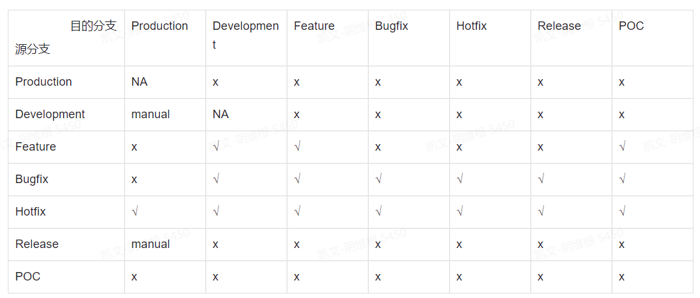

分支/标签管理规范
====================

分支管理规范
----------------

分支模型
^^^^^^^^^^^

**Development分支**

功能开发分支，此分支为代码最新的开发状态

分支约束条件：

1) 只能通过代码合并请求(pull request)对分支状态进行修改
2) 禁止修改代码提交历史
3) 禁止删除

**Production分支**

产品分支，用于部署生产环境的分支。此分支为代码最新的稳定状态

分支约束条件：

1) 禁止一切代码修改(只能通过管理员临时修改权限后进行修改)
2) 禁止修改代码提交历史
3) 禁止删除

**Feature分支**

开发新功能分支。Feature分支需要基于最新的Development分支创建，并且在新的特性开发完成后合入Development分支

分支约束条件：无

**Bugfix分支**

对Development分支或Release分支上存在的bug进行修复

分支约束条件：无

**Hotfix分支**

对Production分支或Release分支上存在的bug进行修复

分支约束条件：无

**Release分支**

对Development分支的功能达到计划预期后，可以创建发布分支。发布分支用于交付给测试团队进行测试使用。发布分支中只能进行bug修复，不能向发布分支中添加或修改功能。

分支约束条件

1) 只能通过代码合并请求(pull request)对分支状态进行修改
2) 禁止修改代码提交历史
3) 禁止删除

**POC分支**

对于POC(概念验证)项目需要快速迭代更新一些新的功能代码，可以在develop/master分支基础上创建POC分支进行开发。POC分支中开发的代码可以降低代码质量和测试指标的要求，但是POC分支
禁止合入Development分支

约束条件：无

分支命名规范
^^^^^^^^^^^^^^

=============   =========================================================================================================
 分支类型           分支名称
-------------   ---------------------------------------------------------------------------------------------------------
 Development            development
 Production             master
 Feature                feature/<user_name>/<feature_brief>
 Bugfix                 bugfix/<user_name>/<bug_brief>
 Hotfix                 hotfix/<user_name>/<bug_brief>
 Release                release/v<Major>.<Minor>-[postfix]    release/<PROJECT_CODE>/R<release-number>[-postfix]
 POC                    poc/<PROJECT_CODE>
=============   =========================================================================================================

**分支合并规则矩阵**

标签管理规范
--------------

标签用于标记一个工程的代码状态

可以对Development/Release分支中的代码状态进行打标签操作

一般只需要在代码状态正式交付时打标签

**标签命名规范**

v<Major>.<Minor>.<Patch>

