markdown 语法
===============

标题
------

markdown中使用 ``#`` 来创建标题, ``#`` 的数量代表了标题的级别． 

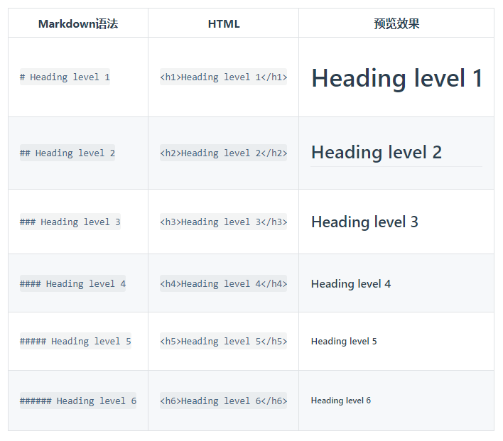

段落
------

需要创建段落，则使用空白行进行分割

换行
-----

在一行的末尾添加两个或多个空格，然后按回车键，则可以创建一个换行

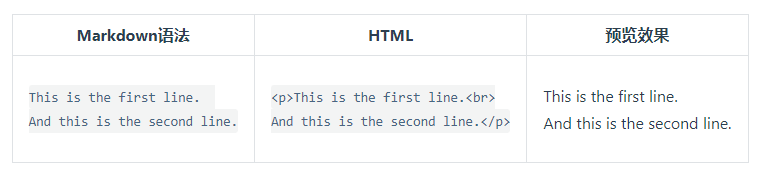

强调
-----

粗体
^^^^^^

如果要加粗文本，则在要加粗的文本前后添加两个星号或下划线

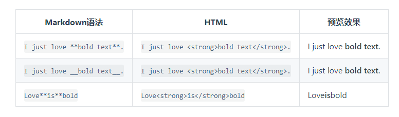

斜体
^^^^^^

在文本前后添加一个星号或下划线,则会实现斜体

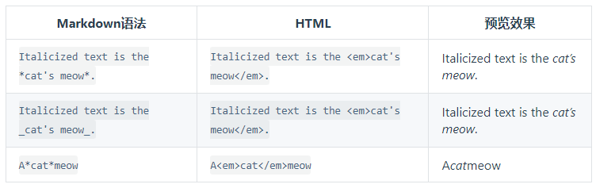

要同时使用粗体和斜体，则需要使用三个星号或下划线

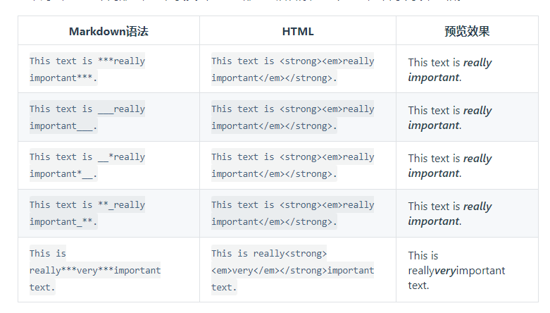

引用
-----

- 要创建块引用，则在段落前加一个 ``>`` 符号

::

    > Dorothy followed her through many of the beautiful rooms in her castle.

渲染效果如下

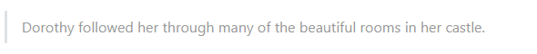

- 多个段落的块引用，则在段落之间空白行添加一个 ``>``

::

    > Dorothy followed her through many of the beautiful rooms in her castle.
    >
    > The Witch bade her clean the pots and kettles and sweep the floor and keep the fire fed with wood.

渲染效果如下

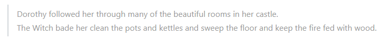

- 嵌套块引用，在要嵌套的段落前添加一个 ``>>`` 符号

::
    
    > Dorothy followed her through many of the beautiful rooms in her castle.
    >
    >> The Witch bade her clean the pots and kettles and sweep the floor and keep the fire fed with wood.

渲染效果如下

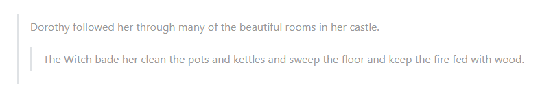

- 带有其他元素的块引用

::

    > #### The quarterly results look great!
    >
    > - Revenue was off the chart.
    > - Profits were higher than ever.
    >
    >  *Everything* is going according to **plan**.

渲染效果如下

列表
-----

在每个列表项前加数字和英文句点可以创建有序表

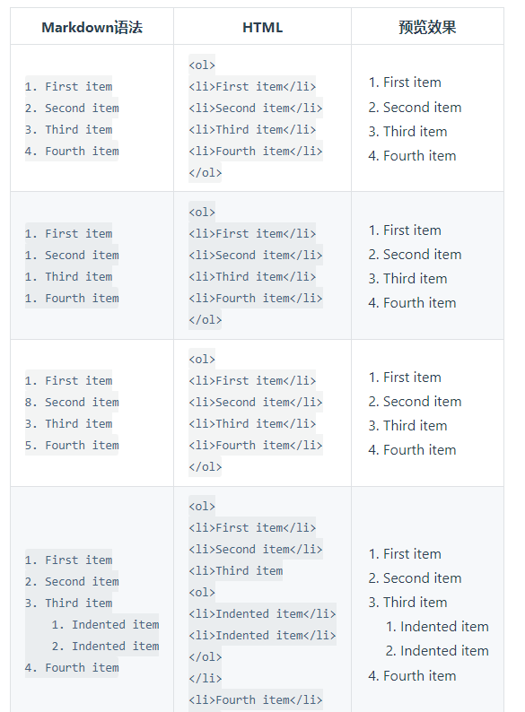

在每个列表项前面添加 ``-`` , ``*`` , ``+`` ,则可以创建无序表

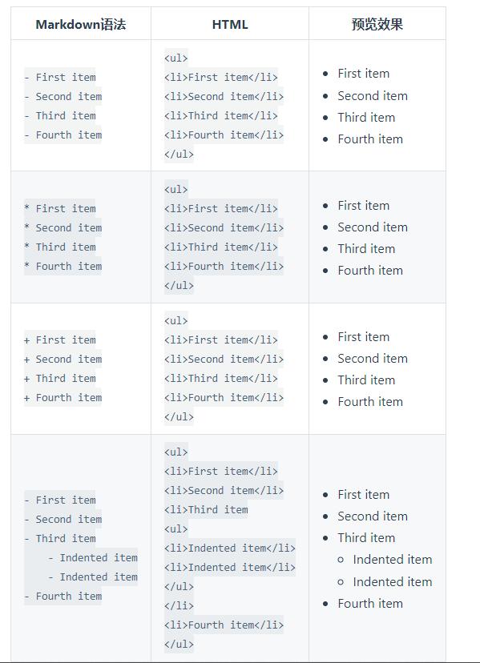

在列表中嵌套其他元素时，需要将该元素缩进四个空格或一个制表符

::

    *   This is the first list item.
    *   Here's the second list item.

        I need to add another paragraph below the second list item.

    *   And here's the third list item.

渲染效果如下

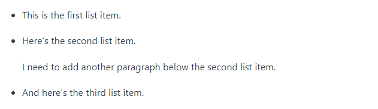

代码
-----

要将单词或短语表示为代码，请将其包裹在反引号 (`) 中。

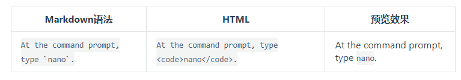

要创建代码块则需要在每一行缩进至少四个空格或一个制表符

分割线
--------

如果需要创建分割线，则在单独一行上使用三个或多个星号(***),破折号 (---) 或下划线 (___) ，并且不能包含其他内容。

::

    ***

    ---

    _______________

链接
---------

::

    超链接语法
    [超链接显示名](超链接地址　"超链接title")

示例

::

    这是一个链接 [Markdown语法](https://markdown.com.cn)。

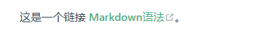

使用尖括号可以很方便地把URL或者email地址变成可点击的链接。

::

    <https://markdown.com.cn>
    <fake@example.com>

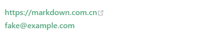

图片
------

::

    图片markdown语法:
    

    例子
    

转义字符
----------

内嵌HTML标签
-----------------

