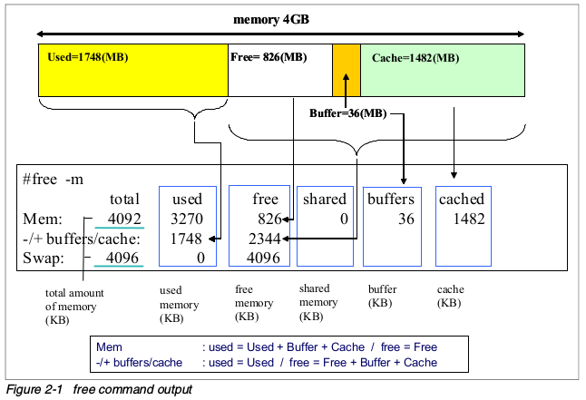

性能优化
========

分析系统瓶颈
------------

性能优化就是找到系统处理中的瓶颈以及除去这些的过程。

性能优化其实是对OS各子系统达到平衡的定义，这些子系统包括： ``CPU`` ``Memory`` ``IO`` ``Network`` .这些子系统之间是相互依赖的，任何一个子系统的高负荷都会
导致其他子系统出现问题。

比如：

1.大量的页调入请求导致内存队列的拥堵

2.网卡的大吞吐量可能导致更多的CPU开销

3.大量的写磁盘请求会导致CPU以及IO的问题

perf 应用教程

http://www.brendangregg.com/perf.html

.. image:: res/linux_observability_tools.png

分析内存瓶颈
------------

在linux的内存分配机制中，优先使用物理内存,当物理内存还有空闲时不会释放其占用的内存，就算占用内存的程序已经关闭，该程序所占用的内存可以用来做缓存使用对于开启过的程序
或者是刚存取过的数据会比较快

一般有这样的一个经验公式：应用程序可用内存大于70%时,表示系统内存资源充足,不影响系统性能

虚拟内存时Linux kernel 使用虚拟内存机制来利用磁盘对内存的空间进行扩展,kernel将在那时不用的内存写入到磁盘从而释放出更多的可用内存,当这些数据再次被使用时会被重新加载到内存中
。做虚拟内存的磁盘空间被称作时swap space. 对于硬盘的读写相对于内存来说速度要慢许多因此使用了虚拟内存的程序，速度相应会变慢，虚拟内存的使用往往被认为时内存出现瓶颈的标志。

内存分页(memory paging)和内存交换(memory swapping)

memory paging 是一个定时将内存数据同步回磁盘的过程。当系统内存不足时，系统回将最近不常用的内存段交换到交换空间, 出现pageout. 当程序要读的文件在内存中没有找到，这时候出现
page fault 从磁盘中读取到内存.

pmap 命令可以用来查看进程的内存映射使用这个命令可以找出内存瓶颈的原因。

vmstat 命令可以查看cpu使用率, 内存使用, 虚拟内存交换情况, io读写情况

一般情况下vmstat工具可以通过两个数字参数完成, 第一参数是采样的时间间隔, 第二个参数是采样的次数.

r 在运行队列中等待的进程数

b 在等待io的进程数

swpd 指切换到内存交换去的内存数量(以K为单位)，如果swpd的值不为0,或者比较大,只要si so的值长期为0, 这种情况一般不用担心, 不会影响系统性能,

free 表示空闲的物理内存

buffer  表示buffers cache的内存数量, 一般对块设备的读写才需要缓冲

cache 表示page cache的内存数量, 一般作为文件系统的cached . 频繁访问的文件都会被cached，如果cached的值比较大, 说明cached的文件比较多. 也就是常说的高速缓存

si 从磁盘交换到内存的交换页数量, 单位KB/s 

so 从内存交换到磁盘的交换页数量,单位是KB/s

一般情况下, si so的值都为0, 如果si so的值长期不为0，则表示系统内存不足

在linux中, 分页(paging)和交换(swapping)是有区别的，分页是吧独立的页移动到磁盘上的一个交换分区. 交换是一个大型操作, 把进程所有的地址空间一次性全部移动到交换分区.
交换可能是有两种因素引起的

1. 进程进入睡眠模式,这种事情经常发生,因为进程依赖于交互操作,编辑器,shell等,应用程序把大多数的时间花在等待用户输入数据上,在此期间进程是非激活的

2. 进程异常行为.

分页可能是严重的性能问题

- 性能调优选项

1.  使用bigpages hugetlb和共享内存调优swap空间

2.  增加或者减少页大小

3.  调整page-out 率

4.  增加内存

优化内存子系统需要持续的观察,确保所作出的修改不会对其他的子系统产生不好的影响，如果要修改/proc/sys/vm下的虚拟内存参数, 建议每次只该一个参数, 然后观察性能变化

linux上大多数应用并不直接把数据写入磁盘，他们先写入由虚拟内存管理器维护的文件系统缓冲中,最后刷入数据到磁盘. 

- /proc/sys/vm/swappiness 

这个参数用来定义如何把内存交换到磁盘,通过修改此参数中的百分比,可以控制swap行为,如果不希望发生交换,那应该设很小的值. 可以通过echo 或者 sysctl改变交换行为

::

    sysctl -w vm.swappiness=100

- /proc/sys/vm/dirty_background_ratio 

此参数定义了达到的内存百分比时，pdflush守护进程把数据写入到磁盘,如果希望更大写入则把默认值增加到10% ,值越大写入的频率越低

::

    sysctl -w vm.dirty_background_ratio=25

- /proc/sys/vm/dirty_ratio

此参数设置了应用程序生成的脏页被写入磁盘的百分比

::

    sysctl -w vm.dirty_ratio=20

- swap分区

磁盘上空闲的分区可以创建为swap分区,如果没有空闲分区怎可以创建swap文件, swap分区是优于swap文件的,swap的I/O操作可以绕过文件系统,节省了写入文件的开销,比写入swap文件的性能更好

另一种提升swap分区和文件性能的办法是建立多个swap分区，linux可以并行的读写多个swap分区

swap分区可以在/etc/fstab文件中创建

- HugeTLBfs

对于大量使用虚拟地址空间的应用来说，内存管理是很有用的，CPU的旁路转换缓冲是保存虚拟到物理映射信息的小缓冲区,使用TLB，可以不用参考内存页表的虚拟地址映射就能完成转换. 为了保证转换速度够快
TLB通常被设置的很多,经常有大内存的应用超过TLB的映射能力

HugeTLBfs特性让应用使用比通常更大的页大小,大页可以是正常页的1000倍. 这个功能是通过文件系统接口向应用程序开放的

::

    sysctl -w vm.nr_hugepages=512

如果应用程序使用mmap()系统调用使用大页,则必须挂载hugetlb类型的文件系统

::

    mount -t hugetlbfs none /mnt/hugepages

分析IO瓶颈
----------

分析系统调用
------------

优化程序代码
------------

监控工具
--------

- linux性能监控常用工具

+-------------------+----------------------------+
|    工具           |  常用功能                  | 
+===================+============================+
|    top            | 所有进程情况               |
+-------------------+----------------------------+
|    vmstat         | 系统活动硬件和系统信息     |
+-------------------+----------------------------+
|    uptime         | 系统平均负载               |
+-------------------+----------------------------+
|    ps,pstree      | 显示进程                   |
+-------------------+----------------------------+
|    free           | 内存使用情况               |
+-------------------+----------------------------+
|    iostat         | cpu负载和磁盘活动          |
+-------------------+----------------------------+
|    sar            | 收集和报告系统状态         |
+-------------------+----------------------------+
|    mpstat         | 多处理器使用情况           |
+-------------------+----------------------------+
|    numastat       | NUMA相关统计               |
+-------------------+----------------------------+
|    pmap           | 进程内存情况               |
+-------------------+----------------------------+
|    netstat        | 网络统计                   |
+-------------------+----------------------------+
|    iptraf         | 实时网络统计               |
+-------------------+----------------------------+
| tcpdump,ethereal  | 详细网络流量分析           |
+-------------------+----------------------------+
|    nmon           | 收集和报告系统活动         |
+-------------------+----------------------------+
|    strace         | 系统调用                   |
+-------------------+----------------------------+
|    proc文件系统   | 各种内核统计信息           |
+-------------------+----------------------------+
| KDE system guard  | 实时的系统图形报告         |
+-------------------+----------------------------+
| Gnome system moni | 实时的系统图形报告         |
+-------------------+----------------------------+

top
^^^

``top`` 命令会展示进程的实际活动,默认情况下它会列出系统上所有cpu密集型任务,并且每5s刷新一次列表,你可以对PID，生存时间,以及常驻内存使用率和时间(进程启动开始占用CPU的时间)进行排序。

- top输出的各列:

1) PID 进程号
2) USER 进程所有者的名字
3) PRI 进程优先级
4) NI nice级别
5) VIRT 进程使用的虚拟内存总量,单位是kb. VIRT=SWAP+RES
6) RES 进程使用的,未被换出的物理内存大小,单位是kb, RES=CORE+DATA
7) SHR 共享内存大小
8) S 进程状态. D=不可中断的睡眠状态 R=运行 S=睡眠 T=跟踪/停止 Z=僵尸进程
9) %CPU cpu使用率
10) %MEM 进程使用的物理内存百分比
11) TIME+ 进程使用CPU的时间总计,单位1/100秒
12) COMMAND 进程名称(命令名/命令行)

- 使用技巧

1) 多核CPU监控

在top基本视图中,按键盘数字1,可监控每个逻辑CPU的使用状况

2) 进程字段排序

默认进入top时,各进程时按照CPU的占用率来排序的,敲击键盘x(打开/关闭配序列的加亮效果),可以通过"shift+>"或者"shift+<"向左或者向右改变排序列

3) top 使用实例

::

    top -c   //显示完整命令
    top -b   //以批处理模式显示程序信息
    top -p 105  //指定进程显示信息

    top交互命令
    k       终止一个进程
    s       改变刷新时间
    m       切换显示内存信息
    c       切换显示命令行名称和完整命令行
    M       根据驻留内存排序
    P       根据CPU使用率排序
    T       根据时间/累计时间排序

vmstat
^^^^^^

``vmstat`` 显示关于进程，内存、页、块i/o、traps和CPU的信息. vmstat可以显示平均值,也可以是实时数据. 通过提供采样频率和采样时间就可以开启vmstat的采样模式

详细信息可以通过man vmstat查看

vmstat 执行后显示各列的含义如下:

- 进程

r:  等待执行时间的进程数

b:  在不可中断睡眠中的进程数

- 内存

swpd: 已使用的虚拟内存量

free: 空闲内存量

buff: 作为缓冲的内存

cache: 作为缓存的内存

- swap

si: 从交换分区写到内存的量

so: 从内存写到交换分区的大小

- IO

bi: 发往块设备的数目(blocks/s)

bo: 从块设备接收的块数目(blocks/s)

- system

in: 每秒的中断次数，包括时钟

cs: 每秒的上下文切换次数

- cpu

us: 运行非内核代码的时间(用户时间,包括nice时间)

sy: 运行内核代码的时间(系统时间)

id: 空闲时间

wa: 等待IO时间

uptime
^^^^^^

``uptime`` 命令可以用来查看服务器运行了多长时间，有多少用户登录在服务器上,以及服务器平均负载. 分别展示过去1分钟 5分钟 15分钟的系统瓶颈负载值

平均负载的理想值是1，意味着每个进程可以直接使用CPU，没有发生CPU周期丢失. ``w`` 命令也可以查看当前登录系统的用户,以及他们在做什么

ps和pstree
^^^^^^^^^^

``ps`` 命令展示所有进程列表,ps所显示出来的进程数量取决于所使用的参数

- 命令选项

-e  所有进程,和-A一样

-l 显示长格式

-F 额外的全格式,包括参数和选项

-H 显示进程等级

-L 显示线程,可能带有LWP和NLWP列

-m 在进程后面显示线程

free
^^^^

``free`` 命令显示系统所有已用和可用内存(包括swap)量,也包括被内核使用的缓冲和缓存信息

使用free命令的时候记住linux内存架构和虚拟内存管理器的工作方式,空闲内存是受限使用的,使用swap也不表示出现了内存瓶颈,下图展示了free命令的基本原理

iostat
^^^^^^

``iostat`` 命令显示从系统启动依赖的平均CPU时间(和uptime类似),它会生成服务器磁盘子系统的活动报告:CPU和磁盘设备利用情况.使用iostat找出详细的I/O瓶颈,进行性能优化.
iostat是sysstat包里的一个组件

- cpu 使用报告部分

%user 显示CPU在用户级执行应用程序所花时间的百分比

%nice 显示带有nice优先级的用户级程序占用的CPU的时间百分比

%sys 显示执行系统级(内核)任务所占用CPU时间的百分比

%idle 显示CPU空闲的时间百分比

- device 使用报告部分

device 块设备的名字

tps  设备上的每秒传输次数(每秒的i/o请求数),多个单I/O请求可以合成一个传输请求,因为每个传输请求的大小可以是不一样的

kb_read/s kb_wrtn/s 每秒块读写显示了每秒从设备读或者写的数据.块也可以有不同的大小,常见的是1024 2048 和 4096,这取决于分区大小

kb_read kb_wrtn 指示系统启动以来读和写的总块数

iostat有很多选项,在性能调试中最有用的是 ``-x`` ,它能显示扩展的统计信息.输出信息解释如下

r/s w/s     设备上每秒读/写请求次数

rkb/s wkb/s 每秒从设备上上读写的kb数

rrqm/s wrqm/s  每秒向设备发出的合并读写请求的数目，多个单一的读写请求可以合并为一个传输请求

%utils I/O请求发出到设备的时间占用CPU的百分比(设备带宽利用率),该值接近100%时，设备能力几乎饱和.

sar
^^^

``sar`` 命令可以收集、展示和保存系统信息.sar是sysstat包的一部分,
