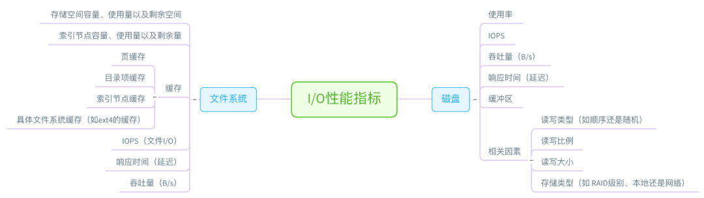

linux性能工具
================

性能工具图谱
---------------

CPU性能工具
-----------------

首先，从CPU的角度来说，主要的性能指标就是CPU的使用率，上下文切换以及CPU Cache的命中率等．下面这张图就列出了常见的CPU性能指标

内存性能工具
--------------

从内存的角度来说，主要的性能指标是形同内存的分配和使用，进程内存的分配和使用以及SWAP的用量

磁盘I/O性能工具
-------------------

从文件系统和磁盘I/O的角度来说，主要性能指标，就是文件系统的使用，缓存和缓冲区的使用，以及磁盘I/O的使用率，吞吐量和延迟．

网络性能工具
--------------

网络的性能指标主要包括吞吐量，响应时间，连接数，丢包数．根据TCP/IP网络协议栈的原理，我们可以把这些性能指标，进一步细化为每层协议的具体指标．

