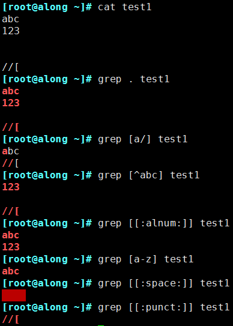
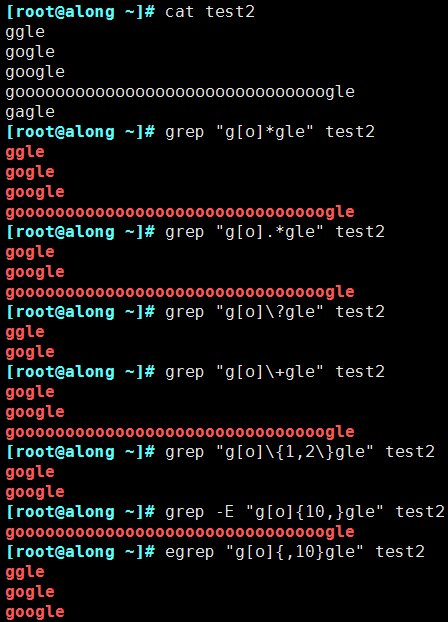
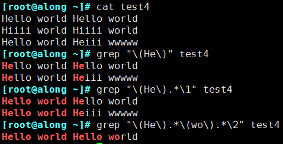

正则表达式
=============

正则表达式应用广泛，在绝大多数的编程语言都可以完美应用，使用正则表达式可以i有效的筛选出需要的文本，然后结合相应的工具
或者语言完成任务需求

正则表达式可以使用正则表达式引擎实现，正则表达式引擎是解释正则表达式模式并使用这些模式匹配文本的基础软件

linux中常用的正则表达式有

1. POSIX基本正则表达式引擎(BRE)

2. POSIX扩展正则表达式引擎(ERE)

**基本组成部分**

正则表达式的基本组成部分

===================     ====================================================    ============================================================================================
正则表达式                              描述                                                                            实例
-------------------     ----------------------------------------------------    --------------------------------------------------------------------------------------------
    \\                  转义符，将特殊字符进行转义，忽略其特殊意义                  \\/dev   匹配/dev
    ^                   匹配行首，awk中,^则是匹配字符串的开始                   ^tmux匹配以tux开头的行
    $                   匹配行末，awk中$是匹配字符串的结尾                      tmux$匹配以tmux结尾的行
    .                   匹配除换行符\n之外的任意字符                            ab.匹配abc或者abd但不匹配abcd或者abde,只能匹配单字符
    []                  匹配包含在[字符]中的任意一个字符                        coo[kl]可以匹配cook或者cool
    [^]                 匹配[^字符]之外的任意一个字符                           123[^45]不可以匹配1234或1235，但1237 1239都可以
    [-]                 匹配[]中指定范围内的任意一个字符，要写成递增            [0-9]可以匹配0到9中的任意一个数字
    ?                   匹配之前项1次或0次                                      colou?r可以匹配color或者colour，但不能匹配colouur
   \+                   匹配之前项1次或多次                                     sa-6+可以匹配sa-6或sa-666,但不能匹配sa-
   \*                   匹配之前项0次或多此                                     co*l可以匹配cl,col,cool,cooool等
    ()                  匹配表达式，创建一个用于匹配的子串                      max(tri)?匹配max或maxtri
    {n}                 匹配之前项n次，n是可以为0的正整数                       [0-9]{3}匹配任意一个三位数
    {n,}                匹配之前项最少n次                                       [0-9{2,}匹配任意一个两位数或者更多位数
    {n,m}               指定之前的项至少匹配n次，最多m次 n<=m                   [0-9]{2,4}匹配从两位数到5位数之间的任意一个数字
   \|                   交替匹配|两边的任意一项                                 ab{c|d}匹配abc或abd
===================     ====================================================    ============================================================================================

**POSIX字符类**

POSIX字符类是一个形如[:...:]的特殊元序列，可以用于匹配特定的字符范围

===================     ====================================================    ============================================================================================
正则表达式                              描述                                                                            实例
-------------------     ----------------------------------------------------    --------------------------------------------------------------------------------------------
[:alnum:]               匹配任意一个字母或数字字符                               [[:alnum]]+
[:alpha:]               匹配任意一个字母字符(包括大小写字母)                     [[:alpha:]]{4}
[:blank:]               空格与制表符(横向和纵向)                                 [[:blank:]]*
[:digit:]               匹配任意一个数字字符                                     [[:digiit:]]?
[:lower:]               匹配小写字母
[:upper:]               匹配大写字母
[:punct:]               匹配标点符号
[:space:]               匹配包括换行符、回车等在内的所有空白符
[:graph:]               匹配任何一个可以看得见的且可以打印的字符
[:xdigit:]              匹配任何一个十六进制数(即：0-9,a-f,A-F)
[:cntrl:]               任何一个控制字符(ASCII字符集中的前32个字符)
[:print:]               任何一个可以打印的字符
===================     ====================================================    ============================================================================================

**支持的特殊字符描述**

- \\w        匹配任意数字和字母，等效[a-zA-Z0-9]
- \\W        与\w相反，等效[^a-zA-Z0-9]
- \\b        匹配字符串开始或结束，等效\<和\>
- \\s        匹配任意空白字符
- \\S       匹配任意非空白字符

**空白字符描述**

- \\n       换行符
- \\r       回车符
- \\t       水平制表符
- \\v       垂直制表符
- \\0       空值符
- \\b       退后一格

**位置锚定**

- ^     行首锚定
- $     行尾锚定
- ^PATTERN$     用于模式匹配整行
- ^$    空行
- ^[[:space:]].*$   空白行

**使用示例**

匹配次数使用示例

**分组和后向引用**

分组:\(\)将一个或多个字符捆绑在一起，当作一个整体进行处理

     分组括号中得模式匹配到得内容会被正则表达式记录于内部的变量中，这些变量的命名方式为:\1,\2,\3...

后向引用:引用前面的分组括号中的模式所匹配字符，而非模式本身
 
    \1表示从左侧起第一个左括号以及与之匹配右括号之间的模式所匹配到的字符

    \& 表示前面分组中的所有字符

示例

