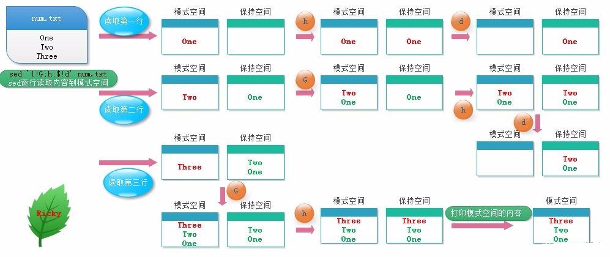

shell三剑客grep sed awk
========================

awk、grep、sed是linux操作文件的三大利器，合称文本三剑客。grep适合单纯的文件查找或者匹配文本，sed更适合编辑匹配到的文本，awk适合格式化文本，对文本进行复杂的格式处理

grep
----

grep用于过滤搜索特定字符，可使用正则表达式配合使用.搜索成功返回0,不成功返回1,文件不存在则返回2

命令格式

::

    grep [option] pattern file

命令参数如下

- -A<显示行数>: 除了显示符合匹配样式的那一行之外，并显示该行之后的内容
- -B<显示行数>: 除了显示符合匹配样式的那一行之外，并显示该行之前的内容
- -C<显示行数>: 除了显示符合匹配样式的那一行之外，并显示该行前后的内容
- -c: 统计匹配的行数
- -e: 实现多个选项间的逻辑or关系
- -E: 扩展的正则表达式
- -f FILE: 从file获取pattern匹配
- -F: 相当于fgrep
- -i --igonre-case : 忽略大小写的区别
- -n: 显示匹配的行号
- -o: 仅显示匹配到的字符串
- -q: 静默模式,不输出任何信息
- -s: 不显示错误信息
- -v: 显示不被pattern匹配到的行
- -w: 匹配整个单词

sed
----

sed是一种流编辑器，它一次处理一行内容，处理时把当前处理的行存储在临时缓冲区中，称为"模式空间"，接着用sed命令处理缓冲区中的内容，处理完成后，把缓冲区中的内容送往屏幕，
然后读入下一行，执行下一个循环。文件内容并没有改变，除非你使用重定向存储输出或者-i

sed命令解释
^^^^^^^^^^^

命令格式

::

    se [options] '[地址定界] command' file(s)

**常用选项options**

- -n:不输出模式空间内容到屏幕，即不自动打印，只打印匹配到的行
- -e:多点编辑，对每行处理时，可以有多个script
- -f:把script写到文件当中，在执行sed时-f指定文件路径,如果是多个script，换行写
- -r:支持扩展的正则表达式
- -i:直接将处理结果写入文件
- i.bak:在将处理的结果写入文件之前备份一份

**地址定界**

- 不给地址：对全文进行处理
- 单地址:

  1. #:指定的行

  #. /pattern/:被此模式能够匹配到的每一行

- 地址范围:

  1. #,#

  #. #,+#

  #. /pat1/,/pat2/

  #. ,/pat1/

- ~:步进

  1. sed -n '1~2p'  #只打印奇数行(1~2从第一行,一次加2行)

  2. sed -n '2~2p'  #只打印偶数行

**编辑命令commmand**

- d:删除模式空间匹配的行，并立即启用下一轮循环
- p:打印当前模式空间内容,追加到默认输出之后
- a:在指定行后面追加文本,支持使用\n实现多行追加
- i:在前面插入文件，支持使用\n实现多行追加
- c:替换行为单行或者多行文本，支持使用\n实现多行追加
- w:保存模式匹配到的行到指定文件
- r:读取指定文件的文本到模式空间中匹配到的行后
- =:为模式空间中的行打印行号
- !:为模式空间中匹配行取反处理
- s///:查找替换,支持使用其他分隔符，如s@@@,s###

sed用法演示
^^^^^^^^^^^

**常用选项options演示** 

::

    cat demo
    aaa
    bbb
    AABBCCDD

    sed "/aaa/p" demo   #匹配到的行会打印一遍，没有匹配到的行也会打印
    aaa
    aaa
    bbb
    AABBCCDD

    sed -n "/aaa/p" demo    #-n不显示没匹配的行
    aaa

    sed -e "s/a/A/" -e "s/b/B/" demo #-e多点编辑
    Aaa
    Bbb
    AABBCCDD

    cat sedscript.txt
    s/A/a/g

    sed -f sedscript.txt demo
    aaa
    bbb
    aaBBCCDD

**地址界定演示**

::

    sed -n "p" demo     #不指定行，打印全文
    aaa
    bbb 
    AABBCCDD

    sed "2s/b/B/g" demo #替换第2行的b->B
    aaa
    BBB
    AABBCCDD

    sed -n "1,2p" demo #打印1-2行
    aaa
    bbb

    sed -n "/aaa/,/DD/p" demo
    aaa
    bbb
    AABBCCDD

    sed -n "2,/DD/p" demo
    bbb
    AABBCCDD

    sed "1~2s/[aA]/E/g" demo    #将奇数行的a或A替换为E
    EEE
    bbb
    EEBBCCDD

**编辑命令command演示**

::

    sed "2d" demo       #删除第2行
    aaa
    AABBCCDD

    sed -n "2p" demo    #打印第二行

    sed "2a123" demo    #在第二行后面加123
    aaa
    bbb
    123
    AABBCCDD

    sed "1i123" demo    #在第一行前面加123

    sed "3c123\n456"    #替换第三行的内容
    aaa
    bbb
    123
    456

    sed -n "3w/root/demo3" demo     #保存第三行的内容到demo3文件中

    sed "1r/root/demo3" demo    #读取demo3的内容到第1行后

    sed -n "=" demo     #打印行号
    1
    2
    3

    sed -n "2!p" #打印除了第2行的内容

    sed 's@[a-z]@\u&@g' demo #将全文的小写字母替换为大写字母

sed高级编辑命令
^^^^^^^^^^^^^^^

- 格式

- h:把模式空间中的内容覆盖至保持空间中
- H:把模式空间中的内容追加至保持空间中
- g:从保持空间取出数据覆盖至模式空间中
- G:从保持空间取出数据追加至模式空间中
- x:把模式空间中的内容与保持空间中的内容进行互换
- n:读取匹配到的行的下一行覆盖至模式空间
- N:读取匹配到的行的下一行追加至模式空间
- d:删除模式空间中的行
- D:当前模式空间开端至\n的内容(不再传至标准输出)，放弃之后的命令，但是对剩余模式空间重新执行sed

**案例**

::

    cat num.txt
    One
    Two
    Three

    sed '1!G;h;$!d' num
    Three
    Two
    One

示意图如下所示:

.. note::
    保持空间是模式空间一个临时存放数据的缓冲区，协助模式空间进行数据处理

**演示**

::

    seq 99 | sed -n "n;p"   #打印偶数行
    2 
    4
    6
    8

    seq 9 | sed "1!G;h;$!d"     #倒序显示

    seq 9 | sed 'H;n;d' #显示奇数行

    seq 9 | sed "N:D" #显示最后一行

    seq 9 | sed "G" #每行之间加空行

    seq 9 | sed "g" #把每行内容替换为空行

awk
----

awk是一种编程语言，用于在linux/unix下对文本和数据进行处理,数据可以来自标准输入(stdin)、一个或者多个文件或其他命令的输出。它支持用户自定义函数和动态正则表达式等先进功能，
可以在命令行使用也可以作为脚本使用

语法

::

    awk [options] 'program' var=value file...
    awk [options] -f programfile var=value file...
    awk [options] 'BEGIN{ action;... } pattern{ action;... } END{ actions;.. }' file...

**常用命令选项**

- -F fs:fs指定输入分隔符,fs可以是字符串或正则表达式
- -v var=value:赋值一个用户定义变量，将外部变量传递给awk
- -f scriptfile:从脚本文件中读取awk命令

awk变量
^^^^^^^

变量:内置变量和自定义变量,每个变量前加-v命令选项

内置变量
""""""""

1) 格式

- FS:输入字段分隔符,默认为空白字符
- OFS:输出字段分隔符，默认为空白字符
- RS:输入记录分隔符，指定输入时的换行符，原换行符仍有效
- ORS:输出记录分隔符，输出时用指定符号代替换行符
- NF:字段数量，共有多少字段，$NF引用最后一列
- NR:行号，后可跟多个文件，第二个文件行号继续从第一个文件最后行号开始
- FNR:各文件分别计数，行号
- FILENAME:当前文件名
- ARGC:命令行参数个数
- ARGV:数组，保存的是命令行所给定的各参数，查看参数

演示

::

    cat awkdemo
    hello:world
    linux:redhat:lalala:hahaha
    along:love:youou

    awk -v FS=':' '{print $1,$2}' awkdemo   #FS指定输入分隔符

    awk -v FS=':' OFS="----" '{print $1,$2}' awkdemo #OFS指定输出分隔符

    awk -v RS=':' '{print $1,$2}' awkdemo 

    awk -F: '{print NF}' awkdemo

    awk -F: '{print $(NF-1)' awkdemo    #显示倒数第2列

    awk END'{print NR} awkdemo  #统计行号

自定义变量
""""""""""

自定义变量区分大小写

::

    -v var=value
    
    awk v name="ywg" -F: 'print name":"$0' awkdemo

pintf命令
^^^^^^^^^

格式：

::
    
    pritnf "FORMAT", item1,item2,...

1) 必须指定FORMAT

2) 不会自动换行，需要显示给出换行控制符,\n

3) FORMAT中需要分别为后面每个item指定格式符

格式符：与item一一对应

- %c:显示字符的ADCII码
- %d,%i:显示十进制整数
- %e,%E:显示科学计数法数值
- %f:显示为浮点数,小数, %5.1f带整数、小数，整数5位小数1位
- %g,%G:以科学计数法或浮点形式显示数值
- %s:显示字符串
- %u:无符号整数
- %%:显示%自身

::

    awk -F: '{printf "%20s----%u\n",$1,$3}' /etc/passwd

    awk -F: '{printf "%-20s----%-u\n",$1,$3}' /etc/passwd   #使用-进行左对齐

操作符
^^^^^^

格式

- 算数操作符

1. x+y,x-y,x*y,x/y,x^y,x%y

#. -x:转换为负数

#. +x:转换为数值

- 字符串操作符：没有符号的操作符，字符串连接

- 赋值操作符：

1. =,+=,-=,*=,/=,%=,^=

#. ++,--

- 比较操作符

==,!=,>,>=,<=

- 模式匹配符:~:左边和右边是否匹配包含 !~:是否不匹配

- 逻辑操作符:&& || !

- 函数调用:function_name(argu1,argu2,...)

演示
 
模式匹配

::

    df -h | awk -F: '$0 ~ /^\/dev/'     #查询以/dev开头的磁盘信息

    df -h | awk '$0 ~ /^\/dev/{print $(NF-1)"----"$1}'   #只显示磁盘情况和磁盘名

    df -h | awk '/^\/dev/{print $(NF-1)"---"$1}' | awk -F% '$1 > 40'

逻辑操作符

::

    awk -F: '$3>0 && $3<=1000 {print $1,$3}' /etc/passwd

    awk -F: '!($0 ~ /bash$/) {print $1,$3}' /etc/passwd

awk pattern匹配部分
^^^^^^^^^^^^^^^^^^^

根据pattern条件，过滤匹配的行，再做处理

1. 如果未指定：空模式，匹配每一行

#. /regular expression/: 仅处理能够模式匹配到的行,正则，需要用//括起来

#. relational expression: 关系表达式,结果为真才会被处理

   真:结果为非0值，非空字符串

   假：结果为空字符串或0值

#. line ranges:行范围

   startline(起始行),endline(结束行):/part1/,/part2/ 不支持直接给出数字，可以有多段，中间可以有间隔

#. BEGIN/END 模式
   
   BEGIN{}: 仅在开始处理文件中的文本之前执行一次

   END{}: 仅在文本处理完成之后执行

演示

::

    awk -F: '/^h/,/^a/{print $1}' awkdemo.txt

    awk -F: 'BEGIN{print "第一列"}{print $1} END{print "结束"}' awkdemo.txt

awk高阶用法
^^^^^^^^^^^

**控制语句之if else判断**

::

    if(condition){statement;...}[else statement]    #双分支
    if(condition1){statement1;...}else if(condition2)else{statement3}   #多分支

使用场景:对awk取得的整行或某个字段做条件判断

::

    awk -F: '{if($3>10 && $3<1000)print $1,$3}' /etc/passwd

    awk -F: '{if($NF=="/bin/bash") print $1,$NF}' /etc/passwd

    awk -F: '{if($3>==1000) {printf "commmon user: %s\n",$1} else{printf "root or sysuser: %s\n",$1}}' /etc/passwd

**控制语句之while循环**

::

    while(condition){statement;...}

注:条件为真，进入循环；条件为假，退出循环

::

    awk -F: '/^along/{i=1;while(i<=NF){print $i,length($i);i++}}' awkdemo.txt

**控制语句之do while循环**

::

    do {statement;..}while(condition)

注:无论真假，至少会执行一次

::

    awk 'BEGIN{sum=0;i=1;do{sum+=i;i++}while(i<1000);print sum}'

**控制语句之for循环**

::

    for(expr1;expr2;expr3) {statement;...}

特殊用法:遍历数组中的元素

::

    for(var in array) {for-body}

::

    awk -F: '{for(i=1;i<=NF;i++) {print $i,length($i)}}' awkdemo.txt

字符串处理
^^^^^^^^^^^

rand()返回0到1之间一个随机数，需要一个种子srand()，没有种子，一直输出0.237788

::

    awk 'BEGIN{srand(); print rand()}'

    awk 'BEGIN{srand()} {printf int(rand()*100%50)}' #取0-50的随机数

字符串处理:

- length([s]):返回指定字符串的长度
- sub(r,s,[t]):对t字符串进行搜索r表示的模式匹配的内容，并将第一个匹配的内容替换为s
- gsub(r,s,[t]):对t字符串进行搜索r表示的模式匹配的内容，并将全部匹配的内容替换为s
- split(s,array,[r]):以r为分割符切割字符串s并将切割后的结果保存至array所表示的数组中，第一个索引值为1第二个为2

::

    echo "2008:08:08 08:08:08" | awk 'sub(/:/,"-",$1)'

    echo "2008:08:08 08:08:08" | awk 'gsub(/:/,"-",$1)'

    echo "2008:08:08 08:08:08" | awk '{split($0,i,":")}END{for(n in i){print n,i[n]}}'

    
awk自定义函数
^^^^^^^^^^^^^

格式：和bash区别:定义函数中需要加参数，return 返回值不是$?，是相当于echo输出

::

    function name (parm1, parm2, ...)
    {
        statements
        return expression
    }

::

    cat fun.awk
    function max(v1,v2) {
        v1>v2?var=v1:var=v2
        return var
    }
    BEGIN{a=3;b=2;printf max(a,b)}

    awk -f fun.awk

awk可以借助system调用shell命令

::

    awk BEGIN'{system("hostname")}'

awk程序也可以写成脚本，直接调用或执行

::

    cat f1.awk
    #!/bin/awk -f
    {if($3 >= 1000)print $1,$3}

    chmod +x f1.awk

    ./f1.awk -F: /etc/passwd

向awk脚本传递参数

::

    awkfile var=value var2=value2 ... inputfile

.. note::
    在BEGIN过程中不可用，直到首行输入完成以后变量才可使用，可以通过-v参数让awk在BEGIN之前得到变量的值，命令行中每指定一个变量都需要一个-v
