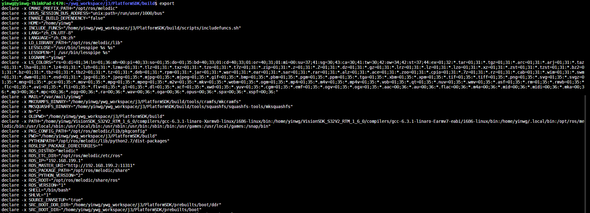

shell基本语法
==============

变量
-----

定义变量时,变量名和=之间不能有空格，需遵循以下规则

1) 命名只能使用字母，数字和下划线，首个字符不能是数字

2) 中间不能是空格

3) 不能使用bash里的关键字

使用readonly命令可以将变量定义为只读变量

::

    myname="ywg"
    readonly myname
    myname="jxn"

    运行脚本,会提示
    行 5: myname：只读变量

unset命令可以删除变量,删除后变量不能再次使用，不能删除只读变量

::
    
    unset myurl

- 字符串
 
**拼接字符串**

拼接字符串可以使用单引号也可以使用双引号，但是单引号中的字符会原样输出，单引号中字符串的变量是无效的

::

    your_name="runoob"
    # 使用双引号拼接
    greeting="hello, "$your_name" !"
    greeting_1="hello, ${your_name} !"
    echo $greeting  $greeting_1
    # 使用单引号拼接
    greeting_2='hello, '$your_name' !'
    greeting_3='hello, ${your_name} !'
    echo $greeting_2  $greeting_3

输出结果为

::

    hello, runoob ! hello, runoob !
    hello, runoob ! hello, ${your_name} !

**获取字符串长度**

::

    string=="abcd"
    echo ${#string}     #输出4

**提取字符串**

::

    string="this is a test string"
    echo "${string:1:3}"    #输出his

**查找字符串**

::

    string="this is a test string"
    echo `expr index "${string}" g`    #输出21

- 数组

shell支持一维数组，不支持多维数组

**获取数组长度**

::

    array=(1 2 3 4 5)
    length=${#array[@]}
    echo ${length}      #输出为5
    length=${#array[*]}
    echo ${length}      #输出为5
    echo ${array[@]}    #输出 1 2 3 4 5

基本运算符
----------

shell支持多种运算符，包括

1. 算数运算符

#. 关系运算符

#. 布尔运算符

#. 字符串运算符

#. 文件测试运算符

**算数运算符**

======      ========
运算符       描述
------      --------
\+           加法
\-           减法
\*           乘法
\/           除法
\%           取余
=            赋值
==           相等
!=           不相等
======      ========

.. note::
    表达式在方括号中间时要有空格,[$a==$b]是错误的，必须写成[ $a == $b ]

**关系运算符**

关系运算符支持数字，不支持字符串

======      ===========================
运算符          说明
------      ---------------------------
-eq         两个数是否相等
-ne         两个数是否不相等
-gt         左边的是否大于右边的
-lt         左边的是否小于右边的
-ge         左边的是否大于等于右边的
-le         左边的是否小于等于右边的
======      ===========================

**布尔运算符**

======      ==============================================
运算符          说明
------      ----------------------------------------------
!           非运算  [ ! false ]返回true
-o          或运算  [ $a -lt $b -o $b -eq 100 ]
-a          与运算  [ $a -gt $b -a $a -ne 50 ]
======      ==============================================

**逻辑运算**

======      ==============================================
运算符          说明
------      ----------------------------------------------
&&          逻辑的AND
||          逻辑的OR
======      ==============================================

**字符串运算符**

======      ==============================================
运算符          说明
------      ----------------------------------------------
=           检测两个字符串是否相等
!=          检测两个字符串是否不相等
-z          检测字符串长度是否为0
-n          检测字符串长度是否不为0
$           检测字符串是否为空
======      ==============================================

**文件测试运算符**

==========      ==============================================
运算符          说明
----------      ----------------------------------------------
-b file         检测文件是否是块设备文件
-c file         检测文件是否是字符设备文件
-d file         检测文件是否是目录
-f file         检测文件是否是普通文件
-g file         检测文件是否设置了SGID位
-u file         检测文件是否设置了SUID位
-p file         检测文件是否是有名管道
-r file         检测文件是否可读
-w file         检测文件是否可写
-x file         检测文件是否可执行
-s file         检测文件是否为空
-e file         检测文件是否存在
-L file         检测文件是否是链接文件
-S file         检测文件是否是socket文件
==========      ==============================================

shell流程控制
--------------

if判断
^^^^^^

if语句语法格式

::

    if condition
    then
        command1
        command2
    fi

if else 语句语法格式

::

    if condition
    then
        command1
    else
        command2
    fi

if else-if else语句语法格式

::

    if condition1
    then 
        command1
    elif condition2
    then
        command2
    else
        command3
    fi
    

for循环
^^^^^^^

for循环语法格式

::

    for var in item1 item2 ... itemn
    do
        command
    done

while语句
^^^^^^^^^

::

    while condition
    do
        command
    done

无限循环

::
        
    while true  #或者while :
    do
        command
    done

case ... esac语句
^^^^^^^^^^^^^^^^^

::

    case var in
    mode1)
        command1
        ;;
    mode2)  
        command2
        ;;
    *)
        command3
        ;;
    esac

- 跳出循环

shell中使用break和continue两个命令跳出循环.break命令允许跳出所有循环,continue仅仅跳出当前循环

::

    #!/bin/bash

    while true
    do
        echo -n "输入1到5之间的数字"
        read num
        case ${num} in
            1|2|3|4|5)
                 echo "你输入的数字为${num}"
            ;;
            *)
                 echo "你输入的数字超出范围"
            break
            ;;
        esac
    done
    

shell函数
---------

shell中函数定义格式如下

::

    [function] funname[()]
    {
        action;
        [return int;]
    }

说明:

1.  可以带function fun()定义，也可以直接fun()定义

2.  参数返回可以显示加return返回，如果不加将以最后一条命令运行结果作为返回值，return后可以跟(0-255)

输入输出重定向
--------------

=================      ==============================================
命令                    说明
-----------------      ----------------------------------------------
command > file          将输出重定向到file
command < file          将输入重定向到file
commnad >> file         将输出以追加的方式重定向到file
n > file                将文件描述符为n的文件重定向到file
n >> file               将文件描述符为n的文件以追加的方式重定向到file
n>&m                    将输出文件m和n合并
n<&m                    将输入文件m和n合并
<< tag                  将开始标记tag和结束标记tag之间的内容作为输入
=================      ==============================================

.. note::
    文件描述符0为标准输入(STDIN),1是标准输出(STDOUT),2是标准错误输出(STDERR)
    2>之间不可以有空格，只有在一体的时候才表示错误输出

::

    command > file 2>&1     #将stdout和stderr合并后重定向到file
    command < file1 > file2     #stdin重定向到file1，stdout重定向到file2
    command > /dev/null 2>&1    #屏蔽输出

here document是shell种一种特殊的重定向方式，用来将输入重定向到一个交互式shell脚本或程序

基本形式如下

::

    command << delimiter
        document
    delimiter

.. note::
    结尾的delimiter一定要顶格写,前面不能有任何字符

例

::

    multi.sh
    #!/bin/bash

    read -p "enter number:" no
    read -p "enter name:" name
    echo "your have entered $no, $name"
    

    #!/bin/bash
    bash multi.sh << EOF
    28
    ywg
    EOF

shell文件包含
-------------

shell文件包含语法格式

::

    . filename  #注意点号(.)和文件名中间有一个空格
    或者
    source filename

.. note::
    被包含的文件不需要可执行权限

shell特殊变量
--------------

+--------------+---------------------------------------------------------------+
|  变量        |                 含义                                          |
+==============+===============================================================+
|  $0          |   当前脚本的文件名                                            |
+--------------+---------------------------------------------------------------+
|  $n          |   传递给脚本或者函数的参数，n是一个数字                       |
+--------------+---------------------------------------------------------------+
|  $#          |   传递给脚本或者函数的参数个数                                |
+--------------+---------------------------------------------------------------+
|  $*          |   传递给脚本或者函数的所有参数                                |
+--------------+---------------------------------------------------------------+
|  $?          |   上个命令的退出状态                                          |
+--------------+---------------------------------------------------------------+
|  $$          |   当前shell进程的ID                                           |
+--------------+---------------------------------------------------------------+

export可以查看当前shell中已经设置好的环境变量,也可以使用export设置环境变量

shell中括号用法
----------------

 ``shell中{}与()的区别``

- () 执行一串命令时，需要重新开启一个子 Shell 来执行。
- {} 执行一串命令时，在当前 Shell 中执行。
- () 和 {} 都是把一串命令放田括号里面，并且命令之间用";"隔开。
- () 最后一条命令可以不用分号。
- {} 最后一条命令要用分号。
- {} 的第一条命令和左括号之间必须有一个空格。
- () 里的各命令不必和括号有空格。
- () 和 {} 中括号里面的某条命令的重定向只影响该命令，但括号外的重定向则会影响到括号里的所有命令。

小括号、圆括号
^^^^^^^^^^^^^^

- 单小括号()

1) 命令组.括号中的命令将会新开一个子shell顺序执行，座椅括号中的变量不能够被脚本余下的部分使用，括号中的多个命令用分号隔开，最后一个命令可以没有分号
   各命令和括号之间不必有空格

2) 命令替换。等同于 `cmd` ,shell扫描一遍命令行，发现了$(cmd)结构，便将$(cmd)中的cmd执行一次，得到其标准输出，再将此输出放到原来的命令

3) 用于初始化数组。如 array=(a b c d)

- 双小括号(())

1) 整数扩展。这种扩展计算式整数型的计算，不支持浮点型。((exp))结构扩展并计算一个整数表达式的值，如果表达式的结构为0，那么返回的退出状态码为1,或者是假，而一个非0值得表达式所返回
   的退出状态码为0，或者为true. 若是逻辑判断，表达式exp为真则为1，假则为0

2) 只要括号中的运算符，表达式符合C语言运算规则,都可在((exp))

3) 常用作算术运算比较，双括号中的变量可以不使用$符号前缀 如 for((i=0;i<5;i++))

中括号
^^^^^^^

- 单中括号

1) bash内部命令,[和test是等同的。if/else结构中左中括号是调用test的命令标识，右中括号是关闭条件判断的。

.. note::
    shell中test命令用于检查某个条件是否成立，它可以进行数值、字符和文件三个方面的测试

2) []中可用的比较运算符只有==和!=，两者都是用于字符串比较的，不可以用于整数比较，整数比较只能用-eq, -gt这种形式

3) 作为test用途的中括号内不能使用正则

4) 在一个array结构的上下文中，中括号用来引用数组中每个元素的编号

- 双中括号

1) [[是bash程序语言的关键字，并不是一个命令，[[]]结构比[]结构更加通用，在[[]]之间的所有字符都不会发生文件名扩展或者单词分割，但是会发生参数扩展和命令替换

2) 支持字符串的模式匹配，字符串比较时可以把右边的作为一个模式不仅仅是一个字符串,支持正则表达式 比如 [[ hello == hell? ]]

3) 使用[[...]]条件判断结构，而不是[...],能够防止脚本中许多逻辑错误，比如,&& || <>操作符能够正常存在于[[]]条件判断中，但是出现在[]结构中会报错
   比如 if [[ $a != 1 && $a !=2 ]] 等同于 if [ $$a -ne 1 ] && [ $a !=2 ]

4) bash中把双中括号中的表达式看作一个单独的元素，并返回一个退出状态码

大括号、花括号
^^^^^^^^^^^^^^

- 常规用法

1) 大括号扩展。通配将对大括号中的文件名做扩展，在大括号中不允许有空白，除非这个空白被引用或者转义。第一种对大括号中以逗号分隔的文件列表进行扩展，如touch {a,b}.txt结果为a.txt b.txt
   第二种：对大括号中以..分割的顺序文件列表起拓展作用如 touch {a..d}.txt 结构为a.txt b.txt c.txt d.txt

2) 代码块，又被称为内部组，这个结构事实上创建了一个匿名函数。与小括号中的命令不同，大括号内的命令不会新开一个子shell运行。括号内的命令间用分号隔开，最后一个也必须有分号。{}的第一
   个命令和左括号之间必须要有一个空格

- 几种特殊的替换结构

::

    ${var:-string},${var:+string},${var:=string},,${var:?string}

1) ${var:-string}若var变量为空,则用在命令行中用string来替换${var:-string},不为空则用变量var的值来替换${var:-string}.

2) ${car:=string}若var变量为空,则用在命令行中用string来替换${var:-string}同时用string赋值给var,不为空则用变量var的值来替换${var:-string}.

3) ${var:+string}与${var:-string}用法相反

4) ${var:?string}若变量var不为空，则用变量var的值来替换${var:?string}；若变量var为空，则把string输出到标准错误中，并从脚本中退出

- 四种模式匹配替换结构

模式匹配记忆方法

# 是去掉左边(在键盘上#在$的左边)

% 是去掉右边(在键盘上%在$的右边)

::

    ${var%pattern},${var%%pattern},${var#pattern}${var##pattern}

例

::

    # var=testcase 
    # echo $var 
    testcase 
    # echo ${var%s*e} 
    testca 
    ###此模式下，shell在var中搜索是否符合pattern模式，如果是则去掉右边最短的匹配模式
    # echo $var 
    testcase 
    # echo ${var%%s*e} 
    te 
    ###此模式下，shell在var中搜索是否符合pattern模式，如果是则去掉右边最长的匹配模式
    # echo ${var#?e} 
    stcase 
    ###此模式下，shell在var中搜索是否符合pattern模式，如果是则去掉左边最短的匹配模式
    # echo ${var##?e} 
    stcase 
    # echo ${var##*e}
    # echo ${var##*s} 
    e 
    ###此模式下，shell在var中搜索是否符合pattern模式，如果是则去掉左边最长的匹配模式
    # echo ${var##test} 
    case

- 字符串提取和替换

::

    ${var:num},${var:num1:num2},${var/patttern/pattern},${var//pattern/pattern}

第一种模式：这种模式下提取var中第num个字符到末尾的所有字符

第二种模式: 提取var中num1到num2的字符

第三种模式: 将var中第一个匹配到的pattern替换为另一个pattern

第四种模式: 将var中所有能匹配到的pattern替换为另一个pattern
