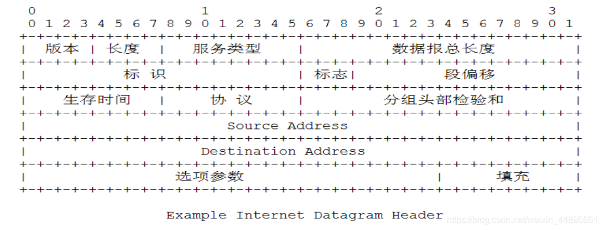

linux 网络概览
===============

网络分层
---------

**OSI层级**

1) 应用层(数据)： 确定进程之间的通信性质以满足用户需要以及提供网络与用户应用
2) 表示层(数据)：主要解决用户信息的语法表示问题，如加密解密
3) 会话层(数据): 提供包括访问验证和会话管理在内的建立和维护应用之间通信的机制，如服务器验证用户登录便是由会话层完成的
4) 传输层(数据): 实现网络不同主机上用户进程之间的数据通信，可靠与不可靠的传输，传输层的错误检测，流量控制等
5) 网络层(包): 提供逻辑地址(IP)，选路，数据从源端到目的端的传输
6) 数据链路层(帧): 将上层数据封装成帧，用MAC地址访问媒介，错误检测与修正
7) 物理层(比特流)：设备之间比特流的传输，物理接口，电气特性等

**各个层对应的数据交换设备**

1) 网关：应用层、传输层(网关在传输层以上实现网络互联，是最复杂的网络互连设备，仅用于两个高层协议不同的网络互联。网关的结构也和路由器类似，不同的是互连层.网关既可以用于广域网连接也可以用于局域网互联)
2) 路由器: 网络层(路由选择、存储转发)
3) 交换机: 数据链路层、网络层(识别数据包中的MAC地址信息，根据MAC地址进行转发，并将这些MAC地址与对应的端口记录在自己内部的地址表中)
4) 网桥：数据链路层(将两个LAN连起来，根据MAC地址来转发帧)
5) 集线器(HUB): 物理层(纯硬件设备，主要用来连接计算机等网络终端)
6) 中继器: 物理层(在比特级别对网络信号进行再生和重定时，从而使得他们能够在网络上传输更长的距离)

数据链路层
------------

ARP协议
^^^^^^^^

- ARP协议的作用

ARP为IP地址对应的硬件地址提供动态映射

- 点对点链路使用ARP吗？

在点对点链路中不适用ARP,实际上在点对点网络中也不使用MAC地址，因为在此类网络中分别已经获取了对端的IP地址

- ARP高效运转的关键是什么?

关键是每个主机上都有一个ARP的高速缓存

- ARP报文的各个字段以及含义

帧类型: ARP: 0x0806

=================   ===============================================================
字段                描述
-----------------   ---------------------------------------------------------------
硬件类型            硬件地址的类型，1表示以太网地址
协议类型            协议地址的类型，0x0800表示IP地址
硬件地址长度        6字节
协议地址长度        4字节
操作类型            2个字节，ARP请求1, ARP回复2, RARP请求3, RARP应答4
发送者硬件地址      6字节
发送者IP地址        4字节
目标硬件地址        6字节
目标IP地址          4字节
CRC校验             4字节
=================   ===============================================================

ARP共28个字节。

**记忆方法: 以太网先目的后源，ARP先发送端后目的端，先硬件后协议**

- ARP协议弱点

1) 缓存：主机的地址映射是基于高速缓存的，动态更新的。地址刷新是有时间限制的，可以通过下次更新之前修改计算机上的地址缓存，造成拒绝服务攻击或者ARP欺骗
2) 广播: 攻击者可以伪装ARP应答
3) ARP应答没有认证，都是合法的。可以在不接受请求的时候就发出应答包

- ARP代理和应用场景

若ARP请求是从一个网络的主机发送给另一个网络的主机，那么连接这两个网路的路由器就可以回答该请求，这个过程就叫做ARP代理。ARP代理路由器相应ARP请求的MAC地址为路由器的MAC地址而非ARP请求的主机的MAC地址

ARP代理的应用环境: 两个物理网络之间的路由是使用相同的网络号,两个路由器设置成ARP代理，实现相互隐瞒物理网络

- 数据链路层MTU的最大值和最小值

1. 数据链路层的最小MTU为64字节
2. 数据链路层的最大MTU为1500

网络层
-------

IP协议
^^^^^^^^

- 如何理解IP的不可靠和无连接

不可靠: 指的是不能保证数据报能成功的到达目的地。发生错误时候，丢弃该数据包，发送ICMP消息给信源端。可靠性由上层提供
无连接：IP不维护关于后续数据报的状态信息，体现在IP数据可以不按顺序发送和接受，A发送连续的数据报，到达B不一定是连续的，来回路由选择可能不一样，路线也不一样，到达先后顺序也不一样

- IP报文的格式和各个字段的含义

==============  ========================================================================
字段            描述
--------------  ------------------------------------------------------------------------
版本            IPV4就是4, IPV6就是6
首部长度        4个字节为单位，最小为5最大为15
服务类型        Qos用，目前不怎么使用
总长度          字节为单位，最多可以传送65535字节的IP数据包
标识字段
标志
段偏移
生存时间TTL     经过一个路由器减一。字段为0时数据包被丢弃，并发送ICMP报文通知源主机
协议            区分上层协议
首部校验和      仅对首部进行校验
源地址 
目的地址
==============  ========================================================================

- 为什么IP首部中要有总长度字段

因为一些数据链路(以太网)需要填充一些数据以达到最小长度，因为以太网帧的最小长度是46个字节，但是IP长度可能更短，所以需要总长度来确定IP数据部分的内容

- IP首部校验和如何计算，与ICMP，IGMP，TCP，UDP的首部校验和有什么区别与共同点

1) 先把校验和字段设置为0
2) 对首部中每个16位比特进行二进制反码求和
3) 结果存在校验和字段中
4) 收到一份IP数据包后，同样对首部中每个16bit二进制反码求和
5) 最后结果全为1表示正确，否则表示错误
6) 如果是错误的，IP就丢弃该数据报，但是不生成差错报文，由上层去处理

共同点：用到的算法都是一样的

区别：IP计算的时候没有将数据包括在内，ICMP, IGMP, TCP, UDP同时覆盖首部和数据校验

- 主机和路由器本质区别

主机从不把数据报从一个结构转发到另一个接口，而路由器则要转发数据报

- IP路由选择的过程是怎么样的

根据最长匹配原则，找到条目，发送到指定的路由器，如果不能找到，返回一个"主机不可达"或"网络不可达"的错误

- IP路由选择的特性

1) IP路由选择是逐跳进行的，IP并不知道到达任何目的的完整路径，只提供下一跳地址
2) 为一个网络指定一个路由器，而不是为每个主机指定一个路由器

- IP搜索路由表的步骤

搜索匹配的主机地址---------->搜索匹配的网络地址-------------->搜索默认选项

IP层进行的选路实际上是一种选路机制，他搜索路由表并决定向哪个接口发送分组

- IP地址分类

A类地址: 首位为0, 1.0.0.1~~126.255.255.254 : 主机号24位
B类地址: 首位为10, 128.0.0.1~~191.255.255.254；主机号 16 位
C类地址: 首位为110, 192.0.0.1~~223.255.255.254；主机号 8 位
D类地址(多播地址，也叫做组播地址): 首位为1110, 224.0.0.1~~239.255.255.254
E类地址: 此类地址是保留地址，首位为 11110， 240.0.0.1~~254.255.255.254

ICMP协议
^^^^^^^^^^

icmp的层次和作用

ICMP报文分为两类，一类是ICMP查询报文，一类是ICMP差错报文. 

传输层
-------

UDP是一个简单的面向数据报的运输层协议，进程的每个输出都正好产生一个UDP数据报，并组装成一份待发送的IP数据报

TCP是面向流字符，应用程序产生的全体数据与真正发送的单个IP数据报可能没什么关系

UDP协议
^^^^^^^^^

UDP数据报头字段

.. note::
    UDP的校验和要计算首部和数据部分，其中首部包含伪首部。如下图所示

TCP协议
^^^^^^^^

- TCP通过以下机制保证数据可靠性

1. 应用数据被分割成TCP认为最适合发送的数据块
2. 确认机制，发送报文后，等待确认
3. 重发机制，没有收到确认，将重发数据包
4. 保持它首部和数据的校验和，确认数据的准确性
5. 排序，丢弃重复的，流量控制

- TCP与UDP对比

1. TCP面向连接，UDP面向无连接
2. TCP面向报文，UDP面向字节流
3. TCP提供可靠传输服务(数据顺序，正确性)，UDP传输不可靠
4. TCP协议传输速度慢，UDP协议传输速度快
5. TCP协议对系统资源要求比较多(头部开销大)，UDP协议要求少

- TCP、UDP存在伪包头的原因

TCP(UDP)校验和是根据TCP(UDP)数据报和伪报头计算得到的差错检测值。伪包头包含源和目的IP地址，以及来自IP数据报报头的协议值，IP数据报再网络中传输时包含UDP数据报，伪报头
并不会在网络中传送，校验和中所包含的伪报头内容可以避免目的端错误的接收错误的路由的数据报。

- 3次握手，4次挥手

3次握手: 防止已过期的连接请求报文突然又传送到服务器，因而产生错误
4次挥手: 确保数据能够完成传输，当关闭连接时，当收到对方的FIN报文通知时，它仅仅表示对方没有数据发送给你了，但未必你所有的数据都全部发送给对方了，随意ACK报文和FIN报文多数情况下是分开发送的

应用层
---------

DNS，域名解析，可以将域名转换成ip,能够使用户更方便的访问互联网。DNS协议运行在UDP协议之上，使用端口号53
