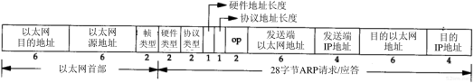
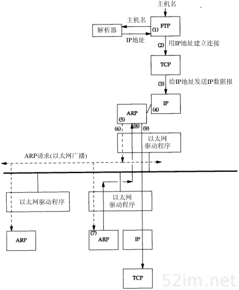

ARP地址解析协议
=================

当以太主机把以太网数据帧发送到位于同一局域网的另一台主机时，是根据48Bit的以太网地址(mac地址)来确定目的接口的，设备驱动程序从不检查IP数据报中的目的IP地址

地址解析为这两种不同地址形式提供映射:32bit的IP地址和数据链路层使用的任何类型的地址。ARP为IP地址到对应的硬件地址之间提供动态映射。

ARP高速缓存
------------

ARP高效运行的关键是由于每个主机上都有一个ARP高速缓存，这个高速缓存存放了最近IP地址和硬件地址之间的映射记录。高速缓存中每一项的生存时间一般为20分钟。
我们可以使用 ``arp -a`` 来检查arp高速缓存

ARP的分组格式
--------------

ARP请求和应答分组的格式如下

=================   ==============================================================================================================================================================
 数据段                                 描述
-----------------   --------------------------------------------------------------------------------------------------------------------------------------------------------------
 以太网目的地址         以太网目的地址为全1的则表示是广播地址
 以太网源地址           
 帧类型                 ARP请求和应答此字段的值为0x0806
 硬件类型               1表示以太网地址
 协议类型               表示要映射的协议地址类型，0x0800表示IP地址
 硬件地址长度           值为6
 协议地址长度           值为4
 操作字段               ARP请求(1)、ARP应答(2)、RARP请求(3)、RARP应答(4)
 发送端以太网地址    
 发送端IP
 目的以太网地址
 目的IP
=================   ==============================================================================================================================================================

对于ARP请求来说，除目的端硬件地址外的所有其他的字段都有填充值，当系统收到一份目的端为本机的ARP请求报文后，它就把硬件地址填进去，然后用两个目的端地址分别替换两个发送端地址，并把操作字段置为
2,然后将其发送出去

示例
-----

下面对ftp yinwg这个命令的执行过程进行分析, 当执行这条命令时会进行以下步骤

1) 应用程序FTP客户端调用函数gethostbyname把主机名(yinwg)转换成32bit的IP地址，这个函数再DNS(域名系统)中称作解析器,这个过程使用DNS，或者在较小网络中使用一个静态主机文件(/etc/hosts)
2) FTP客户端请求TCP用第一步得到的IP建立连接
3) TCP发送一个连接请求分段到远端的主机，即用上述IP地址发送一份IP数据报
4) 如果目的主机在本地网络上，那么IP数据报可以直接送到目的主机上。如果目的主机在一个远程网络上，那么就通过IP选路函数来确定位于本地网络上的下一站路由器地址，并让它转发IP数据报。
5) ARP将IP地址到对应的物理硬件地址进行翻译
6) ARP发送一份arp请求以太网数据帧到以太网上的每一台主机，这个过程称作广播。
7) 目的主机的ARP层收到这份广播报文后，发送一个ARP应答。这个应答包含IP地址和对应的硬件地址
8) 收到ARP应答后，IP数据报便可以传送了
9) 发送IP数据报到目的主机

