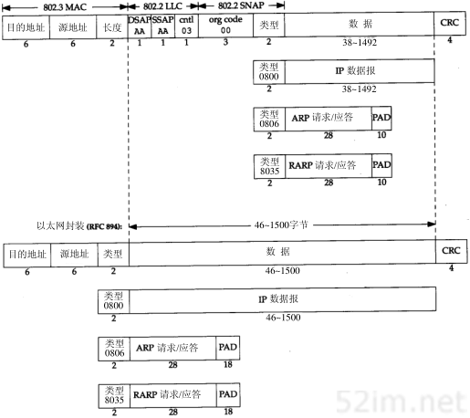

数据链路层
===========

这里再次引用TCP/IP协议族分层图

.. image::
    res/tcpip_layer.png

在TCP/IP协议族中，数据链路层主要有三个目的：

1) 为IP模块发送和接收数据报
2) 为ARP模块发送ARP请求和接收ARP应答
3) 为RARP发送RARP请求和接收RARP应答

下面将套路以太网数据链路层协议，两个串行接口链路层协议(SLIP和PPP),以及大多数实现都包含的环回(loopback)驱动程序。

IEEE 802和以太网封装
----------------------

IEEE 802.2/802.3（RFC 1042）和以太网的封装格式（RFC 894）

.. note::
    以太网的封装格式为常见的封装格式

SLIP:串行线路IP
-----------------

SLIP的全称是serial line ip，它是一种在串行线路上对IP数据报进行封装的简单形式，下面是SLIP定义的帧格式

1) IP数据报以一个END(0xC0)的特殊字符结束。同时为了防止数据报到来之前的线路噪声被当作数据报内容，大多数实现在数据报的开始处也传一个END字符
2) 如果IP报文中某个字符为END,那么就要连续传送两个字节0xdb和0xdc来取代他，0xdb这个特殊字符称作SLIP的ESC字符，但是它的值与ASCII码的ESC字符(0x1b)不同
3) 如果IP报文中某个字符为SLIP为SLIP的ESC字符，那么就要连续传送两个字节0xdb和0xdd来取代它

一下例子就是含有一个END字符和一个ESC字符的IP报文。在这个例子中，在串行线路上传输的总字节数是原IP报文长度再加4个字节。

.. image::  
    res/slip_package.png

PPP: 点对点协议
-----------------

PPP包括以下三个部分

1) 在串行链路上封装IP数据报的方法，PPP既支持数据为8位和无奇偶校验的异步模式，还支持面向比特的同步链接
2) 建立、配置及测试数据链路的链路控制协议(LCP: link control protocol). 它允许通信双方进行协商,以确定不同的选项
3) 针对不同网络层协议的网络控制协议(NCP: Network Control Protocol)体系。

PPP数据帧格式如下所示

.. image::
    res/ppp_protocol.png

每一帧都以标志字符0x7e开始和结束，接着是有个地址字节，值始终为0xff。然后是一个值为0x03的控制字节。接下来是协议字段，类似于以太网中类型字段的功能,然后是数据，最后是两个字节的crc

1) 当遇到字符0x7e时，需连续传送两个字符：0x7d和0x5e，以实现标志字符的转义。
2) 当遇到转义字符0x7d时，需连续传送两个字符：0x7d和0x5d，以实现转义字符的转义。

环回接口
---------

大多数产品都支持环回接口(loopback interface)，以允许运行在同一台主机上的客户程序和服务器程序将通过TCP/IP进行通信。A类端口号127就是为环回接口预留的。根据惯例，大多数系统把IP地址为
127.0.0.1分配给这个接口，并命令为localhost. 一个传给环回接口的IP数据报不能再任何网络上出现

环回接口处理IP数据报的简单过程

.. image::
    res/loopback_process.png

.. note::
    1.传给环回地址（一般是127.0.0.1）的任何数据均作为IP输入。
    2.传给广播地址或多播地址的数据报复制一份传给环回接口，然后送到以太网上。这是因为广播传送和多播传送的定义包含主机本身。
    3.任何传给该主机IP地址的数据均送到环回接口。

MTU
-----

