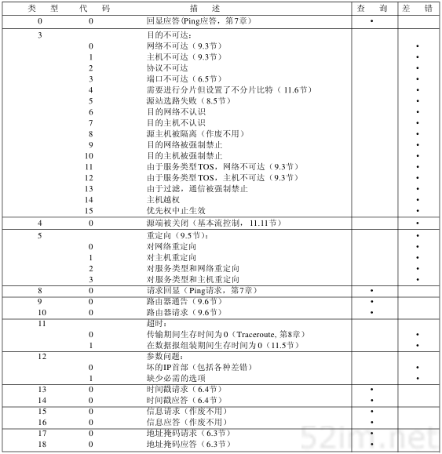

ICMP internet控制报文协议
============================

ICMP经常被认为时IP的一个组成部分，它传递差错报文以及其他需要注意的信息。ICMP报文通常被IP层或更高层协议(TCP或UDP)使用。一些ICMP报文把差错报文返回给用户进程

ICMP报文是在IP数据报内部被传输的

.. image::
    res/icmp_data.png

ICMP报文结构如下

============    ========================================================================================================================
 字段                   说明
------------    ------------------------------------------------------------------------------------------------------------------------
 8位类型          类型字段有15个不同的值，以描述特性类型的ICMP报文
 8位代码          某些ICMP报文还使用代码字段来进一步描述不同的条件
 16位校验和       检验和字段覆盖整个ICMP报文
============    ========================================================================================================================

ICMP报文类型
---------------

不同类型的ICMP报文由报文中的类型字段和代码字段共同决定

以下情况不会导致产生ICMP差错报文

1) ICMP差错报文(但是ICMP查询报文可能会产生ICMP差错报文)
2) 目的地址是广播地址或者多播地址的IP数据报
3) 作为链路层广播的数据报
4) 不是IP分片的第一片
5) 源地址不是单个主机的数据报，这就是说源地址不能为0地址、环回地址、广播地址、多播地址

这些规则是为了防止过去允许ICMP差错报文对广播分组响应所带来的广播风暴。

ICMP地址掩码请求与应答
-----------------------

ICMP地址掩码请求用于无盘系统在引导过程中获取自己的子网掩码，系统广播它的ICMP请求报文。无盘系统获取子网掩码的另一个方法是BOOTP协议

.. image::
    res/icmp_mask.png

ICMP报文中的标识符和序列号字段由发送端任意选择设定，这些值在应答中将被返回。这样发送端就可以把应答与请求进行匹配。

ICMP时间戳请求与应答
---------------------

ICMP时间戳请求允许系统向另一个系统查询当前时间，返回值为协调的统一时间（Coordinated Universal Time,UTC）（早期的参考手册认为UTC是格林尼治时间）。这种ICMP报文的好处是它提供了
毫秒级的分辨率，而利用其他方法从别的主机获取的时间只能提供秒级的分辨率。

ICMP时间戳请求和应答报文如下

请求端填写发起时间戳，然后发送报文。应答系统收到请求报文时填写接收时间戳，在发送应答时填写发送时间戳。但是，实际上，大多数的实现把后面两个字段都设成相同的值（提供三个字段的原因是可以让发送方分别计算发送请求的时间和发送应答的时间）。

ping
------

unix系统在实现ping程序时把ICMP报文中的标识字段设置成发送进程的ID号，这样即使在同一台主机上同时运行了多个ping程序，也可以识别出返回的信息。

序列号从0开始，每发送一次新的回显请求就加1. ping程序打印返回的每个分组的序列号，允许我们查看是否由分组丢失、失序、或重复. ping程序通过在ICMP报文中存放发送请求的时间来计算往返时间。
通常第一个往返时间值比较大，这是由于目的端的硬件地址不在ARP高速缓存中的缘故。

