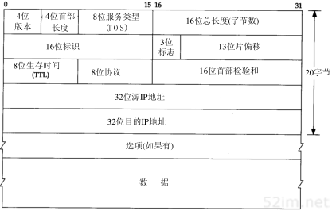

IP:网际协议
============

IP是TCP/IP协议族中最为核心的协议.

不可靠（unreliable）的意思是它不能保证IP数据报能成功地到达目的地。IP仅提供最好的传输服务。如果发生某种错误时，如某个路由器暂时用完了缓冲区，IP有一个简单的错误处理算法：丢弃该数据报，然后发送ICMP消息报给信源端。任何要求的可靠性必须由上层来提供（如TCP）。

无连接（connectionless）这个术语的意思是IP并不维护任何关于后续数据报的状态信息。每个数据报的处理是相互独立的。这也说明，IP数据报可以不按发送顺序接收。如果一信源向相同的信宿发送两个连续的数据报（先是A，然后是B），每个数据报都是独立地进行路由选择，可能选择不同的路线，因此B可能在A到达之前先到达。

IP首部
-------

IP数据报的格式如下图所示

==============  ========================================================================
字段            描述
--------------  ------------------------------------------------------------------------
版本            IPV4就是4, IPV6就是6
首部长度        4个字节为单位，最小为5最大为15
服务类型        Qos用，目前不怎么使用
总长度          字节为单位，最多可以传送65535字节的IP数据包
标识字段
标志
段偏移
生存时间TTL     经过一个路由器减一。字段为0时数据包被丢弃，并发送ICMP报文通知源主机
协议            区分上层协议
首部校验和      仅对首部进行校验
源地址 
目的地址
==============  ========================================================================

IP路由选择
-------------

从概念上说，IP路由是最简单的，如果目的主机与源主机直接相连，那么IP数据报就直接送到目的主机上，否则主机把数据报发送到路由器上，由路由器进行转发。

IP可以从TCP、UDP、ICMP、和IGMP接收数据报(即再本地生成的数据报)并进行发送，或者从一个网络接口接收数据报(待转发的数据报)并进行发送。IP层在内存中有一个路由表。当收到一份数据报
并进行发送时，它都要对该表搜素一次。当数据报来自某个网络接口时，IP首先检查目的IP地址是否为本机IP地址之一或者IP广播地址。如果确实是这样，数据报就被送到由IP首部协议字段所指定
的协议模块进行处理。如果数据报的目的不是这些地址，那么IP层被设置成路由器的功能，对数据报进行转发

路由表包含的信息

1) 目的IP地址: 它既可以是一个完整的主机地址，也可以是一个网络地址，由该表目中的标志字段来指定。
2) 下一跳路由器IP地址或者直接链接的网络IP地址
3) 标志: 其中一个标志指明目的IP地址是网络地址还是主机地址,另一个标志指明下一跳路由器是否为真正的下一站路由器还是一个直接相连的接口
4) 为数据报的传输指定一个网络接口

IP路由选择是逐跳(hop-by-hop)进行的。所以IP并购不知道达到目的IP的完整路径

IP路由选择主要完成以下这些功能

1) 搜索路由表，寻找能与目的IP地址完全匹配的表目(网络号和主机号都要匹配)，如果找到则把报文发送到该表目指定的下一站路由器或直接相连的网络接口
2) 搜索路由表，需要能与目的网络号项匹配的标目，如果找到则发送
3) 搜索路由表，寻找标为"default"的表目，如果找到则发送，如果以上三步都没有成功，那么数据报将不能被发送

