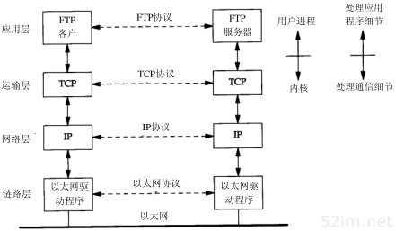
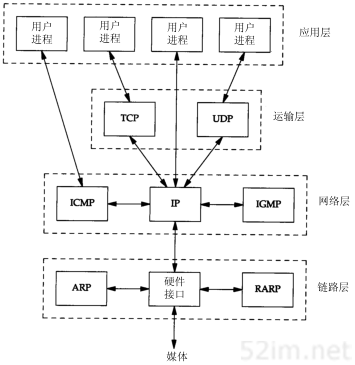
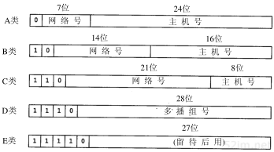
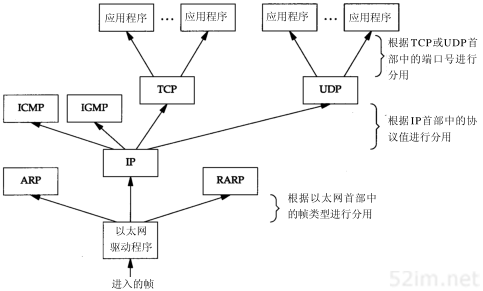

概述
=====

分层
-----

网络协议通常分为不同层次进行开发，每一层分别负责不同的通信功能。一个协议族，如TCP/IP，是一组不同层次上的多个协议的组合，TCP/IP通常被认为是一个四层协议系统，如下图所示

.. image::
    res/tcpip_layer.png

每一层负责不同的功能:

1) 链路层：又是也称作数据链路层或者网络接口层，通常包括操作系统中的设备驱动程序喝计算机中对应的网络接口卡
2) 网络层: 有事也称作互联网层，处理分组在网络中的活动，例如分组的选路。在tcp/ip协议族中，网络层协议包括IP协议(网际协议)，ICMP协议(internet互联网控制报文协议)，以及IGMP协议(internet组管理协议)
3) 运输层: 主要为两台主机上的应用程序提供端到端的通信。在TCP/IP协议族中，有两个互不相同的传输协议，TCP(传输控制协议)和UDP(用户数据报协议)
4) 应用层：应用层负责处理特定的应用程序细节，Telnet远程登录，FTP文件传输协议，SMTP简单邮件传输协议，SNMP简单网络管理协议

以下示例中展示了一个局域网中，两台运行FTP协议的主机在运行过程中涉及到的所有协议

在TCP/IP协议族中有很多种协议,下图种展示了不同层次中的协议

1) TCP和UDP都属于运输层协议，二者都使用IP作为网络层协议。虽然TCP使用不可靠的IP服务但是它提供一种可靠的运输层服务。UDP为应用程序发送和接收数据报。一个数据报是指从发送方传输到接收方的一个信息单元。
   与TCP不同的是UDP是不可靠的，它不能保证数据报能安全无误的到达最终目的。
2) IP是网络层的主要协议，同时被TCP和UDP使用
3) ICMP是IP协议的附属协议，IP层用它来与其他主机或路由器交换错误报文和其他重要信息。
4) IGMP是internet组管理协议，它用来把一个UDP数据报多播到多个主机
5) ARP地址解析协议和RARP逆地址解析协议是某些网络接口使用的特殊协议，用来转换IP层和网络接口层使用的地址

互联网地址
-----------

互联网上的每个接口必须有一个唯一的internet地址(IP地址)，IP地址长32bit，internet地址有一定的结构，主要分为5类

==============  ========================================================
    类型                    范围
--------------  --------------------------------------------------------
    A               0.0.0.0 到 127.255.255.255
    B               128.0.0.0 到 191.255.255.255
    C               192.0.0.0 到 223.255.255.255
    D               224.0.0.0 到 239.255.255.255
    E               240.0.0.0 到 247.255.255.255
==============  ========================================================

IP地址中又可以分为单播地址(目的为单个主机)、广播地址(目的端为给定网络上的所有主机)、以及多播地址(目的端为同一组内的所有主机)

域名系统
----------

尽管通过IP地址可以识别主机上的网络接口，进而访问主机，但是人们更喜欢使用的还是主机名。在TCP/IP领域中，域名系统(DNS)是一个分布的数据库，由它来提供IP地址和主机名之间的
映射信息。

封装
-----

当应用程序用TCP传数据时，数据被送入协议栈中，然后逐个通过每一层直到被当作一串比特流送入网络。其中每一层对收到的数据都要增加一些首部信息(有时还要增加尾部信息)。
TCP传给IP的数据单元称作TCP报文段或者TCP段。IP传给网络接口层的数据单元称作IP数据报，通过以太网传输的比特流称作帧

下图表示了数据进入协议栈时的封装过程

.. image::
    res/data_package.png

分用
-----

当目的主机收到一个以太网数据帧时，数据就开始从协议栈中由底向上升，同时去掉各层协议上的报文首部。每层协议都要去检查报文首部中的协议标识，以确定接收数据的上层协议。这个过程称为
分用(Demultiplexing)

