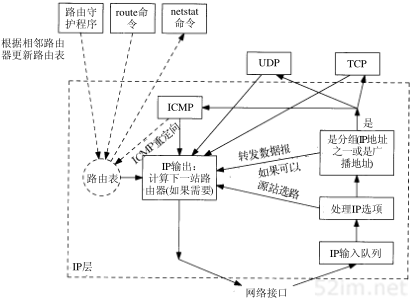
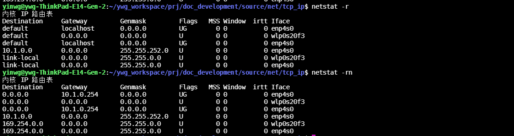
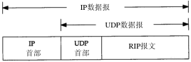
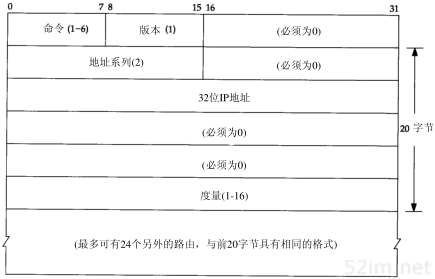

IP选路
=========

选路时IP最重要的功能之一，下图表示了IP层处理的简单流程

选路的原理
-------------

IP层进行的选路实际上是一种选路机制，它搜索路由表并决定向哪个网络接口发送分组，这区别于选路策略，它只是一组决定把哪些路由放入路由表的规则。IP执行选路机制，而路由守护进程
则一般提供选路策略。

简单路由表
^^^^^^^^^^^^^

netstat -r命令可以列出当前内核维护的路由表,然后-n选项再次执行该命令，以数字形式打印出IP地址。(如果没有-n则netstat命令将搜索文件/etc/networks并列出其中的网络名)

================  ========================================================================================================================================
 参数               描述
----------------  ----------------------------------------------------------------------------------------------------------------------------------------
 Destination        目的主机
 Gateway            网关
 Flags              U该路由可以使用，G该路由是到一个网关如果没有该标志则说明是直连的，H该路由是到一个主机，D该路由由重定向报文创建
================  ========================================================================================================================================

主机路由表的复杂性取决于主机所在网络的拓扑结构

1) 最简单的情况是主机没有跟任何网络相连，这种情况下路由表只包含环回接口这一项
2) 主机连接在一个局域网上，只能访问局域网主机，这时路由表包含两项:一项是环回接口,另一项是局域网
3) 如果主机能够通过单个路由器访问其他网络，一般情况下增一个默认表项指向该路由器

每当初始化一个接口时，就为此接口自动创建一个直接路由.如果目的主机不是直接相连的则需要加入路由表,可以使用route add default gw 10.1.0.254

动态选路协议
----------------

前面讨论的是静态选路，在配置接口时以默认方式生成路由表项(对直接连接的接口)，并通过route命令增加表项，或时通过ICMP重定向生成表项。在网络比较小且与其他网络只有单个连接点且没有
多余路由时，采用这种方法是可行的。复杂网络中则采用动态选路。

动态选路协议用于路由器间的通信，我们主要讨论RIP(即选路协议routing information protocol),大多是TCP/IP实现都提供这个应用广泛的协议。

当相邻路由器之间进行通信，以告知对方每个路由器当前所连接的网络，这时就出现了动态选路。路由器之间必须采用选路协议进行通信，这样的选路协议有很多种。路由器上有一个进程称为
路由守护程序(routing daemon)它运行选路协议，并于其相邻的一些路由器进行通信,从相邻的路由器接收信息并更新内核路由表。

RIP选路信息协议
^^^^^^^^^^^^^^^^

RIP报文包含在UDP数据报中，如下为RIP报文格式

=================   ======================================================================================================================
 字段                       描述
-----------------   ----------------------------------------------------------------------------------------------------------------------
 命令                   1表示请求2表示应答，3和4舍弃不用，两个非正式命令轮询(5)、轮询表项(6)
 版本                   通常为1,第二版RIP设置为2
 地址系列               对于IP地址来说，值为2
 度量                   逐跳计数
=================   ======================================================================================================================

采用这种20字节格式的RIP报文可以通告多达25条路由。上限25是用来保证RIP报文的总长度为20×25+4=504，小于512字节。由于每个报文最多携带25个路由，因此为了发送整个路由表，经常需要多个报文。

采用RIP协议的routed程序正常运行流程，RIP常用的UDP端口号试520

1) 初始化：启动一个路由守护程序时，先判断q启动了哪些接口，并在每个接口上发送一个请求报文，要求其他路由器发送完整路由表。在点对点链路中，该请求时发送给其他终点的。如果网络支持广播的话，
   这种请求是以广播形式发送的。目的UDP端口号是520。这种请求报文的命令字段为1，但地址系列字段设置为0，而度量字段设置为16。这是一种要求另一端完整路由表的请求报文
2) 接收到请求: 如果这个请求是刚才提到的特殊请求，那么路由器就将完整的路由表发送给请求者。否则就处理请求中的每一个表项，如果有连接到指明地址的路由，则将度量设置成我们的值，否则将度量置为16(度量
   为16表示一种称为无穷大的特殊值，它意味着没有到达目的路由),然后发送响应
3) 接收到响应: 使响应生效，可能会更新路由表。
4) 定期选路更新: 每过30秒，所有或部分路由器会将完整路由器表发送给相邻路由器。发送路由表可以是以广播形式的，或是发送给点对点链路其他重点的。
5) 触发更新: 每当一条路由的度量发生改变时，就对它进行更新。不需要发送完整路由表，而只需要发送哪些发生改变的表项。

每条路由都有与之相关的定时器，如果运行RIP的系统发现一条路由在3分钟内未更新，就将该路由的度量设置成无穷大(16)，并标注为删除

**度量**

RIP所使用的度量是以跳(hop)计算的，所有直接连接的接口的跳数为1

待完善......

