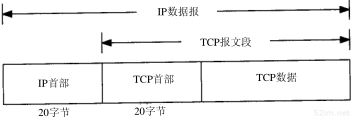
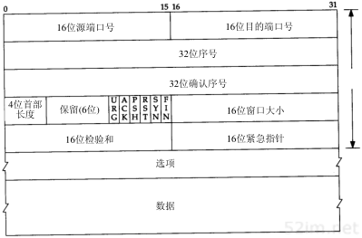
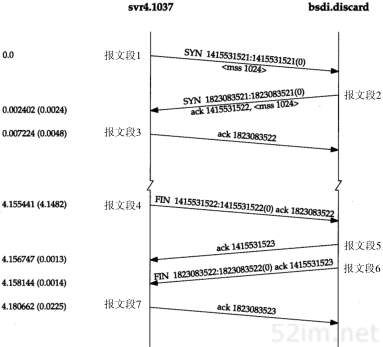
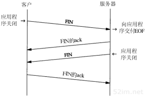
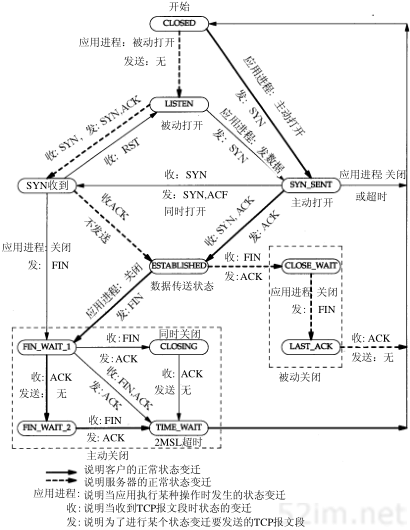
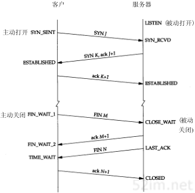
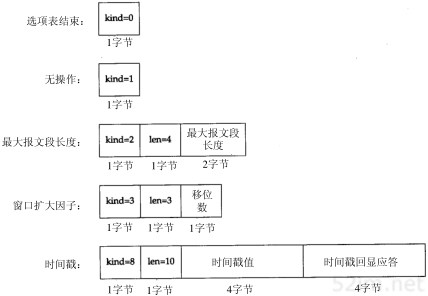
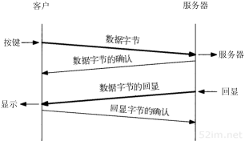
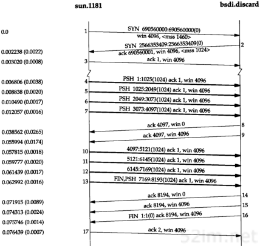
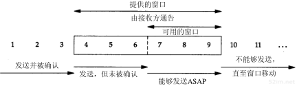

TCP传输控制协议
=================

TCP提供一种面向连接的、可靠的字节流服务，面向连接意味着两个使用TCP的应用在彼此交换数据之前必须先建立一个TCP连接。

TCP通过谢列方式来提供可靠性

1) 应用数据被分割成TCP认为最适合发送的数据块
2) TCP发送一个段后，它启动一个定时器，等待目的端确认收到这个报文段，如果不能及时收到一个确认，将重发这个报文段。
3) 当TCP收到发自TCP连接另一端的数据，它将发送一个确认。
4) TCP将保持首部和数据的校验和。这是一个端到端的校验和，目的是检测数据在传输过程中的任何变化，如果收到段的校验和有差错，TCP将丢弃这个报文段和不确认收到此报文段(希望发端超市重发)
5) 既然TCP报文段作为IP数据报来传输，而IP数据报的到达可能会失序，因此TCP报文的到达也可能会失序。如果必要，TCP将对收到的数据进行重新排序，将收到的数据以正确的顺序交给应用层
6) 既然IP数据报会发生重复，TCP的接收端必须丢弃重复的数据
7) TCP还能提供流量控制。TCP连接的每一方都有固定大小的缓冲空间，TCP的接收端只允许另一端发哦是那个接收端缓冲区能容纳的数据。这将防止较快主机致使较慢主机的缓冲区溢出

TCP数据封装
--------------

TCP数据在IP数据报中的封装

TCP首部格式如下

每个TCP段都包含源端和目的端的端口号，用于寻找发端和收端应用进程。这两个值加上IP首部中的源端IP地址和目的端IP地址唯一确定一个TCP连接。

==============  =======================================================================================================================================================================
 字段               描述
--------------  -----------------------------------------------------------------------------------------------------------------------------------------------------------------------
 16位源端口号       端口号用于确定建立连接的是哪个应用程序
 16位目的端口
 32位序号           用来标识TCP传送数据字节流的计数
 32位确认序号       确认序号包含发送确认的一端所期望收到的下一个序号
 4位首部长度        TCP首部长度
 URG                紧急指针
 ACK                确认序号有效
 PSH                标识接收方应该尽快将这个报文段交给应用层
 RST                重新建立连接
 SYN                同步序号，用来发起一个连接
 FIN                发端完成发送任务
 16位窗口大小       TCP的流量控制由连接的每一端通过声明的窗口大小来提供
 16位校验和         检验和覆盖了整个的TCP报文段：TCP首部和TCP数据
 16位紧急指针       只有当URG标志置1时紧急指针才有效
 选项
 数据
==============  =======================================================================================================================================================================

TCP连接的建立与终止
--------------------

建立连接
^^^^^^^^^

建立连接需要进行以下步骤

1) 请求端发送一个SYN段指明客户打算连接的服务器的端口，以及初始序号。这个SYN段为报文段1。
2) 服务器发回包含服务器初始序号的SYN报文段作为应答。同时将确认序号设置为客户端的ISN加一以对客户端的SYN报文段进行确认
3) 客户端必须将确认确认序号设置为服务器的ISN加1以对服务器的SYN报文段进行确认

这个过程称为三次握手

终止连接
^^^^^^^^^^

建立一个连接需要三次握手，而终止一个连接需要经过4次挥手，这是由于TCP的半关闭(halfclose)造成d的。既然一个TCP连接时全双工，因此每个方向必须单独地进行关闭。
收到一个FIN只意味着这一方向上没有数据流动，一个TCP连接在收到一个FIN后仍能发送数据。

数据流如下所示

TCP状态迁移图
^^^^^^^^^^^^^^

TCP正常建立连接和终止所对应的状态

**2MSL等待状态**

TIME_WAIT状态也称为2MSL等待状态，每个具体TCP实现必须选择一个报文段最大生存时间MSL(maximum segment lifetime).它时任何报文段被丢弃前在网络内的最长时间。

MSL一般为30秒、1分钟、或2分钟

对一个具体实现所给定的MSL值，处理的原则是：当TCP执行一个主动关闭，并发回最后一个ACK，该连接必须在TIME_WAIT状态停留的时间为2倍的MSL。这样可让TCP再次发送最后的ACK以防这个ACK丢失（另一端超时并重发最后的FIN）。

这种2MSL等待的另一个结果是这个TCP连接在2MSL等待期间，定义这个连接的socket(客户的IP地址和端口号，服务器的IP地址和端口号)不能再被使用，只能再2MSL结束后使用

TCP选项
^^^^^^^^^^

TCP的交互数据流
----------------

在一个交互式输入的TCP连接中，需要有以下几个步骤

1) 来自客户端的交互按键
2) 自来服务器的按键确认
3) 来自服务器的按键回显
4) 来自客户的按键回显确认

数据流如下所示

然后我们一般将报文段2和报文段3进行合并(按键确认和按键回显)一起发送，这种合并的技术称为经受时延的确认。

**Nagle算法**

Nagle算法要求一个TCP连接上最多只能有一个未被确认的未完成的小分组，在该分组的确认到达之前不能发送其他的小分组。相反，TCP收集这些少量的分组，并在确认到来时以一个分组的方式发出去。
该算法的优越之处在于它是自适应的：确认到达的越快，数据也就发送的越快。

有时候我们需要关闭Nagle算法，比如有些消息需要无时延的发送。可以通过TCP_NODELAY选项来关闭Nagle算法

**快的发送方和慢的接收方**

发送方发送4个背靠背（back-to-back）的数据报文段去填充接收方的窗口，然后停下来等待一个ACK。接收方发送ACK（报文段8），但通告其窗口大小为0，这说明接收方已收到所有数据，但这些数据都在接
收方的TCP缓冲区，因为应用程序还没有机会读取这些数据。另一个ACK（称为窗口更新）在17.4ms后发送，表明接收方现在可以接收另外的4096个字节的数据。虽然这看起来像一个ACK，但由于它并不确认任
何新数据，只是用来增加窗口的右边沿，因此被称为窗口更新。

下面是一个滑动窗口协议的示意图

接收方通告的窗口称为提出的窗口。当接收方确认数据后，这个滑动窗口不时的向右移动。通常使用三个术语来描述窗口左右边沿的运动

1) 称窗口左边沿向右边沿靠近为窗口合拢。这种现象发生在数据被发送和确认时。
2) 当窗口右边沿向右移动时将允许发送更多的数据，称之为窗口张开。这种现象发生在接收端进程读取已确认的数据并释放了TCP的接收缓存时。
3) 当右边沿向左移动时，称之为窗口收缩。这种情况不多见。

TCP的超时与重传
----------------

TCP提供可靠的运输层，它使用的方法之一就是确认从另一端收到的数据。但数据和确认数据都有可能会丢失。TCP通过在发送时设置一个定时器来解决这种问题。如果当定时器溢出时还没有收到确认，它就
重传该数据。

对于每个连接，TCP管理4个不同的定时器

1) 重传定时器使用于当希望收到另一端的确认。
2) 坚持(persist)定时器使窗口大小信息保持不断流动，即使另一端关闭了其接收端口
3) 保活(keepalive)定时器可检测到一个空闲连接的另一端何时崩溃或重启。
4) 2MSL定时器测量一个连接处于TIME_WAIT状态的时间。

TCP超时与重传中最重要的部分就是对一个给定连接的往返时间(RTT)的测量。TCP必须测量在发送一个带有特别序号的字节和接收到包含该字节的确认之间的RTT,因为数据报文段和ACK之间通常并没有一一对应关系。

