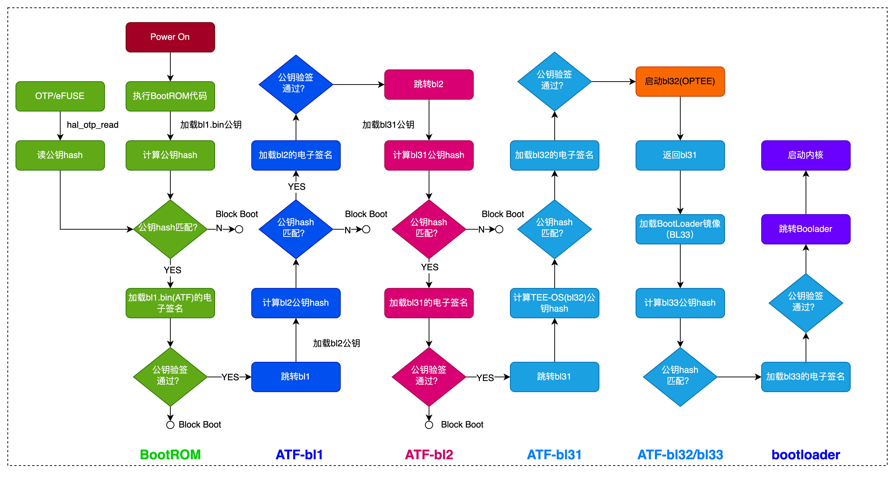
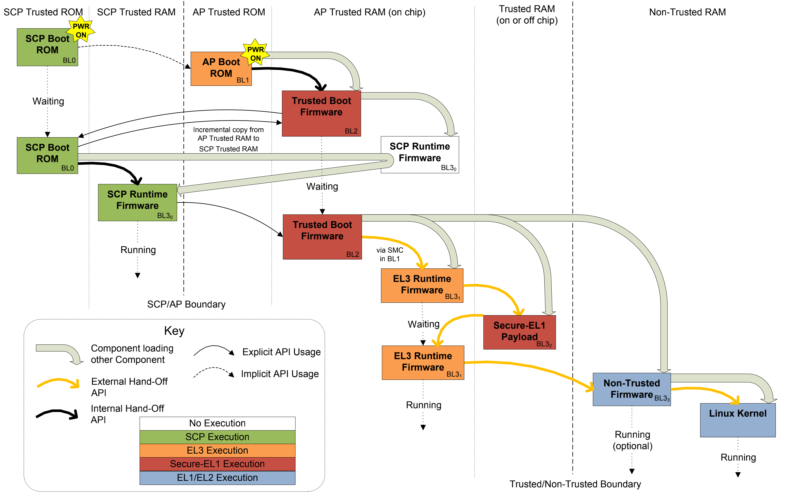

ATF启动过程
===============

冷启动流程及阶段划分
-----------------------

ATF冷启动实现分为5个步骤:

- BL1: AP Trusted ROM, 一般为BootRom

- BL2: Trusted Boot Firmware，一般为Trusted Bootloader

- BL31: EL3 Runtime Firmware，一般为SML，管理SMC执行处理和中断，运行在secure monitor中

- BL32: Secure-EL1 Payload，一般为TEE OS Image

- BL33: Non-Trused Firmware,一般为uboot, linux kernel

.. note::
    ATF输出BL1, BL2, BL31，提供BL32和BL33接口

启动流程如下

.. image::
    res/atf_start.png

BL1
^^^^

BL1 ``位于ROM`` 中，在 ``EL3`` 下从reset vector处开始运行．其主要目的是初始化系统环境和启动第二阶段镜像BL2

BL1做的主要工作包括:

- 决定启动路径: 冷启动还是热启动

- 架构初始化: 异常向量，CPU复位处理函数配置，控制寄存器设置(SCRLR_EL3/SCR_EL3/CPTR_EL3/DAIF)

- 平台初始化: 使能Trusted Watchdog，初始化控制台，配置硬件一致性互联，配置MMU,初始化相关存储设备

- 固件更新处理

- BL2镜像加载和运行:

  - BL1输出"Booting Trusted Firmware"

  - BL1加载BL2到SRAM,如果SRAM不够或者BL2镜像错误，输出"Failed to load BL2 firmware"

  - BL1切换到Secure EL1并将执行权交给BL2

BL2
^^^^^

BL2位于 ``SRAM`` 中，运行在 ``Secure EL1`` 主要工作有:

- 架构初始化: EL1/EL0使能浮点单元和ASMID

- 平台初始化: 控制台初始化，相关存储设备初始化，MMU, 相关设备安全配置

- SCP_BL2: 系统控制核镜像加载，单独核处理系统功耗，时钟，复位等控制

- 加载BL31镜像: BL2将控制权交给BL1, BL1关闭MMU并关cache，BL1将控制权交给BL31

- 加载BL32镜像: BL32运行在安全世界，BL2依赖BL31并将控制权交给BL32，SPSR通过Secure-EL1 Payload Dispatcher进行初始化

- 加载BL33镜像: Bl2依赖BL31将控制权交给BL33

.. note::
    此阶段可视为ARMv7 SPL的流程，此时DDR还没有初始化，这一步总需要被加载到片内的SRAM执行，一般在这个阶段完成DDR的初始化，因此后面的Image可以
    被加载到DDR中．BL3所有的Image都是由BL2加载的，BL31/BL32是可选的配置．若没有trusted os可以没有BL2，若不支持EL3异常等级及secure monitor,则
    可以去掉BL31 

BL31
^^^^^

BL31位于 ``SRAM`` 中， ``EL3`` 模式，除了做架构初始化和平台初始化外，还做了如下工作

- PSCI服务初始化，后续提供CPU功耗管理操作

- BL32镜像运行初始化，处于Secure EL1模式

- 初始化非安全EL2或EL1，跳转到BL33执行

- 负责安全非安全世界切换

- 进行安全服务请求的分发

BL33
^^^^^^^

通常是uboot,由uboot启动kernel.这个步骤Soc处于EL2-non-secure模式

ARMv8安全引导过程
------------------

