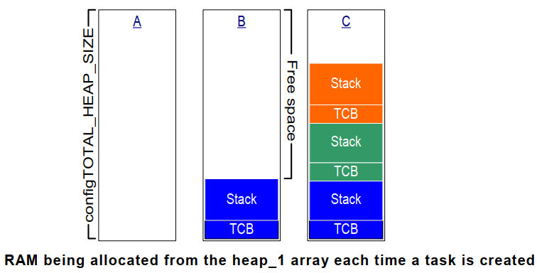

FreeRTOS内存管理
=====================

在C语言的库函数中，有malloc, free等函数，但在FreeRTOS中，他们不适用

- 不适用在资源紧缺的嵌入式系统中

- 这些函数的实现过于复杂，占据的代码空间大

- 并非线程安全

- 运行有不确定性，每次调用这些函数时花费的时间可能都不相同

- 内存碎片化

- 使用不同的编译器时，需要进行复杂的配置

- 有时难以调试

FreeRTOS内存管理方法
-----------------------

FreeRTOS中内存管理的接口函数为: ``pvPortMalloc`` , ``vPortFree`` ,对应C库的malloc, free

=================   ========================================    =======================================
  文件　                    优点　                                      缺点
-----------------   ----------------------------------------    ---------------------------------------
 heap_1.c               分配简单，时间确定　                        只分配，不回收
 heap_2.c               动态分配，最佳匹配　                        碎片，时间不确定
 heap_3.c               调用标准库函数　                            速度慢，时间不定
 heap_4.c               相邻空闲内存可合并　                        可解决碎片问题，时间不定
 heap_5.c               在heap_4基础上支持分割的内存块　            可解决碎片问题，时间不定
=================   ========================================    =======================================

Heap_1
-----------

它只实现了pvPort, 没有实现vPortFree

如果你的程序不需要删除内核对象，那么可以使用heap_1

- 实现最简单

- 没有碎片问题

- 一些要求非常严格的系统里，不允许使用动态内存，就可以使用heap_1

它的实现原理很简单，首先定义一个大数组

::

    /* A few bytes might be lost to byte aligning the heap start address. */
    #define configADJUSTED_HEAP_SIZE    ( configTOTAL_HEAP_SIZE - portBYTE_ALIGNMENT )

    /* Allocate the memory for the heap. */
    #if ( configAPPLICATION_ALLOCATED_HEAP == 1 )

    /* The application writer has already defined the array used for the RTOS
    * heap - probably so it can be placed in a special segment or address. */
        extern uint8_t ucHeap[ configTOTAL_HEAP_SIZE ];
    #else
        static uint8_t ucHeap[ configTOTAL_HEAP_SIZE ];
    #endif /* configAPPLICATION_ALLOCATED_HEAP */

然后，对于pvPortMalloc调用时，就从这个数组中分配空间

FreeRTOS在创建任务时，需要2个内核对象: task control block(TCB), stack

使用heap_1时，内存分配过程如下图所示

- A: 创建任务之前整个数组都是空闲的

- B: 创建第一个任务之后，蓝色区域被分配出去了

- C: 创建第三个任务之后的数组使用情况

Heap_2
---------

Heap_2之所以还保留，只是为了兼容以前的代码．新设计中不再推荐使用Heap_2,建议使用Heap_4来代替Heap_2，更加高效

Heap_3
---------

Heap_3使用标准C库里的malloc, free函数，所以堆大小由链接器的配置决定

Heap_4
----------

跟Heap_1和Heap_2一样，Heap_4也是使用大数组来分配内存

Heap_4使用 ``首次适应算法(first fit)`` 来分配内存．它还会把相邻的空闲内存合并为一个更大的空闲内存，这有助于较少内存
的碎片问题

首次适应算法：

- 假设堆中有3块空闲内存:5字节，200字节，100字节

- pvPortMalloc想申请20字节

- 找出第一个能满足pvPortMalloc的内存: 200字节

- 把它划分为20字节，180字节

    - 返回这20字节的地址

    - 剩下的180字节仍然是空闲状态，留给后续的pvPortMalloc使用

.. note::
    Heap_4执行的时间是不确定的，但它的效率高于标准库的malloc, free

Heap_5
----------

Heap_5分配内存，释放内存的算法是跟Heap_4一样的．不同的是，Heap_5并不局限于管理一个大数组:它可以管理多块，分割开的内存.

既然内存是分割开的，那么就需要进行初始化，确定这些内存块在哪，有多大

::

    typedef struct HeapRegion
    {
        uint8_t *pucStartAddress;
        size_t  xSizeInBytes;
    } HeapRegion_t;

    HeapRegion_t xHeapRegions[] = {
        {(uint8_t *)0x80000000UL, 0x10000},
        {(uint8_t *)0x90000000UL, 0xa0000},
        {NULL, 0}
    };

    void vPortDefineHeapRegions(const HeapRegion_t * const pxHeapRegions);

Heap相关的函数
----------------

::

    void *pvPortMalloc(size_t xWantedSize);
    void vPortFree(void *pv);
    size_t xPortGetFreeHeapSize(void);
    //返回程序运行过程中，空闲内存容量的最小值,只有Heap_4, Heap_5支持此函数
    size_t xPortGetMinmumEverFreeHeapSize(void);

- malloc失败的钩子函数

::

    void *pvPortMalloc(size_t xWantedSize)
    {
        ...
        #if (configUSE_MALLOC_FAILED_HOOK == 1)
            if(pvReturn == NULL)
            {
                extern void vApplicationMallocFailedHook(void);
                vApplicationMallocFailedHook();
            }
        #endif
    }

.. note::
    使用此钩子函数需要在FreeRTOSConfig.h中，把configUSE_MALLOC_FAILED_HOOK定义为1

