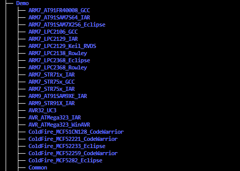
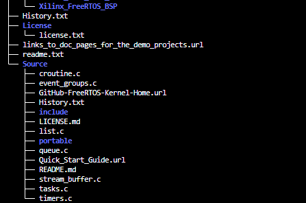

FreeRTOS概述
================

FreeRTOS目录结构
------------------

- Demo: 工程文件，以"芯片和编译器"组成一个名字

- Source

    - 根目录下是核心文件，这些文件是通用的

    - portable: 目录下是移植时需要实现的文件

核心文件
-----------

FreeRTOS最核心的文件有两个

- FreeRTOS/Source/tasks.c

- FreeRTOS/Source/list.c

====================    ====================================================================
 Source目录文件　                   作用
--------------------    --------------------------------------------------------------------
 tasks.c                 　必需，任务操作
 list.c                     必需，列表
 queue.c                   基本必需，提供队列操作，信号量操作
 timer.c                   可选，software timer
 event_groups.c            可选，提供event group功能
 croutine.c                可选，已过时
====================    ====================================================================

移植时涉及的文件
------------------

移植FreeRTOS时涉及的文件放在 ``FreeRTOS/Source/portable/[compiler]/[architecture]`` 目录下

需要关注 ``port.c`` ``portmacro,h``

头文件
---------

- FreeRTOS本身的头文件: FreeRTOS/Source/include

- 移植时用到的头文件: FreeRTOS/Source/portable/[compiler]/[architecture]

- 含有配置文件FreeRTOSConfig.h目录

===================== =================================================================================================
 头文件　                               作用
--------------------- -------------------------------------------------------------------------------------------------
 FreeRTOSConfig.h       FreeRTOS配置文件，比如选择调度算法
 FreeRTOS.h             使用FreeRTOS API函数时，必须包含此文件，然后再去包含其他头文件,如task.h queue.h
===================== =================================================================================================

内存管理
------------

文件在 ``FreeRTOS/Source/portable/MemMang`` ，它也是放在 ``portable`` 目录下，表示你可以提供自己的函数.源码中默认提供了
5个文件，对应内存管理的5种方法

=================   ========================================    =======================================
  文件　                    优点　                                      缺点
-----------------   ----------------------------------------    ---------------------------------------
 heap_1.c               分配简单，时间确定　                        只分配，不回收
 heap_2.c               动态分配，最佳匹配　                        碎片，时间不确定
 heap_3.c               调用标准库函数　                            速度慢，时间不定
 heap_4.c               相邻空闲内存可合并　                        可解决碎片问题，时间不定
 heap_5.c               在heap_4基础上支持分割的内存块　            可解决碎片问题，时间不定
=================   ========================================    =======================================

Demo
-------

Demo目录下是预先配置好的，没有编译错误的工程，目的是让你可以基于它进行修改，以适配你的单板

