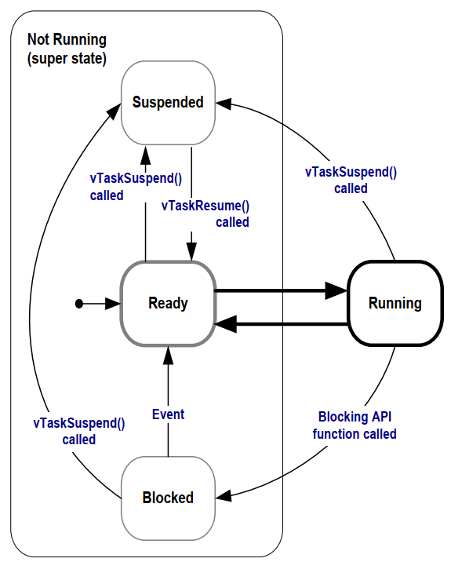

FreeRTOS任务管理
==================

任务创建与删除
----------------

在FreeRTOS中，任务就是一个函数，原型如下

::

    void TaskFunction(void *pvParameters);

- 这个函数不能返回

- 同一个函数可以用来创建多个任务

- 每个任务都有自己的栈，任务的局部变量放在栈中

::

    BaseType_t xTaskCreate(TaskFunction_t pxTaskCode,   //函数指针，任务函数
                            const char * const pcName,  //任务名字
                            const configSTACK_DEPTH_TYPE usStackDepth,  //栈大小，单位为word
                            void *const pvParameters,   //调用任务函数时传入的参数
                            UBaseType_t uxPriortity,    //优先级
                            TaskHandlet_t *const pxCreateTask); //任务句柄，以后使用它来操作这个任务

    void vTaskDelete(TaskHandle_t xTaskToDelete);

任务优先级和Tick
----------------------

优先级的取值范围是: 0~(configMAX_PRIORITES - 1),数值越大优先级越高.
FreeRTOS的调度器可以使用2种方法来快速找出优先级最高的，可以运行的任务．使用不同的方法时，configMAX_PRIORITES的取值有所不同

- 通用方法，使用C函数实现．对configMAX_PRIORITES的取值没有限制．

- 架构相关的优化方法，架构相关的汇编指令实现．使用这种方法时，configMAX_PRIORITES的取值不能超过32

::

    uBaseType_t uxTaskPriorityGet(const TaskHandle_t xTask);

    void vTaskPrioritySet(TaskHandle_t xTask, UBaseType_t uxNewPriority);

任务状态
-------------

- 运行态(Running): 任务正在运行

- 就绪态(Ready): 任务具备运行的条件，等待调度器调度

- 暂停状态(Suspended): 任务挂起

    - 通过调用vTaskSuspend(TaskHandle_t xTaskToSuspend)函数挂起任务

    - 要退出挂起状态，只能由别人来操作，vTaskResume(别的任务调用)，xTaskResumeFromISR(中断程序调用)

- 阻塞态(Blocked): 任务要等待某个事件才能运行，等待过程中不消耗CPU资源

Delay函数
--------------

::

    //等待多少个tick
    void vTaskDelay(const TickType_t xTicksToDelay);

    // pxPreviousWakeTime: 上一次被唤醒的时间
    // xTimeIncrement: 要阻塞到(pxPreviousWakeTime + xTimeIncrement), 单位都是tick count
    BaseType_t xTaskDelayUntil(TickType_t *const pxPreviousWakeTime,
                                const TickType_t xTimeIncrement);

空闲任务
------------

一个良好的程序，它的任务都是事件驱动的，平时大部分时间都处于阻塞状态，有可能自己创建的任务都无法运行，
但是调度器必须能找到一个可以运行的任务，所以需要提供空闲任务．在使用 ``vTaskStartScheduler()`` 函数来创建，
启动调度器时，这个函数内部会创建空闲任务

- 空闲任务的优先级为0: 它不能阻碍用户任务运行

- 空闲任务要不处于就绪态，要不处于运行态，永远不会阻塞

可以添加一个空闲任务的钩子函数(idle task hook functions),空闲任务的循环每执行一次，就会调用一次钩子函数.钩子函数有以下作用

- 执行一些低优先级的，后台的，需要连续执行的函数

- 测量系统的空闲时间，空闲任务被执行就意味着所有高优先级的任务都停止了，所以测量空闲任务占据的时间，就可以算出处理器占用率

- 让系统进入省电模式

调度算法
-----------

所谓调度算法，就是怎么确定哪个就绪态的任务可以切换为运行状态

通过配置文件FreeRTOSConfig.h的两个配置项来配置调度算法: configUSE_PREEMPTION, configUSE_TIME_SLICING

调度算法的行为主要体现在两个方面:高优先级的任务先运行，同优先级的就绪态任务如何被选中

从3个角度统一理解多种调度算法

- 可否抢占？高优先级的任务能否优先执行(配置项:configUSE_PREEMPTION)

  - 可以: 被称作"可抢占调度(pre-emptive)", 高优先级的就绪任务马上执行

  - 不可以: 不能抢占就只能协商了，被称作"合作调度模式(Co-operative Scheduling)"
        
    - 当前任务执行，更高优先级的任务就绪了也不能马上运行，只能等待当前任务主动让出CPU资源

    - 其他同优先级的任务也只能等待

- 可抢占的前提下: 同优先级的任务是否轮流执行(配置项:configUSE_TIME_SLICING)

  - 轮流执行: 被称为"时间片轮转(time slicing)"，同优先级的任务轮流执行

  - 不轮流执行: 当前任务会一直执行，直到主动放弃，或被高优先级任务抢占

- 在"可抢占"+"时间片轮转"的前提下，进一步细化:空闲任务是否让步于用户任务(配置项:configIDLE_SHOULD_TIELD)

  - 空闲任务每执行一次循环，检查是否主动让位于用户任务

  - 空闲任务跟用户任务一样，轮流执行

.. note::
    一般配置为可抢占+时间片轮转+空闲任务让步

