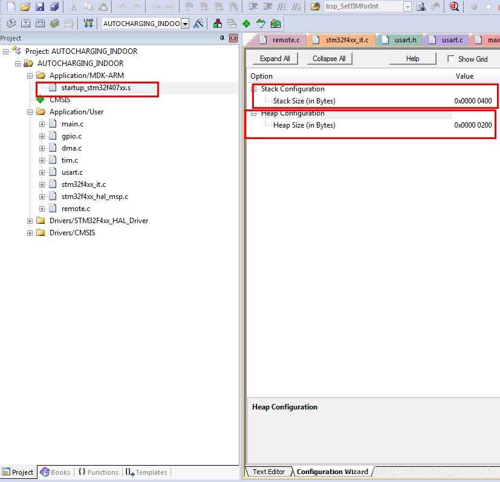
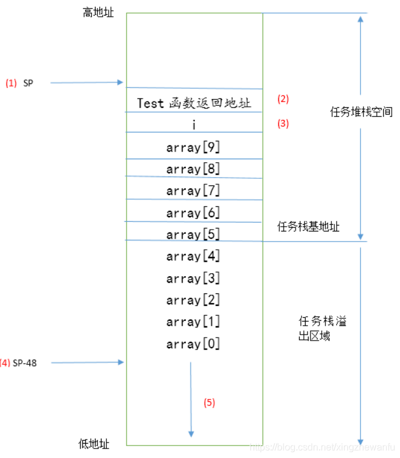
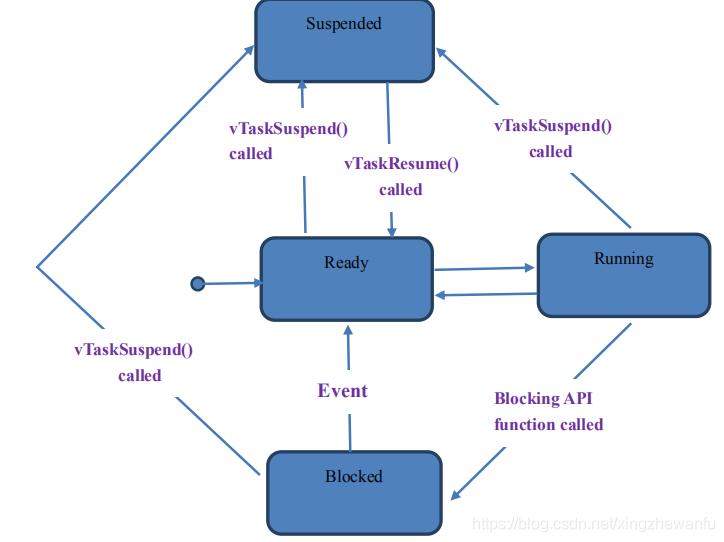
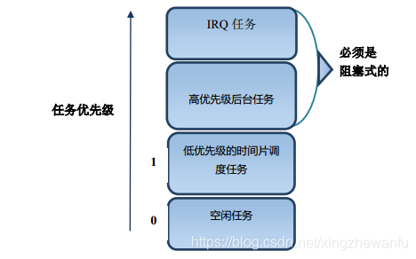
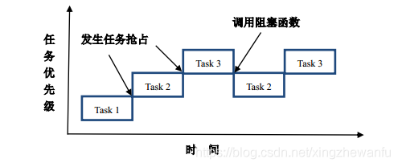
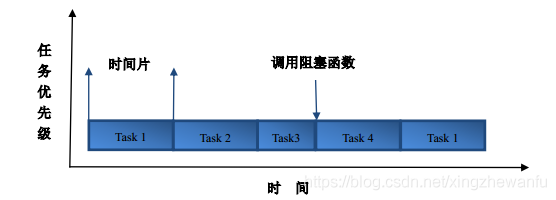

free_rtos基础知识体系梳理
============================

FreeRTOS 在线手册　https://freertos.asicfans.com/

**单任务系统**

单任务系统中主要采用超级循环系统(前后台系统),应用程序是一个无限的循环，循环中调用相应的函数完成相应的操作，
这部分可以看作后台行为．中断服务程序处理异步时间，这部分可以看作前台行为．后台也可以叫做任务级，前台也叫做中断级

前后台系统编程主要有两种思路：轮询方式(实时性不能得到保障),中断方式

中断与轮循结合的方式可以解决很多裸机应用，但随着系统的复杂，裸机的缺点就暴露出来了

- ISR函数变得非常复杂，并且需要很长的执行时间．当ISR嵌套可能会产生不可预测的执行时间和堆栈需求

- 超级循环与ISR之间的数据交换通过全局变量进行．

- 超级循环使得应用程序变得复杂，可扩展性差

**多任务系统**

采用多任务系统可以解决裸机开发中的几个缺点

freertos是一款支持多任务运行的实时操作系统，具有时间片，抢占式和合作式三种调度方式．

任务堆栈
-------------

上图中显示栈与堆空间的设置

.. note::
    在freertos操作系统中，主堆栈指针MSP是给系统栈空间使用的，进程栈指针PSP是给任务栈使用的．也就是说freertos任务中，所有栈空间的使用
    都是通过PSP指针进行指向的．实际应用中系统栈空间分配多大，主要看可能发生的中断嵌套层数．

任务栈大小确定
^^^^^^^^^^^^^^^

函数的栈大小计算起来是比较麻烦的，一般IDE开发环境都会有这样的一个功能，比如MDK会生成一个htm文件．用户可以通过这个文件知道每个被调用
函数的最大栈需求以及各个函数的调用关系．但是MDK无法确定通过函数指针实现函数调用时的栈需求．另外，发生中断或者中断嵌套时的现场保护需要
的栈空间也不会统计

栈溢出检测机制
^^^^^^^^^^^^^^^^^

栈的生长方向一般是从高地址向地址生长的

上图中array数组的申请就发生来栈溢出

FreeRTOS提供了两种栈溢出检测机制，这两种检测都是任务切换时才会进行

1) 在任务切换时检测任务栈指针是否越界了，如果越界来，在任务切换时会触发栈溢出钩子函数．用户可以在钩子函数里面做一些处理．这种方法不能保证
所有的栈溢出都能检测到．比如在任务执行过程中出现过栈溢出，任务切换前栈指针又恢复到了正常水平．

使用这种方法时用户需要在FreeRTOSConfig.h文件中配置如下宏定义

::

    #define configCHECK_FOR_STACK_OVERFLOW 1

2) 任务创建的时候将任务栈的所有数据初始化为0xa5，任务切换时进行任务栈检测，检查末尾的16个字节是否都是0xa5,通过这种方式来检测任务栈是否溢出了，
相比方法一这种方法速度稍微慢些，但有效的避免了方法一中的某些情况．但还是不能检测所有任务栈溢出情况，比如发生栈溢出来，但是末尾的16个字节没有
修改，但是修改了溢出部分的数据

使用这种方法时用户需要在FreeRTOSConfig.h文件中配置如下宏定义

::

    #define configCHECK_FOR_STACK_OVERFLOW 2

任务状态
--------

.. note::
    FreeRTOS的任务状态(4种):运行态(running),就绪态(ready),阻塞态(blocked),挂起态(suspended)
    ucos任务状态(5种):睡眠状态，就绪状态，等待状态，中断服务状态，执行状态

- 运行态(running): 任务处于实际运行状态，即CPU的使用权被这个任务占用

- 就绪态(ready): 指那些能够运行(没有阻塞或者挂起)但是当前没有运行的任务，因为同优先级或更高优先级的任务正在运行

- 阻塞态(blocked): 由于等待信号量，消息队列，事件标志等处于的状态成为阻塞态，另外任务调用延迟函数也会处于阻塞态

- 挂起态(suspended): 类似阻塞态，通过调用函数vTaskSuspend()对指定任务进行挂起，挂起后这个任务将不被执行，只有调用xTaskResume()才可以将这个任务从挂起状态恢复

任务优先级
------------

1) FreeRTOS中任务最高优先级是通过 ``FreeRTOSConfig.h`` 文件中的 ``configMAX_PRIORITIES`` 进行配置的．用户可以使用的优先级范围是0~configMAX_PRIORITIES

2) 用户配置的优先级数值越小，任务优先级越低．空闲任务的优先级是0

3) ``configMAX_PRIORITIES`` 建议最大值不超过32

- IRQ任务: 指中断服务程序触发的任务，此类任务应该设置为所有任务里面优先级最高的

.. note::
    IRQ任务和高优先级任务必须设置为阻塞式(调用消息等待或延迟函数)，只有这样高优先级的任务才会释放CPU的使用权，从而
    低优先级的任务才会有机会执行

任务调度
-----------

FreeRTOS是一款支持多任务运行的实时操作系统，具有时间片，抢占式，合作式三种调度方式

1) 合作式调度，主要用在资源有限的设备上面，现在基本不用了

2) 抢占式调度，每个任务都有不同的优先级，任务会一直运行到被高优先级的任务抢占或者遇到阻塞式的API函数

3) 时间片调度，每个任务都有相同的优先级，任务会运行固定的时间片个数或者遇到阻塞式API函数

调度器
^^^^^^^

调度器就是使用相关的调度算法来决定当前需要执行的任务，所有的调度器有一个共同的特性：

1) 调度器可以区分就绪态任务和挂起任务(延迟，信号量等待等原因挂起的任务), 调度器可以选择就绪态中的一个任务，然后激活它

- 抢占式调度器

- 时间片调度器

在小型的嵌入式RTOS中，最常用的时间片调度算法就是Round-robin调度算法.

用户需要在 ``FreeRTOSConfig.h`` 文件中使能宏定义

::

    #define configUSE_TIME_SLICING 1

临界区，锁与系统时间
----------------------

代码的临界区，一旦这部分代码开始执行，则不允许任何中断打断．为了保证这部分代码不被中断，需要进行关中断操作

**锁**

1) 调度锁: 调度锁就是RTOS提供的调度器开关函数，如果某个任务调用了调度锁开关函数，处于调度锁开关之间的代码在执行期间不会被高优先级的任务抢占，但中断是可以执行的

2) 任务锁: 为了防止当前任务的执行被其他高优先级的任务．FreeRTOS没有专门的任务锁函数，有以下两种实现方A.通过调度器加锁实现B.关闭任务切换中断PendSV和系统Systick

任何操作系统都需要提供一个时钟节拍，以供系统处理注入延迟，超时等时间相关的事件．时钟节拍是特定的周期性中断，这个中断可以看成是系统心跳，
系统节拍越快，系统的额外开销就越大. MCU中一般采用滴答定时器来实现系统时钟节拍

