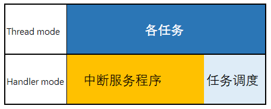
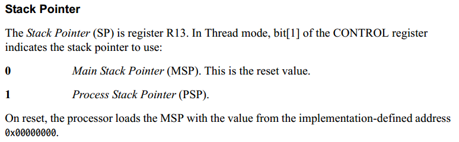
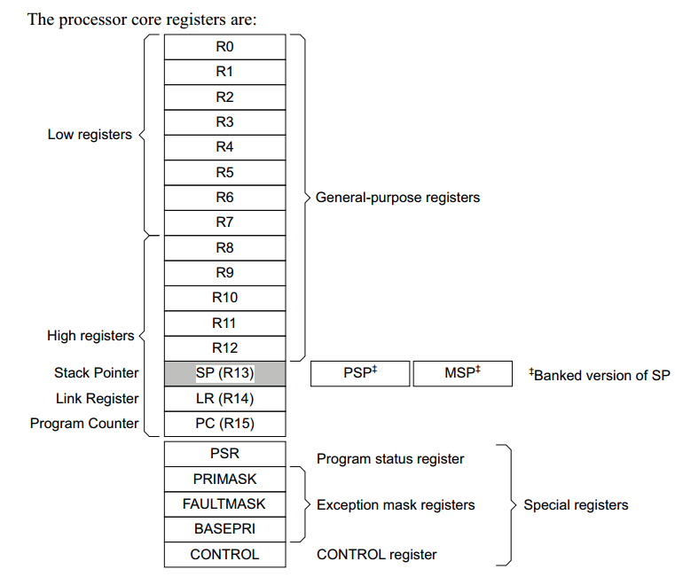
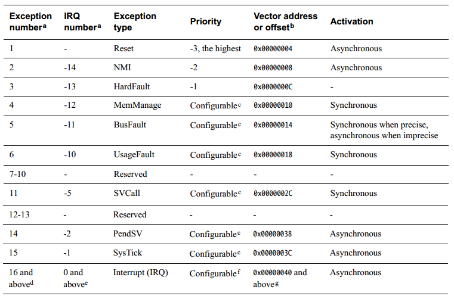
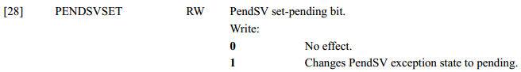
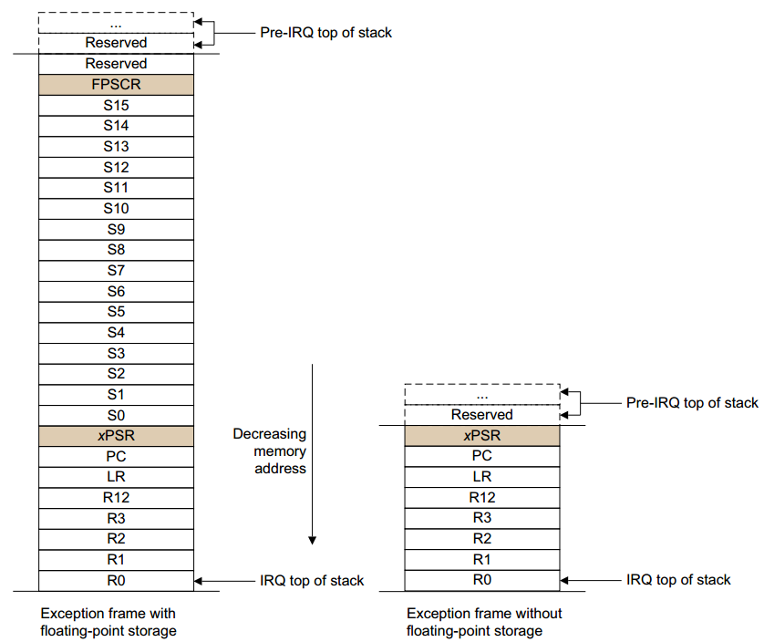
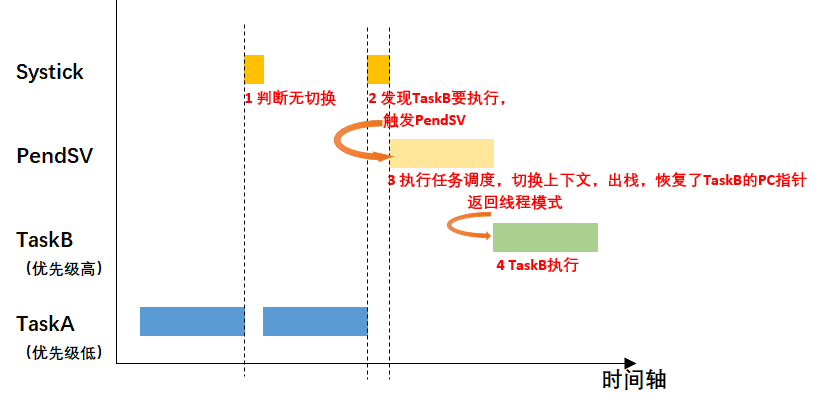

RTOS底层原理
==============

OS的底层运行原理依赖于芯片架构，以下内容仅适用于Cortex-M系列的MCU

处理器模式和软件执行权限
---------------------------

Cortex-M系列的处理器有两种模式

- Thread mode(线程模式): 用于执行应用软件，处理器在复位结束时进入线程模式

- Handle mode:用于处理异常(例如中断)，处理器在完成所有异常处理后返回线程模式，RTOS的调度都在该模式下进行

软件执行权限级别为:

- 无特权: 对MSR和MRS指令的访问受限，无法使用CPS指令．无法访问系统定时器，NVIC或系统控制块．

- 有特权: 可以使用所有指令并访问所有资源

栈
---

Cortex-M实现了两个栈: main stack和process stack，每个栈的指针保存在独立的寄存器中

核心寄存器
------------

- LR(R14): link register,它存储子程序，函数调用和异常的返回信息

- CONTROL: 当处理器处于线程模式时，CONTROL寄存器控制使用的栈和软件执行的特权级别

异常模式
----------

异常类型有: Reset, NMI, HardFault, IRQ.

有三个异常处理是RTOS动作的基础: ``SVCall`` , ``PendSV`` , ``SysTick``

- SVCall: supervisor call(SVC)是由SVC指令触发的异常，应用程序可以使用SVC指令访问操作系统内核函数和设备驱动函数．类似于linux的SysCall

- PendSV: 一种中断驱动的系统级服务请求，当没有其他异常处于活动状态时使用PendSV进行上下文切换，所以RTOS的任务切换(上下文切换)都是在PendSV异常处理函数里执行的.
  RTOS必须考虑任务抢占的实时性和中断响应的实时性，因此PendSV的理念是，他的优先级大于任务，小于其他异常．当触发PendSV(任务调度)时，它可以打断任何任务的执行，
  进行任务优先级调度．

触发PendSV的方法: 将ICSR寄存器的bit28的PENDSVSET设定为1

RTOS的系统调用API,如task delay,获取信号量，发送消息，接收消息的函数里都会触发PendSV.

- SysTick: SysTick异常是系统计时器达到0时生成的异常，操作系统中使用此异常作为滴答定时器，一般周期为1ms, rtos在systick异常处理中判断是否需要任务切换，如果有则触发PendSV

异常进入和返回
---------------

处理任务上下文切换时，要求速度和效率，因此RTOS处理上下文切换(PendSV处理函数)的代码大部分都是汇编写的．

当进入异常时，处理器会自动进行入栈操作，栈中会包含异常返回的地址，该值在异常返回时恢复PC.入栈的同时，处理器从向量表中读取异常处理地址．入栈完成后处理器开始
执行异常处理程序．

.. note::
    R4-R11不会自动入栈，如果有需要就自己写代码控制

**总结**

