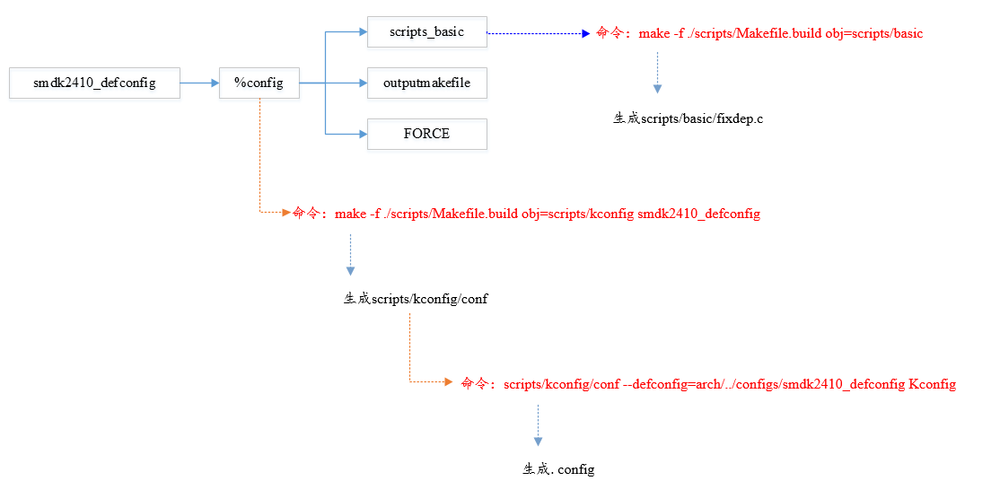
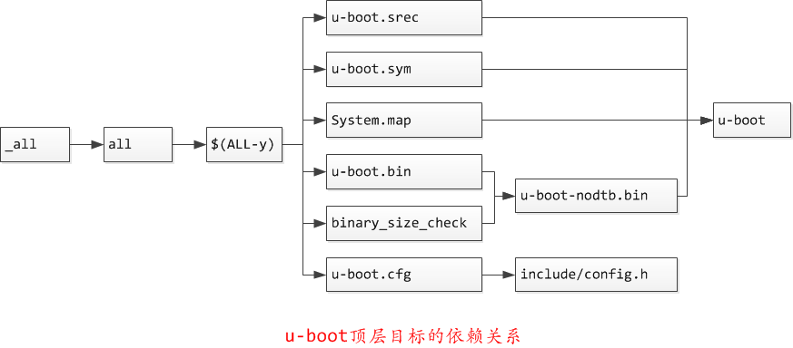
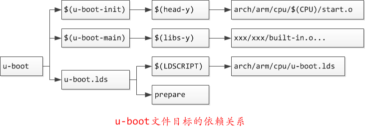
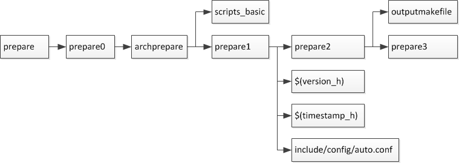
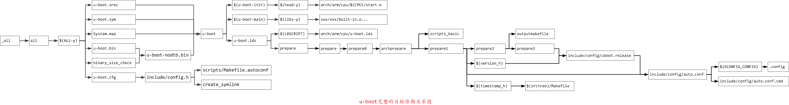

uboot编译流程分析
=====================

在分析uboot编译过程之前，必须了解Makefile语法。由于u-boot的Makefile中存在相互调用，这里介绍以下make -f和make -c的区别

- -c选项：Makefile中的-c是递归调用子目录的Makefile，-c选项后跟目录，表示到子目录下执行子目录的makefile，顶层Makefile的export的变量还有make默认的变量是可以传递给子目录中的Makefile的
- -f选项：顶层Makefile使用make -f调用子目录中的文件（文件名可以随便，不必一定是Makefile)作为Makefile，顶层export的变量可以传递给底层

.. note::
    在顶层Makefile中使用make -f调用子目录中的文件工作目录仍是顶层目录，即CURDIR变量仍是顶层目录

Makefile的核心是依赖和命令，对于每个目标，首先会检查依赖如果依赖存在则执行命令更新目标，如果依赖不存在，则会以依赖为目标先生成依赖，最后执行命令生成目标

make xxx_defconfig配置分析
--------------------------

xxx_defconfig依赖检查更新
^^^^^^^^^^^^^^^^^^^^^^^^^^^^^

在编译uboot时首先执行make xxx_defconfig生成.config文件。uboot根目录中Makefile中有唯一的规则目标

::

    config: scripts_basic outputmakefile FORCE
        $(Q)$(MAKE) $(build)=scripts/kconfig $@

    %config: scripts_basic outputmakefile FORCE
        $(Q)$(MAKE) $(build)=scripts/kconfig $@

build 在 scripts/Kbuild.include 中定义

::

    build := -f $(srctree)/scripts/Makefile.build obj

所以最后执行的命令就是

::

    make -f scripts/Makefile.build obj=scripts/kconfig xxx_defconfig

**scripts_basic依赖**

目标xxx_defconfig的生成依赖于scripts_basic，outputmakefile和FORCE,只有scripts_basic需要执行命令

::

	# Basic helpers built in scripts/
	PHONY += scripts_basic
    scripts_basic:
        $(Q)$(MAKE) $(build)=scripts/basic
        $(Q)rm -f .tmp_quiet_recordmcount
	#展开后，规则如下
	make -f ./scripts/Makefile.build obj=scripts/basic
	#make命令会转到文件scripts/Makefile.build去执行

事实上大量实际目标的编译都是调用scripts/Makefile.build完成的，文件scripts/Makefile.build的开头会根据传入的obj=scripts/basic参数设置src=sripts/basic

::

	# Modified for U-Boot
	prefix := tpl
	src := $(patsubst $(prefix)/%,%,$(obj))
	ifeq ($(obj),$(src))
	prefix := spl
	src := $(patsubst $(prefix)/%,%,$(obj))
	ifeq ($(obj),$(src))
	prefix := .
	endif
	endif

kbuild-dir根据src变量(等于obj变量)是绝对路径还是相对路径来确定当前编译的目录，若为绝对路径则该目录即src变量的值，若为相对路径则该变量就是src相对于源码根目录的目录。kbuild-file即
在该目录下查找kbuild文件，若能找到则使用kbuild作为该目录的编译文件，若找不到则使用该目录下的Makefile作为该目录的编译文件，然后将该文件包含进来

::

	# The filename Kbuild has precedence over Makefile
	kbuild-dir := $(if $(filter /%,$(src)),$(src),$(srctree)/$(src))
	kbuild-file := $(if $(wildcard $(kbuild-dir)/Kbuild),$(kbuild-dir)/Kbuild,$(kbuild-dir)/Makefile)
	include $(kbuild-file)

这里展开替换后相当于

::

	include ./scripts/basic/Makefile

文件scripts/basic/Makefile中定义了编译在主机上执行的工具fixdep

::

	# fixdep: 	 Used to generate dependency information during build process

	hostprogs-y	:= fixdep
	always		:= $(hostprogs-y)

	# fixdep is needed to compile other host programs
	$(addprefix $(obj)/,$(filter-out fixdep,$(always))): $(obj)/fixdep

fixdep用于更新每一个生成目标的依赖文件*.cmd。上面定义的这个$(always)在scripts/Makefile.build里会被添加到targets中

::

	targets += $(extra-y) $(MAKECMDGOALS) $(always)

简而言之，scripts_basic的规则是

::

	scripts_basic:
		make -f ./scripts/Makefile.build obj=scripts/basic

最终的结果就是编译scripts/basic/fixdep.c 生成主机上的可执行文件fixdep

**outputmakefile依赖**

::

    PHONY += outputmakefile
    # outputmakefile generates a Makefile in the output directory, if using a
    # separate output directory. This allows convenient use of make in the
    # output directory.
    outputmakefile:
    ifneq ($(KBUILD_SRC),)
        $(Q)ln -fsn $(srctree) source
        $(Q)$(CONFIG_SHELL) $(srctree)/scripts/mkmakefile \
            $(srctree) $(objtree) $(VERSION) $(PATCHLEVEL)
    endif

如果此时执行 make xxx_defconfig O=out,那么所有生成的目标都将放到out目录，outputmakefile会导出一个makefile到out目录进行编译

**FORCE依赖**

::

    PHONY += FORCE
    FORCE:

FORCE被定义为一个空目标，如果一个目标添加FORCE依赖每次编译都会西安去执行FORCE(实际上什么都不做),然后运行命令更新目标，这样就能确保目标每次都被更新

xxx_defconfig目标命令执行
^^^^^^^^^^^^^^^^^^^^^^^^^

完成对xxx_defconfig的依赖更新后，接下来就是执行对顶层目标的命令完成对xxx_defconfig的更新,也就是执行以下命令

::

    xxx_defconfig: scripts_basic outputmakefile FORCE
        make -f ./scripts/Makefile.build obj=scripts/kconfig xxx_defconfig

这个命令会转到srcipts/Makefile.kbuild去执行,文件scripts/Makefile.kbuild的开头会根据传入的obj=scripts/kconfig参数设置src=scripts/kconfig, 然后搜寻$(srctree)/$(src)子目录下的makefile，
由于src=scripts/kconfig参数不用于第一次调用的参数(src=scripts/basic)此处包含的makefile也不用于第一次的makefile了

::

	# The filename Kbuild has precedence over Makefile
	kbuild-dir := $(if $(filter /%,$(src)),$(src),$(srctree)/$(src))
	kbuild-file := $(if $(wildcard $(kbuild-dir)/Kbuild),$(kbuild-dir)/Kbuild,$(kbuild-dir)/Makefile)
	include $(kbuild-file)

这里展开后相当于

::

    include ./scripts/kconfig/Makefile

文件scripts/kconfig/Makefile中定义了所有匹配%config的目标

::

    PHONY += xconfig gconfig menuconfig config syncconfig update-po-config \
    %_defconfig: $(obj)/conf
        $(Q)$< $(silent) --defconfig=arch/$(SRCARCH)/configs/$@ $(Kconfig)

展开为

::

    xxx_defconfig: scripts/kconfig/conf
        scripts/kconfig/conf --defconfig=arch/arm/configs/xxx_defconfig Kconfig

此处xxx_defconfig依赖scripts/kconfig/conf,接下来检查并生成依赖

::

    hostprogs-y := conf nconf mconf kxgettext qconf gconf
    conf-objs	:= conf.o  zconf.tab.o

hostprogs-y指出conf被定义为主机上执行的程序，其依赖于另外两个文件 conf.o zconf.tab.o。通过编译conf.c和zconf.tab.c生成conf-objs并链接为scripts/kconfig/conf。生成
依赖后就是执行目标的命令了

conf工具从根目录下开始树状读取默认的kconf文件,分析其配置并保存在内存中，分析完默认的kconfig后再读取指定的文件(arch/arm/configs/xxx_defconfig)更新得到最后的符号表，并输出到.config文件中，
至此完成了make xxx_defconfig执行配置涉及到的所有依赖和命令的分析

make defconfig配置流程简图

make执行流程分析
-----------------

目标_all和all对$(ALL-y)的依赖
^^^^^^^^^^^^^^^^^^^^^^^^^^^^^^

从顶层的Makefile开始查找，找到第一个目标为_all

::

    PHONY := _all
    _all:

    PHONY += all
    ifeq ($(KBUILD_EXTMOD),)    ##当我们定义了KBUILD_EXTMOD编译一个外部模块时，_all依赖Modules否则依赖all
    _all: all
    else
    _all: modules
    endif

在Makefile中.PHONY后面的target表示也是一个伪造的target，而不是真实存在的文件target，注意makefile的target默认是文件

接着往下分析,all自身依赖于$(ALL-y)

::

    all:		$(ALL-y) cfg
    ifeq ($(CONFIG_DM_I2C_COMPAT)$(CONFIG_SANDBOX),y)
        @echo "===================== WARNING ======================"
        @echo "This board uses CONFIG_DM_I2C_COMPAT. Please remove"
        @echo "(possibly in a subsequent patch in your series)"
        @echo "before sending patches to the mailing list."
        @echo "===================================================="
    endif
        @# Check that this build does not use CONFIG options that we do not
        @# know about unless they are in Kconfig. All the existing CONFIG
        @# options are whitelisted, so new ones should not be added.
        $(call cmd,cfgcheck,u-boot.cfg)

**目标$(ALL-y)**

::

    # Always append ALL so that arch config.mk's can add custom ones
    ALL-y += u-boot.srec u-boot.bin u-boot.sym System.map binary_size_check

    ALL-$(CONFIG_ONENAND_U_BOOT) += u-boot-onenand.bin
    ifeq ($(CONFIG_SPL_FSL_PBL),y)
    ALL-$(CONFIG_RAMBOOT_PBL) += u-boot-with-spl-pbl.bin
    else
    ifneq ($(CONFIG_SECURE_BOOT), y)
    # For Secure Boot The Image needs to be signed and Header must also
    # be included. So The image has to be built explicitly
    ALL-$(CONFIG_RAMBOOT_PBL) += u-boot.pbl
    endif
    endif
    ALL-$(CONFIG_SPL) += spl/u-boot-spl.bin
    ifeq ($(CONFIG_MX6)$(CONFIG_SECURE_BOOT), yy)
    ALL-$(CONFIG_SPL_FRAMEWORK) += u-boot-ivt.img
    else
    ifeq ($(CONFIG_MX7)$(CONFIG_SECURE_BOOT), yy)
    ALL-$(CONFIG_SPL_FRAMEWORK) += u-boot-ivt.img
    else
    ALL-$(CONFIG_SPL_FRAMEWORK) += u-boot.img
    endif
    endif
    ALL-$(CONFIG_TPL) += tpl/u-boot-tpl.bin
    ALL-$(CONFIG_OF_SEPARATE) += u-boot.dtb
    ifeq ($(CONFIG_SPL_FRAMEWORK),y)
    ALL-$(CONFIG_OF_SEPARATE) += u-boot-dtb.img
    endif
    ALL-$(CONFIG_OF_HOSTFILE) += u-boot.dtb
    ifneq ($(CONFIG_SPL_TARGET),)
    ALL-$(CONFIG_SPL) += $(CONFIG_SPL_TARGET:"%"=%)
    endif
    ALL-$(CONFIG_REMAKE_ELF) += u-boot.elf
    ALL-$(CONFIG_EFI_APP) += u-boot-app.efi
    ALL-$(CONFIG_EFI_STUB) += u-boot-payload.efi

    ifneq ($(BUILD_ROM)$(CONFIG_BUILD_ROM),)
    ALL-$(CONFIG_X86_RESET_VECTOR) += u-boot.rom
    endif

    # Build a combined spl + u-boot image for sunxi
    ifeq ($(CONFIG_ARCH_SUNXI)$(CONFIG_SPL),yy)
    ALL-y += u-boot-sunxi-with-spl.bin
    endif

    # enable combined SPL/u-boot/dtb rules for tegra
    ifeq ($(CONFIG_TEGRA)$(CONFIG_SPL),yy)
    ALL-y += u-boot-tegra.bin u-boot-nodtb-tegra.bin
    ALL-$(CONFIG_OF_SEPARATE) += u-boot-dtb-tegra.bin
    endif

    # Add optional build target if defined in board/cpu/soc headers
    ifneq ($(CONFIG_BUILD_TARGET),)
    ALL-y += $(CONFIG_BUILD_TARGET:"%"=%)
    endif

    ifneq ($(CONFIG_SYS_INIT_SP_BSS_OFFSET),)
    ALL-y += init_sp_bss_offset_check
    endif

以上的$(ALL-y)目标中看起来很复杂，但除了第一行的通用目标外，其他目标都是在特殊条件下才会生成，这里暂时不提

**$(ALL-y)依赖u-boot.srec**

::

    u-boot.hex u-boot.srec: u-boot FORCE
        $(call if_changed,objcopy)

**$(ALL-y)依赖u-boot.bin**

::

    ifeq ($(CONFIG_MULTI_DTB_FIT),y)

    fit-dtb.blob: dts/dt.dtb FORCE
        $(call if_changed,mkimage)

    MKIMAGEFLAGS_fit-dtb.blob = -f auto -A $(ARCH) -T firmware -C none -O u-boot \
        -a 0 -e 0 -E \
        $(patsubst %,-b arch/$(ARCH)/dts/%.dtb,$(subst ",,$(CONFIG_OF_LIST))) -d /dev/null

    u-boot-fit-dtb.bin: u-boot-nodtb.bin fit-dtb.blob
        $(call if_changed,cat)

    u-boot.bin: u-boot-fit-dtb.bin FORCE
        $(call if_changed,copy)
    else ifeq ($(CONFIG_OF_SEPARATE),y)
    u-boot-dtb.bin: u-boot-nodtb.bin dts/dt.dtb FORCE
        $(call if_changed,cat)

    u-boot.bin: u-boot-dtb.bin FORCE
        $(call if_changed,copy)
    else
    u-boot.bin: u-boot-nodtb.bin FORCE
        $(call if_changed,copy)
    endif

如果打开了device tree的支持，则有依赖关系

::

    u-boot.bin---->u-boot-dtb.bin----->u-boot-nodtb.bin + dts/dt.dtb

如果没有定义CONFIG_OF_SEPARATE则依赖关系如下

::

    u-boot.bin ----> u-boot-nodtb.bin

u-boot-nodtb.bin的依赖关系以及执行命令如下

::

    u-boot-nodtb.bin: u-boot FORCE
        $(call if_changed,objcopy)
        $(call DO_STATIC_RELA,$<,$@,$(CONFIG_SYS_TEXT_BASE))
        $(BOARD_SIZE_CHECK)

命令中if_changed函数定义在scripts/Kbuild.include文件中,顶层Makefile中通过以下命令包含

::

    scripts/Kbuild.include: ;
    include scripts/Kbuild.include

if_changed函数定义如下

::

    if_changed = $(if $(strip $(any-prereq) $(arg-check)),                       \
        @set -e;                                                             \
        $(echo-cmd) $(cmd_$(1));                                             \
        printf '%s\n' 'cmd_$@ := $(make-cmd)' > $(dot-target).cmd)

该命令外层是一个if函数，然后又内嵌了一个strip函数

::

    OBJCOPY		= $(CROSS_COMPILE)objcopy

    # Normally we fill empty space with 0xff
    quiet_cmd_objcopy = OBJCOPY $@
    cmd_objcopy = $(OBJCOPY) --gap-fill=0xff $(OBJCOPYFLAGS) \
        $(OBJCOPYFLAGS_$(@F)) $< $@

所以$(call if_changed,objcopy)展开后：

::

    echo objcopy $@; objcopy $< $@

就是说利用objcopy命令将u-boot转换为u-boot-nodtb.bin

**$(ALL-y)依赖u-boot.sym**

::

    u-boot.sym: u-boot FORCE
        $(call if_changed,sym)

**$(ALL-y)依赖System.map**

::

    System.map:	u-boot
            @$(call SYSTEM_MAP,$<) > $@

**$(ALL-y)依赖u-boot.cfg**

::

    u-boot.cfg spl/u-boot.cfg tpl/u-boot.cfg: include/config.h FORCE
        $(Q)$(MAKE) -f $(srctree)/scripts/Makefile.autoconf $(@)

include/config.h在make xxx_defconfig时创建,include/config.h文件中会包含板级配置文件如#include <configs/holo_ark_v3.h>

**$(ALL-y)依赖binary_size_check**

::

    binary_size_check: u-boot-nodtb.bin FORCE
        @file_size=$(shell wc -c u-boot-nodtb.bin | awk '{print $$1}') ; \
        map_size=$(shell cat u-boot.map | \
            awk '/_image_copy_start/ {start = $$1} /_image_binary_end/ {end = $$1} END {if (start != "" && end != "") print "ibase=16; " toupper(end) " - " toupper(start)}' \
            | sed 's/0X//g' \
            | bc); \
        if [ "" != "$$map_size" ]; then \
            if test $$map_size -ne $$file_size; then \
                echo "u-boot.map shows a binary size of $$map_size" >&2 ; \
                echo "  but u-boot-nodtb.bin shows $$file_size" >&2 ; \
                exit 1; \
            fi \
        fi

以上通用目标$(ALL-y)的依赖有一个共同点，除了u-boot.cfg依赖于include/config.h外其余目标都依赖于u-boot, 以下图中表示了_all依赖简图

u-boot目标编译
^^^^^^^^^^^^^^^

u-boot目标依赖及执行命令如下

::

    u-boot:	$(u-boot-init) $(u-boot-main) u-boot.lds FORCE
        +$(call if_changed,u-boot__)
    ifeq ($(CONFIG_KALLSYMS),y)
        $(call cmd,smap)
        $(call cmd,u-boot__) common/system_map.o
    endif

其中u-boot-init和u-boot-main被定义为

::

    u-boot-init := $(head-y)
    u-boot-main := $(libs-y)

**依赖项head-y libs-y**

head-y 在arch/arm/Makefile中定义

::

    head-y := arch/arm/cpu/$(CPU)/start.o

所以head-y指的是start.S

在顶层目录Makefile中搜索libs-y可以发现其包含许多目录，

::

    libs-y += lib/
    libs-$(HAVE_VENDOR_COMMON_LIB) += board/$(VENDOR)/common/
    libs-$(CONFIG_OF_EMBED) += dts/
    libs-y += fs/
    libs-y += net/
    libs-y += disk/
    libs-y += drivers/
    libs-y += drivers/dma/
    libs-y += drivers/gpio/
    libs-y += drivers/i2c/
    libs-y += drivers/net/
    libs-y += drivers/net/phy/
    libs-y += drivers/pci/
    libs-y += drivers/power/ \
        drivers/power/domain/ \
        drivers/power/fuel_gauge/ \
        drivers/power/mfd/ \
        drivers/power/pmic/ \
        drivers/power/battery/ \
        drivers/power/regulator/
    libs-y += drivers/spi/
    libs-$(CONFIG_FMAN_ENET) += drivers/net/fm/
    libs-$(CONFIG_SYS_FSL_DDR) += drivers/ddr/fsl/
    libs-$(CONFIG_SYS_FSL_MMDC) += drivers/ddr/fsl/
    libs-$(CONFIG_ALTERA_SDRAM) += drivers/ddr/altera/
    libs-y += drivers/serial/
    libs-y += drivers/usb/dwc3/
    libs-y += drivers/usb/common/
    libs-y += drivers/usb/emul/
    libs-y += drivers/usb/eth/
    libs-y += drivers/usb/gadget/
    libs-y += drivers/usb/gadget/udc/
    libs-y += drivers/usb/host/
    libs-y += drivers/usb/musb/
    libs-y += drivers/usb/musb-new/
    libs-y += drivers/usb/phy/
    libs-y += drivers/usb/ulpi/
    libs-y += cmd/
    libs-y += common/
    libs-y += env/
    libs-$(CONFIG_API) += api/
    libs-$(CONFIG_HAS_POST) += post/
    libs-y += test/
    libs-y += test/dm/
    libs-$(CONFIG_UT_ENV) += test/env/
    libs-$(CONFIG_UT_OVERLAY) += test/overlay/

另外libs-y还有如下规则定义

::

    libs-y += $(if $(BOARDDIR),board/$(BOARDDIR)/)

    libs-y := $(sort $(libs-y))

    libs-y		:= $(patsubst %/, %/built-in.o, $(libs-y))

这条规则使得libs-y中的每个条目的最后一个斜杠替换成/built-in.o，可见libs-y被定义为各层驱动目录下built-in.o的集合，而这些built-in.o则由kbuild makefile将obj-y所
包含的各个文件编译而成，具体可以研究 ``scripts/Kbuild.include`` 和 ``scripts/Makefile.build``

::

    ifneq ($(strip $(obj-y) $(obj-m) $(obj-) $(subdir-m) $(lib-target)),)
    builtin-target := $(obj)/built-in.o
    endif

    $(builtin-target): $(obj-y) FORCE
    	$(call if_changed,link_o_target)

u-boot文件目标依赖：

**依赖项u-boot.lds**

::

    u-boot.lds: $(LDSCRIPT) prepare FORCE
        $(call if_changed_dep,cpp_lds)

    ifndef LDSCRIPT
        #LDSCRIPT := $(srctree)/board/$(BOARDDIR)/u-boot.lds.debug
        ifdef CONFIG_SYS_LDSCRIPT
            # need to strip off double quotes
            LDSCRIPT := $(srctree)/$(CONFIG_SYS_LDSCRIPT:"%"=%)
        endif
    endif

    # If there is no specified link script, we look in a number of places for it
    ifndef LDSCRIPT
        ifeq ($(wildcard $(LDSCRIPT)),)
            LDSCRIPT := $(srctree)/board/$(BOARDDIR)/u-boot.lds
        endif
        ifeq ($(wildcard $(LDSCRIPT)),)
            LDSCRIPT := $(srctree)/$(CPUDIR)/u-boot.lds
        endif
        ifeq ($(wildcard $(LDSCRIPT)),)
            LDSCRIPT := $(srctree)/arch/$(ARCH)/cpu/u-boot.lds
        endif
    endif

如果没有定义LDSCRIPT和CONFIG_SYS_LDSCRIPT则默认使用u-boot自带的lds文件，包括board/$(BOARDDIR)和$(CPUDIR)目录下定制的针对board或cpu的lds文件，如果没有定制的lds文件则采用
arch/arm/cpu目录下默认的lds链接文件u-boot.lds

prepare编译
""""""""""""

实际上prepare是一些列prepare伪目标和动作的组合，完成编译前的准备工作

::

    # Listed in dependency order
    PHONY += prepare archprepare prepare0 prepare1 prepare2 prepare3

    prepare3: include/config/uboot.release
    ifneq ($(KBUILD_SRC),)
        @$(kecho) '  Using $(srctree) as source for U-Boot'
        $(Q)if [ -f $(srctree)/.config -o -d $(srctree)/include/config ]; then \
            echo >&2 "  $(srctree) is not clean, please run 'make mrproper'"; \
            echo >&2 "  in the '$(srctree)' directory.";\
            /bin/false; \
        fi;
    endif

    # prepare2 creates a makefile if using a separate output directory
    prepare2: prepare3 outputmakefile

    prepare1: prepare2 $(version_h) $(timestamp_h) \
                       include/config/auto.conf

    archprepare: prepare1 scripts_basic

    prepare0: archprepare FORCE
        $(Q)$(MAKE) $(build)=.

    # All the preparing..
    prepare: prepare0

各个prepare目标的依赖关系如下

在prepare1的依赖列表中，除了include/config/auto.conf之外，还有$(version_h)和$(timestamp_h),他们的依赖关系如下

::

    $(version_h): include/config/uboot.release FORCE
        $(call filechk,version.h)

    $(timestamp_h): $(srctree)/Makefile FORCE
        $(call filechk,timestamp.h)

对于位于最后的prepare3的依赖include/config/uboot.release它还有下级依赖

::

    include/config/uboot.release: include/config/auto.conf FORCE
        $(call filechk,uboot.release)

对于include/config/auto.conf，Makefile还有一个匹配规则

::

    include/config/%.conf: $(KCONFIG_CONFIG) include/config/auto.conf.cmd
        $(Q)$(MAKE) -f $(srctree)/Makefile syncconfig
        @# If the following part fails, include/config/auto.conf should be
        @# deleted so "make silentoldconfig" will be re-run on the next build.
        $(Q)$(MAKE) -f $(srctree)/scripts/Makefile.autoconf || \
            { rm -f include/config/auto.conf; false; }
        @# include/config.h has been updated after "make silentoldconfig".
        @# We need to touch include/config/auto.conf so it gets newer
        @# than include/config.h.
        @# Otherwise, 'make silentoldconfig' would be invoked twice.
        $(Q)touch include/config/auto.conf

include/config/auto.conf依赖于$(KCONFIG_CONFIG)和include/config/auto.conf.cmd，其中：
- $(KCONFIG_CONFIG)实际上就是.config文件
- include/config/auto.conf.cmd是由fixdep在编译时生成的依赖文件

**make编译流程图**

完成目标依赖分析后，剩下的就是基于完整的目标依赖关系图，从最底层的依赖开始，逐行运行命令生成目标，直到生成顶层目标

**补充 ----  config.h文件生成**

此处进行函数定义

::

    ##scripts/Kbuild.include文件中
    define filchk                                                                                                                                                                                              
        $(Q)set -e;             \   
        $(kecho) '  CHK     $@';        \   
        mkdir -p $(dir $@);         \   
        $(filechk_$(1)) < $< > $@.tmp;      \   
        if [ -r $@ ] && cmp -s $@ $@.tmp; then  \
            rm -f $@.tmp;           \   
        else                    \   
            $(kecho) '  UPD     $@';    \   
            mv -f $@.tmp $@;        \   
        fi  
    endef

具体的文件生成则在以下文件中实现

::

    # scripts/Makefile.autoconf文件中
    # Prior to Kconfig, it was generated by mkconfig. Now it is created here.
    define filechk_config_h
        (echo "/* Automatically generated - do not edit */";        \
        for i in $$(echo $(CONFIG_SYS_EXTRA_OPTIONS) | sed 's/,/ /g'); do \
            echo \#define CONFIG_$$i                \
            | sed '/=/ {s/=/    /;q; } ; { s/$$/    1/; }'; \
        done;                               \
        echo \#define CONFIG_BOARDDIR board/$(if $(VENDOR),$(VENDOR)/)$(BOARD);\
        echo \#include \<config_defaults.h\>;               \
        echo \#include \<config_uncmd_spl.h\>;              \
        echo \#include \<configs/$(CONFIG_SYS_CONFIG_NAME).h\>;     \
        echo \#include \<asm/config.h\>;                \
        echo \#include \<linux/kconfig.h\>;             \
        echo \#include \<config_fallbacks.h\>;)
    endef

    include/config.h: scripts/Makefile.autoconf create_symlink FORCE
        $(call filechk,config_h)

    u-boot.cfg: include/config.h FORCE
    $(call cmd,u_boot_cfg)

    spl/u-boot.cfg: include/config.h FORCE
        $(Q)mkdir -p $(dir $@)
        $(call cmd,u_boot_cfg,-DCONFIG_SPL_BUILD)

    tpl/u-boot.cfg: include/config.h FORCE
        $(Q)mkdir -p $(dir $@)
        $(call cmd,u_boot_cfg,-DCONFIG_SPL_BUILD -DCONFIG_TPL_BUILD)

    include/autoconf.mk: u-boot.cfg
        $(call cmd,autoconf)

