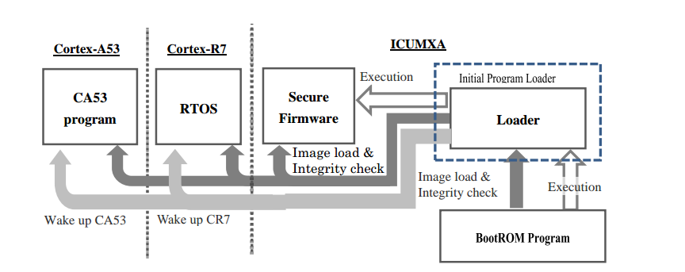
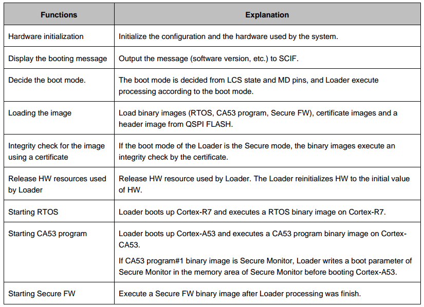
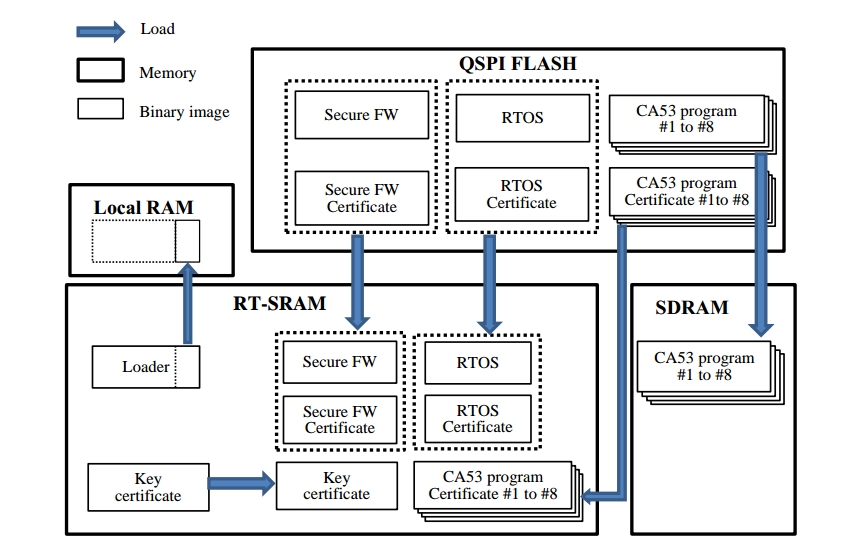
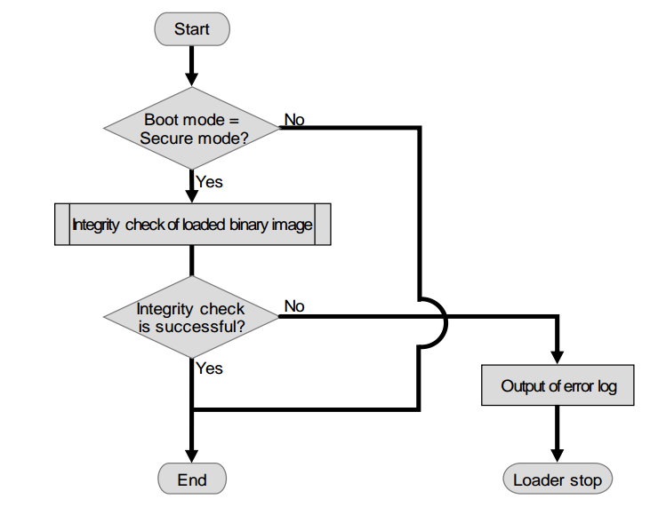
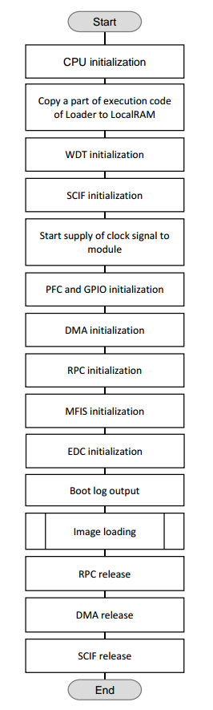
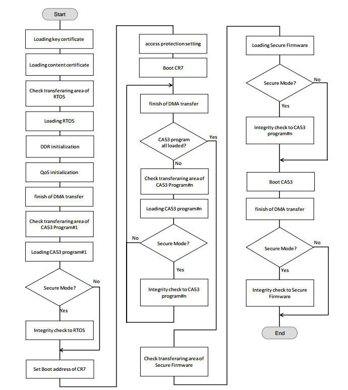
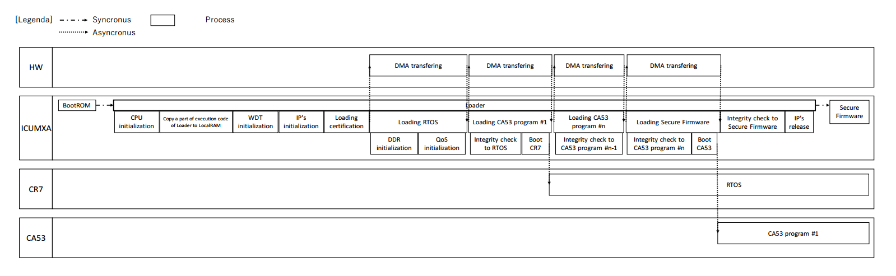
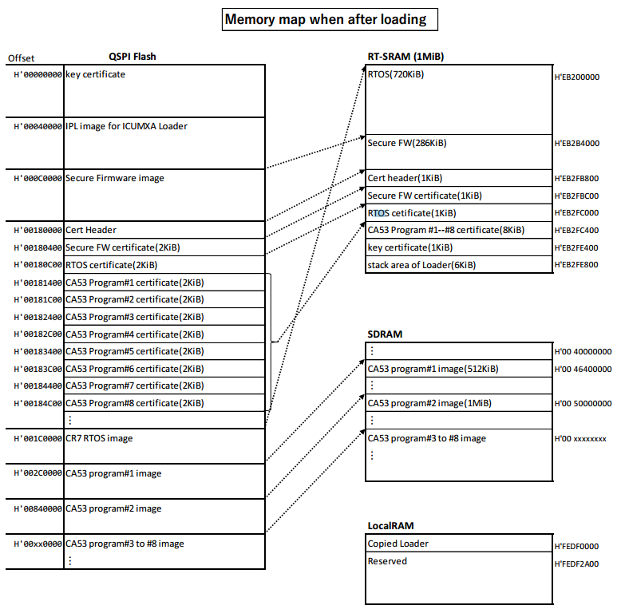
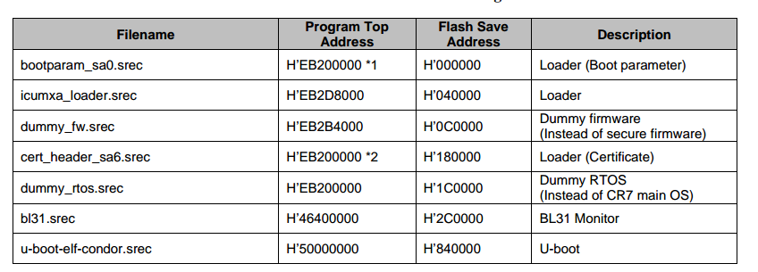

多核异构平台系统启动分析
=========================

以下内容根据瑞萨V3H架构进行分析

参考文档 

* :download:`res/RENESAS_RCV3H_ICUMXA_Loader_Users_Manual_E_v2.0.3.pdf` 

IPL启动系统流程
----------------

Initial Program Loader简称为IPL

IPL主要完成以下功能

load image
^^^^^^^^^^^

IPL流程中主要的一项工作就是将A53以及R7对应的image搬运到SRAM或者DRAM中,然后将其启动.

完整性检查
^^^^^^^^^^^^

如果IPL启动模式设置为security mode则在启动R7或者A53的过程中会利用证书文件对image的完整性进行检查.

IPL flow
^^^^^^^^^^

**flow of loader process**

**flow of load image**

**Sequence of Loader**

memory layout
---------------

**release image and memory address**

